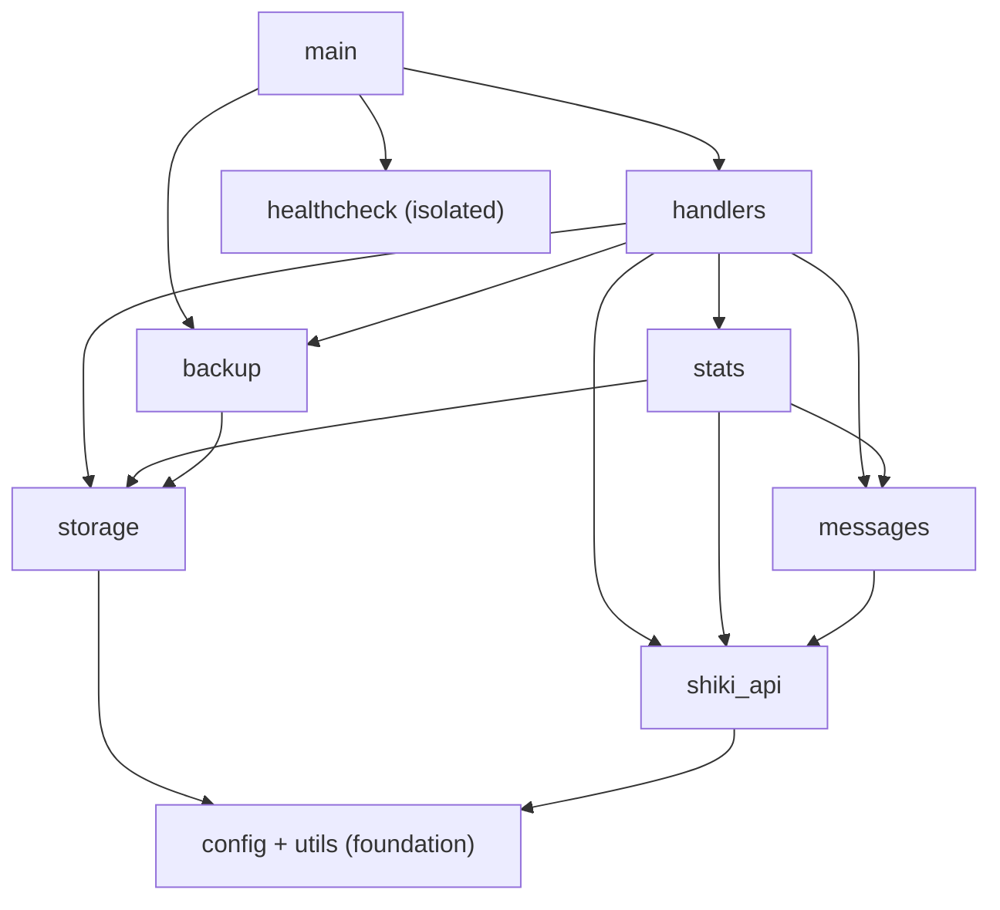

# Agent guidance for ShikiUpdatesBot

## What this repository is
- A Telegram bot that tracks a Shikimori user's history and favourites, then sends notifications to Telegram subscribers.
- Collects statistics (genres, studios, scores, demographics, etc.) and sends the owner an automatic report at the start of each quarter.
- Exposes `/stats` (button menu: current quarter / all-time) and `/favs` (favourite anime & manga) to all subscribers.
- Uses `aiogram` for Telegram and `aiohttp` for HTTP (both client, for Shikimori, and server, for healthcheck).
- Split into focused modules (see Architecture); tests live in `tests/`.

## Architecture (modules)
The former `main.py` monolith was split into single-responsibility modules with a strictly one-way (acyclic) dependency graph. `main.py` is now a thin entrypoint that wires the handlers into the Dispatcher.

- `config.py` — env / local `.env` loading (`load_dotenv`), data-dir paths, logging, the shared `log`. Foundation: imports nothing project-local.
- `utils.py` — pure stdlib-only helpers: `h`, `_rel_url`, `_utcnow`, `quarter_*`, `_safe_int`, `_safe_float`, `_normalize_homoglyphs`.
- `storage.py` — file persistence: `_atomic_write`, load/save of every JSON state file, the `stats_all` in-memory cache.
- `shiki_api.py` — Shikimori client + media domain: `fetch_*`, GraphQL, kind filters, `get_media_info`, `is_relevant`, translation dicts, and the central request throttle + 429 retry (`_throttle`/`_fetch`).
- `messages.py` — message bank, history parsers, `build_message` / `build_favourite_message`, presentation formatters.
- `stats.py` — aggregation, `sync_stats_all`, current-quarter events, quarter snapshots, the `build_*_messages` report builders.
- `backup.py` — `/backup` logic: zip build/restore, delivery to the owner, auto-backup triggers, the shutdown hook.
- `handlers.py` — all aiogram commands & FSM, inline menus, broadcast, the notification cycle (`check_and_notify*`, `polling_loop`), quarter rotation, the owner-reachability gate.
- `healthcheck.py` — isolated HTTP healthcheck server + heartbeat watchdog. Imports nothing from the app; the dependency is one-way.
- `main.py` — entrypoint: builds the Bot/Dispatcher, registers handlers, runs the owner-reachability gate + healthcheck + polling.

Dependency graph (each module depends only on those below it; `healthcheck` is fully isolated):

When adding or moving code, keep dependencies one-directional (import from lower modules only) and pass runtime values (like `CHECK_INTERVAL`) as parameters where that avoids a cycle. `healthcheck.py` is the reference pattern.

## Important files
- `README.md` — setup (three deploy tiers), commands, statistics, healthcheck, and test instructions.
- `requirements.txt` / `requirements-dev.txt` — runtime and development dependencies (`python-dotenv` is a runtime dep for `.env` loading).
- `.env.example` — template for the environment variables.
- `tests/` — pytest coverage for storage, notifications, parsers, statistics, backup, the polling loop, the owner-gate, and Telegram send behaviour.

## Key patterns and conventions
- Environment variables (read in `config.py`, with local `.env` support via `load_dotenv`; a clear startup error names any missing required one): **required** — `BOT_TOKEN`, `OWNER_ID`, `SHIKI_USER`. **Optional with defaults** — `DISPLAY_NAME` (defaults to the `SHIKI_USER` nick), `SHIKI_BASE_URL`, `CHECK_INTERVAL`, `ERROR_NOTIFY_INTERVAL`, `FULL_SYNC_INTERVAL`, `DATA_DIR` (`/data`), `PORT` (`8080`).
- The bot stores state in JSON files under `DATA_DIR`: `seen_ids.json`, `subscribers.json`, `seen_favourites.json`, `stats_all.json`, `stats_current.json`, and snapshots in `quarters/`; `stats_current.json` additionally holds `last_backup_at`, the weekly auto-backup marker.
- All file writes go through `_atomic_write()` (temp file + `os.replace()`) for crash safety.
- All Telegram messages use `ParseMode.HTML`; user-facing strings from the API are escaped via `h()` (`html.escape`).
- **Stability is the top priority.** Every function must be exception-safe: unexpected or missing data must never crash the bot. Network fetches return `None` on any error (not empty collections) to distinguish API failures from genuinely empty results. Statistics degrade gracefully — a failed export or GraphQL call yields a report without enriched metadata rather than a crash.
- Statistics data sources: user lists come from the public `list_export` JSON endpoints (no auth); title metadata comes from the GraphQL `animes`/`mangas` batch queries with `censored: false`. Do NOT reintroduce per-title REST calls or OAuth — these were evaluated and rejected.
- A single relevance filter `is_relevant(media, kind)` governs BOTH notifications and statistics. OVA/ONA are kept; specials/clips/PV are dropped. Do not duplicate or diverge this logic.
- **Anti-429 defense is layered (Shikimori limits: 5 req/sec burst + 90 req/min).** 429s have been a recurring source of breakage, so outgoing requests are guarded at several levels:
  - **Central request throttle (primary).** `shiki_api._throttle()` — one choke-point every request `await`s before firing: fixed min-gap (`_MIN_GAP`, 0.25s → ≤4 req/sec; monotonic mark + lazy `asyncio.Lock`; firewall-style, **no jitter**). All network fns route through a single `_fetch()` helper, so every call-site (incl. `/status` and a future multi-profile mode) is serialized.
  - **429 retry.** `_fetch` intercepts `429` *before* the status check, reads `Retry-After` (`_retry_after`: seconds form only; fallback `_RETRY_AFTER_DEFAULT`, capped `_RETRY_AFTER_CAP`), sleeps and retries up to `_MAX_429_RETRIES`. Data on a successful retry; exhaustion → `None`.
  - **Malformed-body safety.** A `200` with a broken/unexpected body (None, non-list, missing fields) is caught in `_fetch` (JSON + `AttributeError`/`TypeError`/`KeyError`) → `None` + warning, so a bad payload skips the cycle instead of aborting it.
  - **Boot-throttle (startup burst).** `polling_loop` opens one shared `aiohttp.ClientSession` for all startup fetches with fixed inter-phase delays (`BOOT_PHASE_DELAY`, no jitter); favourites is fetched **once** and reused by the stats sync.
  - **Per-cycle favourites dedup.** Each loop iteration fetches favourites once and threads it into both notifications (`check_and_notify_favourites(favourites=…)`) and the resync (`sync_stats_all(fav=…)`) — 1 request/cycle instead of 2. `fetch_meta_batch`/`sync_stats_all` take an optional `session` (own short-lived one when omitted).
  - **Not fully covered:** the 90 req/min ceiling isn't bound by the min-gap alone (see `ideas.md`) — only relevant under sustained multi-profile bursts; revisit then.
- **Owner-reachability gate.** On startup `main()` sends the owner `🟢 Бот запущен` (a restart signal + emergency-channel probe, not debounced). Delivered → `polling_loop` starts as a background task; not delivered → WARNING and the loop is left off. Update-polling stays alive regardless, and the owner re-arms the loop by sending `/start` (idempotent) without a restart. The gate is startup-only; runtime owner-send failures degrade gracefully.
- Use `pytest tests/` to validate changes; `tests/conftest.py` provides default env vars (incl. a temp `DATA_DIR` and `SHIKI_USER`) and zeroes `BOOT_PHASE_DELAY` for speed. It also hosts the shared `backup_env` fixture, which redirects state paths (`DATA_DIR`/`quarters`, storage files, `OWNER_ID`) into `tmp_path`; it is used by both `test_backup.py` (backup.py core) and `test_handlers_backup.py` (the /backup handler flow).
- Preserve existing behaviour for Shikimori event filtering, favourite notifications, and statistics aggregation when modifying logic.
- `/backup` (owner-only) zips the whole `DATA_DIR` for export and restores a whitelist (`subscribers.json`, `stats_current.json`, `quarters/*.json`) on import; the owner also receives automatic backups (tag `#backup`) on subscribe/unsubscribe, quarter rotation, and weekly (via the `last_backup_at` marker). Replaces the former `/export` and `/import`.

## Gotchas discovered the hard way (read before touching stats/links)
- **GraphQL vs REST URL formats differ.** GraphQL Shikimori returns FULL urls (`https://shikimori.io/animes/123`), while REST history returns RELATIVE (`/animes/123`). All link-building code prepends `SHIKI_BASE_URL`, so a full url would produce a double-domain broken link. `_rel_url()` (utils) normalizes any url to relative form — applied at the source (`fetch_meta_batch` in `shiki_api.py`) and defensively at every render point. When adding new link rendering, run urls through `_rel_url()`.
- **Translations are baked into stored records.** `origin` and `rating` are translated via `_ORIGIN_RU`/`_RATING_RU` (`shiki_api.py`) at fetch time and saved into `titles`. Existing records keep their old value when a dict is edited — fixes apply only to new records (or after wiping the test bot's data). This was deliberately not refactored to "store-raw-translate-on-display" (deemed over-engineering for a rarely-changing dict).
- **`/stats` and the quarterly report share `_build_quarter_section`** (`stats.py`). Editing it changes both at once — convenient, but verify both.
- **`/stats all` and the quarterly report are built by DIFFERENT code** (`build_stats_all_messages` works from pre-computed aggregates; the quarterly section aggregates a title list on the fly). Shared look comes from common formatters (`_top_block`, `_fmt_mono_rows`, `_section_header`, `_score_dist_block` in `messages.py`), not shared builders.
- **Shikimori mixes Latin homoglyphs into Russian history strings.** It sends Latin lookalikes (e.g. `c` U+0063 for Cyrillic `с`, `o` for `о`) inside Russian descriptions, so Cyrillic regexes miss and the score renders as `?`. The three history parsers (`extract_score_change`, `extract_score`, `classify_event` in `messages.py`) run input through `_normalize_homoglyphs()` (utils) right after `_strip_html`. It is a single scoped normalization pass — **not** per-site `[xy]` char classes (whack-a-mole): Latin twins are folded to Cyrillic only inside mixed-script tokens (token already has Cyrillic) plus the whitelisted standalone connectives `c→с`/`o→о`; pure-Latin tokens (English `rated`/`scored`, English titles, URLs) are left untouched. When adding a new Russian-matching parser, feed it normalized text; do not resurrect per-connective `[сc]` classes.
- **Link previews are disabled selectively.** `/favs` passes `disable_preview=True` (its first link is always the same favourite); `/stats`, `/status`, and notifications keep previews (a card for the relevant title is desirable).

## Testing notes (two real prod bugs slipped through — smoke tests now guard against them)
- `test_stats.py` covers the stats/favourites code: utilities (`_safe_int/_safe_float`, `_rel_url`), `is_relevant`, quarter dates, formatters, `recompute_aggregates`, the kind-filter regression (garbage kinds must not inflate a studio counter — the "Studio Deen 11 vs 8" bug), favourites collection, and **smoke tests**: every report builder (`build_stats_all_messages`, `build_current_stats_messages`, `build_favourites_messages`, and the `_stats_report_*` async builders) is called and asserted to return `list[str]`, and rendered links are checked to contain the domain exactly once (no double-domain).
- Rationale: two production bugs would have been caught instantly by these smoke tests — (1) `build_stats_all_messages` going undefined after a manual merge clobbered its header, and (2) double-domain broken links from GraphQL full URLs. When adding new report builders or formatters, extend the smoke tests accordingly. Test files mirror modules (`test_<module>.py`); the fat handlers orchestrator is split by flow (`test_handlers_<flow>.py`: favourites, notify, broadcast, send, owner_gate, polling, status, subs, stats_menu, backup). Each symbol's input→output matrix lives in exactly one file — no cross-file duplication.
- Tests patch symbols where they are looked up: mock the I/O a handler calls as `handlers.<name>` (e.g. `monkeypatch.setattr("handlers.fetch_favourites", …)`), the stats-domain callers as `stats.<name>`, etc. String-form `monkeypatch.setattr("module.name", …)` avoids local-variable shadowing.
- **Coverage is a diagnostic, not a target (~78%, and we don't chase %).** Seam discipline deflates it: flow tests mock I/O, so real `load_*`/`fetch_*` bodies read as uncovered even when well-exercised through the flow. Deliberately-uncovered surface, by design: report rendering (`stats.py` `build_*_messages`, `messages.py` banks) stays smoke-tested only until the rich-formatting rewrite (#10) churns it; `main.py` entrypoint wiring is glue; defensive `except → log.debug` branches carry little signal. The GraphQL layer (`shiki_api` `_gql_request`/`fetch_meta_batch`/`fetch_list_export`), storage stats internals (`load_stats_all` cache, `load_stats_current` backfills), and command orchestration (`/favs`, `/subs`, `/export` export button) were the real gaps and are now covered (#26).

## Typical developer tasks
- Update message templates or event classification: the message bank and parsers live in `messages.py`.
- Fix parser edge cases for Shikimori descriptions and score extraction (`messages.py`).
- Extend statistics aggregation or report formatting: `stats.py` (`build_*_messages`, `recompute_aggregates`, `_build_quarter_section`) and the `_top_block`/`_fmt_*` formatters in `messages.py`.
- Add a new report type to the `/stats` menu: append one entry to `_STATS_MENU` in `handlers.py` (callback key, label, async builder, row) — keyboard and dispatch update automatically.
- Improve notification filtering, storage handling, and broadcast flow (`handlers.py` / `storage.py`).
- Add tests under `tests/` for any new behavior.

## How to run
- Install runtime dependencies: `pip install -r requirements.txt`
- Install test dependencies before running tests: `pip install -r requirements-dev.txt`
- Set at least the required env vars (`BOT_TOKEN`, `OWNER_ID`, `SHIKI_USER`) — via the environment or a local `.env` (see `.env.example`).
- Run the bot: `python main.py`
- Run tests: `pytest tests/`
- Lint before pushing/opening a PR: `ruff check .` (config in `ruff.toml`: E4/E7/E9/F/I — E402 import-placement and I import-sort are enforced; also runs in CI with autofix).

## Notes for AI agents
- The module split is done (see Architecture). Keep the dependency graph acyclic and one-directional; `healthcheck.py` is the reference (one-way deps, parameters instead of back-imports).
- Do not commit actual bot tokens or owner IDs.
- When changing configuration defaults, document them in both `config.py` and `README.md`.
- Prefer minimal, behavior-preserving fixes, and verify with `pytest tests/` (ruff runs in CI).
- Line endings are CRLF (the repo has no `.gitattributes`); keep them to avoid whole-file diffs.
- Git operations are handled manually by the maintainer — do not push via tooling.
