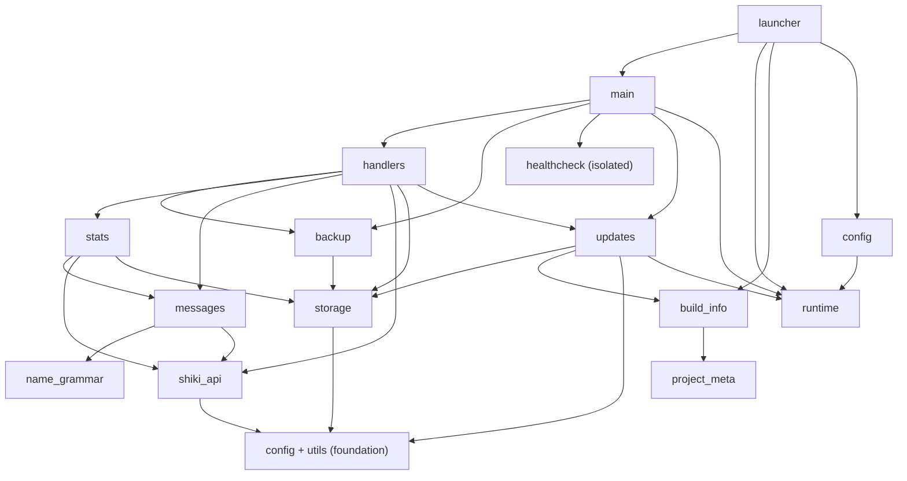

# Agent guidance for ShikiUpdatesBot

## Working agreements

### Roles and technical authority

- The maintainer defines product goals, desired behaviour, and priorities, and retains final authority over repository changes and merges. Codex is the primary author and technical lead for the Python codebase: within the approved scope, it makes implementation and architectural decisions by default without offloading Python details to the maintainer.
- Do not assume the maintainer must resolve Python implementation details. Inspect the code and existing decisions directly. Ask only when a product choice, ambiguous intent, missing authority, or external coordination genuinely requires input.
- If a request or proposed solution would harm correctness, stability, maintainability, security, or the bot as a whole, say so explicitly before implementation, explain the concrete risk, and recommend a safer alternative. The maintainer may accept or override a technical choice after reviewing the tradeoffs, while Codex remains responsible for the quality of what it authors and must not silently ship a knowingly harmful solution.
- Reject complexity that has no comparable practical benefit. Prefer the smallest robust design that preserves existing behaviour.

### Language and code comments

- Write Python and build-script comments, module docstrings, and function/class docstrings in Russian. Keep identifiers, protocol names, library/API names, command-line flags, and standard license headers in their canonical form. GitHub issues, commit/PR metadata, and unavoidable third-party configuration fields remain in English where the workflow requires it.

### Canon and durable knowledge

- Written canon beats conversational memory. Record important discoveries and decisions when they are made:
  - agreed implementation work → a GitHub issue;
  - process and architectural decisions → this `AGENTS.md`;
  - raw, deferred, or rejected ideas (with the reason) → `ideas.md`.
- Do not keep duplicate sources of truth. Current behaviour is established by code and tests; `AGENTS.md` records how the project is intended to work and why; GitHub issues are the canonical home of accepted active work; `ideas.md` is the pre-issue inbox and decision parking lot.
- Codex may update `AGENTS.md` whenever needed without asking for permission, but must report material documentation changes in its handoff.
- `AGENTS.md` is committed and synchronized through public GitHub. Never put secrets, tokens, private identifiers, machine-specific paths, or temporary session details in it.

### Tests and verification

- A behaviour change or bug fix ships with its tests. A regression test must fail against the broken/unpatched behaviour and pass with the fix.
- Test placement mirrors production ownership: `test_<module>.py` for focused modules and `test_handlers_<flow>.py` for handler orchestration. Each symbol's input→output matrix has one authoritative test home.
- Tests of module X verify X's logic and its handling of dependency contracts, including `None`, empty, and exceptional outcomes. They do not duplicate the dependency's own input→output matrix.
- Run cheap pure helpers for real. Mock I/O boundaries such as Telegram, HTTP, storage/filesystem access, and clocks. Full aiogram surfaces may use `unittest.mock`; narrow contracts may use small hand-written stubs.
- Before a PR, run `pytest tests/` and `ruff check .` when the environment provides the required interpreter and tools. If verification cannot run, report that limitation explicitly.

### Work tracking and delivery

- Once a design is agreed, create or update a GitHub issue immediately. Issues are written in English and should include appropriate labels, dependency notes such as `Blocked by: #N`, and an acceptance/test outline.
- An issue tied to a branch starts with the branch name (`branch-name: summary`). PR titles do not carry the branch prefix: use an imperative squash-commit subject and put `Fixes #N` in the PR body.
- Review feedback that arrives after merge approval and belongs to already planned work is added to the existing issue instead of being fixed opportunistically or duplicated in a new issue.
- Before a PR, audit the final diff and issue against the durable documentation: `README.md` for user-facing behaviour, configuration, and deployment; `AGENTS.md` for process, architecture, and stability decisions; and `ideas.md` for deferred items that were implemented, rejected, superseded, or promoted to an issue. Update only the affected sources, avoid duplicating behaviour already established by code and tests, and report material documentation changes in the handoff.
- At the end of every user-facing change, classify its SemVer impact (`none`, `patch`, `minor`, or `major`) against the latest published release and report the decision. Do not bump the version mechanically per commit or independently in every branch; update `project_meta.PROJECT_VERSION` once in the release-bound change so it exactly matches the intended `vMAJOR.MINOR.PATCH` tag.
- Every user-facing PR handoff includes a short, copy-ready release-note fragment written for users. Before pushing a release tag, consolidate these fragments into human-readable notes headed by what changed, any update or migration steps, and relevant known limitations. GitHub-generated notes are the technical changelog supplement, not a substitute for this summary.
- Push a release tag only from the final merged `main` commit after its version change is present. The tag triggers the verified Windows build and creates a draft GitHub Release; inspect its notes, ZIP, and checksum before publishing it manually.
- Codex should offer a consistent commit subject/body and, when useful, an English PR title and body. Git-mutating operations remain with the maintainer unless the maintainer explicitly requests otherwise; read-only inspection (`status`, `diff`, `log`, `show`) is allowed.
- Start every distinct development stage in a fresh Codex task; a new branch always means a new task. Durable context must come from `AGENTS.md`, GitHub issues, `ideas.md`, and the code rather than an old chat.

## What this repository is
- A Telegram bot that tracks a Shikimori user's history and favourites, then sends notifications to Telegram subscribers.
- Collects statistics (genres, studios, scores, demographics, etc.) and sends the owner an automatic report at the start of each quarter.
- Exposes `/stats` (button menu: current quarter / all-time) and `/favs` (favourite anime, manga, ranobe, characters, and industry people) to all subscribers; `/version` is owner-only.
- Uses `aiogram` for Telegram and `aiohttp` for HTTP (both client, for Shikimori, and server, for healthcheck).
- Split into focused modules (see Architecture); tests live in `tests/`.

## Architecture (modules)
The former `main.py` monolith was split into single-responsibility modules with a strictly one-way (acyclic) dependency graph. `main.py` is now a thin application entrypoint; `launcher.py` is the PyInstaller console entrypoint.

- `runtime.py` — stdlib-only frozen/source detection, physical app-root paths, first-run `.env` copy, rotating portable logs, and the Windows single-instance mutex. Lowest foundation; imports nothing project-local.
- `project_meta.py` / `build_info.py` — canonical project version/description and runtime build identity (`APP_VERSION`, repository/server/API URLs), strict SemVer parsing, and PyInstaller overrides injected through `_build_info`.
- `config.py` — explicit app-root `.env` loading (`load_dotenv`), data-dir paths, and shared logging. Depends only on `runtime`.
- `utils.py` — pure stdlib-only helpers: `h`, `_rel_url`, `_subscriber_link`, `_utcnow`, `quarter_*`, `_safe_int`, `_safe_float`, `_normalize_homoglyphs`.
- `name_grammar.py` — startup-time validation, gender detection, first-name inflection, immutable display-name context, and `{g:male|female}` formatting. Pure domain layer over `pytrovich`; imports nothing project-local.
- `storage.py` — file persistence: `_atomic_write`, load/save of every JSON state file (including standalone `update_state.json`), the `stats_all` in-memory cache.
- `updates.py` — notification-only GitHub Release check, daily cache/state, owner notification, and update-loop lifecycle. It never downloads or replaces files and does not use the Shikimori throttle.
- `shiki_api.py` — Shikimori client + media domain: `fetch_*`, GraphQL, kind filters (including the shared `RANOBE_KINDS`), `get_media_info`, `is_relevant`, translation dicts, and the central request throttle + 429 retry (`_throttle`/`_fetch`).
- `messages.py` — anime/manga/ranobe message banks, history parsers, `build_message` / `build_favourite_message`, presentation formatters.
- `stats.py` — aggregation, `sync_stats_all`, current-quarter events, quarter snapshots, the `build_*_messages` report builders.
- `backup.py` — `/backup` logic: zip build/restore, delivery to the owner, auto-backup triggers, and the source/Docker shutdown hook.
- `handlers.py` — all aiogram commands & FSM, inline menus and their shared exception-safe cleanup, broadcast, the notification cycle (`check_and_notify*`, `polling_loop`), quarter rotation, the owner-reachability gate.
- `healthcheck.py` — isolated HTTP healthcheck server + heartbeat watchdog. Imports nothing from the app; the dependency is one-way.
- `main.py` — application entrypoint: builds the Bot/Dispatcher, registers handlers, runs the owner gate, source/Docker healthcheck, update loop, and polling.
- `launcher.py` — frozen console entrypoint: `--version`, `--check-config`, first-run diagnostics, single-instance ownership, and delegation to `main.main()`.

Dependency graph (each module depends only on those below it; `healthcheck` is fully isolated):

```mermaid
graph TD
    launcher --> main
    launcher --> runtime
    launcher --> build_info
    launcher --> config
    main --> handlers
    main --> backup
    main --> healthcheck
    main --> updates
    main --> runtime
    handlers --> backup
    handlers --> stats
    handlers --> messages
    handlers --> shiki_api
    handlers --> storage
    handlers --> updates
    updates --> storage
    updates --> build_info
    build_info --> project_meta
    updates --> base
    updates --> runtime
    stats --> messages
    stats --> shiki_api
    stats --> storage
    messages --> name_grammar
    messages --> shiki_api
    backup --> storage
    storage --> base["config + utils (foundation)"]
    shiki_api --> base
    config --> runtime
    healthcheck["healthcheck (isolated)"]
```

When adding or moving code, keep dependencies one-directional (import from lower modules only) and pass runtime values (like `CHECK_INTERVAL`) as parameters where that avoids a cycle. `healthcheck.py` is the reference pattern.

## Important files
- `README.md` — setup (hosting, portable Windows exe, local Python, Docker), commands, statistics, healthcheck, and test instructions.
- `project_meta.py` — the single committed project version, canonical repository, and short `/version` description shared by source and packaged modes.
- `ShikiUpdatesBot.spec` / `requirements-build.txt` / `README-Windows.txt` — pinned one-file build, build-only dependency, and packaged Windows instructions; `assets/ShikiUpdatesBot.ico` is the embedded multi-size Windows icon and its sibling PNG is the editable preview source.
- `requirements.txt` / `requirements-dev.txt` — runtime and development dependencies (`python-dotenv` is a runtime dep for `.env` loading).
- `.env.example` — template for the environment variables.
- `tests/` — pytest coverage for configuration, pure helpers, storage, the Shikimori API, messages and name grammar, statistics, backup, handler flows, the polling loop, the owner-gate, and Telegram send behaviour.

## Key patterns and conventions
- Environment variables (read in `config.py`, except `PORT`, which `healthcheck.py` reads directly; `.env` is loaded explicitly from the source/exe root and never overrides the process environment): **required** — `BOT_TOKEN`, `OWNER_ID`, `SHIKI_USER`. **Optional with defaults** — `DISPLAY_NAME` (defaults to the `SHIKI_USER` nick), `DISPLAY_NAME_GENDER` (`auto`; also `male`, `female`, `none`), `SHIKI_BASE_URL`, `CHECK_INTERVAL`, `ERROR_NOTIFY_INTERVAL`, `FULL_SYNC_INTERVAL`, `DATA_DIR` (`/data` for source/Docker, `<exe>/data` frozen), `PORT` (`8080`, source/Docker only). Frozen relative `DATA_DIR` overrides resolve from the portable root.
- Display-name morphology runs once when `messages.py` initializes. Only Russian first names made of Cyrillic letters with optional hyphen-separated components are eligible. `auto` requires a confident `pytrovich` gender; ambiguous/ineligible names and every dependency failure fall back to the raw name in all cases plus masculine template alternatives. `male`/`female` force grammar; `none` skips morphology. Templates keep `{n}` nominative and use `{n_gen}`, `{n_dat}`, `{n_acc}`, `{n_ins}` plus `{g:male|female}`. Every selected form is HTML-escaped after inflection.
- The bot stores state in JSON files under `DATA_DIR`: `seen_ids.json`, `subscribers.json`, `seen_favourites.json`, `stats_all.json`, `stats_current.json`, `update_state.json`, and snapshots in `quarters/`; `stats_current.json` additionally holds `last_backup_at`, the weekly auto-backup marker. Frozen rotating logs live in sibling `logs/`, deliberately outside `/backup`.
- **Project version has one source of truth.** `project_meta.PROJECT_VERSION` is used by Python/source mode and must exactly match a release tag before CI will publish it. Non-tag exe artifacts append `-dev`; release builds embed the exact tag. `/version` works in every mode: source performs an explicit check only when the owner asks, while a release exe also checks automatically once per day.
- **Standalone release identity is build-time, not user config.** `ShikiUpdatesBot.spec` embeds the tag plus `github.repository`, server, and API URLs. Fork exe builds follow their own releases automatically; maintainers may set the build-time `UPDATE_REPOSITORY` repository variable to follow another upstream. Only full SemVer releases with a Windows x64 ZIP participate; GitHub errors are non-fatal and notifications are once per successfully delivered newer version.
- **Portable Windows contract.** Persistent files stay beside the physical exe (`sys.executable`), never under `%APPDATA%` or PyInstaller `_MEI`. A missing `.env` is copied once from the adjacent example and never overwritten; healthcheck is skipped frozen; the named mutex prevents a second process in the same folder. Updating means replacing only the stopped exe.
- All file writes go through `_atomic_write()` (temp file + `os.replace()`) for crash safety.
- All Telegram messages use `ParseMode.HTML`; user-facing strings from the API are escaped via `h()` (`html.escape`).
- **Stability is the top priority.** Every function must be exception-safe: unexpected or missing data must never crash the bot. Network fetches return `None` on any error (not empty collections) to distinguish API failures from genuinely empty results. Statistics degrade gracefully — a failed export or GraphQL call yields a report without enriched metadata rather than a crash.
- Statistics data sources: user lists come from the public `list_export` JSON endpoints (no auth); title metadata comes from the GraphQL `animes`/`mangas` batch queries with `censored: false`. Do NOT reintroduce per-title REST calls or OAuth — these were evaluated and rejected.
- A single relevance filter `is_relevant(media, kind)` governs BOTH notifications and statistics. OVA/ONA are kept; specials/clips/PV are dropped. Do not duplicate or diverge this logic.
- **Ranobe is a presentation-only split from manga.** Shikimori history keeps ranobe in the manga domain; `get_media_info` therefore continues to return `media_type="manga"` for `kind in RANOBE_KINDS`, and statistics plus `is_relevant` must keep treating it as manga. The current GraphQL `MangaKindEnum` documents `light_novel` and `novel`; `ranobe` remains a deliberate defensive alias for the undocumented REST history contract, not a currently documented kind. `messages.build_message` uses the preserved `kind` only to select the dedicated `MESSAGES["ranobe"]` presentation bank; favourites route the API `ranobe` category to `MESSAGES["favourites"]["ranobe"]`. Score-change direction banks remain shared across all media and append a human label (`аниме`/`манга`/`ранобэ`) to the rendered title. Do not change the domain `media_type` to `ranobe` merely to choose wording.
- **Anti-429 defense is layered (Shikimori limits: 5 req/sec burst + 90 req/min).** 429s have been a recurring source of breakage, so outgoing requests are guarded at several levels:
  - **Central request throttle (primary).** `shiki_api._throttle()` — one choke-point every request `await`s before firing: fixed min-gap (`_MIN_GAP`, 0.25s → ≤4 req/sec; monotonic mark + lazy `asyncio.Lock`; firewall-style, **no jitter**). All network fns route through a single `_fetch()` helper, so every call-site (incl. `/status` and a future multi-profile mode) is serialized.
  - **429 retry.** `_fetch` intercepts `429` *before* the status check, reads `Retry-After` (`_retry_after`: seconds form only; fallback `_RETRY_AFTER_DEFAULT`, capped `_RETRY_AFTER_CAP`), sleeps and retries up to `_MAX_429_RETRIES`. Data on a successful retry; exhaustion → `None`.
  - **Malformed-body safety.** A `200` with a broken/unexpected body (None, non-list, missing fields) is caught in `_fetch` (JSON + `AttributeError`/`TypeError`/`KeyError`) → `None` + warning, so a bad payload skips the cycle instead of aborting it.
  - **Boot-throttle (startup burst).** `polling_loop` opens one shared `aiohttp.ClientSession` for all startup fetches with fixed inter-phase delays (`BOOT_PHASE_DELAY`, no jitter); favourites is fetched **once** and reused by the stats sync.
  - **Per-cycle favourites dedup.** Each loop iteration fetches favourites once and threads it into both notifications (`check_and_notify_favourites(favourites=…)`) and the resync (`sync_stats_all(fav=…)`) — 1 request/cycle instead of 2. `fetch_meta_batch`/`sync_stats_all` take an optional `session` (own short-lived one when omitted).
  - **Not fully covered:** the 90 req/min ceiling isn't bound by the min-gap alone (see `ideas.md`) — only relevant under sustained multi-profile bursts; revisit then.
- **Owner-reachability gate.** On startup `probe_owner_and_start()` sends the owner a local health snapshot beginning with `🟢 Бот запущен` (with the bare restart signal as an exception-safe fallback); this also probes the emergency channel and is not debounced. Delivered → `polling_loop` starts as a background task; not delivered → WARNING and the loop is left off. Update-polling stays alive regardless, and the owner re-arms the loop by sending `/start` (idempotent) without a restart. The gate is startup-only; runtime owner-send failures degrade gracefully.
- Use `pytest tests/` to validate changes; `tests/conftest.py` provides default env vars (incl. a temp `DATA_DIR` and `SHIKI_USER`) and zeroes `BOOT_PHASE_DELAY` for speed. It also hosts the shared `backup_env` fixture, which redirects state paths (`DATA_DIR`/`quarters`, storage files, `OWNER_ID`) into `tmp_path`; it is used by both `test_backup.py` (backup.py core) and `test_handlers_backup.py` (the /backup handler flow).
- Preserve existing behaviour for Shikimori event filtering, favourite notifications, and statistics aggregation when modifying logic.
- `/backup` (owner-only) zips the whole `DATA_DIR` for export and restores a whitelist (`subscribers.json`, `stats_current.json`, `update_state.json`, `quarters/*.json`) on import; preserving `update_state.json` prevents a migrated bot from repeating an already delivered release notification. Import validates the full candidate set before publication, stages both new payloads and replaced originals beside `DATA_DIR`, and rolls back files already published if a later publication fails; this is an in-process error transaction, not a claim of power-loss atomicity. The owner also receives automatic backups (tag `#backup`) on subscribe/unsubscribe, quarter rotation, and weekly (via the `last_backup_at` marker). Source/Docker additionally registers the graceful-shutdown backup; portable EXE deliberately does not, because its persistent local data plus planned/event backups make an archive on every console or PC shutdown noisy rather than useful. The seven-day `WEEKLY_BACKUP_INTERVAL` is deliberately a fixed internal constant, not an environment setting. Replaces the former `/export` and `/import`.

## Gotchas discovered the hard way (read before touching stats/links)
- **GraphQL vs REST URL formats differ.** GraphQL Shikimori returns FULL urls (`https://shikimori.io/animes/123`), while REST history returns RELATIVE (`/animes/123`). All link-building code prepends `SHIKI_BASE_URL`, so a full url would produce a double-domain broken link. `_rel_url()` (utils) normalizes any url to relative form — applied at the source (`fetch_meta_batch` in `shiki_api.py`) and defensively at every render point. When adding new link rendering, run urls through `_rel_url()`.
- **Translations are baked into stored records.** `origin` and `rating` are translated via `_ORIGIN_RU`/`_RATING_RU` (`shiki_api.py`) at fetch time and saved into `titles`. Existing records keep their old value when a dict is edited — fixes apply only to new records (or after wiping the test bot's data). This was deliberately not refactored to "store-raw-translate-on-display" (deemed over-engineering for a rarely-changing dict).
- **`/stats` and the quarterly report share `_build_quarter_section`** (`stats.py`). Editing it changes both at once — convenient, but verify both.
- **`/stats all` and the quarterly report are built by DIFFERENT code** (`build_stats_all_messages` works from pre-computed aggregates; the quarterly section aggregates a title list on the fly). Shared look comes from common formatters (`_top_block`, `_fmt_mono_rows`, `_section_header`, `_score_dist_block` in `messages.py`), not shared builders.
- **Shikimori mixes Latin homoglyphs into Russian history strings.** It sends Latin lookalikes (e.g. `c` U+0063 for Cyrillic `с`, `o` for `о`) inside Russian descriptions, so Cyrillic regexes miss and the score renders as `?`. The three history parsers (`extract_score_change`, `extract_score`, `classify_event` in `messages.py`) run input through `_normalize_homoglyphs()` (utils) right after `_strip_html`. It is a single scoped normalization pass — **not** per-site `[xy]` char classes (whack-a-mole): Latin twins are folded to Cyrillic only inside mixed-script tokens (token already has Cyrillic) plus the whitelisted standalone connectives `c→с`/`o→о`; pure-Latin tokens (English `rated`/`scored`, English titles, URLs) are left untouched. When adding a new Russian-matching parser, feed it normalized text; do not resurrect per-connective `[сc]` classes.
- **Link previews are disabled selectively.** `/favs` passes `disable_preview=True` (its first link is always the same favourite); `/stats`, `/status`, and notifications keep previews (a card for the relevant title is desirable).

## Testing notes (two real prod bugs slipped through — smoke tests now guard against them)
- Test ownership follows the production split: `test_utils.py` owns `_safe_int`/`_safe_float`, `_rel_url`, `_subscriber_link`, and quarter/date helpers; `test_shiki_api.py` owns `get_media_info`, `is_relevant`, and network-contract tests; `test_stats.py` owns aggregation, favourites collection, metadata retry/sync, the kind-filter regression (garbage kinds must not inflate a studio counter — the "Studio Deen 11 vs 8" bug), report formatters, and **smoke tests**. Every report builder (`build_stats_all_messages`, `build_current_stats_messages`, `build_quarterly_report_messages`, `build_favourites_messages`, and the `_stats_report_*` async builders) is called and asserted to return `list[str]`, and rendered links are checked to contain the domain exactly once (no double-domain).
- Rationale: two production bugs would have been caught instantly by these smoke tests — (1) `build_stats_all_messages` going undefined after a manual merge clobbered its header, and (2) double-domain broken links from GraphQL full URLs. When adding new report builders or formatters, extend the smoke tests accordingly. Test files mirror modules (`test_<module>.py`); the fat handlers orchestrator is split by flow (`test_handlers_<flow>.py`: favourites, notify, broadcast, send, owner_gate, polling, status, subs, stats_menu, backup), with shared inline-menu cleanup owned by `test_handlers_menu_cleanup.py`. Each symbol's input→output matrix lives in exactly one file — no cross-file duplication.
- Tests patch symbols where they are looked up: mock the I/O a handler calls as `handlers.<name>` (e.g. `monkeypatch.setattr("handlers.fetch_favourites", …)`), the stats-domain callers as `stats.<name>`, etc. String-form `monkeypatch.setattr("module.name", …)` avoids local-variable shadowing.
- **Coverage is a diagnostic, not a target; do not pin or chase a percentage.** Seam discipline deflates it: flow tests mock I/O, so real `load_*`/`fetch_*` bodies read as uncovered even when well-exercised through the flow. Report builders intentionally use smoke tests rather than exhaustive snapshots until the rich-formatting rewrite (#10), while shared low-level formatters and message routing/template contracts have focused tests. `main.py` wiring has a focused lifecycle test for frozen update startup and console-guard cleanup; defensive `except → log.debug` branches otherwise carry little signal. The GraphQL and storage gaps identified in #26 remain covered; current `/backup` core and handler orchestration live in `test_backup.py` and `test_handlers_backup.py`.

## Typical developer tasks
- Update message templates or event classification: the message bank and parsers live in `messages.py`.
- Update display-name cases or gender agreement: grammar rules and formatting live in `name_grammar.py`; template case/gender tags live in `messages.py`.
- Fix parser edge cases for Shikimori descriptions and score extraction (`messages.py`).
- Extend statistics aggregation or report formatting: `stats.py` (`build_*_messages`, `recompute_aggregates`, `_build_quarter_section`) and the `_top_block`/`_fmt_*` formatters in `messages.py`.
- Add a new report type to the `/stats` menu: append one entry to `_STATS_MENU` in `handlers.py` (callback key, label, async builder, row) — keyboard and dispatch update automatically.
- Improve notification filtering, storage handling, and broadcast flow (`handlers.py` / `storage.py`).
- Add tests under `tests/` for any new behavior.

## How to run
- Install runtime dependencies: `pip install -r requirements.txt`
- Install test dependencies before running tests: `pip install -r requirements-dev.txt`
- Set at least the required env vars (`BOT_TOKEN`, `OWNER_ID`, `SHIKI_USER`) — via the environment or a local `.env` (see `.env.example`).
- Run the bot: `python main.py`
- Build the Windows exe: `pip install -r requirements-build.txt`, then `pyinstaller --clean --noconfirm ShikiUpdatesBot.spec`
- Smoke the exe: `dist\ShikiUpdatesBot.exe --version` and `dist\ShikiUpdatesBot.exe --check-config`
- Run tests: `pytest tests/`
- Lint before pushing/opening a PR: `ruff check .` (config in `ruff.toml`: E4/E7/E9/F/I — E402 import-placement and I import-sort are enforced; also runs in CI with autofix).

## Notes for AI agents
- The module split is done (see Architecture). Keep the dependency graph acyclic and one-directional; `healthcheck.py` is the reference (one-way deps, parameters instead of back-imports).
- Do not commit actual bot tokens or owner IDs.
- When changing configuration defaults, document them in both `config.py` and `README.md`.
- Prefer minimal, behavior-preserving fixes, and verify with `pytest tests/` (ruff runs in CI).
- Line endings are CRLF (the repo has no `.gitattributes`); keep them to avoid whole-file diffs.
- Git operations are handled manually by the maintainer — do not push via tooling.
