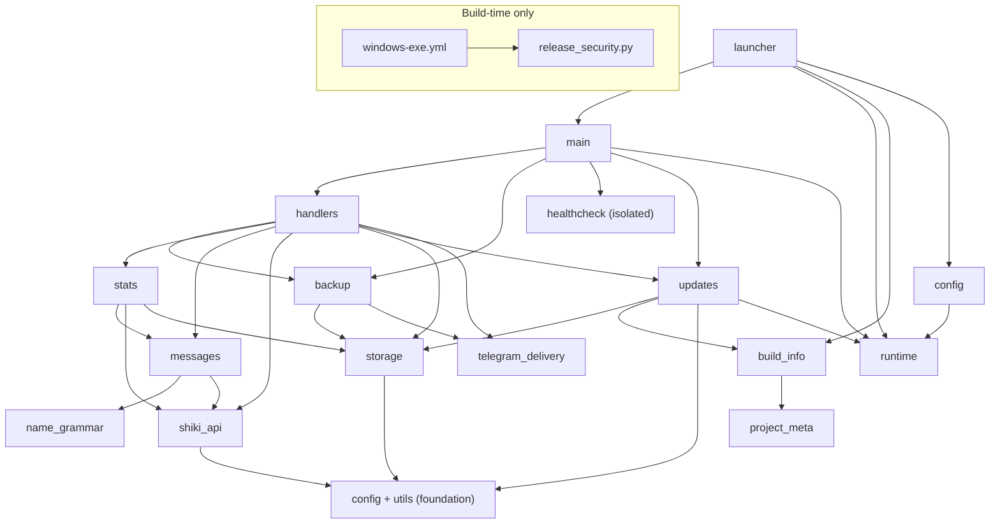

# ShikiUpdatesBot architecture

This document is the canonical description of the bot's internal architecture, module ownership, runtime contracts, and hard-won implementation constraints. Read it together with `AGENTS.md` before changing the repository. User-facing setup and behaviour belong in `README.md`; current behaviour is ultimately established by code and tests.

## What this repository is

- A Telegram bot that tracks a Shikimori user's history and favourites, then sends notifications to Telegram subscribers.
- Collects statistics (genres, studios, scores, demographics, etc.) and sends the owner an automatic report at the start of each quarter.
- Exposes `/stats` (button menu: current quarter / all-time) and `/favs` (favourite anime, manga, ranobe, characters, and industry people) to all subscribers; `/version` is owner-only.
- Uses `aiogram` for Telegram and `aiohttp` for HTTP (both client, for Shikimori, and server, for healthcheck).
- Split into focused modules; tests live in `tests/`.

## Modules and dependency direction

The former `main.py` monolith was split into single-responsibility modules with a strictly one-way (acyclic) dependency graph. `main.py` is now a thin application entrypoint; `launcher.py` is the PyInstaller console entrypoint.

- `runtime.py` — stdlib-only frozen/source detection, physical app-root paths, first-run `.env` copy, rotating portable logs, and the Windows single-instance mutex. Lowest foundation; imports nothing project-local.
- `telegram_delivery.py` — shared bounded retry helper for subscriber notifications and owner backup uploads. Classifies blocked, flood-control, transient transport/server, and permanent failures; imports nothing project-local.
- `project_meta.py` / `build_info.py` — canonical project version/description and runtime build identity (`APP_VERSION`, repository/server/API URLs), strict SemVer parsing, and PyInstaller overrides injected through `_build_info`.
- `config.py` — explicit app-root `.env` loading (`load_dotenv`), data-dir paths, and shared logging. Depends only on `runtime`.
- `utils.py` — pure stdlib-only helpers: `h`, `_rel_url`, `_subscriber_link`, `_utcnow`, `_parse_iso_utc`, `quarter_*`, `_safe_int`, `_safe_float`, `_normalize_homoglyphs`.
- `name_grammar.py` — startup-time validation, gender detection, first-name inflection, immutable display-name context, and `{g:male|female}` formatting. Pure domain layer over `pytrovich`; imports nothing project-local.
- `storage.py` — file persistence: `_atomic_write`, load/save of every JSON state file (including standalone `update_state.json`), the `stats_all` in-memory cache, and the event-loop-local transaction lock for restorable live state.
- `updates.py` — notification-only GitHub Release check, daily cache/state, owner notification, and update-loop lifecycle. It never downloads or replaces files and does not use the Shikimori throttle.
- `shiki_api.py` — Shikimori client + media domain: `fetch_*`, GraphQL, kind filters (including the shared `RANOBE_KINDS`), `get_media_info`, `is_relevant`, translation dicts, and the central request throttle + 429 retry (`_throttle`/`_fetch`).
- `messages.py` — anime/manga/ranobe message banks, history parsers, `build_message` / `build_favourite_message`, presentation formatters.
- `stats.py` — aggregation, `sync_stats_all`, current-quarter events, quarter snapshots, the `build_*_messages` report builders.
- `backup.py` — `/backup` logic: ZIP build/restore, delivery to the owner, auto-backup triggers, and the source/Docker shutdown hook.
- `handlers.py` — all aiogram commands and FSM, inline menus and shared exception-safe cleanup, broadcast, notification cycle (`check_and_notify*`, `polling_loop`), quarter rotation, and owner-reachability gate.
- `healthcheck.py` — isolated HTTP healthcheck server and heartbeat watchdog. Imports nothing from the app; the dependency is one-way.
- `main.py` — application entrypoint: builds the Bot/Dispatcher, registers handlers, runs the owner gate, source/Docker healthcheck, update loop, and polling.
- `launcher.py` — frozen console entrypoint: `--version`, `--check-config`, first-run diagnostics, single-instance ownership, and delegation to `main.main()`.
- `release_security.py` — build-time-only VirusTotal client invoked by the Windows release workflow. It imports no project-local modules and is never part of bot runtime.

Each module depends only on modules below it; `healthcheck` is fully isolated:

When adding or moving code, keep dependencies one-directional and pass runtime values such as `CHECK_INTERVAL` as parameters where that avoids a cycle. `healthcheck.py` is the reference pattern.

## Important files

- `README.md` — setup (hosting, portable Windows exe, local Python, Docker), commands, statistics, healthcheck, and test instructions.
- `project_meta.py` — the single committed project version, canonical repository, and short `/version` description shared by source and packaged modes.
- `ShikiUpdatesBot.spec` / `requirements-build.txt` / `README-Windows.txt` — pinned one-file build, build-only dependency, and packaged Windows instructions; `assets/ShikiUpdatesBot.ico` is the embedded multi-size Windows icon and its sibling PNG is the editable preview source.
- `release_security.py` / `.github/workflows/windows-exe.yml` — build-time VirusTotal client and tagged Windows release pipeline. The client looks up SHA-256 before upload, handles the large-file upload URL, respects the public polling limit, and renders the shared Russian Actions/Release Markdown; it is not imported by bot runtime.
- `requirements.txt` / `requirements-dev.txt` — runtime and development dependencies (`python-dotenv` is a runtime dependency for `.env` loading).
- `.env.example` — template for environment variables.
- `.github/workflows/dependency-submission.yml` / `.github/scripts/submit_dependency_snapshot.py` / `.github/scripts/validate_dependency_submission.py` — build-time-only submission of the resolved Python 3.12 dependency graph. GitHub's managed plain-pip graph job remains enabled, but submits unpinned root requirements without resolved versions or transitive edges. Component Detection's stable `PipReport` detector only discovers files named exactly `requirements.txt`, so it cannot preserve the identities of the canonical root `requirements-dev.txt` and `requirements-build.txt`. The explicit workflow instead runs `pip --dry-run --report` separately for all three files, constructs one Dependency Submission API snapshot with exact repository-relative paths, validates versioned direct dependencies and transitive edges, and only then submits it. The snapshot retains the legacy Component Detection detector identity but uses a dedicated alphabetically-first correlator, making GitHub's documented selection among competing manual detectors deterministic. This keeps the manifests distinct without an adapter or lockfile policy.
- `tests/` — pytest coverage for configuration, pure helpers, storage, the Shikimori API, messages and name grammar, statistics, backup, handler flows, polling, owner gate, and Telegram delivery/retry behaviour.

## Runtime and domain contracts

- Environment variables (read in `config.py`, except `PORT`, which `healthcheck.py` reads directly; `.env` is loaded explicitly from the source/exe root and never overrides the process environment): **required** — `BOT_TOKEN`, `OWNER_ID`, `SHIKI_USER`. **Optional with defaults** — `DISPLAY_NAME` (defaults to the `SHIKI_USER` nick), `DISPLAY_NAME_GENDER` (`auto`; also `male`, `female`, `none`), `SHIKI_BASE_URL`, `CHECK_INTERVAL`, `ERROR_NOTIFY_INTERVAL`, `FULL_SYNC_INTERVAL`, `DATA_DIR` (`/data` for source/Docker, `<exe>/data` frozen), `PORT` (`8080`, source/Docker only). Frozen relative `DATA_DIR` overrides resolve from the portable root.
- Display-name morphology runs once when `messages.py` initializes. Only Russian first names made of Cyrillic letters with optional hyphen-separated components are eligible. `auto` requires a confident `pytrovich` gender; ambiguous/ineligible names and every dependency failure fall back to the raw name in all cases plus masculine template alternatives. `male`/`female` force grammar; `none` skips morphology. Templates keep `{n}` nominative and use `{n_gen}`, `{n_dat}`, `{n_acc}`, `{n_ins}` plus `{g:male|female}`. Every selected form is HTML-escaped after inflection.
- The bot stores state in JSON files under `DATA_DIR`: `seen_ids.json`, `subscribers.json`, `seen_favourites.json`, `stats_all.json`, `stats_current.json`, `update_state.json`, and snapshots in `quarters/`; `stats_current.json` additionally holds `last_backup_at`, the weekly auto-backup marker. Frozen rotating logs live in sibling `logs/`, deliberately outside `/backup`.
- **Project version has one source of truth.** `project_meta.PROJECT_VERSION` is the current code version and is advanced in each PR with non-`none` SemVer impact, independently of portable release cadence. Python/source mode reports it directly; non-tag exe artifacts append `-dev`. A release build embeds the exact tag, and CI publishes it only when that tag matches the current code version. `/version` works in every mode: source performs an explicit check only when the owner asks, while a release exe also checks automatically once per day.
- **Standalone release identity is build-time, not user config.** `ShikiUpdatesBot.spec` embeds the tag plus `github.repository`, server, and API URLs. Fork exe builds follow their own releases automatically; maintainers may set the build-time `UPDATE_REPOSITORY` repository variable to follow another upstream. Only full SemVer releases with a Windows x64 ZIP participate; GitHub errors are non-fatal and notifications are once per successfully delivered newer version.
- **VirusTotal is informational and tag-only.** Only a strict SemVer tag pushed through the release workflow receives the step-scoped `VIRUSTOTAL_API_KEY`; pull requests and manual development builds never receive or submit it. Existing hashes are reused, otherwise the public EXE is uploaded and polled at a bounded rate. Detections, a missing secret, rate limits, malformed responses, and timeouts produce warnings plus an explicit security block but do not gate draft-release creation. Standard submissions are public; never use this path for private artifacts.
- **Portable Windows contract.** Persistent files stay beside the physical exe (`sys.executable`), never under `%APPDATA%` or PyInstaller `_MEI`. A missing `.env` is copied once from the adjacent example and never overwritten; healthcheck is skipped frozen; the named mutex prevents a second process in the same folder. Updating means replacing only the stopped exe.
- All file writes go through `_atomic_write()` (temporary file + `os.replace()`) for crash safety.
- All Telegram messages use `ParseMode.HTML`; user-facing strings from the API are escaped via `h()` (`html.escape`).
- **Telegram delivery retry is bounded and in-process.** `telegram_delivery.send_with_retry()` accepts a fresh async send-operation factory and retries only `TelegramRetryAfter`, transient aiogram network/server failures, and transient aiohttp connection/payload failures, at most twice after the initial call. Subscriber iteration/removal remains in `handlers.py`; ZIP creation, owner targeting, and the successful-backup clock remain in `backup.py`. Backup retries reuse one ZIP byte payload but create a fresh `BufferedInputFile` for every upload. Permanent failures are not retried, and the shutdown wrapper retains its outer timeout/cancellation budget.
- **Stability is the top priority.** Every function must be exception-safe: unexpected or missing data must never crash the bot. Network fetches return `None` on any error (not empty collections) to distinguish API failures from genuinely empty results. Statistics degrade gracefully — a failed export or GraphQL call yields a report without enriched metadata rather than a crash.
- Statistics data sources: user lists come from the public `list_export` JSON endpoints (no auth); title metadata comes from the GraphQL `animes`/`mangas` batch queries with `censored: false`. Do not reintroduce per-title REST calls or OAuth — these were evaluated and rejected.
- A single relevance filter `is_relevant(media, kind)` governs both notifications and statistics. OVA/ONA are kept; specials/clips/PV are dropped. Do not duplicate or diverge this logic.
- **History actions are inferred from text, but progress is not a product event.** The public Shikimori history API exposes only the localized `description`, so completion must use anchored full-string formats (`Просмотрено`/`Прочитано` and their `... и оценено на N` forms), never stems such as `просмотрен` or `прочитан`. Episode/chapter/volume changes and resets plus `Удалено из списка` are known `ignored` events: mark their IDs seen, but send no notification, warning, or quarter event. A standalone first rating is `score_set`, not completion; `score_set` and `score_changed` update the score of an existing current-quarter `completed` event without creating a duplicate. `Отменена оценка` is a silent `score_removed` state correction: it clears that current-quarter completed score without notifying or appending an event, does nothing without such a completion, and never rewrites previous-quarter snapshots. A truly unknown description is logged as a warning and sent to subscribers as cleaned source text without exposing the internal `unknown` classification.
- **History catch-up is bounded and transactional.** `fetch_history()` retrieves one explicit page through the central throttle/429 retry; `handlers.py` requests page 1 first and fetches older pages only until a known `seen_ids` boundary or an exhausted short page, with a hard cap of five pages. Live API responses contain `limit + 1` rows (51 with `limit=50`) and adjacent pages overlap by one ID, but response order is not guaranteed to be strictly monotonic by ID or `created_at`. The orchestrator deduplicates by integer event ID and sorts old-to-new by ID before delivery. A failed required page or an unknown boundary at the cap aborts the history cycle without publishing partial `seen_ids`. First-run baseline remains one page and sends nothing.
- **Ranobe is a presentation-only split from manga.** Shikimori history keeps ranobe in the manga domain; `get_media_info` therefore continues to return `media_type="manga"` for `kind in RANOBE_KINDS`, and statistics plus `is_relevant` must keep treating it as manga. The current GraphQL `MangaKindEnum` documents `light_novel` and `novel`; `ranobe` remains a deliberate defensive alias for the undocumented REST history contract, not a currently documented kind. `messages.build_message` uses the preserved `kind` only to select the dedicated `MESSAGES["ranobe"]` presentation bank; favourites route the API `ranobe` category to `MESSAGES["favourites"]["ranobe"]`. History, media-favourite notifications, and `/status` use one presentation helper to append exactly one central human label (`аниме`/`манга`/`ранобэ`) to the rendered title; `/status` identifies ranobe through the manga target's existing `kind` and falls back to manga for a missing or unknown kind. Character and industry-person favourites remain unlabelled, and score-change direction banks remain shared across all media. Do not change the domain `media_type` to `ranobe` merely to choose wording.
- **Anti-429 defense is layered (Shikimori limits: 5 req/sec burst + 90 req/min).** 429s have been a recurring source of breakage, so outgoing requests are guarded at several levels:
  - **Central request throttle (primary).** `shiki_api._throttle()` — one choke-point every request `await`s before firing: fixed min-gap (`_MIN_GAP`, 0.25s → ≤4 req/sec; monotonic mark + lazy `asyncio.Lock`; firewall-style, **no jitter**). All network functions route through a single `_fetch()` helper, so every call site (including `/status` and a future multi-profile mode) is serialized.
  - **429 retry.** `_fetch` intercepts `429` *before* the status check, reads `Retry-After` (`_retry_after`: seconds form only; fallback `_RETRY_AFTER_DEFAULT`, capped `_RETRY_AFTER_CAP`), sleeps and retries up to `_MAX_429_RETRIES`. Data on a successful retry; exhaustion returns `None`.
  - **Malformed-body safety.** A `200` with a broken or unexpected body (`None`, non-list, missing fields) is caught in `_fetch` (JSON plus `AttributeError` / `TypeError` / `KeyError`) and returns `None` with a warning, so a bad payload skips the cycle instead of aborting it.
  - **Boot throttle (startup burst).** `polling_loop` opens one shared `aiohttp.ClientSession` for all startup fetches with fixed inter-phase delays (`BOOT_PHASE_DELAY`, no jitter); favourites is fetched **once** and reused by the stats sync.
  - **Per-cycle favourites deduplication.** Each loop iteration fetches favourites once and threads it into both notifications (`check_and_notify_favourites(favourites=…)`) and resync (`sync_stats_all(fav=…)`) — one request per cycle instead of two. `fetch_meta_batch` / `sync_stats_all` accept an optional session and create their own short-lived one when omitted.
  - **Public `/status` cache.** Every chat shares one process-local successful raw anime+manga rates result for a fixed 60-second TTL measured by monotonic time. A lazy `asyncio.Lock` plus a second cache check collapses concurrent cold/expired calls into one four-request refresh. Empty lists are successful and cacheable; a full failure of either media domain returns the existing warning without replacing or refreshing the cache. Existing per-domain soft degradation remains: `fetch_current_rates` returns a partial list when at least one requested status succeeds, so that list remains a cacheable successful result; it returns `None` only when every requested status fails. Rendering, allowed-anime filtering, HTML escaping, media labels, and link normalization still run for every command response. Restart begins cold.
  - **Not fully covered.** The 90 req/min ceiling is not bound by the min-gap alone (see `ideas.md`) and matters only under sustained multi-profile bursts; revisit then.
- **Owner-reachability gate.** On startup `probe_owner_and_start()` sends the owner a local health snapshot beginning with `🟢 Бот запущен` (with the bare restart signal as an exception-safe fallback); this also probes the emergency channel and is not debounced. Delivered means `polling_loop` starts as a background task; not delivered produces a warning and leaves the loop off. Update polling stays alive regardless, and the owner re-arms the loop by sending `/start` (idempotent) without a restart. The gate is startup-only; runtime owner-send failures degrade gracefully.
- Preserve existing Shikimori event filtering, favourite notifications, and statistics aggregation when modifying logic.
- **Backup contract.** `/backup` (owner-only) zips the whole `DATA_DIR` for export and restores a whitelist (`subscribers.json`, `stats_current.json`, `update_state.json`, `quarters/*.json`); preserving `update_state.json` prevents a migrated bot from repeating an already delivered release notification. Telegram documents with a missing size or over 20 MiB are rejected before download. Before reading any ZIP member, import rejects archives over 256 members, any restorable JSON over 8 MiB, or more than 32 MiB of cumulative restorable data; exact boundaries remain valid. Import then validates the full candidate set, stages both new payloads and replaced originals beside `DATA_DIR`, and rolls back files already published if a later publication fails; this is an in-process error transaction, not a claim of power-loss atomicity. Publication shares one event-loop-local transaction lock with every asynchronous writer of restorable state. Long operations never hold the lock across network or Telegram awaits: immediately before saving, history, subscriber, update-check, weekly-backup, and quarter-rotation flows reload the published state and apply only their own delta. This makes restored data effective immediately and prevents stale work from replacing it while preserving legitimate later changes. Quarter rotation publishes the new current period together with a durable pending-delivery record before Telegram awaits; report and backup success are marked separately, so either failed stage resumes on the next cycle or restart without holding the state lock over delivery. The owner also receives automatic backups (tag `#backup`) on subscribe/unsubscribe, quarter rotation, and weekly via the `last_backup_at` marker. Source/Docker additionally registers the graceful-shutdown backup; portable EXE deliberately does not, because persistent local data plus planned/event backups make an archive on every console or PC shutdown noisy rather than useful. Import limits and the seven-day `WEEKLY_BACKUP_INTERVAL` are deliberately fixed internal constants, not environment settings. This replaces the former `/export` and `/import`.

## Gotchas discovered the hard way

- **GraphQL vs REST URL formats differ.** GraphQL Shikimori returns full URLs (`https://shikimori.io/animes/123`), while REST history returns relative URLs (`/animes/123`). All link-building code prepends `SHIKI_BASE_URL`, so a full URL would produce a double-domain broken link. `_rel_url()` (`utils.py`) normalizes any URL to relative form — applied at the source (`fetch_meta_batch` in `shiki_api.py`) and defensively at every render point. When adding new link rendering, run URLs through `_rel_url()`.
- **Translations are baked into stored records.** `origin` and `rating` are translated via `_ORIGIN_RU` / `_RATING_RU` (`shiki_api.py`) at fetch time and saved into `titles`. Existing records keep their old value when a dictionary changes — fixes apply only to new records or after wiping the test bot's data. This was deliberately not refactored to store raw values and translate on display because that was unnecessary complexity for rarely changing dictionaries.
- **`/stats` and the quarterly report share `_build_quarter_section`** (`stats.py`). Editing it changes both at once; verify both.
- **`/stats all` and the quarterly report are built by different code.** `build_stats_all_messages` works from pre-computed aggregates; the quarterly section aggregates a title list on the fly. Shared appearance comes from common formatters (`_top_block`, `_fmt_mono_rows`, `_section_header`, `_score_dist_block` in `messages.py`), not shared builders.
- **Shikimori mixes Latin homoglyphs into Russian history strings.** It sends Latin lookalikes (for example, `c` U+0063 for Cyrillic `с`, or `o` for `о`) inside Russian descriptions, so Cyrillic regexes miss and the score renders as `?`. The three history parsers (`extract_score_change`, `extract_score`, `classify_event` in `messages.py`) run input through `_normalize_homoglyphs()` (`utils.py`) immediately after `_strip_html`. It is one scoped normalization pass, not scattered per-site `[сc]` alternatives: Latin twins are folded to Cyrillic only inside mixed-script tokens plus whitelisted standalone connectives `c→с` / `o→о`; pure-Latin tokens such as English `rated` / `scored`, titles, and URLs remain untouched. New Russian-matching parsers must use the same normalization.
- **Link previews are disabled selectively.** `/favs` passes `disable_preview=True` because its first link is always the same favourite; `/stats`, `/status`, and notifications keep previews because a card for the relevant title is desirable.

## Test topology and regressions

- `tests/conftest.py` provides default environment variables (including temporary `DATA_DIR` and `SHIKI_USER`) and zeroes `BOOT_PHASE_DELAY`. It also hosts the shared `backup_env` fixture, which redirects state paths (`DATA_DIR` / `quarters`, storage files, `OWNER_ID`) into `tmp_path`; both `test_backup.py` (backup core) and `test_handlers_backup.py` (`/backup` handler flow) use it.
- Test ownership follows the production split: `test_utils.py` owns `_safe_int` / `_safe_float`, `_rel_url`, `_subscriber_link`, and quarter/date helpers; `test_shiki_api.py` owns `get_media_info`, `is_relevant`, and network contracts; `test_stats.py` owns aggregation, favourites collection, metadata retry/sync, the kind-filter regression (garbage kinds must not inflate a studio counter — the “Studio Deen 11 vs 8” bug), report formatters, and smoke tests.
- Every report builder (`build_stats_all_messages`, `build_current_stats_messages`, `build_quarterly_report_messages`, `build_favourites_messages`, and the `_stats_report_*` async builders) is called and asserted to return `list[str]`; rendered links must contain the domain exactly once. These smoke tests would have caught both a merge-clobbered `build_stats_all_messages` definition and GraphQL double-domain URLs. Extend them for new report builders or render paths.
- Handler orchestration is split by flow (`test_handlers_<flow>.py`: favourites, notify, broadcast, send, owner gate, polling, status, subscriptions, stats menu, backup), with shared inline-menu cleanup in `test_handlers_menu_cleanup.py`. `test_handlers_status.py` owns cache hit/expiry/concurrency/failure orchestration; `test_messages.py` owns the `/status` media-label and URL matrix. Each symbol's input→output matrix has one authoritative test home.
- Flow tests mock I/O boundaries, so real `load_*` / `fetch_*` bodies may appear uncovered even when their contracts are exercised. Report builders intentionally use smoke tests rather than exhaustive snapshots until the rich-formatting rewrite (#10), while shared low-level formatters and message-routing/template contracts have focused tests. `main.py` wiring has a focused lifecycle test for frozen update startup and console-guard cleanup; defensive `except → log.debug` branches carry little signal. The GraphQL and storage gaps identified in #26 remain covered.

## Change map

- Update message templates or event classification in `messages.py`.
- Update display-name cases or gender agreement in `name_grammar.py`; template case/gender tags remain in `messages.py`.
- Fix Shikimori description parsing and score extraction edge cases in `messages.py`.
- Extend statistics aggregation or report formatting in `stats.py` (`build_*_messages`, `recompute_aggregates`, `_build_quarter_section`) and shared `_top_block` / `_fmt_*` formatters in `messages.py`.
- Add a new `/stats` report by appending one entry to `_STATS_MENU` in `handlers.py`; keyboard and dispatch update automatically.
- Improve notification filtering, storage handling, and broadcast flow in `handlers.py` / `storage.py`.
- Add tests under `tests/` for every new behaviour.
