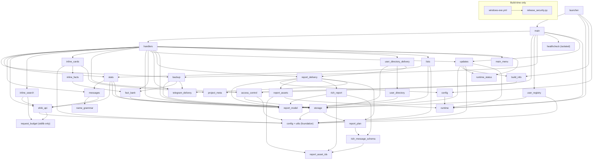

# ShikiUpdatesBot architecture

This document is the canonical description of the bot's internal architecture, module ownership, runtime contracts, and hard-won implementation constraints. Read it together with `AGENTS.md` before changing the repository. User-facing setup and behaviour belong in `README.md`; current behaviour is ultimately established by code and tests.

## What this repository is

- A Telegram hub for one public Shikimori profile, with optional notifications for subscribers.
- Collects statistics (genres, studios, scores, demographics, etc.) and sends the owner an automatic report at the start of each quarter.
- Publishes only `/start` in Telegram's command list; the unified menu exposes the public profile functions, while all historical slash commands remain registered as hidden compatibility entrypoints.
- Uses `aiogram` for Telegram and `aiohttp` for HTTP (both client, for Shikimori, and server, for healthcheck).
- Split into focused modules; tests live in `tests/`.

## Modules and dependency direction

The former `main.py` monolith was split into single-responsibility modules with a strictly one-way (acyclic) dependency graph. `main.py` is now a thin application entrypoint; `launcher.py` is the PyInstaller console entrypoint.

- `runtime.py` — stdlib-only frozen/source detection, physical app/resource-root paths, first-run `.env` copy, rotating portable logs, and the Windows single-instance mutex. Lowest foundation; imports nothing project-local.
- `runtime_status.py` — stdlib-only process start, successful full-sync wall clock, and notification-polling active flag. Process-local and non-persistent; imports nothing project-local.
- `telegram_delivery.py` — shared bounded retry helper for subscriber notifications and owner backup uploads. Classifies blocked, flood-control, transient transport/server, and permanent failures; imports nothing project-local.
- `project_meta.py` / `build_info.py` — canonical project version/description and runtime build identity (`APP_VERSION`, repository/server/API URLs), strict SemVer parsing, and PyInstaller overrides injected through `_build_info`.
- `config.py` — explicit app-root `.env` loading (`load_dotenv`), data-dir paths, and shared logging. Depends only on `runtime`.
- `utils.py` — pure stdlib-only helpers: `h`, `_rel_url`, `_subscriber_link`, `_utcnow`, `_parse_iso_utc`, `quarter_*`, `_safe_int`, `_safe_float`, `_normalize_homoglyphs`, and Russian count-word selection for integer or fractional reader-facing metrics.
- `request_budget.py` — pure rolling-window reservation primitive used by Shikimori attempt and inline-page budgets. Imports only the standard library.
- `report_asset_ids.py` — import-light registry of exact versioned Rich Message asset references and their content hashes. It imports nothing project-local, so pure plan validation does not acquire runtime or aiogram dependencies.
- `report_model.py` — pure typed report model shared by every report producer and transport renderer, ordinary Telegram HTML renderer, conservative UTF-16-aware visible-length accounting, and deterministic logical chunk planner. Text, links, headings, lists, tables, collapsible intent, and presentation-only galleries remain typed rather than becoming transport markup; source values stay unescaped until a renderer boundary. Imports nothing project-local.
- `rich_message_schema.py` — pure-data validator for the exact serialized Rich Message subset and every official character, block, nesting, table-column, and media limit used by the bot. Depends only on `report_asset_ids` from the project.
- `rich_report.py` — aiogram-facing Rich Message renderer over `Report`; maps typed nodes to headings, compact tables, lists, generated anchors, details, bounded top-title collages, and explicit one-to-three-poster galleries without parsing source text as HTML or Markdown, and paginates oversized grouped catalogs against the serialized Rich budgets. Depends on `report_model`, `report_asset_ids`, and `rich_message_schema`.
- `report_plan.py` — pure-data validation and conversion for frozen ordinary HTML and Rich Message transport units. Depends only on `rich_message_schema`.
- `report_assets.py` — aiogram-facing materialization of exact versioned local media references into in-memory multipart uploads. It verifies packaged bytes against the hash frozen into the reference before any Telegram await and depends on `report_asset_ids` and `runtime`.
- `report_delivery.py` — aiogram-facing report freezing and sequential delivery, per-fragment ordinary fallback mapping, local-asset materialization, bounded retry reuse, explicit delivery results, narrow unsupported-method fallback, preview policy, and stable interactive failure notices that distinguish zero delivery from partial delivery. Depends on `config`, `report_model`, `report_assets`, `rich_report`, `report_plan`, and `telegram_delivery` from the project.
- `fact_bank.py` — strict schema and limits for `facts.json`, canonical serialization, atomic publication, and the process-local immutable combined fact snapshot. Reuses `storage`'s restorable-state lock and atomic writer.
- `name_grammar.py` — startup-time validation, gender detection, first-name inflection, immutable display-name context, and `{g:male|female}` formatting. Pure domain layer over `pytrovich`; imports nothing project-local.
- `storage.py` — file persistence: `_atomic_write`, load/save of every JSON state file (including standalone `update_state.json`), the `stats_all` in-memory cache plus its valid/missing/invalid read state, the event-loop-local transaction lock for restorable live state, and the process-local generation advanced by every successful restorable import.
- `user_directory.py` — pure classification, ordering, historical counting, and typed `Report` construction over an immutable three-source snapshot; imports only the shared report model from the project and performs no I/O or mutation.
- `user_directory_delivery.py` — reusable owner-tools use-case that acquires the coherent directory snapshot, releases storage before building presentation, owns stable source-failure handling, and delegates transport to `report_delivery`.
- `access_control.py` — the single middleware boundary for the persistent Telegram user block list. Depends only on `config` and `storage`, and runs before project handlers and user registration.
- `user_registry.py` — handler-matched middleware for first-seen Telegram users and best-effort owner alerts. Depends only on `config`, `storage`, and `utils`, and never owns access or entitlement policy.
- `inline_cards.py` — pure inline-card presentation over aiogram types: shared singular media-kind labels, Shikimori URL normalization, markup cleanup, HTML escaping, field-aware caption truncation, photo/article result construction, and shared project/fact rendering. Depends only on `config`, `inline_facts`, `project_meta`, and `utils` from the project.
- `inline_facts.py` — hardcoded 50+6 fact baseline plus pure query classification and deterministic selection/rotation over the immutable snapshot owned by `fact_bank`; it owns no Telegram, search, cache, or network state.
- `inline_search.py` — inline query parsing and process-local debounce, successful-page cache, concurrent-miss coalescing, page budget, and opaque continuation state. Depends on `request_budget` and `shiki_api`; it has no Telegram handler ownership.
- `updates.py` — independent GitHub `main`/Windows Release fetches, strict raw-text version parsing, daily cache/state, shared safe `/info`/`/version` renderer, owner notification, and update-loop lifecycle. It never downloads or replaces files and does not use the Shikimori throttle.
- `shiki_api.py` — Shikimori client + media domain: `fetch_*`, GraphQL (including validated poster metadata), kind filters (including the shared `RANOBE_KINDS`), `get_media_info`, `is_relevant`, translation dicts, and the central request throttle + 429 retry and private-profile classification (`_throttle`/`_fetch`, `ProfilePrivacyError`).
- `messages.py` — anime/manga/ranobe message banks, history parsers, `build_message` / `build_favourite_message` notification presentation, and the typed `/status` report with its presentation-only local-poster join.
- `stats.py` — aggregation, `sync_stats_all`, current-quarter events, quarter snapshots, typed `build_*_messages` report producers, and pure `/pick` classification/filtering/selection.
- `lists.py` — pure declarative `/lists` registries, exhaustive local title/status grouping, deterministic ordering, comment-safe typed `Report` construction, and reuse of `stats.classify_manga_presentation_kind`; it performs no I/O or mutation.
- `main_menu.py` — immutable public/owner menu declarations plus pure fallback text, caption, versioned-artwork key, and keyboard rendering for the unified `/start` navigation. It performs no I/O, storage access, FSM transition, authorization, report construction, or delivery.
- `backup.py` — `/backup` logic: coherent snapshot capture, cancellable off-event-loop ZIP compression, restore, delivery to the owner, auto-backup triggers, and the source/Docker shutdown hook.
- `handlers.py` — all aiogram commands and FSM, inline menus and shared exception-safe cleanup, broadcast, notification cycle (`check_and_notify*`, `polling_loop`), quarter rotation, and owner-reachability gate.
- `healthcheck.py` — isolated HTTP healthcheck server and heartbeat watchdog. Imports nothing from the app; the dependency is one-way.
- `main.py` — application entrypoint: builds the Bot/Dispatcher, registers handlers, runs the owner gate, source/Docker healthcheck, update loop, and polling.
- `launcher.py` — frozen console entrypoint: `--version`, `--check-config`, first-run diagnostics, single-instance ownership, and delegation to `main.main()`.
- `release_security.py` — build-time-only VirusTotal client invoked by the Windows release workflow. It imports no project-local modules and is never part of bot runtime.

Each module depends only on modules below it; `healthcheck` is fully isolated:

When adding or moving code, keep dependencies one-directional and pass runtime values such as `CHECK_INTERVAL` as parameters where that avoids a cycle. `healthcheck.py` is the reference pattern.

## Important files

- `README.md` — setup (hosting, portable Windows exe, local Python, Docker), commands, statistics, healthcheck, and test instructions.
- `project_meta.py` — the single committed project version, canonical repository, and short `/info`/`/version` project summary shared by source and packaged modes.
- `ShikiUpdatesBot.spec` / `requirements-build.txt` / `README-Windows.txt` — pinned one-file build, build-only dependency, and packaged Windows instructions; the spec embeds `assets/info-preview.png` for the `/info` card, the complete versioned `assets/main-menu/*.jpg` artwork set, and both versioned report-poster placeholders, while `assets/ShikiUpdatesBot.ico` is the multi-size Windows icon and its sibling PNG is the editable preview source. New report collages use `report-poster-placeholder-v2.jpg`; `report-poster-placeholder-v1.png` remains packaged and materializable only for frozen or restored plans that already reference its content-addressed identifier.
- `release_security.py` / `.github/workflows/windows-exe.yml` — build-time VirusTotal client and tagged Windows release pipeline. The client looks up SHA-256 before upload, handles the large-file upload URL, respects the public polling limit, and renders the shared Russian Actions/Release Markdown; it is not imported by bot runtime.
- `requirements.txt` / `requirements-dev.txt` — runtime and development dependencies (`aiogram>=3.31.0,<4` supplies Bot API 10.3 Rich Message types; `python-dotenv` is a runtime dependency for `.env` loading).
- `.env.example` — template for environment variables.
- `.github/workflows/dependency-submission.yml` / `.github/scripts/submit_dependency_snapshot.py` / `.github/scripts/validate_dependency_submission.py` — build-time-only submission of the resolved Python 3.12 dependency graph. GitHub's managed plain-pip graph job remains enabled, but submits unpinned root requirements without resolved versions or transitive edges. Component Detection's stable `PipReport` detector only discovers files named exactly `requirements.txt`, so it cannot preserve the identities of the canonical root `requirements-dev.txt` and `requirements-build.txt`. The explicit workflow instead runs `pip --dry-run --report` separately for all three files, constructs one Dependency Submission API snapshot with exact repository-relative paths, validates versioned direct dependencies and transitive edges, and only then submits it. The snapshot retains the legacy Component Detection detector identity but uses a dedicated alphabetically-first correlator, making GitHub's documented selection among competing manual detectors deterministic. This keeps the manifests distinct without an adapter or lockfile policy.
- `tests/` — pytest coverage for configuration, pure helpers, storage, the Shikimori API, messages and name grammar, statistics, backup, handler flows, polling, owner gate, and Telegram delivery/retry behaviour.

## Runtime and domain contracts

- Environment variables (read in `config.py`, except `PORT`, which `healthcheck.py` reads directly; `.env` is loaded explicitly from the source/exe root and never overrides the process environment): **required** — `BOT_TOKEN`, `OWNER_ID`, `SHIKI_USER`. **Optional with defaults** — `DISPLAY_NAME` (defaults to the `SHIKI_USER` nick), `DISPLAY_NAME_GENDER` (`auto`; also `male`, `female`, `none`), `SHIKI_BASE_URL`, `CHECK_INTERVAL`, `ERROR_NOTIFY_INTERVAL`, `FULL_SYNC_INTERVAL`, `DATA_DIR` (`/data` for source/Docker, `<exe>/data` frozen), `PORT` (`8080`, source/Docker only). Frozen relative `DATA_DIR` overrides resolve from the portable root.
- Display-name morphology runs once when `messages.py` initializes. Only Russian first names made of Cyrillic letters with optional hyphen-separated components are eligible for inflection. `auto` requires a confident `pytrovich` gender; ambiguous/ineligible names and every detector or inflection failure in this mode fall back to the raw name in all cases plus masculine template alternatives. `male`/`female` always retain the explicit template gender: eligible names are inflected with it, while ineligible names skip both morphology factories and remain raw in every case; an inflection failure also keeps the raw forms without discarding the explicit gender. `none` skips morphology and uses raw forms plus masculine alternatives. Templates keep `{n}` nominative and use `{n_gen}`, `{n_dat}`, `{n_acc}`, `{n_ins}` plus `{g:male|female}`. Every selected form is HTML-escaped only during rendering, after inflection or fallback.
- The bot stores state in JSON files under `DATA_DIR`: `seen_ids.json`, `blocked_users.json`, `known_users.json`, `user_alerts.json`, `subscribers.json`, `seen_favourites.json`, `stats_all.json`, `stats_current.json`, `update_state.json`, `facts.json`, and snapshots in `quarters/`; `facts.json` contains only the optional additional fact bank. `stats_all.json` is a rebuildable projection of the current public Shikimori lists and metadata, including normalized title comments. `known_users.json` stores immutable first-seen identity records, while `user_alerts.json` stores only the owner alert switch. `subscribers.json` is one atomic subscriber-state containing both the notification-chat map and the versioned automatic-backup schedule; `stats_current.json` owns only current-quarter tracking and durable quarter-delivery progress. `update_state.json` independently caches the `main` code version and latest Windows release. Process start, successful full-sync time, polling activity, and graceful-shutdown debounce are deliberately process-local. Frozen rotating logs live in sibling `logs/`, deliberately outside `/backup`.
- **Project version has one source of truth, but the UI has three identities.** `project_meta.PROJECT_VERSION` is the current code version and is advanced in each PR with non-`none` SemVer impact, independently of portable release cadence. The user-facing labels are `Версия этого бота` for `APP_VERSION`, `Актуальная версия проекта` for the cached remote `PROJECT_VERSION` from `main`, and `Последняя версия для Windows` for the cached full Release with a Windows x64 ZIP. Python/source mode reports its running version directly; non-tag exe artifacts append `-dev`. A release build embeds the exact tag, and CI publishes it only when that tag matches the current code version.
- **Standalone release identity is build-time, not user config.** `ShikiUpdatesBot.spec` embeds the tag plus `github.repository`, server, and API URLs. Fork exe builds follow their configured repository automatically; maintainers may set the build-time `UPDATE_REPOSITORY` repository variable to follow another upstream. The `main` version comes from `project_meta.py?ref=main` through the configured GitHub Contents API with a raw media type. Parsing accepts exactly one strict `PROJECT_VERSION = "vMAJOR.MINOR.PATCH"` line and never imports, executes, or evaluates remote Python. Main and Release results merge independently, so either failure preserves both previously valid cache values and any success from the other source. When `HAS_RELEASE_INFO` and the configured Release API are available, source/Docker and tagged frozen builds refresh both cache values after the startup delay and then at most once per 24 hours; `/version` can force the same refresh. A non-tag frozen `-dev` build has no release identity and therefore keeps restored cache values without starting this loop. Only a frozen release exe sends portable-update notifications, and it compares only the full SemVer Release with a Windows x64 ZIP; a newer `main` version is informational. GitHub errors are non-fatal and notifications are once per successfully delivered newer Windows release.
- **Public information is cache-only.** `/info` and the private `start=info` deep link read only persisted state plus `runtime_status`; neither subscribes the visitor, wakes polling, searches, or triggers GitHub, Shikimori, or other fetches. Its local illustration is bundled into the one-file exe and included as the sole runtime asset in Docker; after the first successful upload, the process reuses Telegram's returned `file_id`. A missing asset or rejected photo send clears that process-local cache and degrades to the same text-only response. `/version` is hidden and owner-only, forces both GitHub cache fetches when release identity is available, and shares the escaped HTML renderer without requiring the illustration. The optional refresh callback repeats the owner check, edits either a photo caption or a text message, and treats Telegram's normal non-editable-message response as non-fatal. Repository/release URLs accept only absolute HTTP(S) links without credentials; malformed timestamps, values, and links degrade to unknown or disappear without exposing raw exceptions, IDs, environment values, filenames, or local paths.
- **Public facts are local and isolated from media search.** The hardcoded 50 general plus six owner-selected facts are the permanent baseline. `fact_bank.py` can add a strictly validated `facts.json` containing only owner-unmarked IDs that do not collide with that baseline; missing, unreadable, malformed, unsupported, oversized, or otherwise invalid external state publishes a base-only immutable snapshot instead of breaking delivery. `/fact`, its `Ещё факт` callback, exact case-insensitive inline queries `fact` / `факт`, exact generated share queries, and qualifying media-search continuation articles each capture the same current tuple for their deterministic selection. The update-level access-control middleware still fails closed before selection or handler side effects, while fact delivery never reads notification subscriptions, debounce/cache/continuations, Shikimori, or request budgets. Command and callback presentation share the same escaped renderer as the inline article; the callback advances through the current snapshot, edits the existing message, and binds the mutable button to both the displayed fact ID and the command initiator. Another group participant receives an alert without selection or message editing. `Поделиться` remains available to everyone and only opens the chat chooser, but its generated `fact:<id>` query resolves the exact fact currently on screen; an ID removed by a later bank replacement is rejected rather than selecting another entry or reaching media search. A manually entered `fact` / `факт` query uses a stable hash of the Telegram user and `InlineQuery.id`, so a retry within one snapshot keeps the result while a new query may rotate it; every fact answer is uncached and the sent message carries no mutable callback. Other fact-like suffixes, punctuation, split spellings, and near-miss prefixes are rejected before subscriber entitlement or media work. Unrelated media queries retain their existing subscriber-only route.
- **Fact-bank management is a full replacement transaction.** Hidden owner-only `/facts` reloads the external state for status, accepts any bounded document whose name ends with `.json`, validates the complete schema before disk or snapshot mutation, and stores a canonical candidate only in the owner FSM until preview confirmation. The upload name has no persistence authority: `apply` always writes the canonical `DATA_DIR/facts.json`. Rejected attempts are deleted and replace one reusable upload prompt instead of accumulating files and errors in the chat. `apply` compares both the preview candidate hash and the revision of the currently published additional bank under the shared `restorable_state_transaction`, then performs one `_atomic_write` followed synchronously by one immutable snapshot swap; a validation, stale/replayed callback, or publication failure preserves the previous file and active snapshot. A non-empty bank exposes its canonical download; a base-only snapshot replaces that misleading action with the bundled five-fact example, which is the same validated runtime asset in source, Docker, and the one-file exe. Both document actions consume their menu before sending and reject a repeated callback, while an unavailable example leaves the menu intact for retry. Upload preview preserves its Telegram reply to the original `/facts` command even though the first menu is replaced, so close can remove both after apply or cancel has cleared the FSM. The serializer can still produce a valid empty document for missing/invalid state. Clear is exactly menu action plus one count-bearing confirmation, uses the same revision guard, writes a canonical empty document, never touches the hardcoded baseline, and deliberately sends no automatic backup. `/cancel`, the preview cancel button, and close clear the FSM without mutation. No lock is held across Telegram awaits.
- **VirusTotal is informational and tag-only.** Only a strict SemVer tag pushed through the release workflow receives the step-scoped `VIRUSTOTAL_API_KEY`; pull requests and manual development builds never receive or submit it. Existing hashes are reused, otherwise the public EXE is uploaded and polled at a bounded rate. Detections, a missing secret, rate limits, malformed responses, and timeouts produce warnings plus an explicit security block but do not gate draft-release creation. Standard submissions are public; never use this path for private artifacts.
- **Portable Windows contract.** Persistent files stay beside the physical exe (`sys.executable`), never under `%APPDATA%` or PyInstaller `_MEI`. A missing `.env` is copied once from the adjacent example and never overwritten; healthcheck is skipped frozen; the named mutex prevents a second process in the same folder. Updating means replacing only the stopped exe. The ZIP also carries explicit opt-in `Enable-Autostart.cmd` / `Disable-Autostart.cmd` helpers: they own only the current user's `ShikiUpdatesBot.lnk` Startup shortcut, never run from the exe or first-run flow, and remain outside the Docker image.
- All file writes go through `_atomic_write()` (temporary file + `os.replace()`) for crash safety.
- All Telegram messages use `ParseMode.HTML`; user-facing strings from the API are escaped via `h()` (`html.escape`).
- **Global access-control boundary.** `AccessControlMiddleware` is the first project middleware registered in `main.py`; registration of newly seen users remains after it. The boundary checks every supported message and callback by `from_user.id` before handler dispatch, FSM transitions, or function side effects. A blocked message receives one static HTML-safe denial without a keyboard; stale or forged callbacks and malformed callback data receive an alert without editing the message. A supported event with a missing or malformed sender stops before handler dispatch; an update without a supported message, callback, or inline-query event passes through this project gate and cannot match those observers. Sensitive handlers retain owner checks as defence in depth. The owner bypasses the boundary, while storage rejects `OWNER_ID` in every block-list payload and mutation.
- **Known-user registration is post-access, handler-matched, and not entitlement.** `UserRegistryMiddleware` is an inner middleware registered only for message and callback observers, so it runs after the global update gate and only when project filters selected a handler. Inline queries, unsupported updates, ignored messages, and unmatched callbacks never create records; a matched message-less callback still uses its own `from_user.id`. The owner and unusable senders are excluded. `known_users.json` stores only the first valid display name, optional username, and canonical UTC first-seen timestamp keyed by positive Telegram user ID; later or concurrent events never overwrite them. Registration reloads and publishes under `restorable_state_transaction()` and returns the atomic creation result plus the alert decision from the same critical section. The registry never reads or changes notification chats, subscriptions, inline-search entitlement, or subscription-backup triggers.
- **`/start` is a neutral, session-bound profile menu.** Plain `/start` first preserves the owner's idempotent polling recovery and then opens the home screen without changing subscription state. Telegram advertises only `/start`, while every existing command and inline-query handler remains registered as a hidden compatibility entrypoint. The home screen links the escaped `DISPLAY_NAME` to the configured `SHIKI_BASE_URL`/URL-quoted `SHIKI_USER` profile, summarizes every public section, and documents the canonical Russian inline-search prefixes plus their one-letter aliases. Public menu actions work for subscribed and unsubscribed chats. Subscription controls automatic activity delivery and personal inline-search entitlement only; `/stop` and the home action both enter one explicit confirmation flow. A confirmation reloads the current subscriber state through `mutate_subscription`, and only a real changed mutation calls `_backup_after_subscription`; Back, Close, cancellation, replay, and idempotent confirmation do not schedule backup work.

  `main_menu.py` owns only immutable entries and pure rendering. Each screen selects exactly one allowlisted versioned JPEG from `assets/main-menu`; simple navigation pages may rely on the artwork title and omit a caption, while dynamic home/subscription content and operational instructions remain text captions. The same complete `text` field is always retained as an accessibility and delivery fallback. `main.py` explicitly constructs the dispatcher with `FSMStrategy.USER_IN_CHAT`, so process-local state and any cleanup identifiers read from it are isolated by both initiating user and current chat. `handlers.py` owns asset materialization, a process-local Telegram `file_id` cache, and `MainMenuStates.active`, whose process-local data binds the initiator, chat, control-message ID, current screen, origin, and expected subscription target. A missing/empty local asset opens the complete text view. Telegram rejection clears that artwork's cached `file_id`; initial delivery falls back to text, while a rejected photo-to-photo transition sends a replacement text control bound to the original command and then removes the obsolete photo. Ambiguous transport failures do not attempt a second delivery. Text-fallback sessions stay text-only, and owner input prompts edit the current caption or text without starting a parallel FSM implementation.

  Every navigation transition validates all bindings plus the current screen before editing the same control message; replacement occurs only for the explicit degraded photo-to-text path described above, and updates the bound control-message ID before later callbacks can proceed. Every logical non-root screen has Back to its immediate parent; the root has Close. Terminal report, document, and standalone-result actions clear FSM state, then best-effort remove both the control message and its now-uninformative `/start` anchor before delegating to the existing status, stats, lists, favourites, fact, info, picker, fact-bank, user-directory, backup, broadcast, report, and delivery use-cases. The owner menu deliberately omits version refresh because the owner-only `Обновить сведения` action on the shared info card already performs the same operation; hidden `/version` remains a compatibility entrypoint. Cleanup failure cannot suppress a selected read-only action, while cleared state makes replay inert. Restarted or expired menus fail closed and require a new `/start`; neither navigation state nor Telegram media IDs are persisted.

  Public menus may be opened in private or group chats and are operated only by their initiating user. Subscription remains scoped to the current chat and gains no group-admin rule. The home search button checks personal entitlement independently of the current chat subscription: owner/personal-subscriber views use `switch_inline_query_current_chat=""`, so choosing a result posts it beside the menu without an intermediate chat chooser; an unsubscribed private user enters the existing `inline_search` confirmation origin; and an unsubscribed group user receives a private `start=inline_search` URL resolved from `Bot.me()`, with an inert alert fallback when the username is unavailable. The deep-link return control keeps `switch_inline_query=""` because Telegram cannot retain the originating chat across a private subscription flow. A group subscription never grants its members inline search and the search action never mutates that group. Owner buttons render only for the owner in a private chat, and every `menu:owner:*` callback independently repeats both checks before dispatch. All `menu:*` callbacks are registration-neutral, so stale or forged actions cannot populate `known_users.json`. The outer access-control boundary still rejects blocked updates first. Private `start=info` and `start=inline_search_limit` retain direct cache-only/read-only behavior. Private `start=inline_search` returns directly for the owner or an existing subscriber, but an unsubscribed user must confirm before mutation; group and unknown deep-link payloads fall back to the ordinary home without mutation. Recognized read-only deep links never wake polling.
- **New-user alerts are best-effort and discoverable.** A missing `user_alerts.json` means enabled; hidden owner-only `/useralerts on|off` persists explicit changes and reports idempotent state. Disabling alerts does not stop registration, and enabling them later never replays users observed while disabled. Only an atomic newly-created result can dispatch one owner alert, which includes both management commands. Delivery is attempted once after the matched handler has run; a failure neither rolls back the record nor affects user access. A malformed registry is never overwritten and only skips registration, while a malformed alert setting suppresses alerts without stopping registration; neither state becomes access or entitlement policy.
- **The owner user directory is one coherent read-only projection.** For supported message updates, `AccessControlMiddleware` rejects a missing or invalid sender before handler dispatch. Hidden `/users` is marked registration-neutral, so `UserRegistryMiddleware` delegates it before identity extraction or registry storage access. Its handler repeats the owner check as defence in depth and rejects owner calls outside the private bot chat before snapshot acquisition. The private-chat boundary prevents the directory's stored identities and IDs from being exposed to group participants. `storage.load_user_directory_snapshot()` strictly reads existing `known_users.json`, `subscribers.json`, and `blocked_users.json` under one `restorable_state_transaction`, copies them into tuples and a frozenset, and releases the lock before classification, rendering, failure notices, retries, or any Telegram await. Missing files remain valid empty migration states. The dedicated subscriber path accepts the legacy file without `backup_schedule`, never migrates it, and rejects unreadable or invalid UTF-8/JSON, non-canonical or out-of-range chat IDs, non-string labels, malformed subscriber collections, and a malformed present schedule. Failure of any source raises one source-labelled typed error and produces no partial directory.

  `user_directory.py` keeps registry users, personal subscriber chats, the owner's subscribed chat, group/channel subscriptions, blocked-only IDs, and legacy subscriber entries independent. The historical count uses only valid registry records after first-seen tracking began and excludes the owner and every state-only/chat entry. Blocked state wins over a personal subscription, so a positive user ID appears in at most one of Subscribers, Blocked users, and Other registered users, in that order. Registered identities sort newest-first by captured timestamp then ID; undated entries follow by ID, while personal subscriptions precede group/channel chats. Names and usernames remain untrusted typed text. Every entity is one headerless `TableGroup`, while management commands use the shared typed code style for copy-friendly Rich/HTML output. Rich cells contain no `tg://` URL, while each complete ordinary projection may link a generated positive ID through the existing best-effort profile URL. `user_directory_delivery.deliver_user_directory(bot, chat_id)` is the stable interface for both `/users` and the future independently authorized owner-tools menu from #96; callers never aggregate storage themselves.
- **Blocked-user state reliability.** A missing `blocked_users.json` means an empty list during migration. An existing file that is unreadable, malformed, contains duplicates, out-of-range IDs, or the owner's ID raises a typed storage error; the boundary then denies access to everyone except the owner instead of silently opening access. Add and remove operations use the restorable-state lock. Blocking publishes the new list together with subscriber removal through an in-process rollback transaction. Before handlers and background tasks start, an idempotent strict reconciliation removes any lingering subscription left by process termination between the two atomic file replacements. Reconciliation never treats an unreadable or malformed `subscribers.json` as empty: it enters the same fail-safe path while polling remains available to the owner for recovery through `/backup`. Unblocking changes only the block list and never restores a subscription. Concurrent mutations reload published state under the lock and do not lose IDs.
- **The block-list view is read-only and owner-only.** Hidden `/blocklist` reads the validated storage snapshot without acquiring a mutation transaction, sorts every Telegram user ID numerically, and renders each ID as copyable HTML. Long results split only at complete ID rows; the total appears in the first message and the `/block`/`/unblock` management hint appears exactly once in the final message. Missing senders and non-owners are rejected before storage access, while malformed or unreadable state produces a stable reader-facing failure and technical log details. The command is deliberately absent from the public Telegram command menu.
- **Telegram delivery retry is bounded and in-process.** `telegram_delivery.send_with_retry()` accepts a fresh async send-operation factory and retries only `TelegramRetryAfter`, transient aiogram network/server failures, and transient aiohttp connection/payload failures, at most twice after the initial call. Subscriber iteration/removal remains in `handlers.py`; ZIP creation, owner targeting, and the successful-backup clock remain in `backup.py`. Backup retries reuse one ZIP byte payload but create a fresh `BufferedInputFile` for every upload. Permanent failures are not retried, and the shutdown wrapper retains its outer timeout/cancellation budget.
- **Long reports have one typed presentation and delivery boundary.** `stats.py` report producers return `report_model.Report`, whose units contain logical sections, lines, safe inline formatting and links, semantic headings, counter rows, grouped tables, and explicit list markers. Producers never construct Bot API payloads. A grouped table carries both its Rich rows and a complete vertical ordinary projection; each group is the chunking boundary for one domain object. Source values remain typed text: neither renderer parses them as HTML, Markdown, anchors, list syntax, or another control language. The ordinary HTML renderer preserves semantic headings as bold text, including every continuation fragment, packs complete sections and items first, splits multiline counter formatting only between logical rows, and splits grouped tables between domain objects before using an explicit lossless continuation policy when one text field or row itself exceeds the limit. Adjacent table groups retain one empty visual line even after this oversized path is activated. Every resulting chunk closes its own HTML; raw markup is excluded from length accounting, while visible text is conservatively measured in UTF-16 code units against Telegram's 4096-character post-entity limit.

  The Rich Message renderer maps the same nodes deterministically to headings, two-column counter tables, three-column count-plus-percentage tables, arbitrary grouped tables with validated column spans, producer-owned lists, generated per-unit anchors, optional details, presentation-only collages for two or three top-rated titles, and explicit galleries containing one photo or a two/three-photo collage. If one grouped catalog exceeds a message budget, the renderer binary-searches the largest prefix whose actual serialized payload validates, then repeats the media/status headings and message-local `↑ К началу` navigation in each continuation. A title card's table rows remain indivisible; only external plain-text continuation fields such as an individually oversized comment may continue losslessly in later fragments. A details summary contains no link because current Desktop and iOS clients reserve the whole summary click for toggling the section. When a message has details, one standalone subscript anchor link `↑ К началу` follows all sections, where ordinary anchor navigation remains interactive without repeating navigation between tables. A typed table-label hint may improve Rich alignment, such as placing a score marker after the number, while ordinary HTML retains its monospaced fallback label. The ordinary renderer deliberately ignores poster hints and explicit galleries while preserving every title, link, score, and their logical order; images are decoration rather than report information. A top collage keeps rank order and replaces unusable slots with the exact versioned local placeholder. An explicit gallery instead omits missing, malformed, non-HTTPS, credential-bearing, or control-character poster references and never inserts a placeholder.

  Report producers share one restrained Telegram-native presentation language rather than a transport-specific UI framework. The report title is the only all-caps heading; entity and detail headings use readable title case and stable functional emoji without decorative rules. Manga uses `📚`, ranobe uses `📖`, and unresolved reading data uses `⚠️` consistently across statistics, quarterly reports, favourites, and lists. Headings rely on native client spacing without artificial blank blocks, while wider `·` spacing separates adjacent metrics. Dashboard summaries put bold values before their short labels; item and table scores keep their marker after the value, while the average-comparison line uses one leading star as its aligned row icon and an explicit `<`, `>`, or `=` between the user and Shikimori values. All-time headlines contain cumulative completion and reading progress rather than mutable watching, reading, or planned-list snapshots; those current counts remain in the dated `Статусы` details. Quarterly planned events are labelled `Добавлено в планы` to distinguish the period flow from the current list size. Episodes, hours, chapters, volumes, titles, objects, categories, and statuses use Russian count forms. `/favs` is presented as `ИЗБРАННОЕ` and remains a linked list with a computed total and non-empty-category count instead of becoming a table. Empty detail sections and empty Manga, Ranobe, or Unresolved report units are omitted, while any real unresolved event, title record, or source-integrity warning keeps its category visible. Quarterly progress, average, and chronology remain visible context above details. Top-rated titles and their collage are open by default, while secondary score, status, kind, taxonomy, comparison, and achievement details start closed; neither client-side collapsing nor collage media removes information required to understand the ordinary HTML fallback.

  `rich_message_schema` validates every serialized payload independently of aiogram and counts the official 32768 Unicode-character, 500-block, 16-level nesting, 20-table-column, and 50-media limits. Pagination accepts a fragment only after this exact validator passes both the character and block budgets; it never estimates a fixed title count. The block count includes nested blocks, list items, table rows, details, collages, and their photo blocks; rich formatting contributes to nesting depth. Media is restricted to validated HTTPS references or one exact versioned local asset reference whose identifier includes its SHA-256. Before each send attempt, `report_assets` reads that packaged file, verifies the hash, and holds its bytes in a `BufferedInputFile`; absence or mismatch fails locally before Telegram is awaited. Payloads always set `skip_entity_detection=True`, and anchor names come only from the renderer rather than report text.

  `/status`, `/stats`, `/lists`, `/favs`, and quarterly reports use `report_delivery`, which freezes presentation before its first Telegram await, delegates each exact transport attempt to `send_with_retry`, stops at the first permanent or exhausted failure, and returns an explicit result. Several Rich transport fragments may represent one logical `Report.Unit`; each freezes only the complete HTML continuation for the same fragment, so a later safe downgrade neither repeats nor drops neighbouring groups. A local Rich rendering, validation, or asset-materialization error selects ordinary HTML only when it occurs while freezing before any send. Its warning records only a fixed `blocks`, `characters`, `render`, or `materialization` reason plus the exception type; report text and serialized content never enter the log. A typed `ReportAssetError` while delivering a frozen plan also permits the current and remaining units to switch to their already frozen HTML fallback because the failed materialization happens locally before that attempt's Telegram await; any other frozen-plan materialization failure stops the plan unchanged. Only the current unit is preflighted, so a later asset failure retains its exact `next_unit` after preceding acknowledgements. After sending starts, `TelegramNotFound` for the exact `SendRichMessage` method with the exact `Not Found` description is the other safe fallback signal because Telegram rejected the method without accepting the message. Timeout, network, server, and other ambiguous results never trigger a second-format send. Interactive commands then attempt one stable failure notice: it reports complete failure when zero units arrived and partial delivery after at least one unit; no durable progress is persisted. Current manual checks observed no previews for Rich `/favs` links and an accessible mixed collage with two real posters plus the local placeholder on Telegram Desktop 7.2.5 for Windows 11 Pro 25H2 and Swiftgram 12.9.2 for iOS 26.6.1; this evidence permits the Rich path but is not a universal promise for every client version. Telegram exposes no client-capability signal, so the bot makes no per-client choice. Notifications, broadcast, inline cards, and short replies stay outside this abstraction.

  `/status` uses at most one three-poster gallery per non-empty watching or reading group. Separate galleries preserve representation from both media domains; slideshow-style presentation and consecutive collages are deliberately excluded because they are less direct to inspect.
- **Quarterly delivery is a frozen, versioned at-least-once plan.** `stats_current.json.pending_quarter_delivery` is absent/null when no delivery is owed. Version 1 remains exactly `version`, `plan_id` (random UUID hex), `plan_hash` (SHA-256), `old_period`, `new_period`, `report_messages` (ordered rendered HTML strings), and `next_unit` (zero-based next unacknowledged chunk). It always resumes the exact HTML strings and never rerenders or converts them. Version 2 replaces `report_messages` with `report_units`; every ordered unit freezes its exact transport and content. One logical report unit may therefore produce several sequential transport units without changing this persisted schema or its progress semantics. An HTML unit contains exactly `transport`, `content`, and `disable_preview`. A rich unit contains exactly `transport`, the validated serialized `InputRichMessage` content, one or more already rendered `fallback_html` continuations, and `fallback_disable_preview` for their preserved ordinary preview policy. A local placeholder remains a pure string reference containing its content hash, so restart and restore validate the same frozen content before exact bytes are materialized. The plan hash covers all immutable fields, including the plan ID, version, periods, and exact content sequence, using sorted compact ASCII JSON; only `plan_hash` itself and mutable `next_unit` are excluded. It detects inconsistent plan content and is not authentication.

  Periods must be canonical `YYYY-Q1` through `YYYY-Q4` with a positive four-digit year, `old_period < new_period`, and `new_period == current.period`. The current period uses the same format check in strict loading and import even without pending delivery, before any rotation snapshot or aggregate publication. Skipped calendar quarters remain compatible with existing rotation. Progress must be an exact integer (not boolean or fractional) in the range of the selected version's frozen sequence. HTML content and fallback continuations must be nonblank UTF-8-encodable strings; an empty unit sequence is a valid empty report. Rich content must pass the same exact schema and limits as a freshly rendered payload. A partial legacy/current plan cannot claim `last_report_sent == new_period`. One `storage.validate_pending_quarter_delivery` contract validates runtime and imported legacy/version-1/version-2 pending. Unknown versions, malformed fields, progress, content, or lineage preserve runtime state and stop delivery with a debounced static owner notice; logs contain fixed reason codes and exception types, never report content. Import validates a new or legacy candidate before publishing any archive member. Content is never rebuilt, filtered, silently cleared, or treated as success to recover malformed state.

  Quarter delivery uses `load_stats_current(strict=True)` and `save_stats_current(strict=True)`: missing/unreadable current state is not recreated and a failed atomic write logs the original exception type (without exception text or report data) and raises `QuarterDeliveryStateError` instead of being swallowed. Existing callers keep their default load/reset and best-effort save semantics. New rotation, local rendering, and legacy migration must publish successfully before any report Telegram await. Before every unit/transport retry, the caller reloads the published state under `restorable_state_transaction`. After Telegram success it reacquires that lock, reloads again, verifies the complete frozen plan, current period, expected progress, and process-local restore generation, and atomically publishes only the progress delta into the freshly read state. Independent current-quarter events survive this merge. A changed progress value or replaced plan stops the attempt; it never acknowledges the replacement. On the exact unsupported-method response or a typed local `ReportAssetError`, the caller publishes a new version-2 plan identity/hash before sending HTML: acknowledged prefix units remain untouched, while the current and remaining rich units become their frozen HTML continuations. An ambiguous failure leaves the existing rich plan and index unchanged. Automatic delivery attempts are serialized with the existing automatic-backup delivery lock, which is distinct from the restorable-state lock.

  Every successful import advances one process-local restorable restore generation inside the publication transaction, even when it contains no `stats_current.json` or publishes byte-identical content. Thus an identical, unrelated, older, newer, or conflicting restore invalidates any in-flight report or backup attempt. The next attempt starts from the newly authoritative restored state; restoring an older quarterly plan deliberately rolls back its acknowledgements and may replay messages absent from that snapshot. The generation need not survive restart because no old send remains in flight. Restart with unchanged files resumes the exact frozen plan at its persisted index. Telegram may accept a unit immediately before interruption or failure to write its acknowledgement: retry may duplicate that unit, but must never skip it. This is at-least-once, with no cross-system transaction or exactly-once/power-loss guarantee.

  Only durable acknowledgement of all units publishes `last_report_sent = new_period`, atomically with the final index; this field remains a compatibility summary, not per-unit progress. Empty/already-complete plans need no message, ensure the compatible completion marker is saved, and proceed to backup. Report failure never starts the quarterly backup. A successful report leaves pending intact; failed backup retries do not resend acknowledged report units. After confirmed backup, the caller rechecks plan/progress/restore generation and the independent subscriber snapshot before advancing the shared automatic-backup timestamp and clearing pending. These remain two atomic file replacements, not a power-loss transaction: failure between them may retry the backup but cannot erase report acknowledgements. A pending older report takes precedence over another calendar rotation so the new quarter cannot overwrite its obligation.

  Legacy unversioned pending has exactly `old_period`, `new_period`, `report_messages`, and boolean `report_sent`. It uses the same period/message checks. Migration assigns a version-1 plan ID/hash, preserving exact messages and periods, and strictly saves it before sending: `False` maps to index zero, `True` to the full message count and backup-only continuation. Failed migration sends no report/backup and leaves the legacy file recoverable. Import/export preserve legacy, version-1, and version-2 schemas and their frozen payloads; migration happens on the next delivery attempt, not during import. Rendering, validation, Telegram delivery, pacing/retry sleeps, ZIP construction, and backup upload never hold `restorable_state_transaction`.

- **Inline search entitlement is current personal subscription state, not user discovery.** The update-level `AccessControlMiddleware` covers `InlineQuery` and answers a blocked or fail-closed malformed-blocklist request with an immediate empty uncached result before handlers. `handlers.cmd_inline_search` then grants media results only to `OWNER_ID` or a sender whose positive Telegram user ID is a current key in `subscribers.json`; a negative group/channel subscription does not grant its members access, and the known-user registry is not an entitlement source. Authorization is repeated immediately before local-cache work and before a fetched page can populate the cache, so blocking or unsubscribing affects the next query without trying to revoke cards already sent. Only after this boundary does the handler capture the current Telegram ID, full name, and username as operational actor metadata; `inline_search.py` never reads subscriber storage, so future entitlement changes retain the same boundary. A non-blocked non-subscriber receives only Telegram's private `inline_search` `/start` button. That deep link never mutates immediately: the owner or an existing subscriber receives the manual `switch_inline_query=""` return button, while an unsubscribed user enters the common confirmation and receives the return button only after confirmation. The read-only `inline_search_limit` deep link explains an exhausted budget and adds the same return button without reading or changing subscriptions, waking polling, or starting a search.
- **Inline query state is process-local, bounded, and query-bound.** `parse_inline_query()` recognizes case-insensitive `anime|аниме|a|а`, `manga|манга|m|м`, and `ranobe|ранобэ|r|р`, collapses whitespace, strips the technical prefix, and rejects titles shorter than two characters without a timer. Initial searches use one real two-second per-user debounce; a newer query cancels or invalidates the old lease before cache/network work. A valid non-empty offset is an explicit action and skips debounce. Successful pages, including genuinely empty pages, are cached for ten monotonic minutes by media type, case-folded normalized title, and page; failures are not cached, and one in-flight task coalesces identical misses. Continuations are opaque random tokens issued only after an exact 49-item page, bound to the normalized media/title and next page, and expire with the preceding cached full page. Malformed, stale, cross-query, skipped, or unissued offsets are read-only failures: they answer empty without touching debounce, cache, continuation state, Shikimori, or budgets.
- **Inline cards come from one GraphQL page request.** Anime uses `animes` with `tv,movie,ova,ona,special,tv_special`, manga uses `mangas` with `manga,manhwa,manhua,one_shot,doujin`, and ranobe uses `mangas` with `light_novel,novel`; every query keeps `limit: 49` and `censored: false`. The anime filter is server-side so promotional `music`, `pv`, and `cm` rows cannot create locally filtered pagination holes. The operation requests chooser, poster, score, anime origin/rating/status, domain facts, taxonomy, and description fields together; there is no per-result detail fan-out or custom result chunking. The mandatory Mobile/Desktop UX check showed that Telegram chooses layout for each loaded page: an all-photo page becomes an unreadable gallery without titles, while any mixed photo/article page remains a usable vertical chooser. The first non-empty page therefore appends one explicit `Поделиться ShikiUpdatesBot` article after at most 49 media results. Its chooser copy states that selection sends a project description and GitHub link; the sent message advertises the open-source project and installation rather than directing new users to consume the running bot's quota. A continuation page that already has a natural article fallback needs no technical result; an otherwise all-photo continuation appends one explicit `Отправить интересный факт` article from the immutable curated bank. Its chooser description warns that selection sends the fact to the chat. Selection is a stable hash-derived rotation bound to the user and normalized query, so retries keep one result, neighbouring pages do not repeat within a complete bank cycle, and no mutable random state is introduced. The bank contains 50 general anime/Japan facts plus six spoiler-free owner selections about Evangelion, Frieren, and Higurashi. No technical result appears for an empty or failed page. No media result is downgraded merely to control layout; a missing/invalid poster remains the only reason for its article fallback. Each sent media result carries a current-chat search button, its normalized Shikimori URL, and an optional private `start=info` bot link built from the cached `Bot.me()` username; username lookup failure omits only the info button. The renderer separates score from domain metrics, adds translated anime origin/rating and an explicit ongoing marker when present, labels one/multiple studios and publishers explicitly, normalizes every title link through `_rel_url()`, separates taxonomy kinds, prefers Russian taxonomy names, removes known Shikimori HTML/BBCode, and escapes all API text. Its singular media-kind labels describe one card and deliberately stay separate from the plural aggregate labels in `stats.py`; search acquisition kinds remain in `shiki_api.py`. Photo captions are kept within 1024 post-entity characters by shortening description first and then removing whole trailing taxonomy items with an omitted count; tags and entities are assembled only from intact structured fields.
- **Stability is the top priority.** Every function must be exception-safe: unexpected or missing data must never crash the bot. Network fetches return `None` on ordinary network, timeout, rate-limit, server, parsing, and unexpected-status failures (not empty collections) to distinguish API failures from genuinely empty results. Typed control signals are limited to the exact private-profile response described below and `ShikimoriBudgetExceeded`, which is raised only for denied inline HTTP attempts so the handler can distinguish an exhausted protective budget from an ordinary API failure. Presentation and polling boundaries handle both without stopping the bot. Statistics degrade gracefully — a failed export or GraphQL call yields a report without enriched metadata rather than a crash.
- Statistics data sources: user lists come from the public `list_export` JSON endpoints (no auth); title metadata comes from the GraphQL `animes`/`mangas` batch queries with `censored: false`. Do not reintroduce per-title REST calls or OAuth — these were evaluated and rejected.
- **List comments are export-owned rebuildable state.** `sync_stats_all` reads only the existing `text` field from each successful anime or manga `list_export` row; it adds no endpoint, request, or scheduler. CRLF and CR become LF, outer whitespace is trimmed, and only a remaining non-empty string is stored as `comment`. Missing, empty, or non-string `text` authoritatively removes that key for the successful media half. The same normalized value is applied to ordinary updates, new records, missing-kind repair, malformed-record recovery, and metadata refresh, and a comment-only change participates in the existing atomic `stats_all` save. An unavailable export preserves its complete media half; `ProfilePrivacyError` still prevents publication of every working change. Aggregates and favourites use explicit derived fields, statistics report producers never emit comments, and `_quarter_titles` projects an explicit presentation/history allowlist before current/quarterly reporting, `by_quarter` aggregation, or `quarters/*.json` snapshots. Thus comments never enter statistics, favourites, Rich or frozen quarterly report payloads, or historical snapshots, and source title records are not mutated by projection. Comment values are never logged and have no storage-time product length limit; `lists.py` is their only presentation boundary.
- **`/lists` is a public local read-only browser.** `lists.py` owns immutable media, view, and status registries plus one generic typed-report builder; `handlers.py` derives the root Anime/Manga/Ranobe/Combined menu and the shared Completed/Planned/Full-list submenu from those registries. The command and every callback have no subscription gate and read exactly one `load_stats_all_snapshot()` only after a terminal selection. They never call Shikimori, synchronization, request budgets, backups, or any persistent writer. The menu is process-local FSM state bound to its initiator, chat, and control-message ID; Back edits the bound menu. Close clears the state and deletes both control and original command, while a terminal selection clears the state, deletes only the control, and retains the original command beside the delivered result. Repeating `/lists` similarly replaces only the previous control and preserves its original command. All paths use shared exception-safe cleanup. The hidden owner workflow command `/cancel` follows the common FSM cancellation contract without a `/lists`-specific reply or cleanup path. Stale, forged, inaccessible, and malformed callbacks do not read data, deliver reports, mutate state, or clean another menu.

  Anime entries remain in the anime domain. Manga-domain entries are classified only through `stats.classify_manga_presentation_kind()` into manga, ranobe, or unknown; there is no second classifier and no top-level ranobe storage. Completed and planned views accept only the exact known status after whitespace/case normalization. Full-list and Combined retain every dictionary entry exactly once; non-object records become in-memory untitled entries with unknown status/kind, future or malformed statuses use an explicit unresolved-status group, and unknown manga kinds are never guessed. Manga/Ranobe views disclose the count excluded for unknown kind, while Combined carries separate Anime, Manga, and Ranobe units plus an Unresolved unit only when it contains a record or source-integrity warning. A missing `stats_all` produces a not-ready report. An unreadable file or any present malformed media/title container produces an explicit corruption warning and is never labelled empty; valid sibling categories remain deliverable.

  Each readable media unit reports its selected title count and, for a full-list view, its non-empty status count; an unreadable container never receives a misleading zero. Non-empty statuses are collapsible Rich details with an emoji, bold domain label, and a bare count matching the favourites headings; selected single-status views start open, full-list views start closed, and the shared generated `↑ К началу` anchor remains outside all details. Within each status, a valid integer owner score from 1 through 10 sorts descending; unrated or malformed scores follow, then normalized display title and stable numeric-or-string ID break ties. Valid stored paths and absolute URLs are normalized back onto `SHIKI_BASE_URL`.

  Every status contains numbered mobile title cards. Each card starts with a three-column row (`№`, linked title, owner score), followed by available full-width semantic rows: year/type/Shikimori score; local progress/Shikimori-named media-specific status/repeat count; demographic/genres/themes; studio or publisher/duration/translated primary source/age rating. Numbering resets inside each status and does not reset at a transport continuation. Episode, chapter, volume, minute, and repeat values use full Russian count forms instead of technical abbreviations. A progress fraction represents “completed out of total”, so its noun uses the genitive form governed by the total after `/`: for example, `44/44 эпизодов` and `0/1 эпизода`; a standalone count keeps the ordinary form after a numeral. `lists.py` reuses `shiki_api.translate_origin` through its existing `stats.py` dependency, so raw `mixed_media` remains `Более одного`; the reading kind `novel` is `Новелла`. Missing or malformed metadata is omitted rather than inferred. Each non-empty string comment is an external typed `Italic` paragraph immediately after its card: neither Rich nor ordinary rendering parses HTML, Markdown, list markers, anchors, or other control syntax from it. The same logical group carries a labelled vertical HTML projection and the comment, so both transports keep the comment next to its title and split only an individually oversized plain-text continuation losslessly while retaining neighbouring title groups. Interactive delivery uses `report_delivery` with previews disabled for ordinary link-heavy chunks and intentionally persists no progress. Rich table cells accept text only, so poster hints are not inserted into list tables; `/lists` adds no media requests, collages, or alternate media delivery.
- **Title metadata refresh is fixed-budget and piggybacks on the full sync.** Every successfully applied GraphQL metadata record receives its own `meta_updated_at`; an omitted ID, failed batch, or parsing failure preserves both the previous good metadata and its timestamp so the same record remains retryable. Legacy records without a valid timestamp are stale candidates and migrate gradually rather than through an eager rewrite; an unparseable or future timestamp is invalid and receives the same oldest priority. Current `planned`, `watching`, `rewatching`, and `on_hold` records become eligible after seven days; `completed` and `dropped` records after thirty days. Each successful export half selects candidates oldest-first with a stable numeric-ID tie-break and spends at most one maintenance batch of 50 anime plus one of 50 shared manga/ranobe-domain records per `sync_stats_all` run. New titles, missing-`kind` repair, and non-object title values whose IDs remain in the current export share the higher-priority correctness batch outside that maintenance allowance. A malformed value is rebuilt from the current user row and returned metadata; if the batch fails or omits its ID, it becomes a canonical missing-`kind` record without `meta_updated_at` and retries on the next sync. Malformed values absent from the export are removed by normal cleanup, while a `ProfilePrivacyError` still publishes neither working repairs nor cache changes. A successful refresh rebuilds the complete metadata portion, including `poster_url` and `release_status`, while taking score, list status, progress, and rewatches only from the current export; aggregates are then recomputed from the refreshed title records. The existing startup and periodic full-sync paths are the only scheduler, and all requests still pass through the central throttle, 429 retry, and shared attempt budget.
- A single relevance filter `is_relevant(media, kind)` governs both notifications and statistics. OVA/ONA are kept; specials/clips/PV are dropped. Do not duplicate or diverge this logic.
- **History actions are inferred from text, but progress is not a product event.** The public Shikimori history API exposes only the localized `description`, so completion must use anchored full-string formats (`Просмотрено`/`Прочитано` and their `... и оценено на N` forms), never stems such as `просмотрен` or `прочитан`. Episode/chapter/volume changes and resets plus `Удалено из списка` are known `ignored` events: mark their IDs seen, but send no notification, warning, or quarter event. A standalone first rating is `score_set`, not completion; `score_set` and `score_changed` update the score of an existing current-quarter `completed` event without creating a duplicate. `Отменена оценка` is a silent `score_removed` state correction: it clears that current-quarter completed score without notifying or appending an event, does nothing without such a completion, and never rewrites previous-quarter snapshots. A truly unknown description is logged as a warning and sent to subscribers as cleaned source text without exposing the internal `unknown` classification.
- **History catch-up is bounded and transactional.** `fetch_history()` retrieves one explicit page through the central throttle/429 retry; `handlers.py` requests page 1 first and fetches older pages only until a known `seen_ids` boundary or an exhausted short page, with a hard cap of five pages. Live API responses contain `limit + 1` rows (51 with `limit=50`) and adjacent pages overlap by one ID, but response order is not guaranteed to be strictly monotonic by ID or `created_at`. The orchestrator deduplicates by integer event ID and sorts old-to-new by ID before delivery. A failed required page or an unknown boundary at the cap aborts the history cycle without publishing partial `seen_ids`. First-run baseline remains one page and sends nothing.
- **Ranobe is a presentation-only split from manga.** Shikimori history keeps ranobe in the manga domain; `get_media_info` therefore continues to return `media_type="manga"` for `kind in RANOBE_KINDS`, and statistics plus `is_relevant` must keep treating it as manga. The current GraphQL `MangaKindEnum` documents `light_novel` and `novel`; `ranobe` remains a deliberate defensive alias for the undocumented REST history contract, not a currently documented kind. `messages.build_message` uses the preserved `kind` only to select the dedicated `MESSAGES["ranobe"]` presentation bank; favourites route the API `ranobe` category to `MESSAGES["favourites"]["ranobe"]`. History and media-favourite notifications use the shared presentation helper to append exactly one central human label (`аниме`/`манга`/`ранобэ`) to the rendered title; the typed `/status` builder applies the same label matrix without parsing generated HTML. `/status` identifies ranobe through the manga target's existing `kind` and falls back to manga for a missing or unknown kind. Character and industry-person favourites remain unlabelled, and score-change direction banks remain shared across all media. Do not change the domain `media_type` to `ranobe` merely to choose wording.
- **Statistics and planned-list presentation share one tri-state manga classifier.** `stats.classify_manga_presentation_kind()` maps only `manga`/`manhwa`/`manhua` to `manga`, `RANOBE_KINDS` to `ranobe`, and every missing, malformed, or future value to `unknown`; it never infers from a title, URL, or progress. `/pick` keeps anime in its existing anime domain, keeps manga and ranobe records under `stats_all["manga"]`, and excludes unknown planned records from both visible pools while reporting their count. Statistics reuse this same classifier through `partition_manga_titles`; its raw kind matrix and `/pick` behavior remain unchanged.
- **Manga report partitions are presentation-only and exhaustive over title entries.** `partition_manga_titles` retains each dictionary title record exactly once in `manga`, `ranobe`, or `unknown`, without changing the source fields; malformed non-list `genres`, `themes`, `demographic`, and `publishers` become empty lists only in a presentation copy, while valid lists and raw kind remain intact. Missing list fields retain the consumers' empty-list default. Non-object values become empty in-memory unknown records without inferred status, score, or progress. All-time presentation also discloses their count as unreadable titles, so even an entirely malformed collection remains visible. A present non-dictionary titles container produces an explicit unreadable-collection notice in the unknown section with an unknown title count; no IDs or numeric title counts are invented, and the report cannot label it as not yet collected. An absent container or empty dictionary retains the normal empty-state behavior. The source values are untouched and remain the existing sync recovery responsibility. All-time reports call `recompute_aggregates("manga", subset)` independently for each category, never using or mutating persisted manga aggregates or `by_quarter`. Anime presentation is unchanged. Current/quarterly reports resolve completed, dropped, and planned events against the local title lookup; missing records, non-object records, and invalid manga IDs remain visible in the unknown section without network requests. Valid completed/dropped IDs are deduplicated before partitioning; malformed IDs cannot identify a title and each such event remains unresolved. Planned counts retain event-count semantics. `_prepare_quarter_report` keeps the combined manga lists for achievements and adds an in-memory `manga_split` solely for separate report units; achievements never sum both representations. Reading progress displays chapters and volumes. There is no top-level ranobe storage, schema migration, polling taxonomy change, or additional write/fetch.
- **Statistics report inputs are checked at the presentation boundary.** `_report_media_mapping` reads anime/manga domains and their nested mappings with an explicit unreadable flag: absent mappings remain empty, while present non-object containers produce reader-facing notices. Current and quarterly reports retain known completed/dropped/planned events even if their title lookup is unavailable. `_report_title` makes a copy only for invalid display fields: taxonomy/studio/publisher lists discard non-string entries, invalid text fields become empty, and score/progress values are normalized without booleans or non-finite numbers; raw kind and source records remain untouched. It is used by report preparation, not by `/pick` or storage migration. All-time anime continues to use persisted aggregates; invalid aggregate containers, counters, totals, hours, or mean rating make that anime block explicitly unavailable while reading sections remain deliverable. Valid anime aggregates and valid report output retain their existing semantics. Previous-summary non-object inputs degrade to unavailable comparisons. Snapshots and synchronization retain their separate ownership; no additional I/O is introduced by this validation.
- **Historical manga comparison requires complete title-level evidence.** Existing quarter snapshots already store `manga_titles`, including raw `kind` when metadata exists; saving keeps the same combined snapshot schema. `_load_prev_quarter_summary` carries those frozen records into the comparison. A split requires a nonnegative exact integer `manga_completed`, a list of exactly that length, and a nonblank string `kind` on every object record. Recognized strings use the canonical classifier; unsupported strings remain unknown. Missing, non-string, blank, partial, malformed, or count-inconsistent evidence keeps the entire comparison explicitly combined, including unresolved titles; an unusable combined count is reported unavailable rather than replaced by zero. Legacy `by_quarter` remains combined and is neither partitioned nor rewritten. Reading/building reports never rewrites older snapshots. The additional typed `Report` units freeze through the current transport plan boundary; an already pending report is never rebuilt after a metadata update or upgrade.
- **`/pick` is local, session-bound, and repeat-aware.** The hidden owner-only command and every callback independently check `OWNER_ID`, read only the latest local `stats_all` cache, and never call Shikimori, GitHub, subscriber entitlement, inline search, sync, or request budgets. Ordinary full sync enrichment stores validated `poster_url` and `release_status` for new records, missing-`kind` repair, and the fixed-budget stale metadata refresh described above; `/pick` only observes the published cache, so a released title can return to its planned catalog after a later full sync without the command initiating migration or network traffic. `storage.load_stats_all_snapshot()` distinguishes valid, missing, and invalid file states without changing the legacy dict loader; the pure picker catalog additionally rejects unusable nested anime/manga title structures. Candidate filtering accepts exactly `status == "planned"` and excludes an exact normalized `release_status == "anons"`; a missing or future release status remains eligible instead of being guessed from other fields. Ordinary selection uses `random.choice` uniformly over unseen candidates, resets only after exhaustion, and stores shown IDs plus the current anchor only in the menu FSM. Contrast selection prefers a known different decade, then the smallest known genre overlap, and uses a random tie-break; missing metadata weakens rather than fabricates a criterion. The FSM is bound to the current control-message ID and presentation kind, so a second `/pick`, `/cancel`, Close, and stale or forged callbacks cannot cross-mutate sessions. Telegram rendering remains in `handlers.py`: a validated cached poster becomes the photo of the control message with a bounded 1024-character HTML caption; missing or Telegram-rejected posters fall back to a text card with web previews disabled. Photo-to-text replacement rebinds the FSM to the new control-message ID before future callbacks. Both forms normalize title links through `_rel_url()`, escape untrusted fields, remove only whole trailing fields when limits are reached, and use shared exception-safe menu cleanup.
- **Anti-429 defense is layered (Shikimori limits: 5 req/sec burst + 90 req/min).** 429s have been a recurring source of breakage, so outgoing requests are guarded at several levels:
  - **Central request throttle (primary).** `shiki_api._throttle()` — one choke-point every request `await`s before firing: fixed min-gap (`_MIN_GAP`, 0.25s → ≤4 req/sec; monotonic mark + lazy `asyncio.Lock`; firewall-style, **no jitter**) followed by an attempt-budget reservation inside the same lock. The monotonic mark advances only for an accepted attempt, so a denied reservation does not manufacture an extra throttle slot. All network functions route through a single `_fetch()` helper, so every call site (including `/status` and a future multi-profile mode) is serialized.
  - **429 retry.** `_fetch` intercepts `429` *before* the status check, reads `Retry-After` (`_retry_after`: seconds form only; fallback `_RETRY_AFTER_DEFAULT`, capped `_RETRY_AFTER_CAP`), sleeps and retries up to `_MAX_429_RETRIES`. Data on a successful retry; exhaustion returns `None`.
  - **Rolling attempt ceiling.** Every actual `_fetch` attempt, including each 429 retry, reserves one place in the process-wide 80-attempt/60-second window before the HTTP call. General polling, `/status`, and other existing traffic may use all 80; inline attempts stop at 60 occupied places and therefore preserve 20 places for non-inline work. Independently, `inline_search.py` permits at most 30 uncached search pages per 60 seconds, counted once before a coalesced page fetch. A denied search answers with zero results plus an uncached `inline_search_limit` button naming Shikimori and the rounded wait until capacity returns; clicking it is optional and opens the read-only explanation described above. The failure is never cached as a successful page. The first denial in an exhausted window writes one Russian warning with used/capacity/retry timing, the current names, usernames, and IDs of the last consumer and rejected actor, and per-user consumption; names use escaped representations, query text is never logged, and later denials in the same exhausted interval do not flood the journal.
  - **Private-profile classification.** Only HTTP `403` whose JSON `message` is exactly `You are not authorized to access this page.` raises the typed `ProfilePrivacyError` from `_fetch`. Different or malformed bodies and every other status retain the ordinary `None` contract. Composite rate/list operations propagate this signal so it dominates partial successes; callers never repeat response-body matching.
  - **Malformed-body safety.** A `200` with a broken or unexpected body (`None`, non-list, missing fields) is caught in `_fetch` (JSON plus `AttributeError` / `TypeError` / `KeyError`) and returns `None` with a warning, so a bad payload skips the cycle instead of aborting it.
  - **Boot throttle (startup burst).** `polling_loop` opens one shared `aiohttp.ClientSession` for all startup fetches with fixed inter-phase delays (`BOOT_PHASE_DELAY`, no jitter); favourites is fetched **once** and reused by the stats sync.
  - **Per-cycle favourites deduplication.** Each loop iteration fetches favourites once and threads it into both notifications (`check_and_notify_favourites(favourites=…)`) and resync (`sync_stats_all(fav=…)`) — one request per cycle instead of two. `fetch_meta_batch` / `sync_stats_all` accept an optional session and create their own short-lived one when omitted.
  - **Public `/status` cache and presentation.** Every chat shares one process-local successful raw anime+manga rates result for a fixed 60-second TTL measured by monotonic time. A lazy `asyncio.Lock` plus a second cache check collapses concurrent cold/expired calls into one four-request refresh. Empty lists are successful and cacheable; a full failure of either media domain returns the existing warning without replacing or refreshing the cache. A `ProfilePrivacyError` also never replaces or refreshes the successful cache: non-owners receive only a short closed-profile notice, while `OWNER_ID` receives the setting name, required value, and ready `SHIKI_BASE_URL`/`SHIKI_USER` settings URL. Existing per-domain soft degradation remains: `fetch_current_rates` returns a partial list when at least one requested status succeeds, so that list remains a cacheable successful result; it returns `None` only when every requested status fails. Rendering and allowed-anime filtering still run for every command response. A successful non-empty result becomes one typed report with the complete watching then reading lists, original rate order, group counts in the established `Title · N` form, watching/rewatching markers, normalized links, and bold Anime/Manga/Ranobe labels. Only after that boundary does the handler read the existing local `stats_all` snapshot: a poster joins by the exact anime or manga domain plus canonical positive target ID, never by title. Each non-empty watching or reading group is followed by its own presentation-only gallery containing the first three usable HTTPS posters in that group's textual order: one poster is a photo, two or three are one collage, and missing, malformed, stale, unrelated, or invalid local state yields fewer or no media blocks without placeholders or network work. Each subset is neither a ranking nor a completeness signal; the ordinary HTML fallback remains complete and retains the former enabled link-preview policy. Empty-list, Shikimori-failure, and privacy outcomes stay short ordinary replies. Restart begins cold.
- **Owner-reachability gate.** On startup `probe_owner_and_start()` sends the owner a local health snapshot beginning with `🟢 Бот запущен` (with the bare restart signal as an exception-safe fallback); this also probes the emergency channel and is not debounced. Delivered means `polling_loop` starts as a background task; not delivered produces a warning and leaves the loop off. Update polling stays alive regardless, and the owner re-arms the loop by sending `/start` (idempotent) without a restart. The gate is startup-only; runtime owner-send failures degrade gracefully.
- **Private-profile polling diagnostics are owner-only and non-destructive.** Startup defers initial history/favourites baseline publication until the list-sync phase has completed without `ProfilePrivacyError`; a confirmed privacy failure therefore cannot publish a partially successful startup result. Background detection sends one detailed message only to `OWNER_ID`, shares `ERROR_NOTIFY_INTERVAL` with other loop errors, never calls subscriber broadcast, and leaves history, favourites, and statistics state untouched. The known failure is handled inside the loop, refreshes the liveness heartbeat, and is retried after `CHECK_INTERVAL`, so opening the profile restores normal work without restart.
- Preserve existing Shikimori event filtering, favourite notifications, and statistics aggregation when modifying logic.
- **Backup contract.** `/backup` (owner-only) zips the whole `DATA_DIR` for export, including rebuildable `stats_all.json`, and restores a whitelist (`blocked_users.json`, `facts.json`, `known_users.json`, `subscribers.json`, `stats_current.json`, `update_state.json`, `user_alerts.json`, `quarters/*.json`); `stats_all.json` remains deliberately excluded from import, so current titles and comments are rebuilt by a later successful full sync. Preserving `update_state.json` prevents a migrated bot from repeating an already delivered release notification. Both the legacy release-only update schema and the current schema with `latest_main_version` restore safely; loading backfills the new field. Telegram documents with a missing size or over 20 MiB are rejected before download. Before reading any ZIP member, import rejects archives over 256 members, any restorable JSON over 8 MiB, or more than 32 MiB of cumulative restorable data; exact boundaries remain valid. Import then validates the full candidate set, reconciles restored/current subscribers with the restored/current `blocked_users.json` state, strictly canonicalizes a present fact bank, stages both new payloads and replaced originals beside `DATA_DIR`, and rolls back files already published if a later publication fails. A malformed restored `facts.json`, `known_users.json`, `user_alerts.json`, or current-schema subscriber backup schedule rejects the entire candidate before publication; legacy `subscribers.json` without a schedule remains importable. A valid restored fact bank is swapped into runtime immediately after every file has published; an archive without any new file leaves its current state unchanged. An older subscribers file can never reintroduce a blocked user. This is an in-process error transaction, not a claim of power-loss atomicity. Publication shares one event-loop-local transaction lock with every asynchronous writer of restorable state. Immediately before saving, history, subscriber, access-control, user-registry, fact-bank management, update-check, automatic-backup, and quarter-rotation flows reload the published state and apply only their own delta. First-run `stats_current.json` initialization also enters this transaction instead of writing from an unlocked read path. This makes restored data effective immediately and prevents stale work from replacing it while preserving legitimate later changes.

  Export first freezes one sorted manifest and copies every importable/restorable member into immutable bytes while holding `restorable_state_transaction`. Directory traversal and reads run on a dedicated single backup worker in fixed-size chunks, so the event loop remains schedulable; only restorable writers wait for this bounded raw-copy critical section. Files created after the manifest boundary belong to later state. After the lock is released, the same worker reads export-only members such as seen IDs and `stats_all.json`, then constructs the ZIP only from captured bytes. Compression, Telegram awaits, retry sleeps, and all slow delivery work therefore never hold the restorable-state lock. Normal bounded acknowledgement writes still reacquire it only to validate lineage/generation and atomically publish their delta.

  Export accepts at most 256 included files, at most 8 MiB per restorable member, at most 32 MiB of total uncompressed included data, and at most a 20 MiB completed ZIP; every exact boundary is valid. The raw snapshot and completed ZIP are intentionally bounded in memory for source, Docker, and portable modes. Temporary `_atomic_write` files and every descendant of `.restore-*.tmp` remain excluded. A limit, read, or compression failure occurs before Telegram delivery and preserves automatic pending state and clocks.

  The backup worker is owned by one coroutine and never uses the default executor. Cancellation sets a cooperative token checked between bounded filesystem and compression chunks, drains that worker, and only then propagates `CancelledError`; no detached ZIP task may delay `asyncio.run()` shutdown. `SHUTDOWN_BACKUP_TIMEOUT` is the completion deadline, not a strict wall-clock kill: expiry can be followed only by the bounded drain of the current chunk, and no later compression, Telegram attempt, or retry continues. Restore generation is checked after capture, before every Telegram attempt, after confirmed Telegram success, and again inside automatic acknowledgement. A mismatch reports failure and cannot advance `last_backup_at` or clear subscription/quarter pending state.

  A real confirmed subscription or unsubscription mutation and its backup delta are published in that single `subscribers.json` replacement; opening `/start` or `/stop`, navigating, cancelling, repeating a confirmation, or confirming an already-current state does not add counts. One versioned pending batch aggregates subscription and unsubscription counts plus the current subscriber total shown at delivery. The first pending change is immediately eligible when there is no valid successful automatic-backup timestamp; otherwise it becomes eligible after a rolling 24-hour interval. Startup and every polling cycle attempt a due subscription batch before the weekly fallback. Telegram failure leaves both the successful timestamp and pending batch unchanged for retry. After confirmed delivery, the completion timestamp and subtraction of only the delivered counts are published together; changes appended during ZIP creation/upload remain pending. A concurrent restore or unrelated state replacement is detected by the batch lineage and is never acknowledged as the delivered state. Missing legacy schedule state is migrated without inventing a change; malformed current runtime schedule becomes an immediately eligible recovery batch with explicitly unknown historical counts, while non-finite, negative, or future timestamps are not trusted.

  `last_backup_at` means the completion time of the latest successfully delivered subscription, weekly, or quarterly automatic backup. Weekly remains a seven-day fallback and uses a separate first-run anchor until an automatic success exists, so initialization is not reported as success and a fresh subscription/quarter backup suppresses an immediate weekly duplicate. Quarter rotation publishes the new current period together with its independent durable pending-delivery record before Telegram awaits; report and backup success are marked separately. A successful quarter backup advances the shared automatic timestamp but deliberately leaves subscription pending intact, delaying that batch until its rolling window opens. Subscription pending is outside `stats_current.json`, so quarter rotation cannot erase it. Manual `/backup` and graceful-shutdown delivery neither advance the durable automatic timestamp nor clear pending; shutdown keeps only its process-local recent-send debounce. User registration, user-alert settings, direct fact upload, and fact clear do not create subscription pending. Automatic delivery is serialized per event loop; only coherent restorable snapshot capture and bounded acknowledgement writes use the restorable-state lock, while export-only reading, compression, Telegram delivery, and retries do not. Source/Docker additionally registers the graceful-shutdown backup; portable EXE deliberately does not, because persistent local data plus automatic/manual backups make an archive on every console or PC shutdown noisy rather than useful. Import/export limits, fact-bank limits, the rolling 24-hour subscription interval, and the seven-day `WEEKLY_BACKUP_INTERVAL` are deliberately fixed internal constants, not environment settings. This replaces the former `/export` and `/import`.

## Gotchas discovered the hard way

- **GraphQL vs REST URL formats differ.** GraphQL Shikimori returns full URLs (`https://shikimori.io/animes/123`), while REST history returns relative URLs (`/animes/123`). All link-building code prepends `SHIKI_BASE_URL`, so a full URL would produce a double-domain broken link. `_rel_url()` (`utils.py`) normalizes any URL to relative form — applied at the source (`fetch_meta_batch` in `shiki_api.py`) and defensively at every render point. When adding new link rendering, run URLs through `_rel_url()`.
- **Translations are baked into stored records.** `origin` and `rating` are translated via `_ORIGIN_RU` / `_RATING_RU` (`shiki_api.py`) at fetch time and saved into `titles`; the observed `mixed_media` origin is shown as `Более одного`. The statistics presentation also normalizes and merges a known raw origin with its localized counterpart so already stored values benefit from dictionary additions without rewriting state. Other existing records keep their old value when a dictionary changes — this is a narrow compatibility path rather than a general refactor to raw storage plus display-time translation.
- **`/stats` and the quarterly report share `_build_quarter_sections`** (`stats.py`). Editing it changes both at once; verify both.
- **`/stats all` and the quarterly report are built by different code.** `build_stats_all_messages` uses persisted anime aggregates and recomputes manga/ranobe/unknown presentation aggregates from title records; the quarterly section aggregates a title list on the fly. Both produce the shared typed `Report` model and rely on the shared ordinary/Rich renderer and delivery boundary instead of constructing Telegram payloads.
- **Shikimori mixes Latin homoglyphs into Russian history strings.** It sends Latin lookalikes (for example, `c` U+0063 for Cyrillic `с`, or `o` for `о`) inside Russian descriptions, so Cyrillic regexes miss and the score renders as `?`. The three history parsers (`extract_score_change`, `extract_score`, `classify_event` in `messages.py`) run input through `_normalize_homoglyphs()` (`utils.py`) immediately after `_strip_html`. It is one scoped normalization pass, not scattered per-site `[сc]` alternatives: Latin twins are folded to Cyrillic only inside mixed-script tokens plus whitelisted standalone connectives `c→с` / `o→о`; pure-Latin tokens such as English `rated` / `scored`, titles, and URLs remain untouched. New Russian-matching parsers must use the same normalization.
- **Rich link previews are a client observation, not a capability contract.** The current tested Desktop and iOS clients showed no previews for report links, including `/favs`; Telegram provides neither a Rich preview switch nor a client-capability signal. Ordinary HTML delivery retains its explicit preview flag, and notifications keep their existing presentation.

## Test topology and regressions

- `tests/conftest.py` provides default environment variables (including temporary `DATA_DIR` and `SHIKI_USER`) and zeroes `BOOT_PHASE_DELAY`. It also hosts the shared `backup_env` fixture, which redirects state paths (`DATA_DIR` / `quarters`, storage files, `OWNER_ID`) into `tmp_path`; both `test_backup.py` (backup core) and `test_handlers_backup.py` (`/backup` handler flow) use it.
- Test ownership follows the production split: `test_utils.py` owns `_safe_int` / `_safe_float`, `_rel_url`, `_subscriber_link`, and quarter/date helpers; `test_shiki_api.py` owns `get_media_info`, `is_relevant`, and network contracts; `test_stats.py` owns aggregation, favourites collection, metadata retry/sync, the kind-filter regression (garbage kinds must not inflate a studio counter — the “Studio Deen 11 vs 8” bug), typed report production, and report-content smoke tests; `test_messages.py` owns the typed `/status` content, classification, and exact local-poster join. `test_report_model.py` owns escaping, post-entity length, logical packing, grouped-table ordinary projections, HTML validity, oversized-field continuation, and the invisibility of presentation-only galleries in ordinary HTML; `test_rich_message_schema.py` owns every official Rich Message boundary; `test_rich_report.py` owns exact aiogram mappings, grouped-table geometry, hostile text, deterministic collages/galleries, and cross-renderer semantic parity; `test_report_assets.py` owns exact local bytes and hash failures; `test_report_delivery.py` owns transport choice, retry reuse, fallback ambiguity, stop-on-failure, partial notices, and preview propagation.
- Every report builder (`build_stats_all_messages`, `build_current_stats_messages`, `build_quarterly_report_messages`, `build_favourites_messages`, `build_list_report`, and the `_stats_report_*` async builders) is called and asserted to return `Report`; rendered links must contain the domain exactly once. These smoke tests would have caught both a merge-clobbered `build_stats_all_messages` definition and GraphQL double-domain URLs. Extend the model, renderer, and delivery tests for new report nodes or transport renderers.
- Handler orchestration is split by flow (`test_handlers_<flow>.py`: access control, user alerts, facts, favourites, notify, broadcast, send, owner gate, polling, status, subscriptions, stats menu, backup, version/info), with shared inline-menu cleanup in `test_handlers_menu_cleanup.py`. `test_access_control.py` owns the central message/callback/inline gate and fail-safe interception; `test_user_registry.py` owns post-access registration, alert delivery, and subscription/entitlement isolation; `test_handlers_access_control.py` owns `/block`, `/unblock`, and `/blocklist`; `test_handlers_user_alerts.py` owns `/useralerts`; `test_handlers_facts.py` owns `/fact` and its edit-in-place callback; `test_handlers_status.py` owns cache hit/expiry/concurrency/failure orchestration plus the local-snapshot/shared-delivery wiring; `test_handlers_version.py` owns public cache-only access, owner refresh guards, and HTML parse-mode wiring; `test_runtime_status.py` owns fake-clock uptime and process-local degradation. Each symbol's input→output matrix has one authoritative test home.
- `test_main_menu.py` owns the immutable keyboard, artwork/caption registry, and immediate-parent Back map. `test_handlers_main_menu.py` owns media navigation, `file_id` reuse, text degradation, session binding, transition guards, owner/private authorization, terminal cleanup order, and delegation to existing use-cases; `test_handlers_subs.py` owns `/start`, `/stop`, initial media fallback, deep-link, confirmation, real-mutation, and subscription-backup orchestration. Packaging tests own the complete Windows/Docker artwork set. `test_main.py` owns the one visible command, hidden handler compatibility, and registration-neutral menu wiring.
- `test_handlers_pick.py` owns `/pick` owner guards, session/message binding, local-state degradation, rendering, cancellation, cleanup, and network/entitlement isolation. Classifier/catalog/ordinary/contrast input-output matrices remain in `test_stats.py`; valid/missing/invalid file-state detection remains in `test_storage.py`; exact dispatcher wiring remains in `test_main.py`.
- `test_user_directory.py` owns directory classification, precedence, historical counting, deterministic ordering, source immutability, hostile text, Rich/HTML link separation, and large-catalog losslessness. `test_handlers_users.py` owns owner guards plus coherent-snapshot/delivery orchestration, `test_storage.py` owns strict subscriber and lock boundaries, `test_user_registry.py` owns the registration-neutral flag, and `test_main.py` owns hidden command wiring.
- `test_lists.py` owns declarative list definitions, exhaustive media/status grouping, ordering, counters, grouped metadata tables, safe links/scores/comments, source immutability, report navigation, and logical chunk boundaries. `test_handlers_lists.py` owns public access, session/message binding, generic navigation, local-state degradation, terminal delivery/cleanup, common `/cancel` behaviour, and side-effect isolation; exact dispatcher and public-command wiring remain in `test_main.py`.
- Inline ownership follows the same split: `test_fact_bank.py` owns external schema, exact limits, canonical serialization, fallback, snapshot, and atomic publication; `test_inline_search.py` owns parsing, debounce, cache/coalescing, page budget, and continuation state; `test_inline_facts.py` owns baseline and deterministic selection over the combined snapshot; `test_inline_cards.py` owns presentation and caption limits; `test_handlers_facts.py` owns public command rotation; `test_handlers_fact_management.py` owns owner upload/preview/apply/download/clear/cancel and no-side-effect orchestration; `test_handlers_inline_search.py` owns access/orchestration and no-side-effect rejection; `test_shiki_api.py` owns the exact GraphQL request and global HTTP-attempt accounting; `test_main.py` owns dispatcher and allowed-update wiring.
- Flow tests mock I/O boundaries, so real `load_*` / `fetch_*` bodies may appear uncovered even when their contracts are exercised. Typed report producers retain focused content smoke tests, while the shared model, ordinary renderer, and delivery boundary have mutation-worthy contract tests. `main.py` wiring has a focused lifecycle test for frozen update startup and console-guard cleanup; defensive `except → log.debug` branches carry little signal. The GraphQL and storage gaps identified in #26 remain covered.

## Change map

- Update message templates or event classification in `messages.py`.
- Update display-name cases or gender agreement in `name_grammar.py`; template case/gender tags remain in `messages.py`.
- Fix Shikimori description parsing and score extraction edge cases in `messages.py`.
- Extend statistics aggregation or typed report production in `stats.py` (`build_*_messages`, `recompute_aggregates`, `_build_quarter_sections`); extend cross-renderer report nodes and ordinary HTML chunking in `report_model.py`, and Telegram report delivery policy in `report_delivery.py`.
- Change planned-list classification or selection in the pure `/pick` helpers in `stats.py`; keep owner guards, FSM, rendering, acknowledgements, and cleanup in `handlers.py`.
- Change declarative public list definitions, filtering, ordering, or typed presentation in `lists.py`; keep local snapshot reading, session-bound navigation, cleanup, and delivery orchestration in `handlers.py`.
- Change unified menu labels, rows, or pure keyboards in `main_menu.py`; keep FSM binding, authorization, cleanup, and terminal use-case dispatch in `handlers.py`, and dispatcher/visible-command wiring in `main.py`.
- Add a new `/stats` report by appending one entry to `_STATS_MENU` in `handlers.py`; keyboard and dispatch update automatically.
- Improve notification filtering, storage handling, and broadcast flow in `handlers.py` / `storage.py`.
- Change global Telegram access policy in `access_control.py`; keep persistent block-list invariants and mutations in `storage.py`, and owner-command orchestration in `handlers.py`.
- Change first-seen registration or its owner alert in `user_registry.py`; keep registry/settings schemas and atomic operations in `storage.py`, `/useralerts` orchestration in `handlers.py`, and access/entitlement policy outside the registry.
- Change user-directory classification or typed presentation in `user_directory.py`, coherent source acquisition in `storage.py`, reusable delivery orchestration in `user_directory_delivery.py`, and only the `/users` owner guard in `handlers.py`.
- Change fact schema/storage/snapshot publication in `fact_bank.py`, deterministic selection/classification in `inline_facts.py`, card/fact presentation in `inline_cards.py`, inline parsing/cache/continuations in `inline_search.py`, GraphQL transport in `shiki_api.py`, and only their orchestration in `handlers.py`.
- Change GitHub version fetching or `/info` rendering in `updates.py`; keep lifecycle clocks in `runtime_status.py` and command orchestration in `handlers.py`.
- Add tests under `tests/` for every new behaviour.
