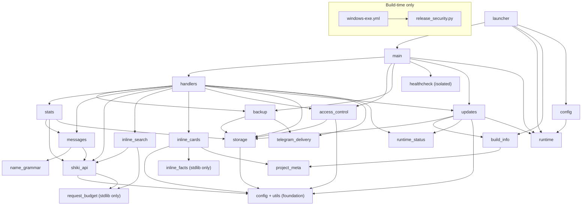

# ShikiUpdatesBot architecture

This document is the canonical description of the bot's internal architecture, module ownership, runtime contracts, and hard-won implementation constraints. Read it together with `AGENTS.md` before changing the repository. User-facing setup and behaviour belong in `README.md`; current behaviour is ultimately established by code and tests.

## What this repository is

- A Telegram bot that tracks a Shikimori user's history and favourites, then sends notifications to Telegram subscribers.
- Collects statistics (genres, studios, scores, demographics, etc.) and sends the owner an automatic report at the start of each quarter.
- Exposes `/stats`, `/favs`, `/fact`, and the cache-only `/info` to the public; `/version` remains a hidden owner-only manual GitHub refresh compatibility path.
- Uses `aiogram` for Telegram and `aiohttp` for HTTP (both client, for Shikimori, and server, for healthcheck).
- Split into focused modules; tests live in `tests/`.

## Modules and dependency direction

The former `main.py` monolith was split into single-responsibility modules with a strictly one-way (acyclic) dependency graph. `main.py` is now a thin application entrypoint; `launcher.py` is the PyInstaller console entrypoint.

- `runtime.py` — stdlib-only frozen/source detection, physical app/resource-root paths, first-run `.env` copy, rotating portable logs, and the Windows single-instance mutex. Lowest foundation; imports nothing project-local.
- `runtime_status.py` — stdlib-only process start, successful full-sync wall clock, and notification-polling active flag. Process-local and non-persistent; imports nothing project-local.
- `telegram_delivery.py` — shared bounded retry helper for subscriber notifications and owner backup uploads. Classifies blocked, flood-control, transient transport/server, and permanent failures; imports nothing project-local.
- `project_meta.py` / `build_info.py` — canonical project version/description and runtime build identity (`APP_VERSION`, repository/server/API URLs), strict SemVer parsing, and PyInstaller overrides injected through `_build_info`.
- `config.py` — explicit app-root `.env` loading (`load_dotenv`), data-dir paths, and shared logging. Depends only on `runtime`.
- `utils.py` — pure stdlib-only helpers: `h`, `_rel_url`, `_subscriber_link`, `_utcnow`, `_parse_iso_utc`, `quarter_*`, `_safe_int`, `_safe_float`, `_normalize_homoglyphs`.
- `request_budget.py` — pure rolling-window reservation primitive used by Shikimori attempt and inline-page budgets. Imports only the standard library.
- `name_grammar.py` — startup-time validation, gender detection, first-name inflection, immutable display-name context, and `{g:male|female}` formatting. Pure domain layer over `pytrovich`; imports nothing project-local.
- `storage.py` — file persistence: `_atomic_write`, load/save of every JSON state file (including standalone `update_state.json`), the `stats_all` in-memory cache, and the event-loop-local transaction lock for restorable live state.
- `access_control.py` — the single middleware boundary for the persistent Telegram user block list. Depends only on `config` and `storage`, and runs before project handlers and future user registration.
- `inline_cards.py` — pure inline-card presentation over aiogram types: Shikimori URL normalization, markup cleanup, HTML escaping, field-aware caption truncation, photo/article result construction, and shared project/fact rendering. Depends only on `config`, `inline_facts`, `project_meta`, and `utils` from the project.
- `inline_facts.py` — immutable curated fact bank plus pure query classification and deterministic selection/rotation. It imports only the standard library and owns no Telegram, search, cache, or network state.
- `inline_search.py` — inline query parsing and process-local debounce, successful-page cache, concurrent-miss coalescing, page budget, and opaque continuation state. Depends on `request_budget` and `shiki_api`; it has no Telegram handler ownership.
- `updates.py` — independent GitHub `main`/Windows Release fetches, strict raw-text version parsing, daily cache/state, shared safe `/info`/`/version` renderer, owner notification, and update-loop lifecycle. It never downloads or replaces files and does not use the Shikimori throttle.
- `shiki_api.py` — Shikimori client + media domain: `fetch_*`, GraphQL, kind filters (including the shared `RANOBE_KINDS`), `get_media_info`, `is_relevant`, translation dicts, and the central request throttle + 429 retry and private-profile classification (`_throttle`/`_fetch`, `ProfilePrivacyError`).
- `messages.py` — anime/manga/ranobe message banks, history parsers, `build_message` / `build_favourite_message`, presentation formatters.
- `stats.py` — aggregation, `sync_stats_all`, current-quarter events, quarter snapshots, the `build_*_messages` report builders.
- `backup.py` — `/backup` logic: ZIP build/restore, delivery to the owner, auto-backup triggers, and the source/Docker shutdown hook.
- `handlers.py` — all aiogram commands and FSM, inline menus and shared exception-safe cleanup, broadcast, notification cycle (`check_and_notify*`, `polling_loop`), quarter rotation, and owner-reachability gate.
- `healthcheck.py` — isolated HTTP healthcheck server and heartbeat watchdog. Imports nothing from the app; the dependency is one-way.
- `main.py` — application entrypoint: builds the Bot/Dispatcher, registers handlers, runs the owner gate, source/Docker healthcheck, update loop, and polling.
- `launcher.py` — frozen console entrypoint: `--version`, `--check-config`, first-run diagnostics, single-instance ownership, and delegation to `main.main()`.
- `release_security.py` — build-time-only VirusTotal client invoked by the Windows release workflow. It imports no project-local modules and is never part of bot runtime.

Each module depends only on modules below it; `healthcheck` is fully isolated:

When adding or moving code, keep dependencies one-directional and pass runtime values such as `CHECK_INTERVAL` as parameters where that avoids a cycle. `healthcheck.py` is the reference pattern.

## Important files

- `README.md` — setup (hosting, portable Windows exe, local Python, Docker), commands, statistics, healthcheck, and test instructions.
- `project_meta.py` — the single committed project version, canonical repository, and short `/info`/`/version` project summary shared by source and packaged modes.
- `ShikiUpdatesBot.spec` / `requirements-build.txt` / `README-Windows.txt` — pinned one-file build, build-only dependency, and packaged Windows instructions; the spec embeds `assets/info-preview.png` for the `/info` card, while `assets/ShikiUpdatesBot.ico` is the multi-size Windows icon and its sibling PNG is the editable preview source.
- `release_security.py` / `.github/workflows/windows-exe.yml` — build-time VirusTotal client and tagged Windows release pipeline. The client looks up SHA-256 before upload, handles the large-file upload URL, respects the public polling limit, and renders the shared Russian Actions/Release Markdown; it is not imported by bot runtime.
- `requirements.txt` / `requirements-dev.txt` — runtime and development dependencies (`python-dotenv` is a runtime dependency for `.env` loading).
- `.env.example` — template for environment variables.
- `.github/workflows/dependency-submission.yml` / `.github/scripts/submit_dependency_snapshot.py` / `.github/scripts/validate_dependency_submission.py` — build-time-only submission of the resolved Python 3.12 dependency graph. GitHub's managed plain-pip graph job remains enabled, but submits unpinned root requirements without resolved versions or transitive edges. Component Detection's stable `PipReport` detector only discovers files named exactly `requirements.txt`, so it cannot preserve the identities of the canonical root `requirements-dev.txt` and `requirements-build.txt`. The explicit workflow instead runs `pip --dry-run --report` separately for all three files, constructs one Dependency Submission API snapshot with exact repository-relative paths, validates versioned direct dependencies and transitive edges, and only then submits it. The snapshot retains the legacy Component Detection detector identity but uses a dedicated alphabetically-first correlator, making GitHub's documented selection among competing manual detectors deterministic. This keeps the manifests distinct without an adapter or lockfile policy.
- `tests/` — pytest coverage for configuration, pure helpers, storage, the Shikimori API, messages and name grammar, statistics, backup, handler flows, polling, owner gate, and Telegram delivery/retry behaviour.

## Runtime and domain contracts

- Environment variables (read in `config.py`, except `PORT`, which `healthcheck.py` reads directly; `.env` is loaded explicitly from the source/exe root and never overrides the process environment): **required** — `BOT_TOKEN`, `OWNER_ID`, `SHIKI_USER`. **Optional with defaults** — `DISPLAY_NAME` (defaults to the `SHIKI_USER` nick), `DISPLAY_NAME_GENDER` (`auto`; also `male`, `female`, `none`), `SHIKI_BASE_URL`, `CHECK_INTERVAL`, `ERROR_NOTIFY_INTERVAL`, `FULL_SYNC_INTERVAL`, `DATA_DIR` (`/data` for source/Docker, `<exe>/data` frozen), `PORT` (`8080`, source/Docker only). Frozen relative `DATA_DIR` overrides resolve from the portable root.
- Display-name morphology runs once when `messages.py` initializes. Only Russian first names made of Cyrillic letters with optional hyphen-separated components are eligible for inflection. `auto` requires a confident `pytrovich` gender; ambiguous/ineligible names and every detector or inflection failure in this mode fall back to the raw name in all cases plus masculine template alternatives. `male`/`female` always retain the explicit template gender: eligible names are inflected with it, while ineligible names skip both morphology factories and remain raw in every case; an inflection failure also keeps the raw forms without discarding the explicit gender. `none` skips morphology and uses raw forms plus masculine alternatives. Templates keep `{n}` nominative and use `{n_gen}`, `{n_dat}`, `{n_acc}`, `{n_ins}` plus `{g:male|female}`. Every selected form is HTML-escaped only during rendering, after inflection or fallback.
- The bot stores state in JSON files under `DATA_DIR`: `seen_ids.json`, `blocked_users.json`, `subscribers.json`, `seen_favourites.json`, `stats_all.json`, `stats_current.json`, `update_state.json`, and snapshots in `quarters/`; `stats_current.json` additionally holds `last_backup_at`, the weekly planned-backup marker. `update_state.json` independently caches the `main` code version and latest Windows release. Process start, successful full-sync time, and polling activity are deliberately process-local. Frozen rotating logs live in sibling `logs/`, deliberately outside `/backup`.
- **Project version has one source of truth, but the UI has three identities.** `project_meta.PROJECT_VERSION` is the current code version and is advanced in each PR with non-`none` SemVer impact, independently of portable release cadence. The user-facing labels are `Версия этого бота` for `APP_VERSION`, `Актуальная версия проекта` for the cached remote `PROJECT_VERSION` from `main`, and `Последняя версия для Windows` for the cached full Release with a Windows x64 ZIP. Python/source mode reports its running version directly; non-tag exe artifacts append `-dev`. A release build embeds the exact tag, and CI publishes it only when that tag matches the current code version.
- **Standalone release identity is build-time, not user config.** `ShikiUpdatesBot.spec` embeds the tag plus `github.repository`, server, and API URLs. Fork exe builds follow their configured repository automatically; maintainers may set the build-time `UPDATE_REPOSITORY` repository variable to follow another upstream. The `main` version comes from `project_meta.py?ref=main` through the configured GitHub Contents API with a raw media type. Parsing accepts exactly one strict `PROJECT_VERSION = "vMAJOR.MINOR.PATCH"` line and never imports, executes, or evaluates remote Python. Main and Release results merge independently, so either failure preserves both previously valid cache values and any success from the other source. When `HAS_RELEASE_INFO` and the configured Release API are available, source/Docker and tagged frozen builds refresh both cache values after the startup delay and then at most once per 24 hours; `/version` can force the same refresh. A non-tag frozen `-dev` build has no release identity and therefore keeps restored cache values without starting this loop. Only a frozen release exe sends portable-update notifications, and it compares only the full SemVer Release with a Windows x64 ZIP; a newer `main` version is informational. GitHub errors are non-fatal and notifications are once per successfully delivered newer Windows release.
- **Public information is cache-only.** `/info` and the private `start=info` deep link read only persisted state plus `runtime_status`; neither subscribes the visitor, wakes polling, searches, or triggers GitHub, Shikimori, or other fetches. Its local illustration is bundled into the one-file exe and included as the sole runtime asset in Docker; after the first successful upload, the process reuses Telegram's returned `file_id`. A missing asset or rejected photo send clears that process-local cache and degrades to the same text-only response. `/version` is hidden and owner-only, forces both GitHub cache fetches when release identity is available, and shares the escaped HTML renderer without requiring the illustration. The optional refresh callback repeats the owner check, edits either a photo caption or a text message, and treats Telegram's normal non-editable-message response as non-fatal. Repository/release URLs accept only absolute HTTP(S) links without credentials; malformed timestamps, values, and links degrade to unknown or disappear without exposing raw exceptions, IDs, environment values, filenames, or local paths.
- **Public facts are local and isolated from media search.** `/fact`, its `Ещё факт` callback, and exact case-insensitive inline queries `fact` / `факт` are available to every non-blocked user without reading notification subscriptions. The update-level access-control middleware still fails closed before selection or handler side effects. Command and callback presentation share the same escaped renderer as the inline article; the callback advances through the immutable bank, edits the existing message, and binds the next callback to the displayed fact ID. `Поделиться` only opens the chat chooser through `switch_inline_query="fact"`. Public inline selection is a stable hash of the Telegram user and `InlineQuery.id`, so a retry keeps the result while a new query may rotate it; the answer is uncached and the sent message carries no mutable callback. Fact-like suffixes, punctuation, split spellings, and near-miss prefixes are rejected before subscriber entitlement, debounce, media cache/continuations, Shikimori, or either request budget. Unrelated media queries retain their existing subscriber-only route.
- **VirusTotal is informational and tag-only.** Only a strict SemVer tag pushed through the release workflow receives the step-scoped `VIRUSTOTAL_API_KEY`; pull requests and manual development builds never receive or submit it. Existing hashes are reused, otherwise the public EXE is uploaded and polled at a bounded rate. Detections, a missing secret, rate limits, malformed responses, and timeouts produce warnings plus an explicit security block but do not gate draft-release creation. Standard submissions are public; never use this path for private artifacts.
- **Portable Windows contract.** Persistent files stay beside the physical exe (`sys.executable`), never under `%APPDATA%` or PyInstaller `_MEI`. A missing `.env` is copied once from the adjacent example and never overwritten; healthcheck is skipped frozen; the named mutex prevents a second process in the same folder. Updating means replacing only the stopped exe. The ZIP also carries explicit opt-in `Enable-Autostart.cmd` / `Disable-Autostart.cmd` helpers: they own only the current user's `ShikiUpdatesBot.lnk` Startup shortcut, never run from the exe or first-run flow, and remain outside the Docker image.
- All file writes go through `_atomic_write()` (temporary file + `os.replace()`) for crash safety.
- All Telegram messages use `ParseMode.HTML`; user-facing strings from the API are escaped via `h()` (`html.escape`).
- **Global access-control boundary.** `AccessControlMiddleware` is the first project middleware registered in `main.py`; future registration of newly seen users must remain after it. The boundary checks every supported message and callback by `from_user.id` before handler dispatch, FSM transitions, or function side effects. A blocked message receives one static HTML-safe denial without a keyboard; stale or forged callbacks and malformed callback data receive an alert without editing the message. Missing or malformed sender/message fields stop safely. Sensitive handlers retain owner checks as defence in depth. The owner bypasses the boundary, while storage rejects `OWNER_ID` in every block-list payload and mutation.
- **Blocked-user state reliability.** A missing `blocked_users.json` means an empty list during migration. An existing file that is unreadable, malformed, contains duplicates, out-of-range IDs, or the owner's ID raises a typed storage error; the boundary then denies access to everyone except the owner instead of silently opening access. Add and remove operations use the restorable-state lock. Blocking publishes the new list together with subscriber removal through an in-process rollback transaction. Before handlers and background tasks start, an idempotent strict reconciliation removes any lingering subscription left by process termination between the two atomic file replacements. Reconciliation never treats an unreadable or malformed `subscribers.json` as empty: it enters the same fail-safe path while polling remains available to the owner for recovery through `/backup`. Unblocking changes only the block list and never restores a subscription. Concurrent mutations reload published state under the lock and do not lose IDs.
- **The block-list view is read-only and owner-only.** Hidden `/blocklist` reads the validated storage snapshot without acquiring a mutation transaction, sorts every Telegram user ID numerically, and renders each ID as copyable HTML. Long results split only at complete ID rows; the total appears in the first message and the `/block`/`/unblock` management hint appears exactly once in the final message. Missing senders and non-owners are rejected before storage access, while malformed or unreadable state produces a stable reader-facing failure and technical log details. The command is deliberately absent from the public Telegram command menu.
- **Telegram delivery retry is bounded and in-process.** `telegram_delivery.send_with_retry()` accepts a fresh async send-operation factory and retries only `TelegramRetryAfter`, transient aiogram network/server failures, and transient aiohttp connection/payload failures, at most twice after the initial call. Subscriber iteration/removal remains in `handlers.py`; ZIP creation, owner targeting, and the successful-backup clock remain in `backup.py`. Backup retries reuse one ZIP byte payload but create a fresh `BufferedInputFile` for every upload. Permanent failures are not retried, and the shutdown wrapper retains its outer timeout/cancellation budget.
- **Inline search entitlement is current personal subscription state, not user discovery.** The update-level `AccessControlMiddleware` covers `InlineQuery` and answers a blocked or fail-closed malformed-blocklist request with an immediate empty uncached result before handlers. `handlers.cmd_inline_search` then grants media results only to `OWNER_ID` or a sender whose positive Telegram user ID is a current key in `subscribers.json`; a negative group/channel subscription does not grant its members access, and #97's future registry is not an entitlement source. Authorization is repeated immediately before local-cache work and before a fetched page can populate the cache, so blocking or unsubscribing affects the next query without trying to revoke cards already sent. Only after this boundary does the handler capture the current Telegram ID, full name, and username as operational actor metadata; `inline_search.py` never reads subscriber storage, so future entitlement changes retain the same boundary. A non-blocked non-subscriber receives only Telegram's private `inline_search` `/start` button. Ordinary `/start` is unchanged; the personal subscription deep link adds the manual `switch_inline_query=""` return button after new or existing subscription, while the read-only `inline_search_limit` deep link explains an exhausted budget and adds the same return button without reading or changing subscriptions, waking polling, or starting a search.
- **Inline query state is process-local, bounded, and query-bound.** `parse_inline_query()` recognizes case-insensitive `anime|аниме|a|а`, `manga|манга|m|м`, and `ranobe|ранобэ|r|р`, collapses whitespace, strips the technical prefix, and rejects titles shorter than two characters without a timer. Initial searches use one real two-second per-user debounce; a newer query cancels or invalidates the old lease before cache/network work. A valid non-empty offset is an explicit action and skips debounce. Successful pages, including genuinely empty pages, are cached for ten monotonic minutes by media type, case-folded normalized title, and page; failures are not cached, and one in-flight task coalesces identical misses. Continuations are opaque random tokens issued only after an exact 49-item page, bound to the normalized media/title and next page, and expire with the preceding cached full page. Malformed, stale, cross-query, skipped, or unissued offsets are read-only failures: they answer empty without touching debounce, cache, continuation state, Shikimori, or budgets.
- **Inline cards come from one GraphQL page request.** Anime uses `animes` with `tv,movie,ova,ona,special,tv_special`, manga uses `mangas` with `manga,manhwa,manhua,one_shot,doujin`, and ranobe uses `mangas` with `light_novel,novel`; every query keeps `limit: 49` and `censored: false`. The anime filter is server-side so promotional `music`, `pv`, and `cm` rows cannot create locally filtered pagination holes. The operation requests chooser, poster, score, anime origin/rating/status, domain facts, taxonomy, and description fields together; there is no per-result detail fan-out or custom result chunking. The mandatory Mobile/Desktop UX check showed that Telegram chooses layout for each loaded page: an all-photo page becomes an unreadable gallery without titles, while any mixed photo/article page remains a usable vertical chooser. The first non-empty page therefore appends one explicit `Поделиться ShikiUpdatesBot` article after at most 49 media results. Its chooser copy states that selection sends a project description and GitHub link; the sent message advertises the open-source project and installation rather than directing new users to consume the running bot's quota. A continuation page that already has a natural article fallback needs no technical result; an otherwise all-photo continuation appends one explicit `Отправить интересный факт` article from the immutable curated bank. Its chooser description warns that selection sends the fact to the chat. Selection is a stable hash-derived rotation bound to the user and normalized query, so retries keep one result, neighbouring pages do not repeat within a complete bank cycle, and no mutable random state is introduced. The bank contains 50 general anime/Japan facts plus six spoiler-free owner selections about Evangelion, Frieren, and Higurashi. No technical result appears for an empty or failed page. No media result is downgraded merely to control layout; a missing/invalid poster remains the only reason for its article fallback. Each sent media result carries a current-chat search button, its normalized Shikimori URL, and an optional private `start=info` bot link built from the cached `Bot.me()` username; username lookup failure omits only the info button. The renderer separates score from domain metrics, adds translated anime origin/rating and an explicit ongoing marker when present, labels one/multiple studios and publishers explicitly, normalizes every title link through `_rel_url()`, separates taxonomy kinds, prefers Russian taxonomy names, removes known Shikimori HTML/BBCode, and escapes all API text. Its singular media-kind labels describe one card and deliberately stay separate from the plural aggregate labels in `stats.py`; search acquisition kinds remain in `shiki_api.py`. Photo captions are kept within 1024 post-entity characters by shortening description first and then removing whole trailing taxonomy items with an omitted count; tags and entities are assembled only from intact structured fields.
- **Stability is the top priority.** Every function must be exception-safe: unexpected or missing data must never crash the bot. Network fetches return `None` on ordinary network, timeout, rate-limit, server, parsing, and unexpected-status failures (not empty collections) to distinguish API failures from genuinely empty results. Typed control signals are limited to the exact private-profile response described below and `ShikimoriBudgetExceeded`, which is raised only for denied inline HTTP attempts so the handler can distinguish an exhausted protective budget from an ordinary API failure. Presentation and polling boundaries handle both without stopping the bot. Statistics degrade gracefully — a failed export or GraphQL call yields a report without enriched metadata rather than a crash.
- Statistics data sources: user lists come from the public `list_export` JSON endpoints (no auth); title metadata comes from the GraphQL `animes`/`mangas` batch queries with `censored: false`. Do not reintroduce per-title REST calls or OAuth — these were evaluated and rejected.
- A single relevance filter `is_relevant(media, kind)` governs both notifications and statistics. OVA/ONA are kept; specials/clips/PV are dropped. Do not duplicate or diverge this logic.
- **History actions are inferred from text, but progress is not a product event.** The public Shikimori history API exposes only the localized `description`, so completion must use anchored full-string formats (`Просмотрено`/`Прочитано` and their `... и оценено на N` forms), never stems such as `просмотрен` or `прочитан`. Episode/chapter/volume changes and resets plus `Удалено из списка` are known `ignored` events: mark their IDs seen, but send no notification, warning, or quarter event. A standalone first rating is `score_set`, not completion; `score_set` and `score_changed` update the score of an existing current-quarter `completed` event without creating a duplicate. `Отменена оценка` is a silent `score_removed` state correction: it clears that current-quarter completed score without notifying or appending an event, does nothing without such a completion, and never rewrites previous-quarter snapshots. A truly unknown description is logged as a warning and sent to subscribers as cleaned source text without exposing the internal `unknown` classification.
- **History catch-up is bounded and transactional.** `fetch_history()` retrieves one explicit page through the central throttle/429 retry; `handlers.py` requests page 1 first and fetches older pages only until a known `seen_ids` boundary or an exhausted short page, with a hard cap of five pages. Live API responses contain `limit + 1` rows (51 with `limit=50`) and adjacent pages overlap by one ID, but response order is not guaranteed to be strictly monotonic by ID or `created_at`. The orchestrator deduplicates by integer event ID and sorts old-to-new by ID before delivery. A failed required page or an unknown boundary at the cap aborts the history cycle without publishing partial `seen_ids`. First-run baseline remains one page and sends nothing.
- **Ranobe is a presentation-only split from manga.** Shikimori history keeps ranobe in the manga domain; `get_media_info` therefore continues to return `media_type="manga"` for `kind in RANOBE_KINDS`, and statistics plus `is_relevant` must keep treating it as manga. The current GraphQL `MangaKindEnum` documents `light_novel` and `novel`; `ranobe` remains a deliberate defensive alias for the undocumented REST history contract, not a currently documented kind. `messages.build_message` uses the preserved `kind` only to select the dedicated `MESSAGES["ranobe"]` presentation bank; favourites route the API `ranobe` category to `MESSAGES["favourites"]["ranobe"]`. History, media-favourite notifications, and `/status` use one presentation helper to append exactly one central human label (`аниме`/`манга`/`ранобэ`) to the rendered title; `/status` identifies ranobe through the manga target's existing `kind` and falls back to manga for a missing or unknown kind. Character and industry-person favourites remain unlabelled, and score-change direction banks remain shared across all media. Do not change the domain `media_type` to `ranobe` merely to choose wording.
- **Anti-429 defense is layered (Shikimori limits: 5 req/sec burst + 90 req/min).** 429s have been a recurring source of breakage, so outgoing requests are guarded at several levels:
  - **Central request throttle (primary).** `shiki_api._throttle()` — one choke-point every request `await`s before firing: fixed min-gap (`_MIN_GAP`, 0.25s → ≤4 req/sec; monotonic mark + lazy `asyncio.Lock`; firewall-style, **no jitter**) followed by an attempt-budget reservation inside the same lock. The monotonic mark advances only for an accepted attempt, so a denied reservation does not manufacture an extra throttle slot. All network functions route through a single `_fetch()` helper, so every call site (including `/status` and a future multi-profile mode) is serialized.
  - **429 retry.** `_fetch` intercepts `429` *before* the status check, reads `Retry-After` (`_retry_after`: seconds form only; fallback `_RETRY_AFTER_DEFAULT`, capped `_RETRY_AFTER_CAP`), sleeps and retries up to `_MAX_429_RETRIES`. Data on a successful retry; exhaustion returns `None`.
  - **Rolling attempt ceiling.** Every actual `_fetch` attempt, including each 429 retry, reserves one place in the process-wide 80-attempt/60-second window before the HTTP call. General polling, `/status`, and other existing traffic may use all 80; inline attempts stop at 60 occupied places and therefore preserve 20 places for non-inline work. Independently, `inline_search.py` permits at most 30 uncached search pages per 60 seconds, counted once before a coalesced page fetch. A denied search answers with zero results plus an uncached `inline_search_limit` button naming Shikimori and the rounded wait until capacity returns; clicking it is optional and opens the read-only explanation described above. The failure is never cached as a successful page. The first denial in an exhausted window writes one Russian warning with used/capacity/retry timing, the current names, usernames, and IDs of the last consumer and rejected actor, and per-user consumption; names use escaped representations, query text is never logged, and later denials in the same exhausted interval do not flood the journal.
  - **Private-profile classification.** Only HTTP `403` whose JSON `message` is exactly `You are not authorized to access this page.` raises the typed `ProfilePrivacyError` from `_fetch`. Different or malformed bodies and every other status retain the ordinary `None` contract. Composite rate/list operations propagate this signal so it dominates partial successes; callers never repeat response-body matching.
  - **Malformed-body safety.** A `200` with a broken or unexpected body (`None`, non-list, missing fields) is caught in `_fetch` (JSON plus `AttributeError` / `TypeError` / `KeyError`) and returns `None` with a warning, so a bad payload skips the cycle instead of aborting it.
  - **Boot throttle (startup burst).** `polling_loop` opens one shared `aiohttp.ClientSession` for all startup fetches with fixed inter-phase delays (`BOOT_PHASE_DELAY`, no jitter); favourites is fetched **once** and reused by the stats sync.
  - **Per-cycle favourites deduplication.** Each loop iteration fetches favourites once and threads it into both notifications (`check_and_notify_favourites(favourites=…)`) and resync (`sync_stats_all(fav=…)`) — one request per cycle instead of two. `fetch_meta_batch` / `sync_stats_all` accept an optional session and create their own short-lived one when omitted.
  - **Public `/status` cache.** Every chat shares one process-local successful raw anime+manga rates result for a fixed 60-second TTL measured by monotonic time. A lazy `asyncio.Lock` plus a second cache check collapses concurrent cold/expired calls into one four-request refresh. Empty lists are successful and cacheable; a full failure of either media domain returns the existing warning without replacing or refreshing the cache. A `ProfilePrivacyError` also never replaces or refreshes the successful cache: non-owners receive only a short closed-profile notice, while `OWNER_ID` receives the setting name, required value, and ready `SHIKI_BASE_URL`/`SHIKI_USER` settings URL. Existing per-domain soft degradation remains: `fetch_current_rates` returns a partial list when at least one requested status succeeds, so that list remains a cacheable successful result; it returns `None` only when every requested status fails. Rendering, allowed-anime filtering, HTML escaping, media labels, and link normalization still run for every command response. Restart begins cold.
- **Owner-reachability gate.** On startup `probe_owner_and_start()` sends the owner a local health snapshot beginning with `🟢 Бот запущен` (with the bare restart signal as an exception-safe fallback); this also probes the emergency channel and is not debounced. Delivered means `polling_loop` starts as a background task; not delivered produces a warning and leaves the loop off. Update polling stays alive regardless, and the owner re-arms the loop by sending `/start` (idempotent) without a restart. The gate is startup-only; runtime owner-send failures degrade gracefully.
- **Private-profile polling diagnostics are owner-only and non-destructive.** Startup defers initial history/favourites baseline publication until the list-sync phase has completed without `ProfilePrivacyError`; a confirmed privacy failure therefore cannot publish a partially successful startup result. Background detection sends one detailed message only to `OWNER_ID`, shares `ERROR_NOTIFY_INTERVAL` with other loop errors, never calls subscriber broadcast, and leaves history, favourites, and statistics state untouched. The known failure is handled inside the loop, refreshes the liveness heartbeat, and is retried after `CHECK_INTERVAL`, so opening the profile restores normal work without restart.
- Preserve existing Shikimori event filtering, favourite notifications, and statistics aggregation when modifying logic.
- **Backup contract.** `/backup` (owner-only) zips the whole `DATA_DIR` for export and restores a whitelist (`blocked_users.json`, `subscribers.json`, `stats_current.json`, `update_state.json`, `quarters/*.json`); preserving `update_state.json` prevents a migrated bot from repeating an already delivered release notification. Both the legacy release-only update schema and the current schema with `latest_main_version` restore safely; loading backfills the new field. Telegram documents with a missing size or over 20 MiB are rejected before download. Before reading any ZIP member, import rejects archives over 256 members, any restorable JSON over 8 MiB, or more than 32 MiB of cumulative restorable data; exact boundaries remain valid. Import then validates the full candidate set, reconciles restored/current subscribers with the restored/current `blocked_users.json` state, stages both new payloads and replaced originals beside `DATA_DIR`, and rolls back files already published if a later publication fails; an older subscribers file can never reintroduce a blocked user. This is an in-process error transaction, not a claim of power-loss atomicity. Publication shares one event-loop-local transaction lock with every asynchronous writer of restorable state. Long operations never hold the lock across network or Telegram awaits: immediately before saving, history, subscriber, access-control, update-check, weekly-backup, and quarter-rotation flows reload the published state and apply only their own delta. This makes restored data effective immediately and prevents stale work from replacing it while preserving legitimate later changes. Quarter rotation publishes the new current period together with a durable pending-delivery record before Telegram awaits; report and backup success are marked separately, so either failed stage resumes on the next cycle or restart without holding the state lock over delivery. The owner also receives automatic backups (tag `#backup`) on subscribe/unsubscribe, quarter rotation, and weekly via the `last_backup_at` marker. Source/Docker additionally registers the graceful-shutdown backup; portable EXE deliberately does not, because persistent local data plus planned/event backups make an archive on every console or PC shutdown noisy rather than useful. Import limits and the seven-day `WEEKLY_BACKUP_INTERVAL` are deliberately fixed internal constants, not environment settings. This replaces the former `/export` and `/import`.

## Gotchas discovered the hard way

- **GraphQL vs REST URL formats differ.** GraphQL Shikimori returns full URLs (`https://shikimori.io/animes/123`), while REST history returns relative URLs (`/animes/123`). All link-building code prepends `SHIKI_BASE_URL`, so a full URL would produce a double-domain broken link. `_rel_url()` (`utils.py`) normalizes any URL to relative form — applied at the source (`fetch_meta_batch` in `shiki_api.py`) and defensively at every render point. When adding new link rendering, run URLs through `_rel_url()`.
- **Translations are baked into stored records.** `origin` and `rating` are translated via `_ORIGIN_RU` / `_RATING_RU` (`shiki_api.py`) at fetch time and saved into `titles`. Existing records keep their old value when a dictionary changes — fixes apply only to new records or after wiping the test bot's data. This was deliberately not refactored to store raw values and translate on display because that was unnecessary complexity for rarely changing dictionaries.
- **`/stats` and the quarterly report share `_build_quarter_section`** (`stats.py`). Editing it changes both at once; verify both.
- **`/stats all` and the quarterly report are built by different code.** `build_stats_all_messages` works from pre-computed aggregates; the quarterly section aggregates a title list on the fly. Shared appearance comes from common formatters (`_top_block`, `_fmt_mono_rows`, `_section_header`, `_score_dist_block` in `messages.py`), not shared builders.
- **Shikimori mixes Latin homoglyphs into Russian history strings.** It sends Latin lookalikes (for example, `c` U+0063 for Cyrillic `с`, or `o` for `о`) inside Russian descriptions, so Cyrillic regexes miss and the score renders as `?`. The three history parsers (`extract_score_change`, `extract_score`, `classify_event` in `messages.py`) run input through `_normalize_homoglyphs()` (`utils.py`) immediately after `_strip_html`. It is one scoped normalization pass, not scattered per-site `[сc]` alternatives: Latin twins are folded to Cyrillic only inside mixed-script tokens plus whitelisted standalone connectives `c→с` / `o→о`; pure-Latin tokens such as English `rated` / `scored`, titles, and URLs remain untouched. New Russian-matching parsers must use the same normalization.
- **Link previews are disabled selectively.** `/favs` passes `disable_preview=True` because its first link is always the same favourite; `/stats`, `/status`, and notifications keep previews because a card for the relevant title is desirable.

## Test topology and regressions

- `tests/conftest.py` provides default environment variables (including temporary `DATA_DIR` and `SHIKI_USER`) and zeroes `BOOT_PHASE_DELAY`. It also hosts the shared `backup_env` fixture, which redirects state paths (`DATA_DIR` / `quarters`, storage files, `OWNER_ID`) into `tmp_path`; both `test_backup.py` (backup core) and `test_handlers_backup.py` (`/backup` handler flow) use it.
- Test ownership follows the production split: `test_utils.py` owns `_safe_int` / `_safe_float`, `_rel_url`, `_subscriber_link`, and quarter/date helpers; `test_shiki_api.py` owns `get_media_info`, `is_relevant`, and network contracts; `test_stats.py` owns aggregation, favourites collection, metadata retry/sync, the kind-filter regression (garbage kinds must not inflate a studio counter — the “Studio Deen 11 vs 8” bug), report formatters, and smoke tests.
- Every report builder (`build_stats_all_messages`, `build_current_stats_messages`, `build_quarterly_report_messages`, `build_favourites_messages`, and the `_stats_report_*` async builders) is called and asserted to return `list[str]`; rendered links must contain the domain exactly once. These smoke tests would have caught both a merge-clobbered `build_stats_all_messages` definition and GraphQL double-domain URLs. Extend them for new report builders or render paths.
- Handler orchestration is split by flow (`test_handlers_<flow>.py`: access control, facts, favourites, notify, broadcast, send, owner gate, polling, status, subscriptions, stats menu, backup, version/info), with shared inline-menu cleanup in `test_handlers_menu_cleanup.py`. `test_access_control.py` owns the central message/callback/inline gate and fail-safe interception; `test_handlers_access_control.py` owns `/block`, `/unblock`, and `/blocklist`; `test_handlers_facts.py` owns `/fact` and its edit-in-place callback; `test_handlers_status.py` owns cache hit/expiry/concurrency/failure orchestration; `test_handlers_version.py` owns public cache-only access, owner refresh guards, and HTML parse-mode wiring; `test_runtime_status.py` owns fake-clock uptime and process-local degradation. `test_messages.py` owns the `/status` media-label and URL matrix. Each symbol's input→output matrix has one authoritative test home.
- Inline ownership follows the same split: `test_inline_search.py` owns parsing, debounce, cache/coalescing, page budget, and continuation state; `test_inline_facts.py` owns bank and deterministic-selection invariants; `test_inline_cards.py` owns presentation and caption limits; `test_handlers_inline_search.py` owns access/orchestration and no-side-effect rejection; `test_shiki_api.py` owns the exact GraphQL request and global HTTP-attempt accounting; `test_main.py` owns dispatcher and allowed-update wiring.
- Flow tests mock I/O boundaries, so real `load_*` / `fetch_*` bodies may appear uncovered even when their contracts are exercised. Report builders intentionally use smoke tests rather than exhaustive snapshots until the rich-formatting rewrite (#10), while shared low-level formatters and message-routing/template contracts have focused tests. `main.py` wiring has a focused lifecycle test for frozen update startup and console-guard cleanup; defensive `except → log.debug` branches carry little signal. The GraphQL and storage gaps identified in #26 remain covered.

## Change map

- Update message templates or event classification in `messages.py`.
- Update display-name cases or gender agreement in `name_grammar.py`; template case/gender tags remain in `messages.py`.
- Fix Shikimori description parsing and score extraction edge cases in `messages.py`.
- Extend statistics aggregation or report formatting in `stats.py` (`build_*_messages`, `recompute_aggregates`, `_build_quarter_section`) and shared `_top_block` / `_fmt_*` formatters in `messages.py`.
- Add a new `/stats` report by appending one entry to `_STATS_MENU` in `handlers.py`; keyboard and dispatch update automatically.
- Improve notification filtering, storage handling, and broadcast flow in `handlers.py` / `storage.py`.
- Change global Telegram access policy in `access_control.py`; keep persistent block-list invariants and mutations in `storage.py`, and owner-command orchestration in `handlers.py`.
- Change inline parsing/cache/continuations in `inline_search.py`, curated fact selection/classification in `inline_facts.py`, card/fact presentation in `inline_cards.py`, GraphQL transport in `shiki_api.py`, and only their orchestration in `handlers.py`.
- Change GitHub version fetching or `/info` rendering in `updates.py`; keep lifecycle clocks in `runtime_status.py` and command orchestration in `handlers.py`.
- Add tests under `tests/` for every new behaviour.
