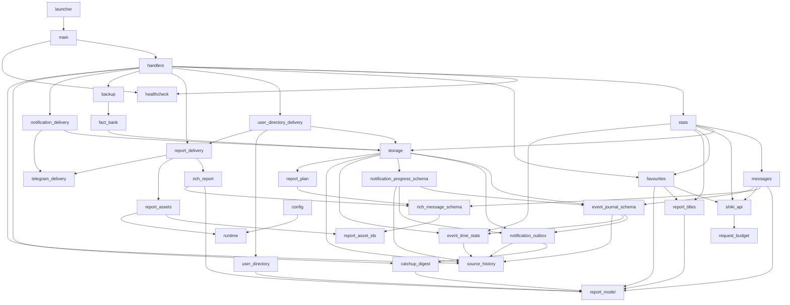

# ShikiUpdatesBot architecture

## Purpose and documentation boundaries

ShikiUpdatesBot is an `aiogram`/`aiohttp` Telegram hub for one public Shikimori profile, with optional subscriber notifications and automatic owner reports at quarter boundaries. This file owns module responsibilities, internal contracts, and the reasons behind stability constraints. Code and tests establish current behaviour.

Read [AGENTS.md](AGENTS.md) for collaboration, verification, and delivery rules. [README.md](README.md) owns user-facing behaviour, configuration, and deployment; [ideas.md](ideas.md) owns deferred and rejected proposals. Those proposals do not change the contracts below.

- [ShikiUpdatesBot architecture](#shikiupdatesbot-architecture)
  - [Purpose and documentation boundaries](#purpose-and-documentation-boundaries)
  - [Module ownership and dependency direction](#module-ownership-and-dependency-direction)
  - [Runtime, build identity, assets and state](#runtime-build-identity-assets-and-state)
    - [Roots and lifecycle](#roots-and-lifecycle)
    - [State ownership and transactions](#state-ownership-and-transactions)
    - [Build identity, resources and updates](#build-identity-resources-and-updates)
  - [Access control, registration and navigation](#access-control-registration-and-navigation)
    - [Access, registration and subscriptions](#access-registration-and-subscriptions)
    - [Unified menu and session boundaries](#unified-menu-and-session-boundaries)
    - [Owner directory and local list/picker flows](#owner-directory-and-local-listpicker-flows)
  - [Shikimori acquisition, synchronization and media semantics](#shikimori-acquisition-synchronization-and-media-semantics)
    - [Failures, reuse and request budgets](#failures-reuse-and-request-budgets)
    - [Synchronization, metadata and comments](#synchronization-metadata-and-comments)
    - [History and media domains](#history-and-media-domains)
    - [Durable history ingestion and processing](#durable-history-ingestion-and-processing)
    - [Durable journal notification delivery](#durable-journal-notification-delivery)
    - [Durable catch-up digest](#durable-catch-up-digest)
    - [Safe retention and capacity](#safe-retention-and-capacity)
    - [Supported state formats and migration](#supported-state-formats-and-migration)
    - [Event-time quarterly projections](#event-time-quarterly-projections)
  - [Typed reports and interactive delivery](#typed-reports-and-interactive-delivery)
    - [Telegram send outcomes](#telegram-send-outcomes)
  - [Durable quarterly delivery](#durable-quarterly-delivery)
  - [Backup, restore and automatic scheduling](#backup-restore-and-automatic-scheduling)
    - [Capture, limits and cancellation](#capture-limits-and-cancellation)
    - [Restore publication](#restore-publication)
    - [Automatic schedule and acknowledgement](#automatic-schedule-and-acknowledgement)
  - [Facts and inline search](#facts-and-inline-search)
    - [Local facts and bank replacement](#local-facts-and-bank-replacement)
    - [Entitlement and query state](#entitlement-and-query-state)
    - [Acquisition and chooser presentation](#acquisition-and-chooser-presentation)

## Module ownership and dependency direction

Application modules live directly under `src/` and retain flat import names; there is no named package. Root `main.py` remains the real application wiring/lifecycle module and the stable `python main.py` entrypoint. Source entrypoints resolve their import paths from their own file locations; frozen builds use PyInstaller's module loader. Pytest and Docker configure both the source directory and repository root for direct flat imports.

Root `project_meta.py` remains the sole canonical metadata source and a public compatibility surface for installed bots and the README version badge. Its existing GitHub Contents/raw path and literal version assignment must survive layout changes; a forwarding file or a second metadata copy would violate that contract. Build-only `release_security.py` and the existing `.github/scripts/` helpers remain outside the application source directory.

Project imports form an acyclic graph. Keep orchestration above reusable domain, presentation, storage, and transport code; pass runtime parameters where that avoids a reverse dependency. `healthcheck.py` imports no project modules and receives its interval from the caller.

| Modules | Responsibility and boundary |
|---|---|
| [runtime.py](src/runtime.py), [config.py](src/config.py) | Physical app/resource roots, frozen detection, first-run environment, logs, mutex; configuration and state paths depend only on `runtime`. |
| [runtime_status.py](src/runtime_status.py), [project_meta.py](project_meta.py), [build_info.py](src/build_info.py) | Process-local lifecycle observations; canonical project metadata; build identity and strict SemVer parsing over `project_meta`. |
| [utils.py](src/utils.py), [request_budget.py](src/request_budget.py) | Pure stdlib helpers for text, URLs, numbers, dates, Russian count forms, and rolling-window reservations. |
| [name_grammar.py](src/name_grammar.py) | Immutable display-name context and template grammar over `pytrovich`, with no project imports. |
| [telegram_delivery.py](src/telegram_delivery.py) | Explicit send outcomes/ordered attempt evidence, caller-selected bounded retry policy and observed aiogram session, with no project imports. |
| [report_model.py](src/report_model.py), [report_asset_ids.py](src/report_asset_ids.py) | Pure typed reports/ordinary HTML chunking; import-light versioned asset identifiers and hashes. Neither imports project modules. |
| [rich_message_schema.py](src/rich_message_schema.py), [report_plan.py](src/report_plan.py) | Pure serialized Rich validation over asset identifiers; frozen transport-unit validation over that schema. No runtime or aiogram dependency. |
| [rich_report.py](src/rich_report.py), [report_assets.py](src/report_assets.py), [report_delivery.py](src/report_delivery.py) | Rich rendering/pagination; hash-checked local uploads; freezing, sequential delivery, fallback and results. Producers remain outside Bot API payload construction. |
| [event_time_stats.py](src/event_time_stats.py) | Pure UTC attribution, deterministic post-migration quarter projections, compact source facts, correction revisions and shared validation; uses `source_history`, with no runtime imports. |
| [source_history.py](src/source_history.py) | Pure absolute-seq/suffix access, exact accepted IDs, bounded diagnostic fingerprints and safe rebasing after prefix/fingerprint maintenance; stdlib only. |
| [event_journal_schema.py](src/event_journal_schema.py) | Pure logical journal/acquisition/source-base/recovery validation and bounded parsing; uses `event_time_stats` and `source_history`, with no runtime imports. |
| [notification_progress_schema.py](src/notification_progress_schema.py) | Pure physical history v4/v5/v6/progress v1 binding, bounded runtime/import parsing and compatibility with logical v3; uses journal/outbox schemas and `source_history`, with no runtime imports. |
| [notification_outbox.py](src/notification_outbox.py) | Pure versioned recipient obligations, frozen digest plans, terminal summaries, completed-prefix retention, membership validation, retry/expiry transitions and capacity reserve; uses `source_history` and `catchup_digest`, with no runtime imports. |
| [catchup_digest.py](src/catchup_digest.py) | Pure lossless ordinary-HTML digest rendering, safe HTML/UTF-16 validation and continuation; uses only `report_model` helpers and stdlib. |
| [notification_delivery.py](src/notification_delivery.py) | Independent bounded journal-notification consumer over storage and Telegram outcomes; owns durable per-recipient attempts/acknowledgements. |
| [history_catchup.py](src/history_catchup.py) | Pure connected-page traversal, exact frontier reconnection and head bridging; owns no I/O, normalization or publication. |
| [storage.py](src/storage.py) | JSON persistence, cache read states, strict validators, restorable-state transaction and restore generation; frozen-plan validation uses `report_plan`. |
| [shiki_api.py](src/shiki_api.py) | REST/GraphQL acquisition, metadata, relevance/kind definitions, translations, throttle, HTTP-attempt budget, 429 retry and privacy classification. |
| [messages.py](src/messages.py) | Notification banks/history parsing and normalization, display-name application, and typed `/status` content/local-poster join. Uses the media and report boundaries. |
| [stats.py](src/stats.py) | Synchronization/publication, aggregates, current events and quarter snapshots, statistics report construction, and pure picker logic; delegates favourites collection to `favourites`. |
| [favourites.py](src/favourites.py) | Favourites collection/enrichment over the supplied statistics cache and typed report construction; uses `shiki_api` but owns no persistence, notification or delivery orchestration. |
| [report_titles.py](src/report_titles.py) | Shared typed title/link/poster construction for statistics and favourites over `config`, `utils` and `report_model`; no I/O. |
| [lists.py](src/lists.py) | Pure declarative list grouping/ordering and typed reports; reuses the manga classifier in `stats`, with no I/O or mutation. |
| [main_menu.py](src/main_menu.py) | Immutable menu declarations and pure text/caption/artwork/keyboard rendering; owns no FSM, authorization, storage, report building or delivery. |
| [access_control.py](src/access_control.py), [user_registry.py](src/user_registry.py) | Global access gate over storage; post-access, handler-matched registration and owner alerts. Registration never owns entitlement. |
| [user_directory.py](src/user_directory.py), [user_directory_delivery.py](src/user_directory_delivery.py) | Pure directory classification/typed report over an immutable snapshot; reusable coherent acquisition and delivery use-case. |
| [fact_bank.py](src/fact_bank.py), [inline_facts.py](src/inline_facts.py) | External-bank schema/publication and immutable combined snapshot over storage; baseline, query classification and deterministic fact selection over that snapshot. |
| [inline_search.py](src/inline_search.py), [inline_cards.py](src/inline_cards.py) | Search debounce/cache/coalescing/continuations over `shiki_api` and `request_budget`; pure aiogram card/fact presentation. Neither owns handler authorization. |
| [updates.py](src/updates.py) | Independent GitHub code/release fetches, cache, safe information renderer, owner notification and lifecycle; never downloads/replaces files or uses the Shikimori throttle. |
| [backup.py](src/backup.py) | Coherent capture, cancellable worker/ZIP, restore, owner delivery and automatic scheduling over storage, fact-bank and retry boundaries. |
| [handlers.py](src/handlers.py), [main.py](main.py), [launcher.py](src/launcher.py) | Commands/FSM/polling/quarter rotation and shared cleanup; application wiring/lifecycle; frozen console diagnostics and single-instance entrypoint. |
| [healthcheck.py](src/healthcheck.py) | Isolated HTTP healthcheck and heartbeat watchdog. |
| [release_security.py](release_security.py) | Build-time-only VirusTotal client; no project imports and no bot-runtime role. |

Selected runtime dependency paths:


```mermaid
graph TD
    launcher --> main
    main --> handlers
    main --> healthcheck
    handlers --> healthcheck
    handlers --> stats
    handlers --> favourites
    handlers --> user_directory_delivery
    handlers --> report_delivery
    handlers --> backup
    stats --> messages
    stats --> storage
    stats --> shiki_api
    stats --> favourites
    stats --> report_titles
    favourites --> shiki_api
    favourites --> report_titles
    favourites --> report_model
    report_titles --> report_model
    messages --> report_model
    messages --> rich_message_schema
    messages --> shiki_api
    user_directory_delivery --> storage
    user_directory_delivery --> user_directory
    user_directory_delivery --> report_delivery
    user_directory --> report_model
    backup --> fact_bank
    fact_bank --> storage
    storage --> event_journal_schema
    storage --> notification_outbox
    storage --> notification_progress_schema
    notification_progress_schema --> event_journal_schema
    notification_progress_schema --> notification_outbox
    event_journal_schema --> notification_outbox
    handlers --> notification_delivery
    handlers --> catchup_digest
    notification_outbox --> catchup_digest
    catchup_digest --> report_model
    notification_delivery --> storage
    notification_delivery --> telegram_delivery
    storage --> event_time_stats
    event_journal_schema --> event_time_stats
    event_time_stats --> source_history
    event_journal_schema --> source_history
    notification_progress_schema --> source_history
    notification_outbox --> source_history
    handlers --> source_history
    storage --> source_history
    stats --> event_time_stats
    messages --> event_journal_schema
    storage --> report_plan
    report_plan --> rich_message_schema
    report_delivery --> rich_report
    report_delivery --> report_assets
    report_delivery --> telegram_delivery
    rich_report --> report_model
    rich_report --> rich_message_schema
    rich_message_schema --> report_asset_ids
    report_assets --> report_asset_ids
    report_assets --> runtime
    shiki_api --> request_budget
    config --> runtime
```

Focused tests follow module ownership; handler orchestration lives in `tests/test_handlers_<flow>.py`. Contract references below point to the suites that protect important boundaries. The test-placement and mocking rules remain in [AGENTS.md](AGENTS.md#tests-and-verification).

## Runtime, build identity, assets and state

### Roots and lifecycle

`config.py` loads `.env` explicitly from the source/exe root without overriding process environment. In source mode, `runtime.py` resolves the physical repository root above `src/` for settings and bundled resources, independently of the working directory. Source/Docker data still defaults to `/data`; relative source `DATA_DIR` values retain working-directory semantics. Configuration names/defaults belong in [README configuration](README.md#конфигурация) and [.env.example](.env.example); `PORT` is read directly by `healthcheck.py`. Frozen relative `DATA_DIR` values resolve from the portable root. Persistent portable files live beside the physical `sys.executable`, never in `%APPDATA%` or the PyInstaller extraction directory. Frozen resource lookup uses the separate extraction root.

A missing portable `.env` is copied once from the adjacent example and never overwritten. Rotating `logs/` stay outside `DATA_DIR` and backups. A named mutex excludes a second process in the same folder. Source/Docker runs the healthcheck and shutdown-backup hook; frozen mode skips both. The ZIP's opt-in autostart helpers own only the current user's Startup shortcut and are never invoked by the exe or first-run flow. Setup/update steps belong in [README](README.md#быстрый-старт-portable-версия-для-windows).

The startup owner probe sends a local escaped HTML health snapshot whose persisted timestamps describe the previous run, with an exception-safe bare restart signal as fallback. Successful delivery starts notification polling; failure leaves it off while Telegram update polling remains available. Owner `/start` re-arms it idempotently. Runtime owner-send failures do not stop the loop: doing so would deprive other subscribers of notifications. Process start, successful full-sync time and polling activity are observations in `runtime_status`, not restored state. Callers signal actual task launch/completion to the import-independent healthcheck. Owner-gate waiting remains healthy; a launched task has three `CHECK_INTERVAL` to produce its first heartbeat, completion is immediately unhealthy, and a legitimate restart resets that grace without inventing a heartbeat. A stale callback cannot stop a newer task's liveness observation. The healthcheck observes liveness and does not restart processes; endpoint/watchdog behaviour and external restart responsibilities are in [README](README.md#healthcheck-и-ответственность-за-перезапуск).

### State ownership and transactions

Persistent JSON state lives under `DATA_DIR`; the complete file inventory is in [README](README.md#хранение-данных-и-жизненный-цикл). Its architectural divisions are:

| State | Authority |
|---|---|
| `event_journal.json` | Strict history ingestion authority, silent baseline, immutable admitted events and separate unfinished acquisition; accepted exact IDs/seq and source facts survive completed-payload compaction; activated history binds separate progress. See the [format reference](#supported-state-formats-and-migration). |
| `notification_progress.json` | Activated progress v1: logical processed checkpoint and complete frozen outbox, enqueue/completion boundaries, recipient attempts and terminal outcomes. Bound to physical history identity/profile/lineage. |
| `seen_ids.json`, `seen_favourites.json` | Export-only journal ID projection; separate favourites baseline/deduplication. Both excluded from restore. |
| `stats_all.json` | Rebuildable current public lists, metadata, comments, favourites and aggregates; cached locally and excluded from restore. |
| `stats_current.json`, `quarters/` | Source-quarter projections and correction revisions, journal-bound checkpoint and frozen report delivery; original historical snapshots. |
| `subscribers.json` | One atomic notification-chat map, versioned membership tokens and automatic-backup schedule. |
| `blocked_users.json`, `known_users.json`, `user_alerts.json` | Access policy; immutable first-seen identity; owner alert switch. These are distinct responsibilities. |
| `facts.json`, `update_state.json` | Optional additional fact bank; independent cached code/release identities and notification acknowledgement. |

Normal JSON publication uses `_atomic_write` (temporary file plus atomic replacement); restore stages and replaces files with rollback on an in-process publication error. Neither mechanism claims a multi-file power-loss transaction.

Seen-cache loading validates an object with a list of exact integer history IDs or string favourite IDs; booleans and incompatible entries invalidate the whole cache. Missing files/keys and empty lists remain valid first-run/empty states, and duplicates collapse normally. Unreadable, invalid-encoding, malformed or excessively nested input warns and returns an empty baseline without writing the original file. Before journal initialization, valid legacy history IDs (including an empty list) migrate silently; missing/invalid history caches require one-page bootstrap. After initialization, `seen_ids` is only a best-effort export and cannot reset history. Favourites keep their silent cache-rebuild policy; neither policy applies to strict journal/quarterly/subscriber authority.

`restorable_state_transaction` is one event-loop-local lock shared by restore and asynchronous writers of restorable state. Writers reload the published state and merge only their delta immediately before saving, so work started before a restore cannot overwrite it. First-run current-quarter initialization also enters this transaction. Coherent readers copy immutable data before releasing the lock. Rendering, Telegram awaits, retry/pacing sleeps, ZIP compression and slow delivery never hold it; backup raw capture has a bounded critical section described below. The separate automatic-delivery lock serializes automatic report/backup attempts.

Every successful restore publication advances a process-local generation, including an unrelated or byte-identical restore. In-flight report/backup attempts must not acknowledge state from another generation. It need not persist across restart because old sends are no longer in flight. Exact guards and recovery semantics belong in [quarterly delivery](#durable-quarterly-delivery) and [backup](#backup-restore-and-automatic-scheduling).

### Build identity, resources and updates

`project_meta.PROJECT_VERSION` identifies source state independently of published portable releases. `APP_VERSION` identifies the running instance; the other information-card identities are cached `main` code and the latest full SemVer Release with a Windows x64 ZIP. Source uses its running project version; non-tag exe builds append `-dev`. [ShikiUpdatesBot.spec](ShikiUpdatesBot.spec) embeds version/repository/server/API identity; fork builds follow their configured repository, with build-time `UPDATE_REPOSITORY` available for another upstream. Tagged builds must match `PROJECT_VERSION`.

`updates.py` fetches raw `project_meta.py?ref=main` through GitHub Contents and accepts exactly one strict `PROJECT_VERSION = "vMAJOR.MINOR.PATCH"` assignment without evaluating remote Python. Main and Release results merge independently: failure preserves old good values and any success from the other source. With release identity/API available, source/Docker and tagged frozen builds refresh after the startup delay and at most once per 24 hours; owner `/version` can force refresh. A frozen `-dev` build preserves restored cache but starts no update loop. Only a frozen release exe sends update notifications, based on the Windows Release rather than newer `main`; successfully delivered versions are acknowledged once. GitHub failures are non-fatal.

`/info` and private `start=info` read only persisted/local runtime state, without subscribing, waking polling or fetching remote data. Owner `/version` and the guarded info refresh action share the safe renderer; refresh edits a caption or text and tolerates normal non-editable responses. Absolute HTTP(S) repository/release links must have no credentials; malformed values/timestamps/links degrade safely without revealing raw exceptions, identifiers, environment values or local paths. The local info illustration reuses a process-local Telegram `file_id`; missing/rejected media clears it and falls back to the same text information.

The Windows spec and [Dockerfile](Dockerfile)/[.dockerignore](.dockerignore) retain the info illustration, the complete versioned `assets/main-menu/*.jpg` set, both report placeholders and [examples/facts.json](examples/facts.json). New collages use `report-poster-placeholder-v2.jpg`; `report-poster-placeholder-v1.png` remains materializable for already frozen/restored content-addressed plans. Removing it would break recovery. The Windows icon/editable PNG are build/design inputs; Windows autostart helpers stay outside Docker. Packaging tests and Docker build-time existence checks protect the effective resource set.

Runtime/dev/build dependency definitions stay in the three root `requirements*.txt` manifests. The build-time [dependency submission workflow](.github/workflows/dependency-submission.yml) resolves each separately and validates exact versions/transitive edges before submission: managed plain-pip data lacks that resolution, while Component Detection's `PipReport` discovery cannot preserve all three manifest identities. The [submitter](.github/scripts/submit_dependency_snapshot.py) retains the legacy detector identity and alphabetically-first correlator to select the resolved manual snapshot deterministically, without introducing an adapter or lockfile policy.

The [Windows workflow](.github/workflows/windows-exe.yml) invokes `release_security.py` only for strict release tags, with a step-scoped VirusTotal secret. It reuses known SHA-256 results or uploads the public EXE and polls at a bounded rate, including the large-file upload path. Detections/integration failures warn and do not gate draft creation; PR/dev builds receive no secret and submit nothing. Standard submissions are public. Release authorization/publication rules belong in [AGENTS.md](AGENTS.md#work-tracking-and-delivery).

Evidence: [runtime tests](tests/test_runtime.py), [owner gate tests](tests/test_handlers_owner_gate.py), [update tests](tests/test_updates.py), [Docker packaging tests](tests/test_docker_compose.py), [Windows packaging tests](tests/test_windows_workflow.py), [dependency submission tests](tests/test_dependency_submission.py).

## Access control, registration and navigation

### Access, registration and subscriptions

`AccessControlMiddleware` is the first project update middleware. It checks supported message/callback/inline senders before handler dispatch, FSM changes or side effects. Missing/malformed senders stop; unsupported updates pass through without matching these observers. Blocked messages receive one static safe denial; callbacks receive an alert without editing; inline queries receive empty uncached results. Sensitive handlers retain owner checks. The owner bypasses the gate and cannot appear in a block-list payload or mutation.

Missing block-list state is an empty migration state. Existing unreadable/malformed state, duplicates, invalid IDs or owner membership raise a typed error and deny everyone except the owner. Blocking publishes the list and subscriber removal with in-process rollback. Strict startup reconciliation repairs a subscription left between two file replacements; unreadable subscribers never become an empty map during reconciliation. The owner remains able to recover through `/backup`. Unblocking never resubscribes, and concurrent mutations reload under the shared state lock. `/blocklist` is a validated read-only owner view: complete ID rows, one total and one final management hint, with no mutation or public command-list entry.

`UserRegistryMiddleware` runs after the access gate, only for handler-matched messages/callbacks. It excludes the owner/unusable senders; inline, unsupported and unmatched events never register. A message-less matched callback uses its own sender. The first valid display name, optional username and canonical UTC first-seen timestamp are immutable; concurrent later events cannot replace them. Atomic creation and its alert decision use one state transaction. A malformed registry is preserved and skips registration; malformed alert settings suppress alerts without preventing registration. Missing settings enable alerts. Disabling/re-enabling never replays missed users; a newly-created result permits one best-effort owner alert after the handler, including the management commands. Failure neither rolls back registration nor affects access.

Registration is not subscription or entitlement and never schedules a subscription backup. Notification subscription is chat-scoped, including groups/channels, with no additional group-admin rule; media inline entitlement is owner/current positive personal subscriber ID. Group membership and registry discovery grant no inline access. Confirmed subscription changes and their backup counts are one atomic `subscribers.json` replacement. Navigation, cancellation, replay and already-current confirmation never add counts.

### Unified menu and session boundaries

Only `/start` is advertised; historical commands and inline handlers remain hidden compatible entrypoints. Plain `/start` opens a neutral profile menu and preserves owner polling recovery without subscribing. Public sections are usable without subscription; `/stop`, menu subscription controls and the unsubscribed inline deep link require explicit confirmation. Confirmation reloads authoritative state through `mutate_subscription`, and only a real change invokes subscription backup work.

`main.py` sets `FSMStrategy.USER_IN_CHAT`. Process-local menus bind initiator, chat and control-message ID; the main menu additionally binds current screen/origin and expected subscription target. Every transition validates those bindings and allowed screen; stale, forged, missing or `InaccessibleMessage` controls fail before progress, state change or report work. Back targets the immediate parent; root Close clears state. Restart/expiry requires a new menu. All `menu:*` callbacks are registration-neutral; each owner callback independently requires owner plus private chat, as do its rendered buttons.

`main_menu.py` retains complete fallback text for every allowlisted versioned JPEG. Missing/empty artwork opens text; rejected media invalidates its process-local `file_id`. Initial rejection falls back to text; rejected photo-to-photo navigation replaces the control with text, rebinds its ID, then removes the obsolete photo. Ambiguous transport failures do not send an alternative. Text sessions stay text-only, and owner prompts edit their current caption/text rather than creating another FSM implementation.

Terminal reports/documents/results clear state before best-effort removal of control and `/start` anchor, then delegate existing use-cases. Cleared state makes replay inert; cleanup failure cannot suppress the selected action. Lists retain the control for their shared progress lifecycle below. Owner tools reuse picker, broadcast, directory, fact-bank and backup flows; information-card refresh already serves the hidden `/version` operation. The hidden `/stats` registry owns its own keyboard/dispatch; unified statistics navigation has separate declarations/dispatch and must be considered when adding a report.

Personal subscribers/owner open home search with `switch_inline_query_current_chat=""`. An unsubscribed private user enters confirmation; a group user receives a private `start=inline_search` URL from `Bot.me()`, or an inert alert if username lookup fails. This never changes group subscription. Private deep-link return uses `switch_inline_query=""` because Telegram cannot preserve the originating chat. Owner/existing personal subscribers return directly; others confirm first. `start=info` and `start=inline_search_limit` are read-only and do not wake polling; group/unknown payloads open the ordinary neutral home.

### Owner directory and local list/picker flows

`/users` and `/start -> owner tools -> users` share `user_directory_delivery.deliver_user_directory`; callers do not aggregate storage. Both paths are registration-neutral and guarded by owner/private-chat checks before acquisition, preventing disclosure of stored identities in groups. `load_user_directory_snapshot` strictly copies registry, subscribers and blocked IDs under one state lock, then releases it before classification/rendering/delivery. Missing files are valid empty migration states; legacy subscribers without a schedule are read without migration. Any malformed existing source, including a present malformed schedule, fails the entire view with one source-labelled error.

Directory classification keeps registry users, personal/owner/group subscriptions, blocked-only IDs and legacy entries distinct. Its historical count covers only valid post-tracking registry users, excluding owner and state-only/chat entries. Blocked wins over personal subscription; positive IDs occur in at most one Subscribers/Blocked/Other section. Registered records sort newest-first then ID; undated follow by ID, with personal subscriptions before groups. Untrusted identities remain typed text, one entity per lossless `TableGroup`. Rich cells omit `tg://`; ordinary projections may use the generated positive-ID best-effort profile link, with management commands in typed code style.

`/lists` reads one local `load_stats_all_snapshot` only after terminal selection; it has no subscription gate, network, synchronization, budget, backup or persistent write. Direct and unified selections share `_lists_deliver`: clear state and acknowledge, then show non-interactive progress in control text/photo caption before snapshot/build/freeze/delivery. If editing fails, remove the keyboard and try a separate status. Progress lasts through sequential delivery; cleanup removes it best-effort or replaces undeletable reused text with neutral completion. Failure of progress/cleanup never suppresses report delivery or complete/partial notices. Direct `/lists` preserves its original command; unified selection removes the `/start` anchor. Repeated direct commands replace only the old control; `/cancel` uses shared FSM cleanup. Invalid callbacks cannot read data or clean another session.

Lists retain every title entry exactly once in full/combined views; non-objects, unknown kinds/statuses and corrupt containers are explicitly unresolved, never guessed or labelled empty. Missing state is not-ready; valid sibling domains remain deliverable. Manga/Ranobe views disclose excluded unknown-kind counts; Combined keeps separate known domains and an unresolved unit only for records or source-integrity warnings. Exact normalized known statuses select completed/planned views. Stable ordering is valid owner score descending, normalized title, then numeric-or-string ID. Numbering continues across transport fragments within a status. Russian count forms are semantic: a progress fraction uses the genitive governed by the total after `/` (for example, `44/44 эпизодов`), while standalone counts use the ordinary numeral form. Typed metadata/comments remain adjacent to their title and use complete ordinary projections; missing/bad metadata is omitted. Rich table cells remain text-only: lists add no posters, collages or media fetches. Detail/layout wording lives in [lists.py](src/lists.py) and [README](README.md#статистика-отчёты-и-избранное).

`/pick` is owner-only, local and session-bound, including independent callback checks. It distinguishes valid/missing/invalid state and rejects unusable nested title structures. Candidates require exact `planned`; only normalized `anons` excludes a release, so unknown release status stays eligible. Unknown manga kinds are disclosed and excluded from known pools. Ordinary selection is uniform over unseen candidates until exhaustion; contrast prefers a known different decade then smallest known genre overlap with random ties. Missing metadata weakens criteria. Seen IDs/current anchor live only in FSM; the picker also binds presentation kind, so repeated commands, cancellation and stale callbacks cannot cross-mutate sessions. Cached poster cards have bounded HTML captions; missing/rejected posters fall back to text without previews, rebind replacement controls and share safe cleanup. Full sync owns enrichment; picker never initiates it.

Evidence: [access tests](tests/test_access_control.py), [registry tests](tests/test_user_registry.py), [main-menu tests](tests/test_handlers_main_menu.py), [directory tests](tests/test_handlers_users.py), [list tests](tests/test_handlers_lists.py), [picker tests](tests/test_handlers_pick.py).

## Shikimori acquisition, synchronization and media semantics

### Failures, reuse and request budgets

Public list exports supply user state; batched GraphQL `animes`/`mangas` with `censored: false` supplies metadata. Per-title REST/OAuth were rejected and are not synchronization paths. Every Shikimori HTTP attempt uses `_fetch` and the application User-Agent. Ordinary network/timeout/status/parsing/429 exhaustion returns `None`, distinct from successful emptiness. Composite contracts may retain partial results: metadata batches skip failed/omitted records; current rates return a partial list if any requested status succeeded, and `None` only when all failed.

Only HTTP 403 with JSON `message` exactly `You are not authorized to access this page.` raises `ProfilePrivacyError`; other/malformed 403 bodies keep ordinary failure semantics. Privacy propagates through composite operations and dominates partial successes. `ShikimoriBudgetExceeded` identifies denied inline HTTP attempts. Strict storage/plan errors are separate control signals handled at their caller boundaries rather than swallowed as successful empty data.

Shikimori protection has distinct levels:

- `_throttle` serializes a fixed 0.25-second min-gap and attempt reservation under one lazy lock, without jitter. A denied reservation does not advance its monotonic mark.
- Every actual attempt, including 429 retries, reserves the global 80-per-60-second window. Inline stops at 60 occupied places, retaining 20 for non-inline traffic. General traffic may use all 80.
- `_fetch` handles 429 before status classification, parses seconds-form `Retry-After` with fixed fallback/cap and allows two additional attempts. Exhaustion is failure.
- Inline additionally permits 30 uncached pages per 60 seconds, counted once before a coalesced fetch. Denials are uncached and offer the read-only limit explanation. One warning per exhausted interval includes escaped operational actor attribution/consumption and timing, never query text.

Startup uses one shared `ClientSession` and fixed `BOOT_PHASE_DELAY` between phases. Startup and each cycle fetch favourites once and reuse the response for notification/synchronization. Omitted favourites input permits an existing standalone fetch; explicit `None` means unavailable and preserves the previous snapshot without refetch. Missing baselines can retry initialization later without historical notification storms. Metadata/sync accept an optional shared session and create a short-lived one only when omitted.

Favourites acquisition accepts only an object whose non-null category values are lists of objects. Missing/null categories and successful empty objects/lists remain compatible; falsey scalars and malformed entries return `None`, preserving notification and statistics snapshots through the existing single-fetch path.

`favourites` owns the collection sentinel shared with `stats.sync_stats_all` and builds `stats["favourites"]` in the caller-supplied statistics snapshot. Collection retains the existing fixed API-category order; ranobe joins the manga title namespace, and people/mangakas/seyu/producers merge with first-entry deduplication by string ID. Cached titles/URLs/positive scores retain their existing fallbacks. A successful empty response replaces favourites with empty categories; unavailable input preserves the old snapshot. The raw response and title records are not mutated. `stats` owns synchronization/publication; handlers own the silent baseline, role-specific seen keys, per-cycle person notification deduplication, and cached URL copies. `favourites` never imports `stats`.

Confirmed startup privacy failure prevents publication of history/favourites baselines or working statistics. Background privacy diagnostics go only to the owner, share `ERROR_NOTIFY_INTERVAL`, never broadcast and preserve state. The loop updates its heartbeat and retries after `CHECK_INTERVAL`, allowing recovery when the profile opens without restart.

Public `/status` shares successful raw anime+manga rates for a fixed 60-second monotonic TTL. Lock plus a second cache check coalesces cold/expired calls into one four-request refresh. Empty results and per-domain partial lists are successful; full domain failure/privacy never replace or refresh good cache. Filtering/rendering runs for every response. Non-owners receive a short privacy notice; the owner receives the required profile setting and configured settings URL. Successful non-empty results use typed reports in original watching-then-reading order. Local posters join only by exact media domain and canonical positive target ID; stale/malformed/missing state only reduces decoration, without network or placeholders. Ordinary HTML remains complete with its enabled preview policy. Empty/error/privacy replies remain short; restart starts cold.

### Synchronization, metadata and comments

Each successfully applied metadata record gets `meta_updated_at`; failed/omitted/parsing records keep good metadata and timestamp for retry. Legacy, malformed and future timestamps are stale with oldest priority. Current `planned`, `watching`, `rewatching` and `on_hold` records age after seven days, `completed`/`dropped` after thirty. Each successful export half spends at most one oldest-first maintenance batch of 50 anime and one of 50 shared manga/ranobe records, with stable numeric-ID ties. New titles, missing-kind repair and malformed values still present in export use the higher-priority correctness batch outside that allowance. Failed repair leaves a canonical missing-kind record without a timestamp; export cleanup removes absent records. Refresh replaces the metadata portion, including poster/release status, while current export owns score/status/progress/rewatches. Aggregates are recomputed. Existing startup/periodic full sync is the only scheduler, and privacy prevents all working publication/cache changes.

Synchronization repairs malformed domain, `titles`, and `aggregates` containers only in its isolated working copy for a successfully exported domain. Container repair counts as a change even with an empty export or aggregate-only damage; valid title records and supported `by_quarter` survive, and an unavailable sibling domain remains untouched. Report readers retain their damaged-versus-empty distinction.

Export `text` owns normalized `comment`: CRLF/CR becomes LF, outer whitespace is trimmed, and missing/empty/non-string text removes the key for a successful media half. This applies to all creation/repair/refresh paths; comment-only changes use existing atomic publication, and failed export preserves its complete half. No endpoint, scheduler, storage-time product length limit or comment logging is added. Derived statistics/favourites and the quarter-title allowlist exclude comments, so historical snapshots and frozen quarterly reports never capture them. `lists.py` is their sole presentation boundary and treats them as untrusted typed text.

GraphQL URLs can be absolute while REST history URLs are relative. `_rel_url` normalizes at acquisition and defensively at Shikimori rendering to prevent double-domain links. History and favourite notifications HTML-escape the complete base-plus-normalized URL at the `href` boundary, independently of escaped title text. `origin`/`rating` translations are stored at metadata fetch time. Statistics narrowly merge known raw/localized origin values so dictionary additions benefit old records without rewriting state; this is not a general raw-storage/display-translation migration.

### History and media domains

History catch-up starts at page 1 and spends at most five page operations per polling cycle, including overlap rechecks, bounded seeking and head bridging. Each operation retains the central HTTP-attempt throttle and bounded 429 retry (at most three attempts). Live read-only verification on 2026-10-01 again returned 51 rows for `limit=50` and one exact ID at the page seam. IDs and source times are not monotonic watermarks. A connected short page (`< limit + 1`) or exact accepted journal/baseline ID at or after the frontier proves the observed traversal end; a known ID before a resumed frontier does not close its unscanned tail. First-run bootstrap still uses one silent page, including successful emptiness.

`history_catchup` owns the pure traversal state. A resumed cycle re-reads the preceding page and reconnects through its exact last ID, also checking the relative order of shared IDs. Missing overlap seeks forward within the same budget; a disconnected short page restarts at page 1 while retaining staged payloads. A disconnected known ID never proves completion. A traversal spanning cycles then scans from page 1 to its original head IDs (or accepted boundary/source end), using the same seam checks. Newly exposed prefix records join the same batch; staged IDs never terminate the older traversal. The head pass has its own observation cutoff: later arrivals are acquired next time. This is evidence of connected observed pages, not an API snapshot guarantee; continuous destructive changes can postpone completion, and unseen records removed by the source cannot be recovered.

History classification strips known markup then applies one scoped homoglyph normalization: mixed-script tokens and whitelisted standalone connectives fold Latin twins to Cyrillic while pure Latin words, titles and URLs remain unchanged. Completion uses anchored full description formats, never stems. Progress/reset/deletion events are seen-but-ignored; first rating is `score_set`. Score set/change/removal updates the completion projection of its source quarter without duplication; removal remains silent in ordinary notifications. Original snapshots never change after a published rotation. Unknown descriptions warn and deliver cleaned source text without the internal classification label.

`is_relevant` is shared by notification/statistics ingestion: OVA/ONA remain, excluded specials/clips/PV and reading kinds are not allowed to diverge between callers. Inline acquisition has its own explicit GraphQL kind sets. Ranobe remains in the manga API/storage namespace. `RANOBE_KINDS` includes documented GraphQL `light_novel`/`novel` and the defensive REST `ranobe` alias. Wording selects the ranobe bank/label without changing `media_type`; missing/unknown status kinds fall back to manga. Media notifications/status use one central human label; character/person favourites remain unlabelled, with shared score-change banks.

`stats.classify_manga_presentation_kind` maps only known manga kinds to manga, ranobe kinds to ranobe, and everything missing/malformed/future to unknown. Lists, picker and statistics reuse it without title/URL/progress inference or top-level ranobe storage. Report partitions retain each entry exactly once in presentation copies; non-object records and unreadable containers stay visible as unresolved with honest unknown counts. Present corruption differs from absence/empty state. Known quarter events survive unavailable title lookups; valid completion/drop IDs deduplicate, malformed IDs remain unresolved, and planned retains event counts. Combined achievement input is not counted again from its presentation split.

Report-boundary validation sanitizes only presentation copies of display fields/lists/numbers, rejecting booleans/non-finite values while retaining raw kind. All-time anime uses persisted aggregates; malformed anime aggregates make that block unavailable while reading categories remain deliverable. Manga/ranobe/unknown recompute independent aggregates from title subsets without changing stored aggregates/`by_quarter`. Current and quarterly reports share `_build_quarter_sections`; all-time has a separate producer. Completed-only all-time insights use valid local metrics/years, stable string-ID ties and safe typed links, omit only unsupported facts/categories, and add no writes/fetches.

Historical manga comparison splits only with an exact nonnegative combined count, an equally long frozen record list and a nonblank string kind on every object. Unknown strings stay unknown; incomplete/malformed evidence keeps an explicit combined comparison, with unusable counts unavailable rather than zero. Historical snapshots retain combined raw-kind records, legacy `by_quarter` stays combined, and reading never rewrites them or an already pending report.

Display-name grammar is initialized once in `messages`. Eligible Cyrillic first names may contain hyphen-separated components; `auto` requires confident gender; ambiguity, ineligibility or detector/inflection failure falls back to raw forms/masculine alternatives. Explicit male/female retains template gender even if ineligible or inflection fails; ineligible names skip morphology. `none` uses raw forms/masculine alternatives. Case forms and `{g:male|female}` are applied before HTML escaping. Exact template/name matrices live in [name_grammar.py](src/name_grammar.py) and its tests.

Evidence: [API tests](tests/test_shiki_api.py), [statistics tests](tests/test_stats.py), [favourites tests](tests/test_favourites.py), [favourites orchestration tests](tests/test_handlers_favourites.py), [message tests](tests/test_messages.py), [polling tests](tests/test_handlers_polling.py), [status tests](tests/test_handlers_status.py), [name grammar tests](tests/test_name_grammar.py).

### Durable history ingestion and processing

`messages.normalize_history_event` owns normalization v1; `event_journal_schema` owns strict logical validation; `notification_progress_schema` binds physical history/progress; `storage` owns bounded reads and publication. Handlers coordinate admission, projection and enqueue. `notification_delivery` dispatches recipients independently. Published events are never reclassified with newer metadata or templates.

The durable sequence is:

1. Initialize a silent baseline from valid legacy exact IDs, or one successful API page when that cache is missing/invalid. Successful emptiness is a valid baseline. Startup defers publication until privacy-sensitive acquisition succeeds; migration creates no fabricated historical events, timestamps or recipients.
2. Acquire connected pages into a separate durable `catchup` checkpoint. It retains tail/head phase, page hint, exact ordered frontier/head IDs, spanning state and first-observed normalized staged payloads. Each connected page checkpoints once; disconnected pages contribute no payload. Staged IDs are not accepted IDs, seen exports or statistics. Failed initial acquisition leaves an unfinished marker so unchecked history cannot close a quarter; failure with a checkpoint preserves it.
3. On traversal completion, sort the batch by exact history ID, assign contiguous absolute local `seq`, and publish admission plus clearing `catchup` in one history replacement. Drain all local admitted work before fetching again, even when Shikimori has since removed it.
4. Prepare an immutable notification plan when grouping is required, before new projections. For every source event, publish its source-quarter delta together with `event_projection.applied_seq` in `stats_current.json`.
5. Publish the event's frozen ordinary obligation or plan link together with `processed_seq == outbox.enqueued_seq` in one progress replacement. Silent events and empty audiences still have a durable decision. A projected event whose enqueue failed stays pending without reapplying its delta.
6. Dispatch ready obligations through the separate recipient consumer; publish each attempt marker before Telegram and its acknowledgement afterwards. Acquisition/projection never waits for all recipients to receive a message.


```mermaid
flowchart LR
    API[Connected API pages] --> Staged[Durable unfinished acquisition]
    Staged --> History[Accepted history: exact ID and absolute seq]
    History --> Plan[Frozen notification plan when needed]
    Plan --> Projection[Source-quarter delta plus applied checkpoint]
    Projection --> Progress[Frozen decision plus processed checkpoint]
    Progress --> Attempt[Durable recipient attempt marker]
    Attempt --> Telegram[Telegram send]
    Telegram --> Ack[Confirmed acknowledgement or retained uncertainty]
```

Every event retains exact integer `history_id`, original `created_at`, aware-only canonical UTC `event_at`, UTC `observed_at`, `time_quality`, and immutable normalized type/media/target/kind/relevance/owner-score/description/title/link fields. Community `target.score` never becomes an owner score. Non-object targets and malformed optional strings receive bounded normalization defaults (`???` for a missing name); normalization copies the API object. Stored validation remains strict. Repeated exact IDs never readmit; a conflicting payload keeps the first acceptance with a bounded count-only diagnostic when evidence is available.

With `event_count = source_base.through_seq + len(events)` (zero compact prefix for old state), cursors always use absolute seq:

```text
projection.baseline_seq <= processed_seq <= applied_seq <= min(processed_seq + 1, event_count)
outbox.baseline_seq <= completed_seq <= enqueued_seq == processed_seq
```

The projection baseline is an explicit legacy-restore boundary. The outbox baseline is the quiet pre-outbox processed boundary; old outboxes use it as their retained boundary. `processed_seq` means projection plus durable notification decision. `completed_seq` means no remaining recipient obligation in the removed prefix. Neither means confirmed delivery. Retained records cover every seq after the retained boundary through enqueue; normalized suffix records cover every seq after `through_seq`. Acquisition cannot coexist with unfinished admitted processing.

An event-loop-local consumer lock serializes draining without blocking restore. Rendering uses an immutable snapshot outside the state lock; publication reloads fresh authority and checks restore generation. A temporary applied-source index derives only the affected quarter, is discarded on failure/restore, and rebuilds at the next drain. Full recovery comparison runs at startup, drain/batch entry and import, not per recipient. Every successful restore, including identical/unrelated imports, invalidates in-flight publication. Journal publishes before initial empty quarter binding; failure of that second write can rebind the same empty identity. A bound quarter with a missing journal, or admitted/acquiring history with a fabricated missing projection, is a recovery error.

Invalid, unreadable, oversized, unsupported or inconsistent authority preserves files and suspends unsafe history work with a debounced static owner notice. Failed acquisition defers new rotation; favourites, list sync and backups continue when their own state is valid. Rotation rechecks acquisition and admitted pending work after rendering. An already frozen quarterly report keeps its delivery contract.

Evidence: [normalization](tests/test_messages.py), [journal orchestration](tests/test_handlers_event_journal.py), [multi-cycle acquisition](tests/test_handlers_history_catchup.py), [strict storage](tests/test_storage.py), [restore races](tests/test_backup.py).

### Durable journal notification delivery

An ordinary obligation is identified by `(journal_id, event seq, chat_id)`; plan obligations use their stable transport-unit ID and recipient. Enqueue freezes exact HTML, parse/preview policy, source identity, audience, membership tokens, creation and expiry clocks. Dispatch neither rerenders nor discovers recipients. Migration retains quiet processed history without asserting delivery. If the single unprocessed legacy event already has its delta, `legacy_uncertain_seq` gives its future recipients `prior_possible` without applying statistics twice.

`subscribers.json.notification_memberships` v1 assigns each active chat, including groups/channels, a UUID-hex token. Legacy metadata migrates before enqueue/capture without subscription counts and preserves the trusted weekly-backup anchor. Unsubscribe removes the token; a new subscription gets a fresh one. Rename/idempotent confirmation and other chats' changes preserve it. New subscribers cannot join a frozen audience. Before the Bot API call, dispatch rechecks membership and block policy. A missing/mismatched/blocked membership cancels the old obligation. Confirmed forbidden/blocked refusal removes only the matching active membership before acknowledgement; failed acknowledgement preserves uncertainty, while durable removal prevents another send.

Recipients retain `pending/delivered/cancelled/expired/rejected`, bounded ordered attempts, prior possible delivery, due time, terminal time/reason and possible duplicates. Before each dispatch, atomically append a conservative `uncertain` marker and backoff clock. Crash/cancellation before the call still consumes it. `SendResult/SendAttempt` replaces only that attempt's evidence; earlier uncertainty survives later rejection. Only confirmed success may acknowledge, subject to the exact recipient lease and restore generation. It retains `duplicate_possible` after prior uncertainty. An older complete restore may roll back acknowledgements and replay.

Fixed policy: six durable attempts, 72 hours from creation, backoffs 60/300/1800/7200/21600 seconds, server RetryAfter capped at six hours, at most 20 dispatches and a 20-second request-start budget per batch, with 0.3-second spacing. Starting requires ten seconds left; each call gets a full ten-second timeout excluding state-lock/eligibility waits. Guard/publication time can extend batch completion. Restart does not reset attempts/TTL; backwards wall time clamps terminal timestamps without resetting clocks. Expiry/refusal/cancellation are explicit outcomes, never evidence that Telegram did not accept an earlier attempt. Logs omit notification text.

Only each chat's first pending source/part can dispatch; oldest due heads provide fairness so one delayed chat cannot block another. A delivery lock excludes duplicate consumers. The owner-gated polling task services pending work at a 60-second batch-start cadence during its acquisition wait, retaining one monotonic `CHECK_INTERVAL` deadline from the end of other duties. A running batch can overrun it; long batches yield at least one second before continuation. Errors keep bounded retry cadence and a debounced notice. No pending work sleeps the remaining interval once; work restored during that sleep resumes next cycle. Acquisition, sync, favourites, reports and backups remain sequential and can delay delivery. There is no separate delivery-task lifecycle or guaranteed audience throughput.

Activated progress publications never rewrite retained history. Validated history/progress caches use paths, file identity/size/nanosecond modification and creation timestamps, profile, history revision, restore generation and capacity policy. Every read checks both members; changed/missing/corrupt files cannot reuse old good bytes. General readers get private copies; internal delivery snapshots borrow strictly read-only branches. Recipient updates privately copy only changed envelopes/record/unit/recipient branches and adopt them after successful publication; general saves invalidate reuse. Every new publication still fully validates/reserves/serializes the complete progress. Legacy embedded progress remains uncached. Metadata-spoofed concurrent manual edits are not a supported transaction mechanism.

`progress_reserve` pays all permitted future recipient growth in production compact UTF-8 JSON: remaining attempts, latest mutable outcome, due/terminal times and allowed terminal status/reason pairs. Numeric fields are finite int/float values in `[0, 10^12]`; the 24-byte binary64 representation bound, not a sampled clock, bounds times. For `n` published attempts and `r = 6 - n`, a pending recipient reserves `38 + (24 - len(JSON(next_attempt_at))) + latest_outcome_growth + 64*r - (1 if n == 0 else 0)` bytes. Terminal recipients reserve zero. Plans additionally reserve future source links/commas and checkpoint digit growth through their end. Markers, acknowledgements and terminal transitions spend that envelope without increasing actual bytes plus reserve. Runtime, legacy parsing, activation and import use the same helper. Fixed payload/audience/membership/older attempts are already paid in actual bytes.

Evidence: [outbox transitions/reserve](tests/test_notification_outbox.py), [recipient delivery](tests/test_notification_delivery.py), [cache/publication](tests/test_storage.py), [coherent capture/import](tests/test_backup.py).

### Durable catch-up digest

One complete newly admitted batch first examines adjacent original records, then filters notifications. A qualifying `planned → completed` pair has nonempty matching `(media, target_id)`, two notifying events, aware source times no later than their own observations, and `0 <= completion - addition <= 1 second` at full datetime precision. Any intervening record breaks adjacency. It uses the existing completion message as one presentation entry while both exact IDs/seq and independent statistical deltas remain. This is a conservative presentation heuristic, not a Shikimori operation identifier. Different batches, already enqueued work, frozen plans and legacy possible broadcasts never regroup.

After pairing/filtering, zero entries are silent, one uses ordinary wording without a heading, two or more use an ordinary-HTML summary. Unknown notifying events stay in admission order; ignored/excluded events and score removal stay silent. Multi-cycle acquisition waits for completion. Bootstrap never notifies. Favourites, broadcast, weekly digests and subscriber preferences have separate scope.

`catchup_digest` uses the caller's existing `build_message` once per surviving entry: playful wording, emoji, escaped title/link, media label and known owner score remain. The heading comes from `messages.build_history_digest_heading` and shared name grammar. Safe HTML continuation decodes entities once, splits by code point, reopens styles/links, and validates each part at 4096 visible UTF-16 units without losing characters. A UTC range uses all included source timestamps only when each is trusted; observation time never substitutes. Local rendering failure before publication permits ordinary presentation; a paired fallback still freezes both sources in one entry. Publication failure stops without dispatch. Published content/representation never changes after a rejection or ambiguous send.

Each plan freezes UUID identity, absolute interval, exact contiguous source pairs including silent events, audience/clocks and ordered units with stable `plan_id:index` IDs. Source links publish one by one after their own deltas; no unit dispatches until the whole source interval is processed. Preparing plans cannot have attempts, though maintenance may cancel/expire them. A unit's atomic recipient marker/ack covers all its sources; oversized entries may owe several independent parts and are complete only when every part is terminal. Missing recipient fields on a source link never prove success. Continuations of a paired entry repeat both sources. Runtime/import validates complete ordered source/entry/part coverage and representation without selecting grouping/templates again.

Ordinary records and ready units share source/part ordering, per-chat head/fairness, membership/TTL/attempt rules and generation/lease guards. Lost reply/acknowledgement can repeat the entire unacknowledged part. Recovery preserves prepared and ready plans byte-semantically, including older plan versions.

Evidence: [renderer](tests/test_catchup_digest.py), [preparation/restart](tests/test_handlers_catchup_digest.py), [entry/plan validation](tests/test_notification_outbox.py), [dispatch](tests/test_notification_delivery.py), [archive compatibility](tests/test_backup.py).

### Safe retention and capacity

Outbox maintenance removes only a contiguous fully terminal prefix, including silent/empty-audience decisions and summaries, advancing `completed_seq` in the same replacement. The first pending/mixed record stops retirement. With the remaining shared 128-record maintenance budget, later fully terminal ordinary records may become `summary_version=1` counters for delivered/cancelled/expired/rejected, possible acceptance and possible duplicates. Counters describe evidence/possibilities, not actual duplicates. Retired outcomes are unavailable; no tombstones or cumulative delivery audit replace them. A mixed record keeps its complete canonical payload, audience, memberships, terminal neighbours, attempts, uncertainty and clocks.

Plan links retire only after the whole plan is processed and terminal; terminal plans behind a pending barrier remain complete. A plan disappears only with its final source link. Source compaction stays before every retained plan's start, including partially retired terminal plans, so source validation and unfinished delivery cannot lose required payloads. Exact leases prevent stale acknowledgements after summary/retirement; a fresh suffix acknowledgement merges after concurrent prefix deletion. Restore always invalidates old leases.

Source maintenance requires a full recovery proof and a boundary no greater than processed/enqueued, applied and outbox completed seq, further pinned by retained plans. Normally it starts at 512 KiB of normalized suffix; capacity rejection forces a below-threshold attempt. One publication deletes at most 128 source payloads. A candidate must strictly reduce compact logical UTF-8 bytes including its complete base/index overhead; non-saving compaction is inert. `source_base` keeps every exact accepted ID in first-acceptance seq order, disjoint from bootstrap IDs, plus checksum, legacy binding, per-quarter existence/minimal source facts and unknown/future counts. Negative/nonmonotonic normalized IDs stay exact; no ID/time watermark replaces them.

For each `(media, target_id, statistical type)`, source facts keep the earliest record metadata/order and latest effective score assignment (including repeated rated completion and removal). In source order `(event_at, history_id)`, later insertion updates those extrema with `min`/`max`, preserving reduction and record order. No current projection/revision is promoted to trusted source evidence. Legacy binding retains the immutable legacy-event hash/baseline. A quarter-only restore at/after the compact boundary excludes earlier facts without replay; subsequent compaction resets statistical binding/facts but keeps dedup IDs.

Base v2 retains semantic SHA-256 fingerprints only for the latest 4096 compacted seq; older ID rows contain `null`. Age is measured from `through_seq`, not source time/ID or normalized suffix length. Known IDs always suppress readmission. A present fingerprint permits bounded conflict diagnostics; missing evidence is unavailable, never equality. Payload descriptions are unavailable after compaction. Fingerprints are neither dedup authority nor authenticity proofs. Expired hashes can be reclaimed independently of the suffix threshold/pending barrier, with full recovery validation, fresh authority/generation checks and a strict byte reduction. A legacy base with no expired hashes is not migrated solely for its version.

Progress maintenance and source/fingerprint maintenance publish separate bounded replacements under the shared state transaction. History boundary/base/payload deletion activate in one history replacement with unchanged progress lineage; progress must validate against either revision. Failure before replacement preserves old bytes; interruption afterwards recovers the new published set. Capacity retry publishes safe reclamation independently, then rebases admission/enqueue by absolute seq with fresh progress/plans. It cannot resurrect deleted data, drop acknowledgement or reproject a delta. At delivery entry, a cleanup-write failure defers reclamation while due sends remain serviceable; invalid recovery or failed attempt/ack publication stops unsafe work.

Each physical member and logical history/progress plus pending reserve has an inclusive 8 MiB bound. Admission additionally leaves 4096 bytes for checkpoint growth; warning starts at 6 MiB including reserved growth. Split envelopes add small physical/archive overhead. Whole-candidate rejection preserves accepted/staged authority before dispatch; saved staging remains recoverable when further acquisition cannot fit. Source/progress validation and serialization still scan complete bounded members: 128 deletions is no time guarantee. Exact IDs, new title/quarter facts, suffix, pending queue, projections and retained quarterly snapshots remain finite growth sources. Backup frees no capacity. Operational 8/32/20 MiB and 256-entry limits and measured examples belong in [README](README.md#лимиты-и-ориентиры-вместимости).

Evidence: [source index](tests/test_source_history.py), [projection equivalence](tests/test_event_time_stats.py), [maintenance/publication](tests/test_storage.py), [capacity retry](tests/test_handlers_event_journal.py), [retention/leases](tests/test_notification_delivery.py), [recovery](tests/test_backup.py).

### Supported state formats and migration

Versions below describe independent formats, not one application-wide schema. Valid current files need not use the highest version: history v4 is normal before saving source compaction, while already frozen notification/quarter plans retain their original versions.

| State family | Supported versions and meaning |
|---|---|
| Normalized events | Normalization v1 across all journal formats; immutable accepted semantics. |
| Logical/legacy journal | v1/v2 store embedded processing; v2 supports unfinished acquisition. Logical v3 adds embedded outbox for consumers/legacy recovery; supported v2/v3 may carry an explicitly versioned source base. |
| Physical `event_journal.json` | Legacy v1/v2/v3 remain readable. Activated v4 separates progress and forbids a source base; v5 requires base v1 with every compact fingerprint; v6 requires base v2 with the 4096-seq window. All activated versions retain the same progress lineage. |
| `notification_progress.json` | v1 only: `progress_id`, `journal_id`, `profile`, processed cursor and complete outbox must match history. Missing/orphan/inconsistent progress is an error, never an empty queue. |
| Outbox | v1 full ordinary records; v2 adds terminal summaries; v3 adds completed-prefix retirement; v4 adds frozen notification plans. Later versions retain supported older ordinary/full/summary records. |
| Notification plans inside outbox v4 | v1: legacy threshold of ten known notifying events, separate ordinary unknown units. v2: summaries including unknown events; already published singleton summaries remain valid. v3: explicit singleton/pair entries and ordinary/digest presentation with exact source/part expansion. New paired batches use v3; unpaired summaries use v2; ordinary unpaired obligations need no plan. |
| Source-quarter projection | `stats_current.event_time` v1, with explicit baseline/legacy state, effective period revisions, unallocated-time counts and report acknowledgement binding; `event_projection` binds journal and absolute checkpoints. |
| Frozen quarterly plans | Legacy unversioned and v1/v2/v3; their distinct schemas are described in [quarterly delivery](#durable-quarterly-delivery). These versions are unrelated to notification plans. |

Reads/import never invent historical audiences, rerender frozen content or silently upgrade plans. The first legacy drain migrates quietly at its processed boundary, preserving acquisition and the single-event uncertainty rule. Split activation prepares progress first, then atomically replaces history; until activation the legacy journal is sole authority. Abandoned preparation is ignored/overwritten and omitted from backups. Afterwards admission/acquisition changes history only, and enqueue/attempt/ack/retention changes progress only.

Source/fingerprint migrations publish only saving maintenance candidates. Current-quarter publication uses compact UTF-8 JSON without a schema change; formatted LF/CRLF files and supported archives stay readable. Shared production-size validation reserves defaults, legacy plan migration, remaining index/uncertainty and final captured-revision acknowledgement. Raw import bounds apply before normalization. Neither matching schema numbers nor smaller current files guarantee downgrade: old code may lack a format or use a larger historical size/reserve budget. [README update/recovery guidance](README.md#обновление-и-откат) requires a compatible pre-update copy.

Recovery of activated history requires matching history, progress and `stats_current` from the candidate archive. Legacy embedded journal recovery requires its matching current state and removes obsolete local progress with exact-byte rollback. Legacy quarter-only/unrelated imports preserve local history/progress; quarter-only replacement establishes an explicit local processed baseline. Subscriber replacement without membership metadata gets new tokens and cancels old audiences; without subscribers, current eligibility remains authoritative. Older complete sets can deliberately replay retired work. Common runtime/import parsers validate identity/profile/lineage, exact IDs/seq, checksum/facts/suffix, cursors, obligations/plans and full derived projections before publication.

Evidence: [physical formats](tests/test_notification_progress_schema.py), [logical journal/current/plan schemas](tests/test_storage.py), [notification versions](tests/test_notification_outbox.py), [old/new recovery sets and rollback](tests/test_backup.py).

### Event-time quarterly projections

`event_time_stats` owns pure UTC attribution/reduction/revision validation. Handlers publish a delta with its applied checkpoint in one `stats_current.json` replacement. Quarter intervals are `[UTC quarter start, next UTC quarter start)`. Only aware `event_at <= observed_at` is trusted; missing/naive/invalid/future times remain explicitly unallocated, never substituted by observation time or automatically reclassified by aging. Only relevant statistical/score events with targets affect projection/counts; unfinished acquisition contributes nothing.

Migration starts at the already applied checkpoint and retains immutable legacy events, original attribution and frozen progress. It never rebuilds processed history or fabricates past list snapshots. Each source quarter derives from base facts plus applied post-baseline suffix in `(event_at, history_id)` order. Deduplication is `(media, target_id, statistical type)` within that quarter. Valid owner rating/completion updates score; score removal clears it; ratings never cross quarter boundaries. Unknown/removed source scores do not fall back to today's export. Unchanged legacy `score=null` keeps its old fallback; explicit removal becomes effective `score=0` to distinguish it without changing legacy base. Source title/kind fills missing metadata; current metadata enrichment does not prove historical state.

The validator checks periods, exact integers/types, cursor relations, records/times, unallocated counts, revisions, current-period equality and frozen acknowledgement binding. Full recovery derives content/counts from source authority and rejects missing/different projections. Strict current reads/saves preserve failures rather than reset state. Encoded size pays all future frozen acknowledgements within 8 MiB; original snapshots are bounded before rotation too.

After complete acquisition/drain, rotation closes one adjacent quarter per polling cycle, with existing pending report priority. Empty buckets remain explicitly incomplete. Current-statistics presentation selects the actual UTC calendar quarter without publishing it. Snapshot failure stops publication/sending; failed following current replacement leaves the unsent rotation retryable. Original snapshots and frozen report content never change for late history. Snapshot/cache/current writes are separate replacements without power-loss atomicity.

`stats_all.aggregates.by_quarter` is a rebuildable cache reconciled at sync after restore/cache failure. Valid media domains reconcile independently; damaged/legacy containers stay untouched rather than block a valid sibling. Periods at/after migration use legacy base plus known source facts; older totals remain unchanged, with `event_time_partial` holding only the known post-migration part and `history_complete=false`. A score-only empty bucket cannot replace a legacy total with zero. Historical comparison reads original snapshots.

Changed closed-quarter content increments revision and appears as explicit correction units in the next newly frozen quarterly report, not immediate standalone messages or reconstructed full legacy totals. Quarterly plan v3 hashes captured revisions; `report_ack` binds exactly to that plan. Only durable completion acknowledges those captured revisions; later concurrent corrections remain owed. Failed backup keeps report progress; clearing pending after backup clears its binding. Restart/restore keeps generation guards and duplicate limits.

Evidence: [projection/reduction](tests/test_event_time_stats.py), [orchestration/corrections](tests/test_handlers_event_time_stats.py), [strict current publication](tests/test_storage.py), [import/revision binding](tests/test_backup.py).

## Typed reports and interactive delivery

Report producers return `report_model.Report` with logical units/sections and typed text, links, headings, lists, tables/details and presentation-only media. Untrusted values remain unescaped until a renderer; neither renderer interprets them as HTML, Markdown, list/anchor syntax or another control language. Short ordinary HTML/inline presentation escapes API/user text at its own boundary.

The ordinary renderer packs complete sections/items/rows and splits grouped tables between domain objects. One oversized field/row uses a lossless continuation policy; groups retain separation, semantic headings survive continuations, and every chunk closes its own HTML. Post-entity visible length is conservatively measured in UTF-16 units against 4096, excluding raw markup. A `TableGroup` carries a complete ordinary projection of its Rich rows. Ordinary rendering ignores poster hints/galleries without losing titles, links, scores or order.

Rich rendering deterministically maps nodes to native blocks. Oversized catalogs binary-search the largest prefix whose actual serialized payload validates, and greedily combine subsequent statuses only when the result still validates. Title-card rows remain indivisible; only external oversized plain-text continuation fields can split. Continuations retain numbering, heading context and message-local generated navigation. Details summaries contain no links because observed clients reserve their click for toggling; a standalone navigation anchor follows details instead. Exact visual labels, emoji and spacing belong in producers/renderers, with semantic parity protected by tests.

`rich_message_schema` independently validates the exact serialized subset: 32768 Unicode characters, 500 recursively counted blocks, 16 nesting levels, 20 table columns and 50 media. Payloads set `skip_entity_detection=True`; anchors come from the renderer. Media must be safe HTTPS or an exact versioned local reference containing SHA-256. `report_assets` verifies packaged bytes and makes a fresh in-memory upload before every attempt. Top collages preserve rank and fill unusable slots with the current placeholder; explicit galleries instead omit invalid/missing posters without placeholders. `/status` has at most one gallery of up to three usable posters per watching/reading group; decorative subsets never imply ranking/completeness.

`report_delivery` freezes all presentation before its first Telegram await and sends units sequentially through `send_with_retry`, stopping on permanent/exhausted failure with an explicit result/resume index and per-unit send results. The outcome/retry contract is defined below. Upload retries reuse captured content with fresh upload objects. Notification iteration/removal remains in handlers; backup ownership remains in backup.

Each Rich fragment freezes exactly its own complete HTML continuations and preview policy, so downgrade cannot repeat/drop neighbouring groups. Local rendering/validation/materialization failure during initial freeze selects HTML; logs contain fixed reason/type, never report text/payload. During frozen delivery, typed local `ReportAssetError` permits callers to downgrade before Telegram is awaited; other materialization errors stop unchanged. Only the current unit is preflighted, preserving exact progress for later asset failures. The other safe signal is `TelegramNotFound` for exact `SendRichMessage` with exact `Not Found`. Both fallback signals require absence of earlier possible delivery of the current fragment; a late local asset error or exact 404 after uncertainty cannot erase that evidence. Network/timeout/server or other ambiguous outcomes never cause another-format send.

Interactive status/statistics/lists/favourites/directory flows persist no report progress and attempt one stable complete-failure, partial-delivery or uncertain-delivery notice. The uncertain notice discloses possible acceptance and duplicates instead of asserting non-delivery. Quarterly progress is durable below. Rich preview/client behaviour is a dated observation, not capability detection: Telegram supplies no client signal or Rich preview switch; ordinary fallback retains its explicit preview flag. Notifications, broadcast, inline cards and short replies keep their own delivery boundaries.

Evidence: [report model tests](tests/test_report_model.py), [shared title tests](tests/test_report_titles.py), [Rich schema tests](tests/test_rich_message_schema.py), [Rich renderer tests](tests/test_rich_report.py), [asset tests](tests/test_report_assets.py), [delivery tests](tests/test_report_delivery.py).

### Telegram send outcomes

`telegram_delivery.send_with_retry` accepts one fresh single-operation factory, an explicit `RetryPolicy`, and optional asynchronous preparation/guards executed before dispatch. It returns immutable `SendResult` with ordered `SendAttempt` evidence, the confirmed value and latest error. The aggregate outcome remains uncertain after any uncertain attempt followed by rejection/non-dispatch. A later success confirms delivery but retains earlier uncertainty and `duplicate_possible`; callers must check `delivered`, never merely the absence/type of the latest error. Journal notification delivery persists this evidence in its outbox; other callers retain their own acknowledgement boundaries.

| Outcome | Evidence and acknowledgement |
|---|---|
| `confirmed_success` | Operation returned its validated Bot API result; caller may acknowledge after its own state/generation checks. |
| `confirmed_rejection` | Typed Telegram API refusal, including `TelegramRetryAfter`; excludes network/server failures. This attempt does not acknowledge delivery. |
| `not_dispatched` | Preparation/guard failed before the call, or an observed first direct request failed with typed connector/connection-timeout evidence. No acknowledgement. |
| `uncertain` | Acceptance cannot be ruled out: generic/total/read timeout, connection reset, response payload/decode failure, server failure or an unclassified dispatch exception. No acknowledgement. |

Installed aiogram 3.31.0 `AiohttpSession.make_request` preserves the direct aiohttp cause when wrapping both POST and response-reading exceptions. aiohttp 3.14.1 connects before `req.send`; its automatic persistent-connection replay excludes POST. `main` supplies `TelegramDeliverySession`, retaining aiogram dispatch/response validation while adding request-start/redirect observations scoped by `ContextVar` to each attempt. A connector/connection-timeout type alone is insufficient: a redirect or multiple requests may follow an already accepted send. Missing observations, any redirect, or more than one request remain uncertain. No exception text infers dispatch stage. Local loopback tests cover this actual transport boundary without calling Telegram.

Favourites notifications, interactive/frozen report units and archive uploads explicitly select `AT_LEAST_ONCE`: at most two retries after the first attempt for 429 or supported transient connection/network/timeout/payload/decode/server failures, with existing 0.5/1-second backoff and server RetryAfter delay. This retains #55's loss-reduction goal for non-idempotent operations while admitting bounded duplicate risk. Unknown/permanent errors stop; confirmed forbidden/blocked responses stop immediately and retain subscriber removal. Failure notices select `SAFE_ONLY`: rate limits and proven transient non-dispatch may retry, uncertainty stops. No generic policy is applied to unrelated command replies, edits, probes or updates. Cancellation propagates through preparation, send and wait; no result invents success. Fresh uploads and guards run on every attempt, outside the state lock.

Journal notifications use one attempt per durable outbox publication; other callers retain their explicit bounded retry policy. History `processed_seq` records enqueue, while recipient outcomes remain independent. Exactly-once is not promised.

## Durable quarterly delivery

`stats_current.json.pending_quarter_delivery` is absent/null when nothing is owed. Its schemas preserve exact frozen content across upgrades, restart and restore:

| Schema | Frozen sequence and progress |
|---|---|
| Legacy unversioned | `old_period`, `new_period`, rendered `report_messages`, boolean `report_sent`; migrated to v1 on the next delivery attempt, never during import. |
| Version 1 | `version`, UUID-hex `plan_id`, SHA-256 `plan_hash`, periods, exact HTML `report_messages`, zero-based next unacknowledged `next_unit`; never rerendered or converted. |
| Version 2 | Same identity/period/progress fields, with `report_units`: exact transport payload and preview policy, plus per-fragment rendered HTML fallback for Rich. One logical unit may yield several transport units. |
| Version 3 | Version-2 units plus hash-bound `event_time_revisions`, the exact source-quarter revisions acknowledged at report completion. Existing v1/v2 plans are never converted. |

`report_plan` defines exact HTML/Rich unit fields. Local asset references freeze identifier/hash rather than filesystem objects. Hash covers immutable fields including identity, periods and content using sorted compact ASCII JSON; `plan_hash`, mutable progress and the optional mutable `delivery_uncertain` flag are excluded. Existing v1/v2/v3 plans without the flag retain their original hash/schema/content. A present flag must be an exact boolean and cannot be true on a completed plan. It detects inconsistency, not authenticity.

One `storage.validate_pending_quarter_delivery` validates runtime/imported schemas. Periods are positive four-digit `YYYY-Q1` through `YYYY-Q4`, with old < new and new == current period; strict current loading/import checks the period even without pending. Skipped calendar quarters remain supported. Progress is an exact integer, excluding booleans/fractions, within its frozen sequence; empty sequences are valid. HTML/fallback strings are nonblank UTF-8-encodable; Rich passes the same schema/limits as fresh output. Partial pending cannot claim the new period fully sent. Unknown versions or invalid fields/content/progress/lineage preserve state, stop delivery and emit a debounced static owner notice; logs contain reason/type only. Recovery never rebuilds, filters, clears or declares malformed content successful.

Strict current load/save raises `QuarterDeliveryStateError` on missing/unreadable state or failed publication, without recreating/resetting it or logging report content. Startup, history cycles and current-quarter reports use strict reads, including pending validation; only an actual `FileNotFoundError` with no existing journal permits first-run initialization under the state lock with strict publication. The legacy non-strict API retains reset/best-effort semantics. A typed failure emits the debounced safe owner diagnostic and leaves recovery available; a handled failed cycle still signals liveness. History publishes its delta with its journal projection checkpoint before atomic outbox enqueue/processed publication; `seen_ids` no longer acknowledges processing. Rotation/rendering and legacy migration must publish successfully before Telegram. Migration preserves exact periods/messages; `report_sent=False` maps to zero, `True` to full count and backup-only continuation. Failed migration leaves recoverable legacy state and sends neither report nor backup.

Before each unit/retry, reload under the state transaction and verify authoritative plan/period/progress/generation. Before dispatch, atomically publish `delivery_uncertain=true` for the current unacknowledged unit without changing content/index/revisions; failed publication sends nothing. Restart/cancellation/failed acknowledgement conservatively retain this evidence, including a crash after marking but before the actual call. A proven rejection/non-dispatch clears only the marker introduced by this invocation when none of its attempts could have delivered; an inherited marker survives later refusal/local asset failure. Confirmed success clears the flag together with the progress delta. Capacity checks reserve both marker and final acknowledgement growth. After Telegram success, reload and validate again, then publish only the progress delta into fresh state so concurrent quarter events survive. Changed progress, replaced plan or restore generation stops acknowledgement. Exact unsupported-method/local asset failures publish a new v2/v3 identity/hash before HTML sending: the acknowledged prefix remains, and current/remaining Rich units become frozen fallback continuations. Ambiguous failure preserves Rich plan/index and its uncertainty flag. Inherited/current uncertainty prohibits downgrade even after a later exact Not Found; only confirmed original-format success resolves that unit. Rendering, Telegram delivery and pacing are outside the state lock; bounded validation of published state belongs to its read/acknowledgement transaction. The automatic-delivery lock serializes attempts.

Restart resumes unchanged frozen content/index. Every successful restore invalidates an in-flight attempt, including identical/unrelated imports; the next attempt uses restored authority. An older restored snapshot deliberately rolls acknowledgements back and may replay messages. Telegram success immediately before interruption/failed acknowledgement may duplicate the unacknowledged unit; never skip it. This is at-least-once, without an exactly-once or power-loss cross-system guarantee.

Only durable completion publishes `last_report_sent=new_period` with the final index. Empty/already-complete plans save that compatibility marker and proceed to backup without report messages. Report failure prevents quarterly backup; successful report leaves pending intact so failed backup never resends acknowledged units. Confirmed backup rechecks plan/progress/generation and subscriber state before updating the automatic timestamp and clearing pending. Those are two file replacements: a failure between them may repeat backup, never erase report acknowledgements. An older pending obligation takes precedence over another calendar rotation.

Evidence: [plan/strict-state tests](tests/test_storage.py), [quarter recovery tests](tests/test_handlers_polling.py), [plan import tests](tests/test_backup.py).

## Backup, restore and automatic scheduling

### Capture, limits and cancellation

`_build_backup_zip` and `send_backup` default to the existing restore whitelist: policy/identity/subscriber/fact/update/journal/current-quarter state and every supported quarter snapshot. All automatic callers (subscription, weekly, quarter and shutdown) use that default. Owner `/backup` and the unified menu offer this recovery operation plus an explicit `full_export=True` operation; import is shared. The exact whitelist remains in [backup.py](src/backup.py) and [README](README.md#бэкап-и-восстановление).

Direct `/backup` commands, callbacks and import uploads independently enforce owner plus private chat before archive work, FSM access or menu mutation; missing/inaccessible callback messages are rejected. Recovery callbacks delegate to the same guarded export flow.

Full export covers the existing `DATA_DIR` composition, including rebuildable `stats_all` (with comments), `seen_ids`, `seen_favourites` and other diagnostic files. Both modes retain temporary-write, `.restore-*.tmp` descendant and unactivated progress-preparation exclusions; logs live outside `DATA_DIR`. Recovery manifest selection filters diagnostics before file counting, metadata checks and content reads. Their size, unreadability or member count cannot consume recovery budgets. Full export captures actual raw bytes without JSON normalization or cache regeneration, and rejects the whole archive on limits rather than dropping included members. `BackupLimitError` carries only a fixed safe resource reason to the manual full-export flow; automatic backup failure remains `False` without acknowledgement. Separate filenames identify backup/export composition. History authority remains in the restorable journal; a later successful sync rebuilds current lists.

Both operations freeze one sorted manifest and capture restorable members as immutable bytes under `restorable_state_transaction`. One dedicated single-worker executor performs manifest traversal and bounded chunk reads, keeping the event loop schedulable while restorable writers wait. Later-created files are outside that manifest. After release, full export reads diagnostic members with the same worker; recovery has none. Both compress only captured bytes. Diagnostics have no cross-file coherence promise; compression, Telegram attempts and sleeps never hold the state lock.

| Boundary (inclusive) | Recovery / full export | Import |
|---|---|---|
| 256 members | Selected files (whitelist / full manifest) | All ZIP entries, checked before reading members |
| 8 MiB per member | Each restorable member | Each restorable JSON |
| 32 MiB total | Selected uncompressed data (diagnostics only in full export) | Cumulative restorable data |
| 20 MiB archive | Completed ZIP | Known Telegram document size checked before download |

These fixed constants bound memory in every runtime mode. Manifest/read/compression/limit failure occurs before delivery and preserves pending/clocks. Cancellation signals a cooperative token between bounded filesystem/compression chunks, drains the worker, then propagates `CancelledError`; no detached/default-executor ZIP task may delay shutdown. `SHUTDOWN_BACKUP_TIMEOUT` is a completion deadline: expiry permits only the bounded drain of the current chunk, with no later compression, upload or retry. Generation checks after capture, before each Telegram attempt and after success prevent a restored snapshot from advancing backup state.

### Restore publication

Import validates a complete candidate before publishing. Invalid facts/registry/alerts/history/progress reject it, as do current-quarter period/plan/projection validation errors and modern subscriber schedule/membership errors. Legacy subscriber/update schemas remain compatible. Other safely skippable invalid/unsupported members retain their existing rules. An invalid archived block-list rejects subscriber replacement; without that replacement, it can be skipped. Path/size/schema checks remain in the importer. Reconcile candidate/current subscribers against candidate/current block-list; an old archive must never resubscribe a blocked user.

All supported history/progress/outbox/notification-plan versions in the [format reference](#supported-state-formats-and-migration), including unfinished acquisition and complete prepared plans, use the same bounded strict parsers as disk reads. Coherent export captures admitted/staged history and activated progress under one transaction; legacy quarter imports preserve them. A journal member requires matching valid `stats_current` in that candidate and validated identity/cursors; malformed or incomplete recovery sets reject the entire import before publication. A bound quarter without its journal is also an incomplete new recovery archive. Legacy quarter archives without a journal/projection remain compatible and never delete/replace the local journal: their quarter receives an explicit `baseline_seq = applied_seq = local processed_seq`. Completed history is not reprojected; unfinished journal work survives and is projected into its source quarter on its next attempt. Event-time projections/revisions and v3 plans round-trip in the same current-quarter member; a mismatched journal prefix, revision binding or oversized future acknowledgement rejects the whole candidate before publication. An unrelated archive leaves the journal/quarter untouched. Restoring an older complete recovery set can roll progress back and replay notifications; callers reload journal authority instead of trusting old in-memory seen sets.

Canonical payloads and exact original bytes are staged beside `DATA_DIR`, without decoding damaged current files or normalizing their line endings. A later publication error restores those bytes and removes files created by that attempt. Unreadable legacy quarter backup timestamps provide no migration anchor. The validated fact-bank runtime snapshot swaps only after all files publish; an archive without facts leaves it unchanged. Restore and writers share the state transaction, and successful publication advances the generation even for identical/unrelated restored files. This is recoverable in-process error handling, not power-loss atomicity. Existing `update_state` acknowledgement prevents repeated already-delivered release notification after migration.

### Automatic schedule and acknowledgement

Automatic-backup preparation requests subscriber-state publication when notification membership tokens are missing, even with an already valid schedule. Tokens are therefore durable before archive capture and expected-state comparison; serialization-generated identities cannot be mistaken for a concurrent subscription change after successful delivery. This migration adds no subscription counts or pending backup work.

One versioned subscription batch holds subscription/unsubscription counts and a lineage, with current subscriber total captured for delivery. A real confirmed mutation publishes its count in the same subscriber-state replacement. First pending work is due immediately without a valid successful automatic timestamp; otherwise after a rolling 24 hours. Startup/cycles attempt due subscription work before the weekly fallback. Failure preserves timestamp and batch. Success reloads under the state lock, checks lineage/generation and subtracts only delivered counts, retaining concurrent new changes. Unrelated state replacement is never acknowledged as the delivered batch.

Legacy schedule migration invents no change. Malformed runtime schedule becomes an immediately eligible recovery batch with explicitly unknown historical counts; non-finite/negative/future timestamps are untrusted. `last_backup_at` is the completion time of the latest confirmed successful subscription/weekly/quarter automatic delivery. Uncertain archive acceptance, including a later confirmed rejection, leaves both this timestamp and pending subscription/quarter obligations unchanged; replay can send duplicate archives. A confirmed later success may acknowledge subject to the existing lineage/generation guards. Weekly is a seven-day fallback with a separate first-run anchor until success, so initialization is not success and recent automatic work suppresses duplicates.

Quarter delivery has independent durable report/backup progress. Its successful backup advances the shared automatic timestamp but keeps subscription pending, postponing that batch until its window opens. Subscription pending is outside current-quarter state and survives rotation. Manual recovery/full-export and shutdown deliveries never advance automatic time or clear pending; shutdown has only process-local recent recovery-send debounce, which a diagnostic export does not update. Failed full export changes no acknowledgement and cannot prevent a later separate recovery operation. Registration, alert settings and direct fact upload/clear do not schedule subscription backups. Portable deliberately omits shutdown upload because durable local data plus automatic/manual copies make one archive on every console/PC shutdown noisy. All limits and 24-hour/seven-day intervals are fixed internal constants, not environment options.

Evidence: [backup tests](tests/test_backup.py), [subscription-state tests](tests/test_storage.py), [subscription orchestration tests](tests/test_handlers_subs.py).

## Facts and inline search

### Local facts and bank replacement

The built-in baseline is permanent. `fact_bank` publishes an immutable tuple combining it with a strict optional owner-unmarked bank whose IDs cannot collide with the baseline. Missing/unreadable/invalid/oversized external state falls back to base-only delivery. File schema, limits and examples belong in [README](README.md#дополнительный-банк-фактов-factsjson) and [fact_bank.py](src/fact_bank.py).

JSON recursion failures become `FactBankValidationError`: on-disk reload keeps built-in facts available, while upload/restore reject the document before publishing or replacing a good runtime snapshot.

Command, callback, exact case-insensitive `fact`/`факт`, generated share query and eligible inline continuation capture the same current snapshot and share escaped presentation. Public fact paths never read subscriptions/search caches or use network/budgets; access control still runs first. Mutable rotation binds initiator plus displayed fact ID, so another group user cannot advance/edit it. Sharing is public and resolves exactly `fact:<id>`; a removed ID rejects rather than selecting something else or reaching media search. Manual fact query selection hashes Telegram user plus inline-query ID, retaining retries within one snapshot while allowing new queries to rotate. Inline fact answers are uncached with no mutable callbacks. Fact-like near misses reject before entitlement/media work.

Owner `/facts` reloads external status, validates bounded `.json` uploads and holds only a canonical preview candidate in FSM. Filename never chooses the persistence path. Apply compares preview hash and current-bank revision under the state lock, performs atomic `DATA_DIR/facts.json` publication followed synchronously by immutable snapshot swap, and preserves old disk/runtime on validation/stale/replay/publication failure. Clear uses one count-bearing confirmation and the same revision guard, writes canonical empty state and preserves baseline without automatic backup. Cancel/close never mutate; no state lock crosses Telegram awaits. Rejected upload attempts reuse the prompt instead of accumulating documents. Download uses canonical additional state or the bundled validated five-fact example for base-only state; document actions consume their menu and reject replay, while unavailable example keeps it retryable. Preview retains the command reply anchor for cleanup even after replacing the initial menu; serialization can still produce valid empty state for missing/invalid files.

### Entitlement and query state

`handlers.cmd_inline_search` grants media results only to the owner/current positive personal subscriber, after the update gate. It repeats authorization before cache work and before a fetched page enters cache; unsubscribe/block affects new queries without revoking sent cards. Only authorized work captures current operational actor metadata. `inline_search` does not read subscriber storage. Non-subscribers get only private subscription confirmation; the limit deep link explains timing without subscription read/mutation, polling wake-up or search.

Parsing recognizes canonical media prefixes/aliases, normalizes whitespace/case and rejects titles shorter than two characters before timers. Prefix syntax is documented in [README](README.md#поиск-тайтлов-из-любого-чата). Initial queries debounce two seconds per user; newer work cancels/invalidates the old lease before cache/network. Valid explicit continuation skips debounce. Successful pages including empty ones cache for ten monotonic minutes by media/normalized title/page; failures never cache, identical misses coalesce. Opaque continuations are issued only after a full 49-item page, bind query/next page and expire with that cached page. Malformed/stale/cross-query/skipped/unissued offsets answer empty without mutating debounce/cache/continuations or touching HTTP/budgets.

### Acquisition and chooser presentation

Each page is one GraphQL operation with `limit:49` and `censored:false`, fetching chooser/poster/domain/taxonomy/description fields together without per-result fan-out. Anime acquisition filters allowed kinds server-side to avoid local pagination holes; manga/ranobe use their explicit `mangas` kind sets in `shiki_api`, independent of ingestion relevance. Singular card labels remain separate from plural statistics labels.

Observed Telegram clients render all-photo pages as title-less galleries; mixed article/photo pages retain a readable chooser. The first non-empty page therefore appends one explicit project-share article after at most 49 media entries, whose sent text describes the open-source project/installation rather than spending the running bot's quota. An otherwise all-photo continuation appends an explicit fact article; a natural article fallback already satisfies this need. Selection hashes user/normalized query for stable retries and no repeat within a bank cycle. Empty/failed pages append nothing, and valid media is never downgraded merely for layout; invalid/missing poster causes article fallback. This is a recorded UX rationale, not a universal client capability promise.

Cards retain normalized Shikimori links and current-chat search, with optional private info link from cached bot username; username lookup failure omits only that link. Rendering cleans known HTML/BBCode and escapes API text, separates score/domain metrics/taxonomy and prefers Russian names. Photo captions fit 1024 post-entity characters by shortening description first, then dropping whole trailing taxonomy items with an omitted count; markup/entities are assembled only from intact fields.

Evidence: [fact-bank tests](tests/test_fact_bank.py), [fact-management tests](tests/test_handlers_fact_management.py), [inline search tests](tests/test_inline_search.py), [inline authorization tests](tests/test_handlers_inline_search.py), [inline presentation tests](tests/test_inline_cards.py).
