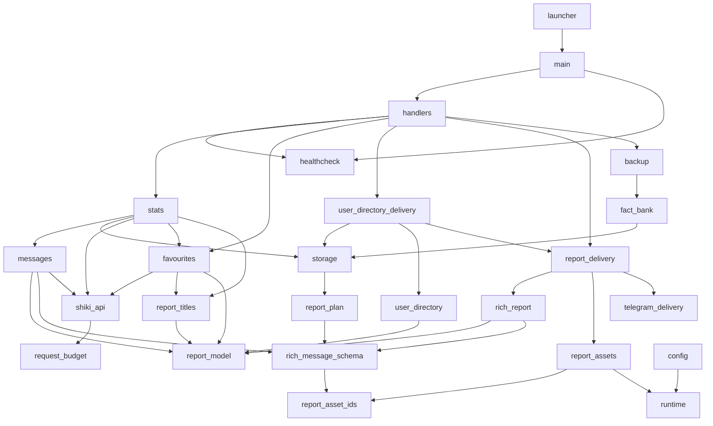

# ShikiUpdatesBot architecture

## Purpose and documentation boundaries

ShikiUpdatesBot is an `aiogram`/`aiohttp` Telegram hub for one public Shikimori profile, with optional subscriber notifications and automatic owner reports at quarter boundaries. This file owns module responsibilities, internal contracts, and the reasons behind stability constraints. Code and tests establish current behaviour.

Read [AGENTS.md](AGENTS.md) for collaboration, verification, and delivery rules. [README.md](README.md) owns user-facing behaviour, configuration, and deployment; [ideas.md](ideas.md) owns deferred and rejected proposals. Those proposals do not change the contracts below.

- [Module ownership and dependency direction](#module-ownership-and-dependency-direction)
- [Runtime, build identity, assets and state](#runtime-build-identity-assets-and-state)
- [Access control, registration and navigation](#access-control-registration-and-navigation)
- [Shikimori acquisition, synchronization and media semantics](#shikimori-acquisition-synchronization-and-media-semantics)
- [Typed reports and interactive delivery](#typed-reports-and-interactive-delivery)
- [Durable quarterly delivery](#durable-quarterly-delivery)
- [Backup, restore and automatic scheduling](#backup-restore-and-automatic-scheduling)
- [Facts and inline search](#facts-and-inline-search)

## Module ownership and dependency direction

Project imports form an acyclic graph. Keep orchestration above reusable domain, presentation, storage, and transport code; pass runtime parameters where that avoids a reverse dependency. `healthcheck.py` imports no project modules and receives its interval from the caller.

| Modules | Responsibility and boundary |
|---|---|
| [runtime.py](runtime.py), [config.py](config.py) | Physical app/resource roots, frozen detection, first-run environment, logs, mutex; configuration and state paths depend only on `runtime`. |
| [runtime_status.py](runtime_status.py), [project_meta.py](project_meta.py), [build_info.py](build_info.py) | Process-local lifecycle observations; canonical project metadata; build identity and strict SemVer parsing over `project_meta`. |
| [utils.py](utils.py), [request_budget.py](request_budget.py) | Pure stdlib helpers for text, URLs, numbers, dates, Russian count forms, and rolling-window reservations. |
| [name_grammar.py](name_grammar.py) | Immutable display-name context and template grammar over `pytrovich`, with no project imports. |
| [telegram_delivery.py](telegram_delivery.py) | Bounded in-process retries and Telegram failure classification, with no project imports. |
| [report_model.py](report_model.py), [report_asset_ids.py](report_asset_ids.py) | Pure typed reports/ordinary HTML chunking; import-light versioned asset identifiers and hashes. Neither imports project modules. |
| [rich_message_schema.py](rich_message_schema.py), [report_plan.py](report_plan.py) | Pure serialized Rich validation over asset identifiers; frozen transport-unit validation over that schema. No runtime or aiogram dependency. |
| [rich_report.py](rich_report.py), [report_assets.py](report_assets.py), [report_delivery.py](report_delivery.py) | Rich rendering/pagination; hash-checked local uploads; freezing, sequential delivery, fallback and results. Producers remain outside Bot API payload construction. |
| [storage.py](storage.py) | JSON persistence, cache read states, strict validators, restorable-state transaction and restore generation; frozen-plan validation uses `report_plan`. |
| [shiki_api.py](shiki_api.py) | REST/GraphQL acquisition, metadata, relevance/kind definitions, translations, throttle, HTTP-attempt budget, 429 retry and privacy classification. |
| [messages.py](messages.py) | Notification banks/history parsing, display-name application, and typed `/status` content/local-poster join. Uses the media and report boundaries. |
| [stats.py](stats.py) | Synchronization/publication, aggregates, current events and quarter snapshots, statistics report construction, and pure picker logic; delegates favourites collection to `favourites`. |
| [favourites.py](favourites.py) | Favourites collection/enrichment over the supplied statistics cache and typed report construction; uses `shiki_api` but owns no persistence, notification or delivery orchestration. |
| [report_titles.py](report_titles.py) | Shared typed title/link/poster construction for statistics and favourites over `config`, `utils` and `report_model`; no I/O. |
| [lists.py](lists.py) | Pure declarative list grouping/ordering and typed reports; reuses the manga classifier in `stats`, with no I/O or mutation. |
| [main_menu.py](main_menu.py) | Immutable menu declarations and pure text/caption/artwork/keyboard rendering; owns no FSM, authorization, storage, report building or delivery. |
| [access_control.py](access_control.py), [user_registry.py](user_registry.py) | Global access gate over storage; post-access, handler-matched registration and owner alerts. Registration never owns entitlement. |
| [user_directory.py](user_directory.py), [user_directory_delivery.py](user_directory_delivery.py) | Pure directory classification/typed report over an immutable snapshot; reusable coherent acquisition and delivery use-case. |
| [fact_bank.py](fact_bank.py), [inline_facts.py](inline_facts.py) | External-bank schema/publication and immutable combined snapshot over storage; baseline, query classification and deterministic fact selection over that snapshot. |
| [inline_search.py](inline_search.py), [inline_cards.py](inline_cards.py) | Search debounce/cache/coalescing/continuations over `shiki_api` and `request_budget`; pure aiogram card/fact presentation. Neither owns handler authorization. |
| [updates.py](updates.py) | Independent GitHub code/release fetches, cache, safe information renderer, owner notification and lifecycle; never downloads/replaces files or uses the Shikimori throttle. |
| [backup.py](backup.py) | Coherent capture, cancellable worker/ZIP, restore, owner delivery and automatic scheduling over storage, fact-bank and retry boundaries. |
| [handlers.py](handlers.py), [main.py](main.py), [launcher.py](launcher.py) | Commands/FSM/polling/quarter rotation and shared cleanup; application wiring/lifecycle; frozen console diagnostics and single-instance entrypoint. |
| [healthcheck.py](healthcheck.py) | Isolated HTTP healthcheck and heartbeat watchdog. |
| [release_security.py](release_security.py) | Build-time-only VirusTotal client; no project imports and no bot-runtime role. |

Selected runtime dependency paths:

```mermaid
graph TD
    launcher --> main
    main --> handlers
    main --> healthcheck
    handlers --> healthcheck
    handlers --> stats
    handlers --> favourites
    handlers --> user_directory_delivery
    handlers --> report_delivery
    handlers --> backup
    stats --> messages
    stats --> storage
    stats --> shiki_api
    stats --> favourites
    stats --> report_titles
    favourites --> shiki_api
    favourites --> report_titles
    favourites --> report_model
    report_titles --> report_model
    messages --> report_model
    messages --> rich_message_schema
    messages --> shiki_api
    user_directory_delivery --> storage
    user_directory_delivery --> user_directory
    user_directory_delivery --> report_delivery
    user_directory --> report_model
    backup --> fact_bank
    fact_bank --> storage
    storage --> report_plan
    report_plan --> rich_message_schema
    report_delivery --> rich_report
    report_delivery --> report_assets
    report_delivery --> telegram_delivery
    rich_report --> report_model
    rich_report --> rich_message_schema
    rich_message_schema --> report_asset_ids
    report_assets --> report_asset_ids
    report_assets --> runtime
    shiki_api --> request_budget
    config --> runtime
```

Focused tests follow module ownership; handler orchestration lives in `tests/test_handlers_<flow>.py`. Contract references below point to the suites that protect important boundaries. The test-placement and mocking rules remain in [AGENTS.md](AGENTS.md#tests-and-verification).

## Runtime, build identity, assets and state

### Roots and lifecycle

`config.py` loads `.env` explicitly from the source/exe root without overriding process environment. Configuration names/defaults belong in [README configuration](README.md#конфигурация) and [.env.example](.env.example); `PORT` is read directly by `healthcheck.py`. Frozen relative `DATA_DIR` values resolve from the portable root. Persistent portable files live beside the physical `sys.executable`, never in `%APPDATA%` or the PyInstaller extraction directory. Resource lookup uses the separate resource root.

A missing portable `.env` is copied once from the adjacent example and never overwritten. Rotating `logs/` stay outside `DATA_DIR` and backups. A named mutex excludes a second process in the same folder. Source/Docker runs the healthcheck and shutdown-backup hook; frozen mode skips both. The ZIP's opt-in autostart helpers own only the current user's Startup shortcut and are never invoked by the exe or first-run flow. Setup/update steps belong in [README](README.md#быстрый-старт-portable-версия-для-windows).

The startup owner probe sends a local escaped HTML health snapshot whose persisted timestamps describe the previous run, with an exception-safe bare restart signal as fallback. Successful delivery starts notification polling; failure leaves it off while Telegram update polling remains available. Owner `/start` re-arms it idempotently. Runtime owner-send failures do not stop the loop: doing so would deprive other subscribers of notifications. Process start, successful full-sync time and polling activity are observations in `runtime_status`, not restored state. The healthcheck observes liveness and does not restart processes; endpoint/watchdog behaviour and external restart responsibilities are in [README](README.md#healthcheck-и-ответственность-за-перезапуск).

### State ownership and transactions

Persistent JSON state lives under `DATA_DIR`; the complete file inventory is in [README](README.md#хранение-данных-и-жизненный-цикл). Its architectural divisions are:

| State | Authority |
|---|---|
| `seen_ids.json`, `seen_favourites.json` | Notification baselines/deduplication; exported for inspection, excluded from restore. |
| `stats_all.json` | Rebuildable current public lists, metadata, comments, favourites and aggregates; cached locally and excluded from restore. |
| `stats_current.json`, `quarters/` | Current-quarter tracking/durable delivery; frozen historical snapshots. |
| `subscribers.json` | One atomic notification-chat map plus versioned automatic-backup schedule. |
| `blocked_users.json`, `known_users.json`, `user_alerts.json` | Access policy; immutable first-seen identity; owner alert switch. These are distinct responsibilities. |
| `facts.json`, `update_state.json` | Optional additional fact bank; independent cached code/release identities and notification acknowledgement. |

Normal JSON publication uses `_atomic_write` (temporary file plus atomic replacement); restore stages and replaces files with rollback on an in-process publication error. Neither mechanism claims a multi-file power-loss transaction.

`restorable_state_transaction` is one event-loop-local lock shared by restore and asynchronous writers of restorable state. Writers reload the published state and merge only their delta immediately before saving, so work started before a restore cannot overwrite it. First-run current-quarter initialization also enters this transaction. Coherent readers copy immutable data before releasing the lock. Rendering, Telegram awaits, retry/pacing sleeps, ZIP compression and slow delivery never hold it; backup raw capture has a bounded critical section described below. The separate automatic-delivery lock serializes automatic report/backup attempts.

Every successful restore publication advances a process-local generation, including an unrelated or byte-identical restore. In-flight report/backup attempts must not acknowledge state from another generation. It need not persist across restart because old sends are no longer in flight. Exact guards and recovery semantics belong in [quarterly delivery](#durable-quarterly-delivery) and [backup](#backup-restore-and-automatic-scheduling).

### Build identity, resources and updates

`project_meta.PROJECT_VERSION` identifies source state independently of published portable releases. `APP_VERSION` identifies the running instance; the other information-card identities are cached `main` code and the latest full SemVer Release with a Windows x64 ZIP. Source uses its running project version; non-tag exe builds append `-dev`. [ShikiUpdatesBot.spec](ShikiUpdatesBot.spec) embeds version/repository/server/API identity; fork builds follow their configured repository, with build-time `UPDATE_REPOSITORY` available for another upstream. Tagged builds must match `PROJECT_VERSION`.

`updates.py` fetches raw `project_meta.py?ref=main` through GitHub Contents and accepts exactly one strict `PROJECT_VERSION = "vMAJOR.MINOR.PATCH"` assignment without evaluating remote Python. Main and Release results merge independently: failure preserves old good values and any success from the other source. With release identity/API available, source/Docker and tagged frozen builds refresh after the startup delay and at most once per 24 hours; owner `/version` can force refresh. A frozen `-dev` build preserves restored cache but starts no update loop. Only a frozen release exe sends update notifications, based on the Windows Release rather than newer `main`; successfully delivered versions are acknowledged once. GitHub failures are non-fatal.

`/info` and private `start=info` read only persisted/local runtime state, without subscribing, waking polling or fetching remote data. Owner `/version` and the guarded info refresh action share the safe renderer; refresh edits a caption or text and tolerates normal non-editable responses. Absolute HTTP(S) repository/release links must have no credentials; malformed values/timestamps/links degrade safely without revealing raw exceptions, identifiers, environment values or local paths. The local info illustration reuses a process-local Telegram `file_id`; missing/rejected media clears it and falls back to the same text information.

The Windows spec and [Dockerfile](Dockerfile)/[.dockerignore](.dockerignore) retain the info illustration, the complete versioned `assets/main-menu/*.jpg` set, both report placeholders and [examples/facts.json](examples/facts.json). New collages use `report-poster-placeholder-v2.jpg`; `report-poster-placeholder-v1.png` remains materializable for already frozen/restored content-addressed plans. Removing it would break recovery. The Windows icon/editable PNG are build/design inputs; Windows autostart helpers stay outside Docker. Packaging tests and Docker build-time existence checks protect the effective resource set.

Runtime/dev/build dependency definitions stay in the three root `requirements*.txt` manifests. The build-time [dependency submission workflow](.github/workflows/dependency-submission.yml) resolves each separately and validates exact versions/transitive edges before submission: managed plain-pip data lacks that resolution, while Component Detection's `PipReport` discovery cannot preserve all three manifest identities. The [submitter](.github/scripts/submit_dependency_snapshot.py) retains the legacy detector identity and alphabetically-first correlator to select the resolved manual snapshot deterministically, without introducing an adapter or lockfile policy.

The [Windows workflow](.github/workflows/windows-exe.yml) invokes `release_security.py` only for strict release tags, with a step-scoped VirusTotal secret. It reuses known SHA-256 results or uploads the public EXE and polls at a bounded rate, including the large-file upload path. Detections/integration failures warn and do not gate draft creation; PR/dev builds receive no secret and submit nothing. Standard submissions are public. Release authorization/publication rules belong in [AGENTS.md](AGENTS.md#work-tracking-and-delivery).

Evidence: [runtime tests](tests/test_runtime.py), [owner gate tests](tests/test_handlers_owner_gate.py), [update tests](tests/test_updates.py), [Docker packaging tests](tests/test_docker_compose.py), [Windows packaging tests](tests/test_windows_workflow.py), [dependency submission tests](tests/test_dependency_submission.py).

## Access control, registration and navigation

### Access, registration and subscriptions

`AccessControlMiddleware` is the first project update middleware. It checks supported message/callback/inline senders before handler dispatch, FSM changes or side effects. Missing/malformed senders stop; unsupported updates pass through without matching these observers. Blocked messages receive one static safe denial; callbacks receive an alert without editing; inline queries receive empty uncached results. Sensitive handlers retain owner checks. The owner bypasses the gate and cannot appear in a block-list payload or mutation.

Missing block-list state is an empty migration state. Existing unreadable/malformed state, duplicates, invalid IDs or owner membership raise a typed error and deny everyone except the owner. Blocking publishes the list and subscriber removal with in-process rollback. Strict startup reconciliation repairs a subscription left between two file replacements; unreadable subscribers never become an empty map during reconciliation. The owner remains able to recover through `/backup`. Unblocking never resubscribes, and concurrent mutations reload under the shared state lock. `/blocklist` is a validated read-only owner view: complete ID rows, one total and one final management hint, with no mutation or public command-list entry.

`UserRegistryMiddleware` runs after the access gate, only for handler-matched messages/callbacks. It excludes the owner/unusable senders; inline, unsupported and unmatched events never register. A message-less matched callback uses its own sender. The first valid display name, optional username and canonical UTC first-seen timestamp are immutable; concurrent later events cannot replace them. Atomic creation and its alert decision use one state transaction. A malformed registry is preserved and skips registration; malformed alert settings suppress alerts without preventing registration. Missing settings enable alerts. Disabling/re-enabling never replays missed users; a newly-created result permits one best-effort owner alert after the handler, including the management commands. Failure neither rolls back registration nor affects access.

Registration is not subscription or entitlement and never schedules a subscription backup. Notification subscription is chat-scoped, including groups/channels, with no additional group-admin rule; media inline entitlement is owner/current positive personal subscriber ID. Group membership and registry discovery grant no inline access. Confirmed subscription changes and their backup counts are one atomic `subscribers.json` replacement. Navigation, cancellation, replay and already-current confirmation never add counts.

### Unified menu and session boundaries

Only `/start` is advertised; historical commands and inline handlers remain hidden compatible entrypoints. Plain `/start` opens a neutral profile menu and preserves owner polling recovery without subscribing. Public sections are usable without subscription; `/stop`, menu subscription controls and the unsubscribed inline deep link require explicit confirmation. Confirmation reloads authoritative state through `mutate_subscription`, and only a real change invokes subscription backup work.

`main.py` sets `FSMStrategy.USER_IN_CHAT`. Process-local menus bind initiator, chat and control-message ID; the main menu additionally binds current screen/origin and expected subscription target. Every transition validates those bindings and allowed screen; stale, forged, missing or `InaccessibleMessage` controls fail before progress, state change or report work. Back targets the immediate parent; root Close clears state. Restart/expiry requires a new menu. All `menu:*` callbacks are registration-neutral; each owner callback independently requires owner plus private chat, as do its rendered buttons.

`main_menu.py` retains complete fallback text for every allowlisted versioned JPEG. Missing/empty artwork opens text; rejected media invalidates its process-local `file_id`. Initial rejection falls back to text; rejected photo-to-photo navigation replaces the control with text, rebinds its ID, then removes the obsolete photo. Ambiguous transport failures do not send an alternative. Text sessions stay text-only, and owner prompts edit their current caption/text rather than creating another FSM implementation.

Terminal reports/documents/results clear state before best-effort removal of control and `/start` anchor, then delegate existing use-cases. Cleared state makes replay inert; cleanup failure cannot suppress the selected action. Lists retain the control for their shared progress lifecycle below. Owner tools reuse picker, broadcast, directory, fact-bank and backup flows; information-card refresh already serves the hidden `/version` operation. The hidden `/stats` registry owns its own keyboard/dispatch; unified statistics navigation has separate declarations/dispatch and must be considered when adding a report.

Personal subscribers/owner open home search with `switch_inline_query_current_chat=""`. An unsubscribed private user enters confirmation; a group user receives a private `start=inline_search` URL from `Bot.me()`, or an inert alert if username lookup fails. This never changes group subscription. Private deep-link return uses `switch_inline_query=""` because Telegram cannot preserve the originating chat. Owner/existing personal subscribers return directly; others confirm first. `start=info` and `start=inline_search_limit` are read-only and do not wake polling; group/unknown payloads open the ordinary neutral home.

### Owner directory and local list/picker flows

`/users` and `/start -> owner tools -> users` share `user_directory_delivery.deliver_user_directory`; callers do not aggregate storage. Both paths are registration-neutral and guarded by owner/private-chat checks before acquisition, preventing disclosure of stored identities in groups. `load_user_directory_snapshot` strictly copies registry, subscribers and blocked IDs under one state lock, then releases it before classification/rendering/delivery. Missing files are valid empty migration states; legacy subscribers without a schedule are read without migration. Any malformed existing source, including a present malformed schedule, fails the entire view with one source-labelled error.

Directory classification keeps registry users, personal/owner/group subscriptions, blocked-only IDs and legacy entries distinct. Its historical count covers only valid post-tracking registry users, excluding owner and state-only/chat entries. Blocked wins over personal subscription; positive IDs occur in at most one Subscribers/Blocked/Other section. Registered records sort newest-first then ID; undated follow by ID, with personal subscriptions before groups. Untrusted identities remain typed text, one entity per lossless `TableGroup`. Rich cells omit `tg://`; ordinary projections may use the generated positive-ID best-effort profile link, with management commands in typed code style.

`/lists` reads one local `load_stats_all_snapshot` only after terminal selection; it has no subscription gate, network, synchronization, budget, backup or persistent write. Direct and unified selections share `_lists_deliver`: clear state and acknowledge, then show non-interactive progress in control text/photo caption before snapshot/build/freeze/delivery. If editing fails, remove the keyboard and try a separate status. Progress lasts through sequential delivery; cleanup removes it best-effort or replaces undeletable reused text with neutral completion. Failure of progress/cleanup never suppresses report delivery or complete/partial notices. Direct `/lists` preserves its original command; unified selection removes the `/start` anchor. Repeated direct commands replace only the old control; `/cancel` uses shared FSM cleanup. Invalid callbacks cannot read data or clean another session.

Lists retain every title entry exactly once in full/combined views; non-objects, unknown kinds/statuses and corrupt containers are explicitly unresolved, never guessed or labelled empty. Missing state is not-ready; valid sibling domains remain deliverable. Manga/Ranobe views disclose excluded unknown-kind counts; Combined keeps separate known domains and an unresolved unit only for records or source-integrity warnings. Exact normalized known statuses select completed/planned views. Stable ordering is valid owner score descending, normalized title, then numeric-or-string ID. Numbering continues across transport fragments within a status. Russian count forms are semantic: a progress fraction uses the genitive governed by the total after `/` (for example, `44/44 эпизодов`), while standalone counts use the ordinary numeral form. Typed metadata/comments remain adjacent to their title and use complete ordinary projections; missing/bad metadata is omitted. Rich table cells remain text-only: lists add no posters, collages or media fetches. Detail/layout wording lives in [lists.py](lists.py) and [README](README.md#статистика-отчёты-и-избранное).

`/pick` is owner-only, local and session-bound, including independent callback checks. It distinguishes valid/missing/invalid state and rejects unusable nested title structures. Candidates require exact `planned`; only normalized `anons` excludes a release, so unknown release status stays eligible. Unknown manga kinds are disclosed and excluded from known pools. Ordinary selection is uniform over unseen candidates until exhaustion; contrast prefers a known different decade then smallest known genre overlap with random ties. Missing metadata weakens criteria. Seen IDs/current anchor live only in FSM; the picker also binds presentation kind, so repeated commands, cancellation and stale callbacks cannot cross-mutate sessions. Cached poster cards have bounded HTML captions; missing/rejected posters fall back to text without previews, rebind replacement controls and share safe cleanup. Full sync owns enrichment; picker never initiates it.

Evidence: [access tests](tests/test_access_control.py), [registry tests](tests/test_user_registry.py), [main-menu tests](tests/test_handlers_main_menu.py), [directory tests](tests/test_handlers_users.py), [list tests](tests/test_handlers_lists.py), [picker tests](tests/test_handlers_pick.py).

## Shikimori acquisition, synchronization and media semantics

### Failures, reuse and request budgets

Public list exports supply user state; batched GraphQL `animes`/`mangas` with `censored: false` supplies metadata. Per-title REST/OAuth were rejected and are not synchronization paths. Every Shikimori HTTP attempt uses `_fetch` and the application User-Agent. Ordinary network/timeout/status/parsing/429 exhaustion returns `None`, distinct from successful emptiness. Composite contracts may retain partial results: metadata batches skip failed/omitted records; current rates return a partial list if any requested status succeeded, and `None` only when all failed.

Only HTTP 403 with JSON `message` exactly `You are not authorized to access this page.` raises `ProfilePrivacyError`; other/malformed 403 bodies keep ordinary failure semantics. Privacy propagates through composite operations and dominates partial successes. `ShikimoriBudgetExceeded` identifies denied inline HTTP attempts. Strict storage/plan errors are separate control signals handled at their caller boundaries rather than swallowed as successful empty data.

Shikimori protection has distinct levels:

- `_throttle` serializes a fixed 0.25-second min-gap and attempt reservation under one lazy lock, without jitter. A denied reservation does not advance its monotonic mark.
- Every actual attempt, including 429 retries, reserves the global 80-per-60-second window. Inline stops at 60 occupied places, retaining 20 for non-inline traffic. General traffic may use all 80.
- `_fetch` handles 429 before status classification, parses seconds-form `Retry-After` with fixed fallback/cap and allows two additional attempts. Exhaustion is failure.
- Inline additionally permits 30 uncached pages per 60 seconds, counted once before a coalesced fetch. Denials are uncached and offer the read-only limit explanation. One warning per exhausted interval includes escaped operational actor attribution/consumption and timing, never query text.

Startup uses one shared `ClientSession` and fixed `BOOT_PHASE_DELAY` between phases. Startup and each cycle fetch favourites once and reuse the response for notification/synchronization. Omitted favourites input permits an existing standalone fetch; explicit `None` means unavailable and preserves the previous snapshot without refetch. Missing baselines can retry initialization later without historical notification storms. Metadata/sync accept an optional shared session and create a short-lived one only when omitted.

`favourites` owns the collection sentinel shared with `stats.sync_stats_all` and builds `stats["favourites"]` in the caller-supplied statistics snapshot. Collection retains the existing fixed API-category order; ranobe joins the manga title namespace, and people/mangakas/seyu/producers merge with first-entry deduplication by string ID. Cached titles/URLs/positive scores retain their existing fallbacks. A successful empty response replaces favourites with empty categories; unavailable input preserves the old snapshot. The raw response and title records are not mutated. `stats` owns synchronization/publication; handlers own the silent baseline, role-specific seen keys, per-cycle person notification deduplication, and cached URL copies. `favourites` never imports `stats`.

Confirmed startup privacy failure prevents publication of history/favourites baselines or working statistics. Background privacy diagnostics go only to the owner, share `ERROR_NOTIFY_INTERVAL`, never broadcast and preserve state. The loop updates its heartbeat and retries after `CHECK_INTERVAL`, allowing recovery when the profile opens without restart.

Public `/status` shares successful raw anime+manga rates for a fixed 60-second monotonic TTL. Lock plus a second cache check coalesces cold/expired calls into one four-request refresh. Empty results and per-domain partial lists are successful; full domain failure/privacy never replace or refresh good cache. Filtering/rendering runs for every response. Non-owners receive a short privacy notice; the owner receives the required profile setting and configured settings URL. Successful non-empty results use typed reports in original watching-then-reading order. Local posters join only by exact media domain and canonical positive target ID; stale/malformed/missing state only reduces decoration, without network or placeholders. Ordinary HTML remains complete with its enabled preview policy. Empty/error/privacy replies remain short; restart starts cold.

### Synchronization, metadata and comments

Each successfully applied metadata record gets `meta_updated_at`; failed/omitted/parsing records keep good metadata and timestamp for retry. Legacy, malformed and future timestamps are stale with oldest priority. Current `planned`, `watching`, `rewatching` and `on_hold` records age after seven days, `completed`/`dropped` after thirty. Each successful export half spends at most one oldest-first maintenance batch of 50 anime and one of 50 shared manga/ranobe records, with stable numeric-ID ties. New titles, missing-kind repair and malformed values still present in export use the higher-priority correctness batch outside that allowance. Failed repair leaves a canonical missing-kind record without a timestamp; export cleanup removes absent records. Refresh replaces the metadata portion, including poster/release status, while current export owns score/status/progress/rewatches. Aggregates are recomputed. Existing startup/periodic full sync is the only scheduler, and privacy prevents all working publication/cache changes.

Export `text` owns normalized `comment`: CRLF/CR becomes LF, outer whitespace is trimmed, and missing/empty/non-string text removes the key for a successful media half. This applies to all creation/repair/refresh paths; comment-only changes use existing atomic publication, and failed export preserves its complete half. No endpoint, scheduler, storage-time product length limit or comment logging is added. Derived statistics/favourites and the quarter-title allowlist exclude comments, so historical snapshots and frozen quarterly reports never capture them. `lists.py` is their sole presentation boundary and treats them as untrusted typed text.

GraphQL URLs can be absolute while REST history URLs are relative. `_rel_url` normalizes at acquisition and defensively at Shikimori rendering to prevent double-domain links. `origin`/`rating` translations are stored at metadata fetch time. Statistics narrowly merge known raw/localized origin values so dictionary additions benefit old records without rewriting state; this is not a general raw-storage/display-translation migration.

### History and media domains

History catch-up fetches page 1 first, then older pages until a known seen-ID boundary or a short page, capped at five. Observed live responses include `limit + 1` rows and one-ID overlap; order is not guaranteed monotonic by ID/time. Deduplicate integer IDs and deliver old-to-new by ID. A required-page failure or unknown boundary at the cap aborts without partial seen-ID publication. First-run baseline uses one page and sends nothing.

History classification strips known markup then applies one scoped homoglyph normalization: mixed-script tokens and whitelisted standalone connectives fold Latin twins to Cyrillic while pure Latin words, titles and URLs remain unchanged. Completion uses anchored full description formats, never stems. Progress/reset/deletion events are seen-but-ignored; first rating is `score_set`. Score set/change updates an existing current-quarter completion without duplicating it; `score_removed` silently clears that score and never changes historical snapshots. Unknown descriptions warn and deliver cleaned source text without the internal classification label.

`is_relevant` is shared by notification/statistics ingestion: OVA/ONA remain, excluded specials/clips/PV and reading kinds are not allowed to diverge between callers. Inline acquisition has its own explicit GraphQL kind sets. Ranobe remains in the manga API/storage namespace. `RANOBE_KINDS` includes documented GraphQL `light_novel`/`novel` and the defensive REST `ranobe` alias. Wording selects the ranobe bank/label without changing `media_type`; missing/unknown status kinds fall back to manga. Media notifications/status use one central human label; character/person favourites remain unlabelled, with shared score-change banks.

`stats.classify_manga_presentation_kind` maps only known manga kinds to manga, ranobe kinds to ranobe, and everything missing/malformed/future to unknown. Lists, picker and statistics reuse it without title/URL/progress inference or top-level ranobe storage. Report partitions retain each entry exactly once in presentation copies; non-object records and unreadable containers stay visible as unresolved with honest unknown counts. Present corruption differs from absence/empty state. Known quarter events survive unavailable title lookups; valid completion/drop IDs deduplicate, malformed IDs remain unresolved, and planned retains event counts. Combined achievement input is not counted again from its presentation split.

Report-boundary validation sanitizes only presentation copies of display fields/lists/numbers, rejecting booleans/non-finite values while retaining raw kind. All-time anime uses persisted aggregates; malformed anime aggregates make that block unavailable while reading categories remain deliverable. Manga/ranobe/unknown recompute independent aggregates from title subsets without changing stored aggregates/`by_quarter`. Current and quarterly reports share `_build_quarter_sections`; all-time has a separate producer. Completed-only all-time insights use valid local metrics/years, stable string-ID ties and safe typed links, omit only unsupported facts/categories, and add no writes/fetches.

Historical manga comparison splits only with an exact nonnegative combined count, an equally long frozen record list and a nonblank string kind on every object. Unknown strings stay unknown; incomplete/malformed evidence keeps an explicit combined comparison, with unusable counts unavailable rather than zero. Historical snapshots retain combined raw-kind records, legacy `by_quarter` stays combined, and reading never rewrites them or an already pending report.

Display-name grammar is initialized once in `messages`. Eligible Cyrillic first names may contain hyphen-separated components; `auto` requires confident gender; ambiguity, ineligibility or detector/inflection failure falls back to raw forms/masculine alternatives. Explicit male/female retains template gender even if ineligible or inflection fails; ineligible names skip morphology. `none` uses raw forms/masculine alternatives. Case forms and `{g:male|female}` are applied before HTML escaping. Exact template/name matrices live in [name_grammar.py](name_grammar.py) and its tests.

Evidence: [API tests](tests/test_shiki_api.py), [statistics tests](tests/test_stats.py), [favourites tests](tests/test_favourites.py), [favourites orchestration tests](tests/test_handlers_favourites.py), [message tests](tests/test_messages.py), [polling tests](tests/test_handlers_polling.py), [status tests](tests/test_handlers_status.py), [name grammar tests](tests/test_name_grammar.py).

## Typed reports and interactive delivery

Report producers return `report_model.Report` with logical units/sections and typed text, links, headings, lists, tables/details and presentation-only media. Untrusted values remain unescaped until a renderer; neither renderer interprets them as HTML, Markdown, list/anchor syntax or another control language. Short ordinary HTML/inline presentation escapes API/user text at its own boundary.

The ordinary renderer packs complete sections/items/rows and splits grouped tables between domain objects. One oversized field/row uses a lossless continuation policy; groups retain separation, semantic headings survive continuations, and every chunk closes its own HTML. Post-entity visible length is conservatively measured in UTF-16 units against 4096, excluding raw markup. A `TableGroup` carries a complete ordinary projection of its Rich rows. Ordinary rendering ignores poster hints/galleries without losing titles, links, scores or order.

Rich rendering deterministically maps nodes to native blocks. Oversized catalogs binary-search the largest prefix whose actual serialized payload validates, and greedily combine subsequent statuses only when the result still validates. Title-card rows remain indivisible; only external oversized plain-text continuation fields can split. Continuations retain numbering, heading context and message-local generated navigation. Details summaries contain no links because observed clients reserve their click for toggling; a standalone navigation anchor follows details instead. Exact visual labels, emoji and spacing belong in producers/renderers, with semantic parity protected by tests.

`rich_message_schema` independently validates the exact serialized subset: 32768 Unicode characters, 500 recursively counted blocks, 16 nesting levels, 20 table columns and 50 media. Payloads set `skip_entity_detection=True`; anchors come from the renderer. Media must be safe HTTPS or an exact versioned local reference containing SHA-256. `report_assets` verifies packaged bytes and makes a fresh in-memory upload before every attempt. Top collages preserve rank and fill unusable slots with the current placeholder; explicit galleries instead omit invalid/missing posters without placeholders. `/status` has at most one gallery of up to three usable posters per watching/reading group; decorative subsets never imply ranking/completeness.

`report_delivery` freezes all presentation before its first Telegram await and sends units sequentially through `send_with_retry`, stopping on permanent/exhausted failure with an explicit result/resume index. The retry helper takes a fresh operation factory and allows two additional attempts only for flood-control/transient Telegram or aiohttp failures; permanent errors are not retried. Upload retries reuse captured content with fresh upload objects. Notification iteration/removal remains in handlers; backup ownership remains in backup.

Each Rich fragment freezes exactly its own complete HTML continuations and preview policy, so downgrade cannot repeat/drop neighbouring groups. Local rendering/validation/materialization failure during initial freeze selects HTML; logs contain fixed reason/type, never report text/payload. During frozen delivery, typed local `ReportAssetError` permits callers to downgrade before Telegram is awaited; other materialization errors stop unchanged. Only the current unit is preflighted, preserving exact progress for later asset failures. The other safe signal is `TelegramNotFound` for exact `SendRichMessage` with exact `Not Found`. Network/timeout/server or other ambiguous outcomes never cause another-format send.

Interactive status/statistics/lists/favourites/directory flows persist no report progress and attempt one stable complete-failure or partial-delivery notice. Quarterly progress is durable below. Rich preview/client behaviour is a dated observation, not capability detection: Telegram supplies no client signal or Rich preview switch; ordinary fallback retains its explicit preview flag. Notifications, broadcast, inline cards and short replies keep their own delivery boundaries.

Evidence: [report model tests](tests/test_report_model.py), [shared title tests](tests/test_report_titles.py), [Rich schema tests](tests/test_rich_message_schema.py), [Rich renderer tests](tests/test_rich_report.py), [asset tests](tests/test_report_assets.py), [delivery tests](tests/test_report_delivery.py).

## Durable quarterly delivery

`stats_current.json.pending_quarter_delivery` is absent/null when nothing is owed. Its schemas preserve exact frozen content across upgrades, restart and restore:

| Schema | Frozen sequence and progress |
|---|---|
| Legacy unversioned | `old_period`, `new_period`, rendered `report_messages`, boolean `report_sent`; migrated to v1 on the next delivery attempt, never during import. |
| Version 1 | `version`, UUID-hex `plan_id`, SHA-256 `plan_hash`, periods, exact HTML `report_messages`, zero-based next unacknowledged `next_unit`; never rerendered or converted. |
| Version 2 | Same identity/period/progress fields, with `report_units`: exact transport payload and preview policy, plus per-fragment rendered HTML fallback for Rich. One logical unit may yield several transport units. |

`report_plan` defines exact HTML/Rich unit fields. Local asset references freeze identifier/hash rather than filesystem objects. Hash covers immutable fields including identity, periods and content using sorted compact ASCII JSON; only `plan_hash` and mutable progress are excluded. It detects inconsistency, not authenticity.

One `storage.validate_pending_quarter_delivery` validates runtime/imported schemas. Periods are positive four-digit `YYYY-Q1` through `YYYY-Q4`, with old < new and new == current period; strict current loading/import checks the period even without pending. Skipped calendar quarters remain supported. Progress is an exact integer, excluding booleans/fractions, within its frozen sequence; empty sequences are valid. HTML/fallback strings are nonblank UTF-8-encodable; Rich passes the same schema/limits as fresh output. Partial pending cannot claim the new period fully sent. Unknown versions or invalid fields/content/progress/lineage preserve state, stop delivery and emit a debounced static owner notice; logs contain reason/type only. Recovery never rebuilds, filters, clears or declares malformed content successful.

Strict current load/save raises `QuarterDeliveryStateError` on missing/unreadable state or failed publication, without recreating/resetting it or logging report content. Default callers keep their existing reset/best-effort semantics. Rotation/rendering and legacy migration must publish successfully before Telegram. Migration preserves exact periods/messages; `report_sent=False` maps to zero, `True` to full count and backup-only continuation. Failed migration leaves recoverable legacy state and sends neither report nor backup.

Before each unit/retry, reload under the state transaction and verify authoritative plan/period/progress/generation. After Telegram success, reload and validate again, then publish only the progress delta into fresh state so concurrent quarter events survive. Changed progress, replaced plan or restore generation stops acknowledgement. Exact unsupported-method/local asset failures publish a new v2 identity/hash before HTML sending: the acknowledged prefix remains, and current/remaining Rich units become frozen fallback continuations. Ambiguous failure preserves Rich plan/index. Rendering, Telegram delivery and pacing are outside the state lock; bounded validation of published state belongs to its read/acknowledgement transaction. The automatic-delivery lock serializes attempts.

Restart resumes unchanged frozen content/index. Every successful restore invalidates an in-flight attempt, including identical/unrelated imports; the next attempt uses restored authority. An older restored snapshot deliberately rolls acknowledgements back and may replay messages. Telegram success immediately before interruption/failed acknowledgement may duplicate the unacknowledged unit; never skip it. This is at-least-once, without an exactly-once or power-loss cross-system guarantee.

Only durable completion publishes `last_report_sent=new_period` with the final index. Empty/already-complete plans save that compatibility marker and proceed to backup without report messages. Report failure prevents quarterly backup; successful report leaves pending intact so failed backup never resends acknowledged units. Confirmed backup rechecks plan/progress/generation and subscriber state before updating the automatic timestamp and clearing pending. Those are two file replacements: a failure between them may repeat backup, never erase report acknowledgements. An older pending obligation takes precedence over another calendar rotation.

Evidence: [plan/strict-state tests](tests/test_storage.py), [quarter recovery tests](tests/test_handlers_polling.py), [plan import tests](tests/test_backup.py).

## Backup, restore and automatic scheduling

### Capture, limits and cancellation

Export covers `DATA_DIR`, excluding temporary writes and all descendants of `.restore-*.tmp`; logs live outside it. Restore is restricted to policy/identity/subscriber/fact/update/current-quarter state and quarter snapshots. The exact whitelist is in [backup.py](backup.py) and [README](README.md#бэкап-и-восстановление). Rebuildable `stats_all` (including comments) and seen baselines are export-only, so a later successful sync rebuilds current lists without restoring stale projection data.

Export freezes one sorted manifest and captures restorable members as immutable bytes under `restorable_state_transaction`. One dedicated single-worker executor performs manifest traversal and bounded chunk reads, keeping the event loop schedulable while restorable writers wait. Later-created files are outside that manifest. After release, the same worker reads export-only members and compresses only captured bytes; compression, Telegram attempts and sleeps never hold the state lock.

| Boundary (inclusive) | Export | Import |
|---|---|---|
| 256 members | Included files | All ZIP entries, checked before reading members |
| 8 MiB per member | Each restorable member | Each restorable JSON |
| 32 MiB total | All included uncompressed data | Cumulative restorable data |
| 20 MiB archive | Completed ZIP | Known Telegram document size checked before download |

These fixed constants bound memory in every runtime mode. Manifest/read/compression/limit failure occurs before delivery and preserves pending/clocks. Cancellation signals a cooperative token between bounded filesystem/compression chunks, drains the worker, then propagates `CancelledError`; no detached/default-executor ZIP task may delay shutdown. `SHUTDOWN_BACKUP_TIMEOUT` is a completion deadline: expiry permits only the bounded drain of the current chunk, with no later compression, upload or retry. Generation checks after capture, before each Telegram attempt and after success prevent a restored snapshot from advancing backup state.

### Restore publication

Import validates a complete candidate before publishing. Known strict member errors, including malformed facts/registry/alerts/block-list/current schedule/quarter pending, reject the candidate; legacy subscriber/update schemas remain compatible. Other safely skippable invalid/unsupported members retain their existing rules. Path/size/schema checks remain in the importer. Reconcile candidate/current subscribers against candidate/current block-list; an old archive must never resubscribe a blocked user.

Canonical payloads and replaced originals are staged beside `DATA_DIR`; a later publication error rolls back prior replacements. The validated fact-bank runtime snapshot swaps only after all files publish; an archive without facts leaves it unchanged. Restore and writers share the state transaction, and successful publication advances the generation even for identical/unrelated restored files. This is recoverable in-process error handling, not power-loss atomicity. Existing `update_state` acknowledgement prevents repeated already-delivered release notification after migration.

### Automatic schedule and acknowledgement

One versioned subscription batch holds subscription/unsubscription counts and a lineage, with current subscriber total captured for delivery. A real confirmed mutation publishes its count in the same subscriber-state replacement. First pending work is due immediately without a valid successful automatic timestamp; otherwise after a rolling 24 hours. Startup/cycles attempt due subscription work before the weekly fallback. Failure preserves timestamp and batch. Success reloads under the state lock, checks lineage/generation and subtracts only delivered counts, retaining concurrent new changes. Unrelated state replacement is never acknowledged as the delivered batch.

Legacy schedule migration invents no change. Malformed runtime schedule becomes an immediately eligible recovery batch with explicitly unknown historical counts; non-finite/negative/future timestamps are untrusted. `last_backup_at` is the completion time of the latest successful subscription/weekly/quarter automatic delivery. Weekly is a seven-day fallback with a separate first-run anchor until success, so initialization is not success and recent automatic work suppresses duplicates.

Quarter delivery has independent durable report/backup progress. Its successful backup advances the shared automatic timestamp but keeps subscription pending, postponing that batch until its window opens. Subscription pending is outside current-quarter state and survives rotation. Manual/shutdown backups never advance automatic time or clear pending; shutdown has only process-local recent-send debounce. Registration, alert settings and direct fact upload/clear do not schedule subscription backups. Portable deliberately omits shutdown upload because durable local data plus automatic/manual copies make one archive on every console/PC shutdown noisy. All limits and 24-hour/seven-day intervals are fixed internal constants, not environment options.

Evidence: [backup tests](tests/test_backup.py), [subscription-state tests](tests/test_storage.py), [subscription orchestration tests](tests/test_handlers_subs.py).

## Facts and inline search

### Local facts and bank replacement

The built-in baseline is permanent. `fact_bank` publishes an immutable tuple combining it with a strict optional owner-unmarked bank whose IDs cannot collide with the baseline. Missing/unreadable/invalid/oversized external state falls back to base-only delivery. File schema, limits and examples belong in [README](README.md#дополнительный-банк-фактов-factsjson) and [fact_bank.py](fact_bank.py).

Command, callback, exact case-insensitive `fact`/`факт`, generated share query and eligible inline continuation capture the same current snapshot and share escaped presentation. Public fact paths never read subscriptions/search caches or use network/budgets; access control still runs first. Mutable rotation binds initiator plus displayed fact ID, so another group user cannot advance/edit it. Sharing is public and resolves exactly `fact:<id>`; a removed ID rejects rather than selecting something else or reaching media search. Manual fact query selection hashes Telegram user plus inline-query ID, retaining retries within one snapshot while allowing new queries to rotate. Inline fact answers are uncached with no mutable callbacks. Fact-like near misses reject before entitlement/media work.

Owner `/facts` reloads external status, validates bounded `.json` uploads and holds only a canonical preview candidate in FSM. Filename never chooses the persistence path. Apply compares preview hash and current-bank revision under the state lock, performs atomic `DATA_DIR/facts.json` publication followed synchronously by immutable snapshot swap, and preserves old disk/runtime on validation/stale/replay/publication failure. Clear uses one count-bearing confirmation and the same revision guard, writes canonical empty state and preserves baseline without automatic backup. Cancel/close never mutate; no state lock crosses Telegram awaits. Rejected upload attempts reuse the prompt instead of accumulating documents. Download uses canonical additional state or the bundled validated five-fact example for base-only state; document actions consume their menu and reject replay, while unavailable example keeps it retryable. Preview retains the command reply anchor for cleanup even after replacing the initial menu; serialization can still produce valid empty state for missing/invalid files.

### Entitlement and query state

`handlers.cmd_inline_search` grants media results only to the owner/current positive personal subscriber, after the update gate. It repeats authorization before cache work and before a fetched page enters cache; unsubscribe/block affects new queries without revoking sent cards. Only authorized work captures current operational actor metadata. `inline_search` does not read subscriber storage. Non-subscribers get only private subscription confirmation; the limit deep link explains timing without subscription read/mutation, polling wake-up or search.

Parsing recognizes canonical media prefixes/aliases, normalizes whitespace/case and rejects titles shorter than two characters before timers. Prefix syntax is documented in [README](README.md#поиск-тайтлов-из-любого-чата). Initial queries debounce two seconds per user; newer work cancels/invalidates the old lease before cache/network. Valid explicit continuation skips debounce. Successful pages including empty ones cache for ten monotonic minutes by media/normalized title/page; failures never cache, identical misses coalesce. Opaque continuations are issued only after a full 49-item page, bind query/next page and expire with that cached page. Malformed/stale/cross-query/skipped/unissued offsets answer empty without mutating debounce/cache/continuations or touching HTTP/budgets.

### Acquisition and chooser presentation

Each page is one GraphQL operation with `limit:49` and `censored:false`, fetching chooser/poster/domain/taxonomy/description fields together without per-result fan-out. Anime acquisition filters allowed kinds server-side to avoid local pagination holes; manga/ranobe use their explicit `mangas` kind sets in `shiki_api`, independent of ingestion relevance. Singular card labels remain separate from plural statistics labels.

Observed Telegram clients render all-photo pages as title-less galleries; mixed article/photo pages retain a readable chooser. The first non-empty page therefore appends one explicit project-share article after at most 49 media entries, whose sent text describes the open-source project/installation rather than spending the running bot's quota. An otherwise all-photo continuation appends an explicit fact article; a natural article fallback already satisfies this need. Selection hashes user/normalized query for stable retries and no repeat within a bank cycle. Empty/failed pages append nothing, and valid media is never downgraded merely for layout; invalid/missing poster causes article fallback. This is a recorded UX rationale, not a universal client capability promise.

Cards retain normalized Shikimori links and current-chat search, with optional private info link from cached bot username; username lookup failure omits only that link. Rendering cleans known HTML/BBCode and escapes API text, separates score/domain metrics/taxonomy and prefers Russian names. Photo captions fit 1024 post-entity characters by shortening description first, then dropping whole trailing taxonomy items with an omitted count; markup/entities are assembled only from intact fields.

Evidence: [fact-bank tests](tests/test_fact_bank.py), [fact-management tests](tests/test_handlers_fact_management.py), [inline search tests](tests/test_inline_search.py), [inline authorization tests](tests/test_handlers_inline_search.py), [inline presentation tests](tests/test_inline_cards.py).
