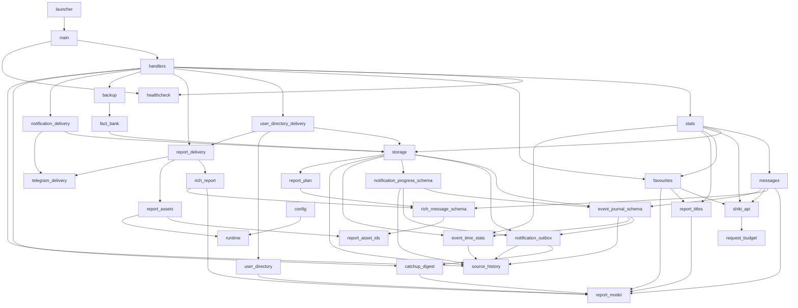

# ShikiUpdatesBot architecture

## Purpose and documentation boundaries

ShikiUpdatesBot is an `aiogram`/`aiohttp` Telegram hub for one public Shikimori profile, with optional subscriber notifications and automatic owner reports at quarter boundaries. This file owns module responsibilities, internal contracts, and the reasons behind stability constraints. Code and tests establish current behaviour.

Read [AGENTS.md](AGENTS.md) for collaboration, verification, and delivery rules. [README.md](README.md) owns user-facing behaviour, configuration, and deployment; [ideas.md](ideas.md) owns deferred and rejected proposals. Those proposals do not change the contracts below.

- [ShikiUpdatesBot architecture](#shikiupdatesbot-architecture)
  - [Purpose and documentation boundaries](#purpose-and-documentation-boundaries)
  - [Module ownership and dependency direction](#module-ownership-and-dependency-direction)
  - [Runtime, build identity, assets and state](#runtime-build-identity-assets-and-state)
    - [Roots and lifecycle](#roots-and-lifecycle)
    - [State ownership and transactions](#state-ownership-and-transactions)
    - [Build identity, resources and updates](#build-identity-resources-and-updates)
  - [Access control, registration and navigation](#access-control-registration-and-navigation)
    - [Access, registration and subscriptions](#access-registration-and-subscriptions)
    - [Unified menu and session boundaries](#unified-menu-and-session-boundaries)
    - [Owner directory and local list/picker flows](#owner-directory-and-local-listpicker-flows)
  - [Shikimori acquisition, synchronization and media semantics](#shikimori-acquisition-synchronization-and-media-semantics)
    - [Failures, reuse and request budgets](#failures-reuse-and-request-budgets)
    - [Synchronization, metadata and comments](#synchronization-metadata-and-comments)
    - [History and media domains](#history-and-media-domains)
    - [Durable history ingestion and processing](#durable-history-ingestion-and-processing)
    - [Durable journal notification delivery](#durable-journal-notification-delivery)
    - [Durable catch-up digest](#durable-catch-up-digest)
    - [Event-time quarterly projections](#event-time-quarterly-projections)
  - [Typed reports and interactive delivery](#typed-reports-and-interactive-delivery)
    - [Telegram send outcomes](#telegram-send-outcomes)
  - [Durable quarterly delivery](#durable-quarterly-delivery)
  - [Backup, restore and automatic scheduling](#backup-restore-and-automatic-scheduling)
    - [Capture, limits and cancellation](#capture-limits-and-cancellation)
    - [Restore publication](#restore-publication)
    - [Automatic schedule and acknowledgement](#automatic-schedule-and-acknowledgement)
  - [Facts and inline search](#facts-and-inline-search)
    - [Local facts and bank replacement](#local-facts-and-bank-replacement)
    - [Entitlement and query state](#entitlement-and-query-state)
    - [Acquisition and chooser presentation](#acquisition-and-chooser-presentation)

## Module ownership and dependency direction

Application modules live directly under `src/` and retain flat import names; there is no named package. Root `main.py` remains the real application wiring/lifecycle module and the stable `python main.py` entrypoint. Source entrypoints resolve their import paths from their own file locations; frozen builds use PyInstaller's module loader. Pytest and Docker configure both the source directory and repository root for direct flat imports.

Root `project_meta.py` remains the sole canonical metadata source and a public compatibility surface for installed bots and the README version badge. Its existing GitHub Contents/raw path and literal version assignment must survive layout changes; a forwarding file or a second metadata copy would violate that contract. Build-only `release_security.py` and the existing `.github/scripts/` helpers remain outside the application source directory.

Project imports form an acyclic graph. Keep orchestration above reusable domain, presentation, storage, and transport code; pass runtime parameters where that avoids a reverse dependency. `healthcheck.py` imports no project modules and receives its interval from the caller.

| Modules | Responsibility and boundary |
|---|---|
| [runtime.py](src/runtime.py), [config.py](src/config.py) | Physical app/resource roots, frozen detection, first-run environment, logs, mutex; configuration and state paths depend only on `runtime`. |
| [runtime_status.py](src/runtime_status.py), [project_meta.py](project_meta.py), [build_info.py](src/build_info.py) | Process-local lifecycle observations; canonical project metadata; build identity and strict SemVer parsing over `project_meta`. |
| [utils.py](src/utils.py), [request_budget.py](src/request_budget.py) | Pure stdlib helpers for text, URLs, numbers, dates, Russian count forms, and rolling-window reservations. |
| [name_grammar.py](src/name_grammar.py) | Immutable display-name context and template grammar over `pytrovich`, with no project imports. |
| [telegram_delivery.py](src/telegram_delivery.py) | Explicit send outcomes/ordered attempt evidence, caller-selected bounded retry policy and observed aiogram session, with no project imports. |
| [report_model.py](src/report_model.py), [report_asset_ids.py](src/report_asset_ids.py) | Pure typed reports/ordinary HTML chunking; import-light versioned asset identifiers and hashes. Neither imports project modules. |
| [rich_message_schema.py](src/rich_message_schema.py), [report_plan.py](src/report_plan.py) | Pure serialized Rich validation over asset identifiers; frozen transport-unit validation over that schema. No runtime or aiogram dependency. |
| [rich_report.py](src/rich_report.py), [report_assets.py](src/report_assets.py), [report_delivery.py](src/report_delivery.py) | Rich rendering/pagination; hash-checked local uploads; freezing, sequential delivery, fallback and results. Producers remain outside Bot API payload construction. |
| [event_time_stats.py](src/event_time_stats.py) | Pure UTC attribution, deterministic post-migration quarter projections, compact source facts, correction revisions and shared validation; uses `source_history`, with no runtime imports. |
| [source_history.py](src/source_history.py) | Pure absolute-seq/suffix access, exact accepted IDs, bounded diagnostic fingerprints and safe rebasing after prefix/fingerprint maintenance; stdlib only. |
| [event_journal_schema.py](src/event_journal_schema.py) | Pure logical journal/acquisition/source-base/recovery validation and bounded parsing; uses `event_time_stats` and `source_history`, with no runtime imports. |
| [notification_progress_schema.py](src/notification_progress_schema.py) | Pure physical history v4/v5/v6/progress v1 binding, bounded runtime/import parsing and compatibility with logical v3; uses journal/outbox schemas and `source_history`, with no runtime imports. |
| [notification_outbox.py](src/notification_outbox.py) | Pure versioned recipient obligations, frozen digest plans, terminal summaries, completed-prefix retention, membership validation, retry/expiry transitions and capacity reserve; uses `source_history` and `catchup_digest`, with no runtime imports. |
| [catchup_digest.py](src/catchup_digest.py) | Pure lossless ordinary-HTML digest rendering, safe HTML/UTF-16 validation and continuation; uses only `report_model` helpers and stdlib. |
| [notification_delivery.py](src/notification_delivery.py) | Independent bounded journal-notification consumer over storage and Telegram outcomes; owns durable per-recipient attempts/acknowledgements. |
| [history_catchup.py](src/history_catchup.py) | Pure connected-page traversal, exact frontier reconnection and head bridging; owns no I/O, normalization or publication. |
| [storage.py](src/storage.py) | JSON persistence, cache read states, strict validators, restorable-state transaction and restore generation; frozen-plan validation uses `report_plan`. |
| [shiki_api.py](src/shiki_api.py) | REST/GraphQL acquisition, metadata, relevance/kind definitions, translations, throttle, HTTP-attempt budget, 429 retry and privacy classification. |
| [messages.py](src/messages.py) | Notification banks/history parsing and normalization, display-name application, and typed `/status` content/local-poster join. Uses the media and report boundaries. |
| [stats.py](src/stats.py) | Synchronization/publication, aggregates, current events and quarter snapshots, statistics report construction, and pure picker logic; delegates favourites collection to `favourites`. |
| [favourites.py](src/favourites.py) | Favourites collection/enrichment over the supplied statistics cache and typed report construction; uses `shiki_api` but owns no persistence, notification or delivery orchestration. |
| [report_titles.py](src/report_titles.py) | Shared typed title/link/poster construction for statistics and favourites over `config`, `utils` and `report_model`; no I/O. |
| [lists.py](src/lists.py) | Pure declarative list grouping/ordering and typed reports; reuses the manga classifier in `stats`, with no I/O or mutation. |
| [main_menu.py](src/main_menu.py) | Immutable menu declarations and pure text/caption/artwork/keyboard rendering; owns no FSM, authorization, storage, report building or delivery. |
| [access_control.py](src/access_control.py), [user_registry.py](src/user_registry.py) | Global access gate over storage; post-access, handler-matched registration and owner alerts. Registration never owns entitlement. |
| [user_directory.py](src/user_directory.py), [user_directory_delivery.py](src/user_directory_delivery.py) | Pure directory classification/typed report over an immutable snapshot; reusable coherent acquisition and delivery use-case. |
| [fact_bank.py](src/fact_bank.py), [inline_facts.py](src/inline_facts.py) | External-bank schema/publication and immutable combined snapshot over storage; baseline, query classification and deterministic fact selection over that snapshot. |
| [inline_search.py](src/inline_search.py), [inline_cards.py](src/inline_cards.py) | Search debounce/cache/coalescing/continuations over `shiki_api` and `request_budget`; pure aiogram card/fact presentation. Neither owns handler authorization. |
| [updates.py](src/updates.py) | Independent GitHub code/release fetches, cache, safe information renderer, owner notification and lifecycle; never downloads/replaces files or uses the Shikimori throttle. |
| [backup.py](src/backup.py) | Coherent capture, cancellable worker/ZIP, restore, owner delivery and automatic scheduling over storage, fact-bank and retry boundaries. |
| [handlers.py](src/handlers.py), [main.py](main.py), [launcher.py](src/launcher.py) | Commands/FSM/polling/quarter rotation and shared cleanup; application wiring/lifecycle; frozen console diagnostics and single-instance entrypoint. |
| [healthcheck.py](src/healthcheck.py) | Isolated HTTP healthcheck and heartbeat watchdog. |
| [release_security.py](release_security.py) | Build-time-only VirusTotal client; no project imports and no bot-runtime role. |

Selected runtime dependency paths:

```mermaid
graph TD
    launcher --> main
    main --> handlers
    main --> healthcheck
    handlers --> healthcheck
    handlers --> stats
    handlers --> favourites
    handlers --> user_directory_delivery
    handlers --> report_delivery
    handlers --> backup
    stats --> messages
    stats --> storage
    stats --> shiki_api
    stats --> favourites
    stats --> report_titles
    favourites --> shiki_api
    favourites --> report_titles
    favourites --> report_model
    report_titles --> report_model
    messages --> report_model
    messages --> rich_message_schema
    messages --> shiki_api
    user_directory_delivery --> storage
    user_directory_delivery --> user_directory
    user_directory_delivery --> report_delivery
    user_directory --> report_model
    backup --> fact_bank
    fact_bank --> storage
    storage --> event_journal_schema
    storage --> notification_outbox
    storage --> notification_progress_schema
    notification_progress_schema --> event_journal_schema
    notification_progress_schema --> notification_outbox
    event_journal_schema --> notification_outbox
    handlers --> notification_delivery
    handlers --> catchup_digest
    notification_outbox --> catchup_digest
    catchup_digest --> report_model
    notification_delivery --> storage
    notification_delivery --> telegram_delivery
    storage --> event_time_stats
    event_journal_schema --> event_time_stats
    event_time_stats --> source_history
    event_journal_schema --> source_history
    notification_progress_schema --> source_history
    notification_outbox --> source_history
    handlers --> source_history
    storage --> source_history
    stats --> event_time_stats
    messages --> event_journal_schema
    storage --> report_plan
    report_plan --> rich_message_schema
    report_delivery --> rich_report
    report_delivery --> report_assets
    report_delivery --> telegram_delivery
    rich_report --> report_model
    rich_report --> rich_message_schema
    rich_message_schema --> report_asset_ids
    report_assets --> report_asset_ids
    report_assets --> runtime
    shiki_api --> request_budget
    config --> runtime
```

Focused tests follow module ownership; handler orchestration lives in `tests/test_handlers_<flow>.py`. Contract references below point to the suites that protect important boundaries. The test-placement and mocking rules remain in [AGENTS.md](AGENTS.md#tests-and-verification).

## Runtime, build identity, assets and state

### Roots and lifecycle

`config.py` loads `.env` explicitly from the source/exe root without overriding process environment. In source mode, `runtime.py` resolves the physical repository root above `src/` for settings and bundled resources, independently of the working directory. Source/Docker data still defaults to `/data`; relative source `DATA_DIR` values retain working-directory semantics. Configuration names/defaults belong in [README configuration](README.md#конфигурация) and [.env.example](.env.example); `PORT` is read directly by `healthcheck.py`. Frozen relative `DATA_DIR` values resolve from the portable root. Persistent portable files live beside the physical `sys.executable`, never in `%APPDATA%` or the PyInstaller extraction directory. Frozen resource lookup uses the separate extraction root.

A missing portable `.env` is copied once from the adjacent example and never overwritten. Rotating `logs/` stay outside `DATA_DIR` and backups. A named mutex excludes a second process in the same folder. Source/Docker runs the healthcheck and shutdown-backup hook; frozen mode skips both. The ZIP's opt-in autostart helpers own only the current user's Startup shortcut and are never invoked by the exe or first-run flow. Setup/update steps belong in [README](README.md#быстрый-старт-portable-версия-для-windows).

The startup owner probe sends a local escaped HTML health snapshot whose persisted timestamps describe the previous run, with an exception-safe bare restart signal as fallback. Successful delivery starts notification polling; failure leaves it off while Telegram update polling remains available. Owner `/start` re-arms it idempotently. Runtime owner-send failures do not stop the loop: doing so would deprive other subscribers of notifications. Process start, successful full-sync time and polling activity are observations in `runtime_status`, not restored state. Callers signal actual task launch/completion to the import-independent healthcheck. Owner-gate waiting remains healthy; a launched task has three `CHECK_INTERVAL` to produce its first heartbeat, completion is immediately unhealthy, and a legitimate restart resets that grace without inventing a heartbeat. A stale callback cannot stop a newer task's liveness observation. The healthcheck observes liveness and does not restart processes; endpoint/watchdog behaviour and external restart responsibilities are in [README](README.md#healthcheck-и-ответственность-за-перезапуск).

### State ownership and transactions

Persistent JSON state lives under `DATA_DIR`; the complete file inventory is in [README](README.md#хранение-данных-и-жизненный-цикл). Its architectural divisions are:

| State | Authority |
|---|---|
| `event_journal.json` | Strict history ingestion authority, silent baseline, immutable admitted events and separate unfinished acquisition; physical v4/v5/v6 binds separate progress; v5 adds source_base v1, v6 bounds diagnostic fingerprints in source_base v2, while legacy v1/v2/v3 retains embedded checkpoints/outbox. |
| `notification_progress.json` | Activated progress v1: logical processed checkpoint and complete frozen outbox, enqueue/completion boundaries, recipient attempts and terminal outcomes. Bound to physical history identity/profile/lineage. |
| `seen_ids.json`, `seen_favourites.json` | Export-only journal ID projection; separate favourites baseline/deduplication. Both excluded from restore. |
| `stats_all.json` | Rebuildable current public lists, metadata, comments, favourites and aggregates; cached locally and excluded from restore. |
| `stats_current.json`, `quarters/` | Source-quarter projections and correction revisions, journal-bound checkpoint and frozen report delivery; original historical snapshots. |
| `subscribers.json` | One atomic notification-chat map, versioned membership tokens and automatic-backup schedule. |
| `blocked_users.json`, `known_users.json`, `user_alerts.json` | Access policy; immutable first-seen identity; owner alert switch. These are distinct responsibilities. |
| `facts.json`, `update_state.json` | Optional additional fact bank; independent cached code/release identities and notification acknowledgement. |

Normal JSON publication uses `_atomic_write` (temporary file plus atomic replacement); restore stages and replaces files with rollback on an in-process publication error. Neither mechanism claims a multi-file power-loss transaction.

Seen-cache loading validates an object with a list of exact integer history IDs or string favourite IDs; booleans and incompatible entries invalidate the whole cache. Missing files/keys and empty lists remain valid first-run/empty states, and duplicates collapse normally. Unreadable, invalid-encoding, malformed or excessively nested input warns and returns an empty baseline without writing the original file. Before journal initialization, valid legacy history IDs (including an empty list) migrate silently; missing/invalid history caches require one-page bootstrap. After initialization, `seen_ids` is only a best-effort export and cannot reset history. Favourites keep their silent cache-rebuild policy; neither policy applies to strict journal/quarterly/subscriber authority.

`restorable_state_transaction` is one event-loop-local lock shared by restore and asynchronous writers of restorable state. Writers reload the published state and merge only their delta immediately before saving, so work started before a restore cannot overwrite it. First-run current-quarter initialization also enters this transaction. Coherent readers copy immutable data before releasing the lock. Rendering, Telegram awaits, retry/pacing sleeps, ZIP compression and slow delivery never hold it; backup raw capture has a bounded critical section described below. The separate automatic-delivery lock serializes automatic report/backup attempts.

Every successful restore publication advances a process-local generation, including an unrelated or byte-identical restore. In-flight report/backup attempts must not acknowledge state from another generation. It need not persist across restart because old sends are no longer in flight. Exact guards and recovery semantics belong in [quarterly delivery](#durable-quarterly-delivery) and [backup](#backup-restore-and-automatic-scheduling).

### Build identity, resources and updates

`project_meta.PROJECT_VERSION` identifies source state independently of published portable releases. `APP_VERSION` identifies the running instance; the other information-card identities are cached `main` code and the latest full SemVer Release with a Windows x64 ZIP. Source uses its running project version; non-tag exe builds append `-dev`. [ShikiUpdatesBot.spec](ShikiUpdatesBot.spec) embeds version/repository/server/API identity; fork builds follow their configured repository, with build-time `UPDATE_REPOSITORY` available for another upstream. Tagged builds must match `PROJECT_VERSION`.

`updates.py` fetches raw `project_meta.py?ref=main` through GitHub Contents and accepts exactly one strict `PROJECT_VERSION = "vMAJOR.MINOR.PATCH"` assignment without evaluating remote Python. Main and Release results merge independently: failure preserves old good values and any success from the other source. With release identity/API available, source/Docker and tagged frozen builds refresh after the startup delay and at most once per 24 hours; owner `/version` can force refresh. A frozen `-dev` build preserves restored cache but starts no update loop. Only a frozen release exe sends update notifications, based on the Windows Release rather than newer `main`; successfully delivered versions are acknowledged once. GitHub failures are non-fatal.

`/info` and private `start=info` read only persisted/local runtime state, without subscribing, waking polling or fetching remote data. Owner `/version` and the guarded info refresh action share the safe renderer; refresh edits a caption or text and tolerates normal non-editable responses. Absolute HTTP(S) repository/release links must have no credentials; malformed values/timestamps/links degrade safely without revealing raw exceptions, identifiers, environment values or local paths. The local info illustration reuses a process-local Telegram `file_id`; missing/rejected media clears it and falls back to the same text information.

The Windows spec and [Dockerfile](Dockerfile)/[.dockerignore](.dockerignore) retain the info illustration, the complete versioned `assets/main-menu/*.jpg` set, both report placeholders and [examples/facts.json](examples/facts.json). New collages use `report-poster-placeholder-v2.jpg`; `report-poster-placeholder-v1.png` remains materializable for already frozen/restored content-addressed plans. Removing it would break recovery. The Windows icon/editable PNG are build/design inputs; Windows autostart helpers stay outside Docker. Packaging tests and Docker build-time existence checks protect the effective resource set.

Runtime/dev/build dependency definitions stay in the three root `requirements*.txt` manifests. The build-time [dependency submission workflow](.github/workflows/dependency-submission.yml) resolves each separately and validates exact versions/transitive edges before submission: managed plain-pip data lacks that resolution, while Component Detection's `PipReport` discovery cannot preserve all three manifest identities. The [submitter](.github/scripts/submit_dependency_snapshot.py) retains the legacy detector identity and alphabetically-first correlator to select the resolved manual snapshot deterministically, without introducing an adapter or lockfile policy.

The [Windows workflow](.github/workflows/windows-exe.yml) invokes `release_security.py` only for strict release tags, with a step-scoped VirusTotal secret. It reuses known SHA-256 results or uploads the public EXE and polls at a bounded rate, including the large-file upload path. Detections/integration failures warn and do not gate draft creation; PR/dev builds receive no secret and submit nothing. Standard submissions are public. Release authorization/publication rules belong in [AGENTS.md](AGENTS.md#work-tracking-and-delivery).

Evidence: [runtime tests](tests/test_runtime.py), [owner gate tests](tests/test_handlers_owner_gate.py), [update tests](tests/test_updates.py), [Docker packaging tests](tests/test_docker_compose.py), [Windows packaging tests](tests/test_windows_workflow.py), [dependency submission tests](tests/test_dependency_submission.py).

## Access control, registration and navigation

### Access, registration and subscriptions

`AccessControlMiddleware` is the first project update middleware. It checks supported message/callback/inline senders before handler dispatch, FSM changes or side effects. Missing/malformed senders stop; unsupported updates pass through without matching these observers. Blocked messages receive one static safe denial; callbacks receive an alert without editing; inline queries receive empty uncached results. Sensitive handlers retain owner checks. The owner bypasses the gate and cannot appear in a block-list payload or mutation.

Missing block-list state is an empty migration state. Existing unreadable/malformed state, duplicates, invalid IDs or owner membership raise a typed error and deny everyone except the owner. Blocking publishes the list and subscriber removal with in-process rollback. Strict startup reconciliation repairs a subscription left between two file replacements; unreadable subscribers never become an empty map during reconciliation. The owner remains able to recover through `/backup`. Unblocking never resubscribes, and concurrent mutations reload under the shared state lock. `/blocklist` is a validated read-only owner view: complete ID rows, one total and one final management hint, with no mutation or public command-list entry.

`UserRegistryMiddleware` runs after the access gate, only for handler-matched messages/callbacks. It excludes the owner/unusable senders; inline, unsupported and unmatched events never register. A message-less matched callback uses its own sender. The first valid display name, optional username and canonical UTC first-seen timestamp are immutable; concurrent later events cannot replace them. Atomic creation and its alert decision use one state transaction. A malformed registry is preserved and skips registration; malformed alert settings suppress alerts without preventing registration. Missing settings enable alerts. Disabling/re-enabling never replays missed users; a newly-created result permits one best-effort owner alert after the handler, including the management commands. Failure neither rolls back registration nor affects access.

Registration is not subscription or entitlement and never schedules a subscription backup. Notification subscription is chat-scoped, including groups/channels, with no additional group-admin rule; media inline entitlement is owner/current positive personal subscriber ID. Group membership and registry discovery grant no inline access. Confirmed subscription changes and their backup counts are one atomic `subscribers.json` replacement. Navigation, cancellation, replay and already-current confirmation never add counts.

### Unified menu and session boundaries

Only `/start` is advertised; historical commands and inline handlers remain hidden compatible entrypoints. Plain `/start` opens a neutral profile menu and preserves owner polling recovery without subscribing. Public sections are usable without subscription; `/stop`, menu subscription controls and the unsubscribed inline deep link require explicit confirmation. Confirmation reloads authoritative state through `mutate_subscription`, and only a real change invokes subscription backup work.

`main.py` sets `FSMStrategy.USER_IN_CHAT`. Process-local menus bind initiator, chat and control-message ID; the main menu additionally binds current screen/origin and expected subscription target. Every transition validates those bindings and allowed screen; stale, forged, missing or `InaccessibleMessage` controls fail before progress, state change or report work. Back targets the immediate parent; root Close clears state. Restart/expiry requires a new menu. All `menu:*` callbacks are registration-neutral; each owner callback independently requires owner plus private chat, as do its rendered buttons.

`main_menu.py` retains complete fallback text for every allowlisted versioned JPEG. Missing/empty artwork opens text; rejected media invalidates its process-local `file_id`. Initial rejection falls back to text; rejected photo-to-photo navigation replaces the control with text, rebinds its ID, then removes the obsolete photo. Ambiguous transport failures do not send an alternative. Text sessions stay text-only, and owner prompts edit their current caption/text rather than creating another FSM implementation.

Terminal reports/documents/results clear state before best-effort removal of control and `/start` anchor, then delegate existing use-cases. Cleared state makes replay inert; cleanup failure cannot suppress the selected action. Lists retain the control for their shared progress lifecycle below. Owner tools reuse picker, broadcast, directory, fact-bank and backup flows; information-card refresh already serves the hidden `/version` operation. The hidden `/stats` registry owns its own keyboard/dispatch; unified statistics navigation has separate declarations/dispatch and must be considered when adding a report.

Personal subscribers/owner open home search with `switch_inline_query_current_chat=""`. An unsubscribed private user enters confirmation; a group user receives a private `start=inline_search` URL from `Bot.me()`, or an inert alert if username lookup fails. This never changes group subscription. Private deep-link return uses `switch_inline_query=""` because Telegram cannot preserve the originating chat. Owner/existing personal subscribers return directly; others confirm first. `start=info` and `start=inline_search_limit` are read-only and do not wake polling; group/unknown payloads open the ordinary neutral home.

### Owner directory and local list/picker flows

`/users` and `/start -> owner tools -> users` share `user_directory_delivery.deliver_user_directory`; callers do not aggregate storage. Both paths are registration-neutral and guarded by owner/private-chat checks before acquisition, preventing disclosure of stored identities in groups. `load_user_directory_snapshot` strictly copies registry, subscribers and blocked IDs under one state lock, then releases it before classification/rendering/delivery. Missing files are valid empty migration states; legacy subscribers without a schedule are read without migration. Any malformed existing source, including a present malformed schedule, fails the entire view with one source-labelled error.

Directory classification keeps registry users, personal/owner/group subscriptions, blocked-only IDs and legacy entries distinct. Its historical count covers only valid post-tracking registry users, excluding owner and state-only/chat entries. Blocked wins over personal subscription; positive IDs occur in at most one Subscribers/Blocked/Other section. Registered records sort newest-first then ID; undated follow by ID, with personal subscriptions before groups. Untrusted identities remain typed text, one entity per lossless `TableGroup`. Rich cells omit `tg://`; ordinary projections may use the generated positive-ID best-effort profile link, with management commands in typed code style.

`/lists` reads one local `load_stats_all_snapshot` only after terminal selection; it has no subscription gate, network, synchronization, budget, backup or persistent write. Direct and unified selections share `_lists_deliver`: clear state and acknowledge, then show non-interactive progress in control text/photo caption before snapshot/build/freeze/delivery. If editing fails, remove the keyboard and try a separate status. Progress lasts through sequential delivery; cleanup removes it best-effort or replaces undeletable reused text with neutral completion. Failure of progress/cleanup never suppresses report delivery or complete/partial notices. Direct `/lists` preserves its original command; unified selection removes the `/start` anchor. Repeated direct commands replace only the old control; `/cancel` uses shared FSM cleanup. Invalid callbacks cannot read data or clean another session.

Lists retain every title entry exactly once in full/combined views; non-objects, unknown kinds/statuses and corrupt containers are explicitly unresolved, never guessed or labelled empty. Missing state is not-ready; valid sibling domains remain deliverable. Manga/Ranobe views disclose excluded unknown-kind counts; Combined keeps separate known domains and an unresolved unit only for records or source-integrity warnings. Exact normalized known statuses select completed/planned views. Stable ordering is valid owner score descending, normalized title, then numeric-or-string ID. Numbering continues across transport fragments within a status. Russian count forms are semantic: a progress fraction uses the genitive governed by the total after `/` (for example, `44/44 эпизодов`), while standalone counts use the ordinary numeral form. Typed metadata/comments remain adjacent to their title and use complete ordinary projections; missing/bad metadata is omitted. Rich table cells remain text-only: lists add no posters, collages or media fetches. Detail/layout wording lives in [lists.py](src/lists.py) and [README](README.md#статистика-отчёты-и-избранное).

`/pick` is owner-only, local and session-bound, including independent callback checks. It distinguishes valid/missing/invalid state and rejects unusable nested title structures. Candidates require exact `planned`; only normalized `anons` excludes a release, so unknown release status stays eligible. Unknown manga kinds are disclosed and excluded from known pools. Ordinary selection is uniform over unseen candidates until exhaustion; contrast prefers a known different decade then smallest known genre overlap with random ties. Missing metadata weakens criteria. Seen IDs/current anchor live only in FSM; the picker also binds presentation kind, so repeated commands, cancellation and stale callbacks cannot cross-mutate sessions. Cached poster cards have bounded HTML captions; missing/rejected posters fall back to text without previews, rebind replacement controls and share safe cleanup. Full sync owns enrichment; picker never initiates it.

Evidence: [access tests](tests/test_access_control.py), [registry tests](tests/test_user_registry.py), [main-menu tests](tests/test_handlers_main_menu.py), [directory tests](tests/test_handlers_users.py), [list tests](tests/test_handlers_lists.py), [picker tests](tests/test_handlers_pick.py).

## Shikimori acquisition, synchronization and media semantics

### Failures, reuse and request budgets

Public list exports supply user state; batched GraphQL `animes`/`mangas` with `censored: false` supplies metadata. Per-title REST/OAuth were rejected and are not synchronization paths. Every Shikimori HTTP attempt uses `_fetch` and the application User-Agent. Ordinary network/timeout/status/parsing/429 exhaustion returns `None`, distinct from successful emptiness. Composite contracts may retain partial results: metadata batches skip failed/omitted records; current rates return a partial list if any requested status succeeded, and `None` only when all failed.

Only HTTP 403 with JSON `message` exactly `You are not authorized to access this page.` raises `ProfilePrivacyError`; other/malformed 403 bodies keep ordinary failure semantics. Privacy propagates through composite operations and dominates partial successes. `ShikimoriBudgetExceeded` identifies denied inline HTTP attempts. Strict storage/plan errors are separate control signals handled at their caller boundaries rather than swallowed as successful empty data.

Shikimori protection has distinct levels:

- `_throttle` serializes a fixed 0.25-second min-gap and attempt reservation under one lazy lock, without jitter. A denied reservation does not advance its monotonic mark.
- Every actual attempt, including 429 retries, reserves the global 80-per-60-second window. Inline stops at 60 occupied places, retaining 20 for non-inline traffic. General traffic may use all 80.
- `_fetch` handles 429 before status classification, parses seconds-form `Retry-After` with fixed fallback/cap and allows two additional attempts. Exhaustion is failure.
- Inline additionally permits 30 uncached pages per 60 seconds, counted once before a coalesced fetch. Denials are uncached and offer the read-only limit explanation. One warning per exhausted interval includes escaped operational actor attribution/consumption and timing, never query text.

Startup uses one shared `ClientSession` and fixed `BOOT_PHASE_DELAY` between phases. Startup and each cycle fetch favourites once and reuse the response for notification/synchronization. Omitted favourites input permits an existing standalone fetch; explicit `None` means unavailable and preserves the previous snapshot without refetch. Missing baselines can retry initialization later without historical notification storms. Metadata/sync accept an optional shared session and create a short-lived one only when omitted.

Favourites acquisition accepts only an object whose non-null category values are lists of objects. Missing/null categories and successful empty objects/lists remain compatible; falsey scalars and malformed entries return `None`, preserving notification and statistics snapshots through the existing single-fetch path.

`favourites` owns the collection sentinel shared with `stats.sync_stats_all` and builds `stats["favourites"]` in the caller-supplied statistics snapshot. Collection retains the existing fixed API-category order; ranobe joins the manga title namespace, and people/mangakas/seyu/producers merge with first-entry deduplication by string ID. Cached titles/URLs/positive scores retain their existing fallbacks. A successful empty response replaces favourites with empty categories; unavailable input preserves the old snapshot. The raw response and title records are not mutated. `stats` owns synchronization/publication; handlers own the silent baseline, role-specific seen keys, per-cycle person notification deduplication, and cached URL copies. `favourites` never imports `stats`.

Confirmed startup privacy failure prevents publication of history/favourites baselines or working statistics. Background privacy diagnostics go only to the owner, share `ERROR_NOTIFY_INTERVAL`, never broadcast and preserve state. The loop updates its heartbeat and retries after `CHECK_INTERVAL`, allowing recovery when the profile opens without restart.

Public `/status` shares successful raw anime+manga rates for a fixed 60-second monotonic TTL. Lock plus a second cache check coalesces cold/expired calls into one four-request refresh. Empty results and per-domain partial lists are successful; full domain failure/privacy never replace or refresh good cache. Filtering/rendering runs for every response. Non-owners receive a short privacy notice; the owner receives the required profile setting and configured settings URL. Successful non-empty results use typed reports in original watching-then-reading order. Local posters join only by exact media domain and canonical positive target ID; stale/malformed/missing state only reduces decoration, without network or placeholders. Ordinary HTML remains complete with its enabled preview policy. Empty/error/privacy replies remain short; restart starts cold.

### Synchronization, metadata and comments

Each successfully applied metadata record gets `meta_updated_at`; failed/omitted/parsing records keep good metadata and timestamp for retry. Legacy, malformed and future timestamps are stale with oldest priority. Current `planned`, `watching`, `rewatching` and `on_hold` records age after seven days, `completed`/`dropped` after thirty. Each successful export half spends at most one oldest-first maintenance batch of 50 anime and one of 50 shared manga/ranobe records, with stable numeric-ID ties. New titles, missing-kind repair and malformed values still present in export use the higher-priority correctness batch outside that allowance. Failed repair leaves a canonical missing-kind record without a timestamp; export cleanup removes absent records. Refresh replaces the metadata portion, including poster/release status, while current export owns score/status/progress/rewatches. Aggregates are recomputed. Existing startup/periodic full sync is the only scheduler, and privacy prevents all working publication/cache changes.

Synchronization repairs malformed domain, `titles`, and `aggregates` containers only in its isolated working copy for a successfully exported domain. Container repair counts as a change even with an empty export or aggregate-only damage; valid title records and supported `by_quarter` survive, and an unavailable sibling domain remains untouched. Report readers retain their damaged-versus-empty distinction.

Export `text` owns normalized `comment`: CRLF/CR becomes LF, outer whitespace is trimmed, and missing/empty/non-string text removes the key for a successful media half. This applies to all creation/repair/refresh paths; comment-only changes use existing atomic publication, and failed export preserves its complete half. No endpoint, scheduler, storage-time product length limit or comment logging is added. Derived statistics/favourites and the quarter-title allowlist exclude comments, so historical snapshots and frozen quarterly reports never capture them. `lists.py` is their sole presentation boundary and treats them as untrusted typed text.

GraphQL URLs can be absolute while REST history URLs are relative. `_rel_url` normalizes at acquisition and defensively at Shikimori rendering to prevent double-domain links. History and favourite notifications HTML-escape the complete base-plus-normalized URL at the `href` boundary, independently of escaped title text. `origin`/`rating` translations are stored at metadata fetch time. Statistics narrowly merge known raw/localized origin values so dictionary additions benefit old records without rewriting state; this is not a general raw-storage/display-translation migration.

### History and media domains

History catch-up starts at page 1 and spends at most five page operations per polling cycle, including overlap rechecks, bounded seeking and head bridging. Each operation retains the central HTTP-attempt throttle and bounded 429 retry (at most three attempts). Live read-only verification on 2026-10-01 again returned 51 rows for `limit=50` and one exact ID at the page seam. IDs and source times are not monotonic watermarks. A connected short page (`< limit + 1`) or exact accepted journal/baseline ID at or after the frontier proves the observed traversal end; a known ID before a resumed frontier does not close its unscanned tail. First-run bootstrap still uses one silent page, including successful emptiness.

`history_catchup` owns the pure traversal state. A resumed cycle re-reads the preceding page and reconnects through its exact last ID, also checking the relative order of shared IDs. Missing overlap seeks forward within the same budget; a disconnected short page restarts at page 1 while retaining staged payloads. A disconnected known ID never proves completion. A traversal spanning cycles then scans from page 1 to its original head IDs (or accepted boundary/source end), using the same seam checks. Newly exposed prefix records join the same batch; staged IDs never terminate the older traversal. The head pass has its own observation cutoff: later arrivals are acquired next time. This is evidence of connected observed pages, not an API snapshot guarantee; continuous destructive changes can postpone completion, and unseen records removed by the source cannot be recovered.

History classification strips known markup then applies one scoped homoglyph normalization: mixed-script tokens and whitelisted standalone connectives fold Latin twins to Cyrillic while pure Latin words, titles and URLs remain unchanged. Completion uses anchored full description formats, never stems. Progress/reset/deletion events are seen-but-ignored; first rating is `score_set`. Score set/change/removal updates the completion projection of its source quarter without duplication; removal remains silent in ordinary notifications. Original snapshots never change after a published rotation. Unknown descriptions warn and deliver cleaned source text without the internal classification label.

`is_relevant` is shared by notification/statistics ingestion: OVA/ONA remain, excluded specials/clips/PV and reading kinds are not allowed to diverge between callers. Inline acquisition has its own explicit GraphQL kind sets. Ranobe remains in the manga API/storage namespace. `RANOBE_KINDS` includes documented GraphQL `light_novel`/`novel` and the defensive REST `ranobe` alias. Wording selects the ranobe bank/label without changing `media_type`; missing/unknown status kinds fall back to manga. Media notifications/status use one central human label; character/person favourites remain unlabelled, with shared score-change banks.

`stats.classify_manga_presentation_kind` maps only known manga kinds to manga, ranobe kinds to ranobe, and everything missing/malformed/future to unknown. Lists, picker and statistics reuse it without title/URL/progress inference or top-level ranobe storage. Report partitions retain each entry exactly once in presentation copies; non-object records and unreadable containers stay visible as unresolved with honest unknown counts. Present corruption differs from absence/empty state. Known quarter events survive unavailable title lookups; valid completion/drop IDs deduplicate, malformed IDs remain unresolved, and planned retains event counts. Combined achievement input is not counted again from its presentation split.

Report-boundary validation sanitizes only presentation copies of display fields/lists/numbers, rejecting booleans/non-finite values while retaining raw kind. All-time anime uses persisted aggregates; malformed anime aggregates make that block unavailable while reading categories remain deliverable. Manga/ranobe/unknown recompute independent aggregates from title subsets without changing stored aggregates/`by_quarter`. Current and quarterly reports share `_build_quarter_sections`; all-time has a separate producer. Completed-only all-time insights use valid local metrics/years, stable string-ID ties and safe typed links, omit only unsupported facts/categories, and add no writes/fetches.

Historical manga comparison splits only with an exact nonnegative combined count, an equally long frozen record list and a nonblank string kind on every object. Unknown strings stay unknown; incomplete/malformed evidence keeps an explicit combined comparison, with unusable counts unavailable rather than zero. Historical snapshots retain combined raw-kind records, legacy `by_quarter` stays combined, and reading never rewrites them or an already pending report.

Display-name grammar is initialized once in `messages`. Eligible Cyrillic first names may contain hyphen-separated components; `auto` requires confident gender; ambiguity, ineligibility or detector/inflection failure falls back to raw forms/masculine alternatives. Explicit male/female retains template gender even if ineligible or inflection fails; ineligible names skip morphology. `none` uses raw forms/masculine alternatives. Case forms and `{g:male|female}` are applied before HTML escaping. Exact template/name matrices live in [name_grammar.py](src/name_grammar.py) and its tests.

Evidence: [API tests](tests/test_shiki_api.py), [statistics tests](tests/test_stats.py), [favourites tests](tests/test_favourites.py), [favourites orchestration tests](tests/test_handlers_favourites.py), [message tests](tests/test_messages.py), [polling tests](tests/test_handlers_polling.py), [status tests](tests/test_handlers_status.py), [name grammar tests](tests/test_name_grammar.py).

### Durable history ingestion and processing

`messages.normalize_history_event` owns normalization v1 by delegating classification/relevance/score parsing to the existing contracts. `event_journal_schema` owns the one strict validator used by runtime and restore; `storage` owns bounded reads and atomic publication; handlers own admission, sequential projection and enqueue; notification_delivery owns recipient dispatch. Rendering uses published normalized semantics without reclassifying existing events.

At the API boundary, a non-object `target` becomes empty and non-string type/kind/title/link fields receive empty defaults (missing name becomes `???`). Normalization works on a copy without changing the source response. Malformed optional metadata cannot block an otherwise valid history-ID batch; missing kind retains the existing irrelevant-event rule. Published journal validation stays strict, and previously admitted events are never rewritten with later repaired metadata.

Journal v1/v2 remain readable without historical replay. First binding/bootstrap uses v2; the first bound drain migrates to logical v3 with an outbox, preserving `catchup` (null or unfinished acquisition), identity, baseline, events and checkpoints. Subsequent acquisition/admission retains logical v3; its physical v4/progress v1 storage is described in stage #185 below. All versions have a stable UUID-hex `journal_id`, configured `SHIKI_USER` profile binding, `normalization_version`, explicit `baseline_initialized`, retained `baseline_ids`, immutable `events`, and `processed_seq`. Each event carries contiguous local `seq`, exact integer `history_id`, original `created_at`, canonical UTC `event_at` only with an explicit offset, canonical UTC `observed_at`, and `time_quality` (`aware`, `naive`, `missing`, `invalid`). Unknown event time stays null. Payload retains event type, anime/manga domain, target ID, source kind, relevance, parsed owner score/change, source description and minimum name/Russian-name/normalized-link fields. Community `target.score` is never an owner score. Ignored/excluded records and silent score removal are admitted too. A repeated ID creates no record; conflicting semantic payload retains the first record with one bounded count-only diagnostic per page.

An unfinished acquisition holds `phase` (`tail`/`head`), a page search hint, ordered exact `frontier`/original `head_ids`, `spanning`, and first-observed normalized `staged` payloads with their own contiguous seq. Its IDs/payloads are separate from accepted authority, exported seen IDs and quarter projection. The shared validator rejects malformed cursors/anchors, duplicate or already accepted staged IDs, and acquisition alongside unfinished admitted processing. Each connected page is normalized once and atomically checkpointed; disconnected pages contribute no payload. A complete batch is sorted by history ID, receives admitted local seq and clears `catchup` in one journal replacement before any projection/send. Cancellation or fetch/write failure retains the last successful checkpoint. A failed first-page request with no acquisition checkpoint publishes an empty unfinished marker: unchecked history must defer new quarter rotation without inventing admitted events. A failure with an existing checkpoint preserves it byte-for-byte.

Migration publishes a silent ready baseline without fabricated events, times, statistics or delivery obligations. Valid legacy IDs, including empty state, are imported; missing/invalid legacy state defers one-page bootstrap after network failure. Startup stages all baseline publication until privacy-sensitive acquisition succeeds. Current-quarter state and frozen reports are retained. The journal is published before its empty quarter binding: failure of that second write is repaired by rebinding the same empty identity on retry. Once bound, a missing journal is a recovery error. A journal with admitted events or unfinished acquisition cannot acquire a fabricated missing projection or current quarter.

One event-loop-local consumer lock serializes journal processing without blocking restore. All admitted local pending work is drained before a new history fetch or quarter rotation, even if Shikimori no longer returns those events. An unfinished acquisition defers new rotation; startup with an initialized journal waits for the first acquisition cycle instead of closing an unchecked offline gap. An already frozen report obligation retains its delivery contract. Rotation rechecks both acquisition and admitted pending work before publishing its new quarter, including work started during rendering. For one event, `stats_current.event_projection = {journal_id, baseline_seq, applied_seq}` advances with its corresponding quarter delta in the same file replacement. `baseline_seq` records an explicit legacy-restore projection baseline. The journal `processed_seq` advances atomically with a durable outbox decision for that event, after projection; it no longer waits for Telegram. These exact integer cursors satisfy `baseline_seq <= processed_seq <= applied_seq <= min(processed_seq + 1, event_count)`. Quarter rotation carries the binding/checkpoint and the source-quarter authority described below. Enqueue retains local admission order; recipient delivery has its independent contract below.

Rendering runs outside the state lock. The journal consumer reuses its immutable snapshot for rendering and projection, reloading journal structure/cursors once per event before enqueue. Full source-projection recovery validation runs at drain entry, startup and import. A temporary index of applied source events by quarter derives only the affected quarter, is discarded on failure/restore and rebuilt from the applied checkpoint on the next drain. A published delta followed by failed enqueue is not reapplied; the same event remains pending until its audience/payload/processed checkpoint publish together. Every successful restore invalidates old publication, including identical/unrelated state. `processed_seq` means statistical projection plus durable delivery decisions, **not delivery to every recipient**. Telegram never runs in this consumer, so pending recipients cannot prevent acquisition or rotation.

Unreadable/invalid/deep/oversized state, unsupported versions, inconsistent recovery state and publication failures preserve original files and suspend unsafe history work with a debounced static owner notice; owner recovery remains available. A history failure defers quarter rotation for that cycle while favourites, list synchronization and subscription/weekly backups continue independently with valid current-quarter state. Unfinished normalized payload and every exact accepted ID remain retained; completed source payload can be compacted under the stage #191 proof below. A debounced warning begins at 6 MiB of serialized journal plus pending-recipient progress reserve; the inclusive restorable limit remains 8 MiB. Staging and admission share that member limit: each publication leaves 4096 bytes for checkpoint growth and rejects an oversized whole candidate before sending or advancing authority. Saved staging stays recoverable when further acquisition cannot fit. Source prefix compaction and completed outbox retention are defined below; neither deletes exact accepted IDs. No digest or shared retry-policy change is introduced.

Evidence: [normalization tests](tests/test_messages.py), [journal validation tests](tests/test_storage.py), [history orchestration tests](tests/test_handlers_event_journal.py), [catch-up compatibility tests](tests/test_handlers_notify.py), [traversal tests](tests/test_history_catchup.py), [multi-cycle acquisition tests](tests/test_handlers_history_catchup.py), [recovery import/race tests](tests/test_backup.py).

### Durable journal notification delivery

Stage #177, child of #59, after #167/#171/#173/#175. Journal v3 reads `outbox` v1/v2/v3; v2 adds terminal summaries, v3 adds completed-prefix retention, and all retain readable full v1 records; its identity/profile are the enclosing strict journal's identity/profile. `(journal_id, event seq, chat_id)` identifies one stable obligation. `baseline_seq` is the quiet legacy processed boundary; `enqueued_seq == processed_seq`. Exactly one ordered record exists for every event after the retained boundary through enqueue, including silent/ignored and empty audiences. For v1/v2 that boundary is the quiet baseline; v3 has a separate `completed_seq`. Each freezes history ID, obligation creation/expiry times, exact HTML text/parse/preview policy and a recipient-to-membership map. No rendering or recipient discovery occurs during dispatch. Fully terminal records can become ordered summaries or leave the retained prefix under the consumer proof below.

Migration never labels legacy processed events delivered or invents recipients for them. If the one unprocessed event already has a statistical delta, `legacy_uncertain_seq` records possible old broadcast and initializes its future recipients with `prior_possible`; it is enqueued normally without applying that delta again. Migration publishes before processing. Crash boundaries are admission, projection, optional membership migration and atomic enqueue/processed publication: each prior successful authority stays recoverable, and no notification can dispatch before enqueue. The journal/current cursor relation stays `baseline_seq <= processed_seq <= applied_seq <= min(processed_seq + 1, event_count)`; recipient acknowledgements are independent.

`subscribers.json.notification_memberships` v1 holds one UUID-hex token per active notification chat, including negative group/channel IDs. Missing metadata is legacy and gains durable tokens before first enqueue; this changes no subscription/backup count. Membership publication first migrates a missing automatic-backup schedule, preserving its trusted legacy weekly anchor instead of resetting the fallback interval. A real unsubscribe removes its token; resubscribe/new subscribe gets a fresh token. Rename/idempotent confirmation, automatic backup publication and removal of another chat preserve existing tokens. The bounded shared subscriber parser rejects duplicate keys and malformed new metadata; runtime/import share token validation. Existing token mismatch, absence or block cancels old obligations before sending. New subscribers never join a frozen audience. Dispatch rechecks eligibility immediately at the Bot API boundary. Forbidden/blocked API refusal first removes only the matching active membership, then publishes rejection; failed acknowledgement retains conservative uncertainty and the durable removal prevents another send. Other chats continue.

Each recipient retains `pending/delivered/cancelled/expired/rejected`, membership, ordered bounded attempts, prior possible delivery, next due time, terminal time/reason and possible duplicate after success. Before each dispatch, atomically append a conservative `uncertain` attempt and the next backoff clock. A crash/cancellation even before the call consumes this attempt; restart never resets attempts or expiry. #175 `SendResult/SendAttempt` supplies one dispatch via `max_attempts=1`; default callers retain three in-process attempts. Completion replaces only this attempt's evidence. Earlier uncertainty survives late rejection. Only confirmed success acknowledges, with `duplicate_possible` when old uncertainty/possible broadcast precedes it. Unknown dispatch errors remain uncertain and retry within the same bounds. Exactly-once is not promised.

Fixed internal limits: six attempts, 72 hours from obligation creation, backoffs 60/300/1800/7200/21600 seconds (server RetryAfter is capped at six hours), at most 20 dispatches and a 20-second request-start budget per batch, with existing 0.3-second spacing. A new attempt requires at least ten seconds remaining before its marker is published. Each Telegram call gets its full ten-second timeout, excluding the eligibility guard/state-lock wait; storage/guard/acknowledgement time can extend batch completion. Attempts are due only on later delivery batches. Budget exhaustion and TTL expiry are retained explicit expiry reasons; neither implies non-acceptance or delivery. Cancellation/expiry/permanent refusal are logged without notification text. Maintenance publishes terminal outcomes even for a delayed head; terminal timestamps are clamped to record creation and latest attempt without changing retry/expiry clocks when wall time moves backwards. Only the first pending event of each chat can dispatch; oldest due heads provide fairness, and one delayed chat cannot block another. A loop-local delivery lock prevents two consumers; the shared state lock spans only bounded reads/writes, never Telegram or waits.

Stage #183 services pending notifications at a fixed internal 60-second batch-start cadence during the acquisition wait, within the existing owner-gated polling task. Handlers keep one monotonic `CHECK_INTERVAL` deadline from the end of other duties; dispatch/diagnostic time counts against it. Batches never restart that deadline. A running batch may overrun it, then acquisition resumes without another batch; a batch longer than the cadence yields for at least one second before continuation. `dispatch_notifications` returns a continuation hint based only on remaining pending recipients; changed authority/generation requests another bounded check, and every batch reloads strict authority. Validation/publication failures retain the debounced static owner diagnostic and the same bounded cadence. No pending work (including legacy, summarized and retired state) sleeps the remaining wait once, without repeated full-journal scans. Work restored during that idle sleep resumes next acquisition cycle. Cancellation propagates through the same task; no additional background-task lifecycle is introduced. Acquisition, full sync, favourites, quarterly delivery and backups still run sequentially and can delay notifications. The ideal default ceiling rises from 1,920 to 28,800 attempts/day, but progress snapshots, recovery work, request duration and other duties reduce actual throughput; larger audiences/catch-up are not guaranteed.

Polling attempts delivery after other duties even if new acquisition failed; consumer errors emit a debounced static owner notice and preserve bytes. A restore-generation guard and exact recipient attempt lease reject stale acknowledgement; unrelated and identical restores invalidate a send too. An older complete archive may roll back acknowledgement and deliberately replay. Full journal recovery still requires matching current-quarter authority. The coherent archive includes activated history/progress, attempts/terminal records and subscriber tokens. A complete history recovery archive without subscribers retains current eligibility; a legacy subscriber replacement creates fresh tokens, cancelling old memberships. A legacy quarter-only restore preserves the local outbox byte-for-byte; legacy journal sets migrate at their restored processed boundary. Exact-byte rollback and existing archive limits remain unchanged.

The journal retains its 6 MiB budget warning and 8 MiB inclusive member limit. Every publication/import includes the common `progress_reserve` bound below, in addition to admission checkpoint reserve. Warning checks include that pending reserve, so the equivalent raw-file threshold is 6 MiB minus reserved growth. Capacity scales with exact payload/audience/attempt count; README owns illustrative measured capacities. Stage #185 publishes markers/acknowledgements in separate progress snapshots; retained history is not rewritten, while pending outbox size still determines write amplification. Stage #179 compacts eligible terminal records as described below; a backup alone frees no journal capacity. An oversized whole enqueue is rejected before processed advancement or dispatch. Invalid/unsupported outbox state rejects the entire recovery candidate. Favourites, manual broadcast, reports, correction acknowledgement and backups retain their own contracts; digest, settings and unavailable-history backfill remain outside these stages.

Stage #187 replaces the former `512 + 96 * remaining_attempts` reserve with a schema-derived upper bound, preserving every schema, value range and storage limit. The strict schema accepts exact `int`/`float` finite times in `[0, 10^12]`, including negative zero and subnormal floats. Integers need at most 13 ASCII bytes. The production compact JSON encoder uses built-in float repr: binary64 needs at most 17 significant decimal digits, plus a decimal point, optional value sign and `e`/exponent sign/at most three exponent digits. That is at most 24 bytes. Fixed repr switches to scientific notation below exponent -4 and at exponent 16; at most four leading zero digits also fit this bound. This is a representation bound, not the length of a sampled wall clock. References: [Python float representation](https://docs.python.org/3.12/tutorial/floatingpoint.html), [CPython formatting](https://github.com/python/cpython/blob/v3.12.10/Python/pystrtod.c).

For a validated pending recipient with `n` attempts and `r = 6 - n`, the reserve is `38 + (24 - len(JSON(next_attempt_at))) + latest_outcome_growth + 64*r - (1 if n == 0 else 0)`. The terms account for:

- Terminal status/reason pairs share the validator's allowed matrix. Their largest combined JSON length is 31 bytes (`rejected`/`permanent_rejection`), versus 13 for `pending`/`null`; `terminal_at` grows from four-byte `null` to at most 24. Together these reserve 38 bytes.
- `next_attempt_at` can change to any permitted representation, reserving its difference from 24. Exact int/float `repr` has the same ASCII length as the JSON number; no numeric normalization or clock changes are introduced.
- The latest published attempt outcome can still change after a conservative marker, even with six consumed attempts. Reserve its difference from the longest allowed JSON outcome, 21 bytes (`confirmed_rejection`). Earlier outcomes and all existing attempt times are immutable.
- A future attempt is at most 63 bytes: 18 structural bytes, 24 for `at`, 21 for outcome. Each appended slot includes one comma; the first slot of an empty list omits it.

Membership, payload, audience, record creation/expiry, prior uncertainty and earlier attempts are already paid in actual bytes and stay fixed. Pending `duplicate_possible=false` can only become the shorter `true` on success. A marker consumes its reserved slot and freezes the former latest outcome, so actual bytes plus reserve cannot increase. Ack replacement spends its outcome/due-time envelope; cancellation, expiry, confirmation and refusal fit the terminal envelope and release unused reserve. Terminal recipients reserve zero and do not change. Compaction and retention retain their independent non-increasing canonical byte checks. This bounds all permitted paths of an accepted recipient, including inherited uncertainty, backwards clocks, an unacknowledged last marker and arbitrarily late valid maintenance.

Legacy journal parsing, activated runtime reads/publications and split recovery import call this same helper after strict validation. A fresh recipient at integer time 1000 reserves 441 bytes instead of 1088. Repeated production serializer probes leave the 7,000-recipient control at 1,408,450 actual logical bytes, with 3,087,000 reserved and 4,495,450 total; no payload bytes are removed. These capacity measurements are separate from CPU/publication costs and Telegram throughput. Full progress replacement, sequential duties and indefinitely retained normalized history/baseline IDs remain limitations. Quarterly snapshots remain retained without automatic cleanup; all backup member/total/ZIP/entry bounds stay unchanged.

The unchanged schema does not make larger newly admitted queues readable by older code: its former reserve can reject them at runtime/import. Downgrade uses a recovery backup that fit that older budget, normally captured before updating; README owns the operator guidance.

Evidence: [outbox schema/transition tests](tests/test_notification_outbox.py), [recipient orchestration tests](tests/test_notification_delivery.py), [storage tests](tests/test_storage.py), [history tests](tests/test_handlers_event_journal.py), [backup tests](tests/test_backup.py).

Stage #179 adds outbox v2 while retaining journal v3, quiet v1/v2 migration and readable outbox v1. A compact record has exactly `summary_version=1`, `seq`, `history_id` and `outcomes`. Each present terminal outcome (`delivered`, `cancelled`, `expired`, `rejected`) carries positive `count` and bounded integer counts `possible_delivery` and `duplicate_possible`. `possible_delivery` counts recipients with an inherited possible broadcast or any uncertain/confirmed-success attempt; delivered counts always include confirmed acceptance. `duplicate_possible` counts recipients with more than one potentially accepted attempt, including unresolved repeated uncertainty before a terminal refusal/expiry/cancellation. These are possibilities, never assertions of actual acceptance or duplicates. Empty outcomes remain completed silent/empty-audience decisions, distinguished by the retained normalized event. Summary validation rejects dispatch fields, pending outcomes, unknown versions, mismatched order/identity, booleans, negative/contradictory counts and nonempty outcomes for silent events. Runtime/import share that exact validator and reserved capacity bound.

Consumer proof: one retained record exists for every seq above the retained boundary through `enqueued_seq == processed_seq`, with matching admitted identity; statistical processing has completed its delivery decision, and every recipient is terminal. The history consumer cannot enqueue that seq again, and the recipient consumer can only select pending recipients. Only those records may lose payload, audience, membership, timestamps and detailed attempt evidence. Every mixed/pending record remains byte-equivalent in its canonical serialized content, including terminal neighbours, clocks, budgets and ordering. Normalized events, baseline IDs, acquisition, projection authority, checkpoints and legacy uncertainty binding remain intact. Compacted records never acquire an audience or dispatch again. An older complete restore may deliberately replace summaries with older pending authority and replay under the existing restore contract.

`compact_outbox` replaces at most 128 eligible records per call, preserving order and checking that each summary is no larger than its full record in compact UTF-8 JSON; changing outbox version 1 to 2 has equal serialized length. Pending reserve is unchanged, so the total reserved budget never increases. Already summarized records are inert; without replacements there is no publication. `storage.compact_event_journal` combines compaction with retention below, rechecks exact published authority and restore generation, and atomically saves one batch under the shared state transaction. It is reachable both before history drain and at independent notification-consumer entry, even with unfinished admitted processing. At notification-consumer entry, a failed compaction write defers reclamation without blocking due delivery; a changed compaction snapshot reloads and validates the current recovery set and refreshes identity/generation before proceeding. Invalid recovery state and failed attempt-marker/acknowledgement publications retain their normal stop semantics. Rendering, Telegram and waits stay outside the lock. A concurrent acknowledgement can update only fresh recipient state; an acknowledgement whose terminal lease has already become a summary stops safely. Ingestion/enqueue merge the current outbox into their current-authority candidate, preserving concurrent markers, acknowledgements, retention and compaction; any restore still invalidates their generation.

Capacity remains distinct at each boundary. Admission/staging retains the last accepted batch/acquisition if its whole candidate cannot fit. Projection publishes its delta and checkpoint once in bounded `stats_current`; outbox compaction cannot reclaim that separate member. Enqueue failure after projection retains the admitted event, the one applied delta and unchanged processed/enqueue checkpoints, with no dispatchable new obligation. Admission/enqueue capacity rejection first attempts one additional bounded batch against accepted authority, publishes that safe reclamation independently, then retries the same candidate with fresh outbox metadata and retained records, merging new decisions by absolute seq. If it still cannot fit, accepted authority remains recoverable, the capacity notice explicitly defers processing, and delivery/backup duties remain independent. Later cycles continue bounded reclamation and resume enqueue without reprojecting; expiry/retry clocks of existing work never reset. Failed compaction/decision publication or interruption leaves the last successful authority intact. New quarter rotation remains blocked until its existing acquisition/processing guards pass.

Normalized-history retention is still finite. No event/baseline deletion, larger archive bounds, digest, settings, event-time redesign, unavailable-history reconstruction or new journal command is introduced. Frozen plans v1/v2/v3, correction acknowledgement, coherent capture, automatic-backup scheduling, restore generations and exact-byte rollback retain their contracts.

Stage #181 adds outbox v3 with exactly one extra field, `completed_seq`, while retaining the enclosing journal v3 and quiet outbox v1/v2 reads. The strict relation is `baseline_seq <= completed_seq <= enqueued_seq == processed_seq`; all values are exact integers excluding booleans. Retained records cover every absolute seq from `completed_seq + 1` through enqueue and match the corresponding normalized event's identity. The quiet `baseline_seq` and `legacy_uncertain_seq` keep their original meanings and never move during retention. Old outboxes use their quiet baseline as the retained boundary; reads/import do not rewrite them or invent delivery. The first eligible prefix deletion publishes outbox v3. Unsupported fields/versions, missing or inconsistent checkpoints, record gaps/identity mismatches and malformed summaries reject through the common runtime/import parser before publication.

`retain_outbox` removes only a contiguous fully terminal prefix, including summaries, silent decisions and empty audiences. A mixed/pending record stops deletion; its full canonical content, terminal neighbours, exact payload/audience/memberships, attempts, uncertainty and retry/expiry clocks remain unchanged. Deleted outcomes are unavailable: `completed_seq` means there are no remaining recipient obligations in that prefix, never that recipients received or rejected a message. No outcome tombstones or cumulative delivery counters replace the deleted data. Normalized events, baseline IDs, acquisition and statistical source/projection authority remain intact; their capacity is still finite.

Retention and compaction share a maximum of 128 removed/replaced records per maintenance publication. Prefix deletion uses that budget first; compaction may summarize later terminal records behind a pending barrier using the remainder. New checkpoint bytes are included in the non-increasing serialized budget check; pending reserve is unchanged. Checkpoint advancement and deletion publish in the same atomic journal replacement, guarded against changed authority and restore generation. Failed publication/interruption preserves the last successful bytes; restart uses only that published boundary. Maintenance stays reachable before history drain and at independent delivery entry, including capacity-blocked processing. Capacity retries preserve newly admitted events and newly enqueued decisions by absolute seq while carrying forward the fresh retained boundary; they cannot resurrect a removed prefix or reapply a projected delta.

Recipient lookup indexes from the retained boundary and returns no lease for removed, quiet-baseline or unenqueued seq; it never interprets absence as delivery. An in-flight suffix acknowledgement merges into current state after concurrent prefix deletion. A removed/summarized/changed exact lease stops acknowledgement, even after Telegram acceptance. Every successful restore still invalidates old attempts, including identical/unrelated imports. Coherent full and history/progress/current archives round-trip checkpoints and complete pending obligations; current eligibility remains authoritative when subscribers are absent. A legacy subscriber replacement gets fresh tokens and cancels old obligations; a legacy quarter-only archive preserves local journal bytes. Older complete archives may deliberately restore retired work and replay under the existing at-least-once contract. Legacy journal recovery migrates at its restored quiet processed boundary. Existing bounded import, exact-byte rollback, frozen plans v1/v2/v3, corrections and automatic-backup scheduling remain unchanged.

Stage #185 separates physical history from frequent progress publication without changing the logical journal/outbox versions exposed to consumers. `notification_progress_schema` owns the shared runtime/import member parser. Physical `event_journal.json` v4 contains the v3 history fields, `catchup` and a UUID-hex `progress_id`, excluding `processed_seq`/`outbox`. `notification_progress.json` v1 contains exactly `version`, `progress_id`, `journal_id`, `profile`, `processed_seq` and the existing outbox. Identity/profile/lineage, retained record identities, cursor bounds and acquisition exclusion must agree. Progress is never treated as an optional empty queue for an activated history member. A missing history alongside progress is an explicit recovery error.

Legacy v1/v2/v3 remains readable without mutation. Logical v1/v2 still migrates quietly at its processed boundary, including the existing single-event uncertainty rule. The first v3 publication prepares progress, then atomically replaces history with its v4 activation member. Until activation, the published legacy journal is the sole authority; abandoned preparation is ignored and overwritten from that authority on retry. A backup omits unactivated preparation. Interruption after activation leaves the complete split state authoritative, even if the publishing invocation did not return. Migration never rerenders payloads, discovers audiences for old processed events or resets clocks.

An activated admission/acquisition publication changes history only. It must preserve identity, initialized baseline and the complete admitted prefix; first baseline initialization remains allowed. It carries the current processed/outbox values unchanged. The previously published progress must validate against the candidate history before replacement, so a crash after admission leaves admitted work recoverable with its old checkpoint. Projection still publishes its delta/applied checkpoint once in `stats_current`; enqueue publishes its frozen decision and processed/enqueued advancement together in one progress replacement. Markers, acknowledgements, terminal maintenance, compaction and prefix retention replace progress only. No multi-file power-loss transaction is claimed, and restore publication retains its existing in-process rollback contract.

Storage caches completely validated published history and activated progress. History reuse is keyed by path, file identity/size/nanosecond modification and creation timestamps, configured profile and restore generation. Stage #189 keys progress reuse by the history revision plus its own path/file metadata, restore generation and capacity policy; every delivery read checks both members. Changed/missing/corrupt members cannot fall back to the old cache. Any successful restore requires full history/progress validation again, including identical/unrelated restores. Legacy embedded progress remains uncached. General readers receive a private deep copy; internal delivery snapshots borrow both history and progress strictly read-only. Full source-projection recovery validation remains at batch/drain/startup/import boundaries; it is never run per recipient. Supported asynchronous writers still reload fresh authority under the shared lock and guard restore generations/exact recipient leases. Direct concurrent edits outside that coordination, including edits that conceal changes by spoofing all revision metadata, are not a supported transaction mechanism.

Stage #189 removes repeated progress reads/parsing/join/size calculation when the published revision is unchanged. Recipient marker/ack publication copies only logical/outbox envelopes, the record list, affected record/recipient map and a deep private replacement recipient; immutable payload and unchanged branches remain borrowed. Maintenance copies only changed recipients and performs no copy for a no-op. The storage-owned recipient path requires the exact current borrowed snapshot and adopts its privately owned branches into the cache only after successful atomic publication. The general save path invalidates progress reuse instead of retaining caller-owned aliases. Failed publication/interruption never activates an unpublished candidate; interruption after physical replacement is recovered through a fresh full read of the published bytes. Every candidate publication still passes the complete common outbox/lineage validator, capacity/reserve checks and full progress serializer. Enqueue/retention/compaction retain their existing private outbox copies; restart/import retain complete strict validation. No incremental validator, deferred ack or different storage format is introduced.

The logical canonical v3 byte count plus pending reserve remains the same inclusive 8 MiB budget, including the 4,096-byte admission reserve and 6 MiB warning. The cached history byte count and actual compact progress serializer reproduce that count without serializing history per recipient. Each physical member independently stays within 8 MiB; duplicated envelope fields add a small fixed overhead to the actual uncompressed archive total. Backup bounds remain 32 MiB uncompressed, 20 MiB ZIP and 256 entries. The complete pending outbox is still validated, reserved, serialized and rewritten for each recipient change; selection/maintenance also scan pending work. Pending volume remains a separate cost and capacity limit; normalized events/baseline IDs are retained indefinitely and remain finite in capacity. Quarter snapshots remain retained without cleanup; digest and task lifecycle are unchanged.

Activated recovery requires history, matching progress and `stats_current` from the candidate archive. Missing, orphan, malformed or incompatible members reject the whole import before publication through the same parser used at runtime. A legacy journal/current restore remains compatible and removes obsolete local progress with exact-byte rollback; quarter-only/unrelated imports preserve both local files. Coherent capture includes activated progress under the same shared transaction. Older complete restores can deliberately roll attempts/acknowledgements back and replay. Frozen plans v1/v2/v3, correction revisions, subscriber memberships and automatic backup acknowledgement retain their existing contracts.

Evidence: [physical format tests](tests/test_notification_progress_schema.py), [storage publication/cache tests](tests/test_storage.py), [recipient regression tests](tests/test_notification_delivery.py), [recovery/capture tests](tests/test_backup.py), [history capacity/resume tests](tests/test_handlers_event_journal.py).

Stage #191 compacts completed normalized source history. The contracts in earlier stages that retain every normalized payload apply before this maintenance. Logical v3 gains optional `source_base` v1; physical history v5 requires it, while v4 forbids it. The v1 fingerprint rules below remain the legacy read contract; current publication is extended by stage #195. Both bind the unchanged progress v1 with the same `progress_id`. Legacy v1/v2/v3 and physical v4 remain readable without rewriting on read. `event_count = source_base.through_seq + len(events)` (zero prefix for old state); retained events cover every absolute seq above `through_seq`. Processing, projection, catch-up, outbox identity and recipient lookup use absolute seq, never the retained list length as a checkpoint.

The base has exactly `version`, `through_seq`, `ids`, `binding`, `periods`, `unknown` and `checksum`. Ordered `ids` contains one `[exact history_id, SHA-256 semantic fingerprint]` for each deleted seq; bootstrap `baseline_ids` stays separate and disjoint. Full IDs, including nonmonotonic or negative integers accepted by normalization v1, remain exact connected-catch-up/dedup authority. Fingerprints retain the first payload's semantic equality, excluding seq/first observation and normalizing numerically equal JSON values as the previous Python equality did. They are diagnostic hashes, not ID watermarks or authenticity proofs. A changed/unencodable repeat produces the existing one count-only warning per page and never replaces/re-admits authority; bootstrap IDs retain their previous lack of payload evidence. Original removed descriptions/rendering payloads are unavailable.

`binding` retains the source-time migration baseline, legacy period and a canonical hash of immutable legacy events. Each source quarter keeps its existence even when it has no effective records. Its minimal facts retain the earliest statistical event per `(media, target_id, type)`, with source ordering key, title/kind and parsed score, plus the latest effective score assignment per title. Assignments include rated repeated completions and explicit removal; a score-only fact has no title/kind and represents only set/removal. Unknown/future counts remain explicit post-baseline source counts. No current projection/revision is promoted into a trusted source base.

Reducer equivalence: in source order `(event_at, history_id)`, the first statistical key determines appended record metadata and relative order; later duplicates do not append. Every valid rating, removal or rated completion overwrites the same title's score, so only its final assignment determines the effective completion score. Keeping first and last extrema remains sufficient after arbitrary new insertion: the first key becomes `min(old_first, new)`, the score assignment becomes `max(old_last, new)`. Retained earliest scored completions remain assignments themselves. Legacy records keep their original order/metadata and initial fallback; explicit removal still changes a legacy null to zero. Differential regressions exercise late insertion before/between/after these facts, timestamp/ID ties, invalid scores, unknown time, indexed/nonindexed reduction and repeated compaction. The existing reducer combines base facts with applied suffix and establishes both content and record order.

The shared parser validates exact version/fields/types, checksum over the whole base, unique/disjoint exact IDs and fingerprint forms, source-seq/ID binding, UTC quarter membership, canonical minimal facts, unknown bounds, contiguous suffix and all cursor/outbox/acquisition relations. Full recovery derives every effective period and unknown count from base plus applied suffix and compares it with `stats_current`. Legacy binding must agree when its source prefix participates. An explicit legacy quarter-only restore establishes a new baseline at local processed seq, at/after the compact boundary; earlier source facts are excluded, not replayed. Subsequent compaction resets only their statistical binding/facts while retaining every exact dedup ID. Missing/mismatched/corrupt recovery data preserves bytes and stops unsafe work.

Source maintenance requires full recovery validation and a boundary no greater than processed/enqueued, applied and outbox completed seq. A pending/mixed record therefore blocks deletion of its normalized payload and all later payload. Pending obligations, terminal neighbours, exact audience/memberships, order, attempts, uncertainty and retry/expiry budgets stay complete. Normally maintenance starts at 512 KiB of serialized normalized suffix; capacity rejection forces one attempt below that threshold. One publication removes at most 128 source records, separately from bounded outbox maintenance. The candidate includes the entire base/index overhead and must strictly reduce production compact UTF-8 bytes; a non-saving candidate is inert. Validation/serialization still scan bounded complete members and can delay the event loop; the batch bound is not an incremental-validation or time guarantee.

Under the shared state transaction, source maintenance checks exact fresh journal/current authority and restore generation, then atomically replaces history alone: new boundary, base and payload deletion activate together. Existing progress validates against either history revision. First finish normal split activation if necessary; interrupted preparation cannot activate compact authority. Failure before replacement preserves old bytes; interruption after replacement recovers the new complete history/progress/current set. No cross-file power-loss transaction is introduced.

Maintenance runs before drain and at independent notification entry, including capacity-blocked processing. A maintenance `journal_write` failure at delivery entry defers cleanup while due recipients continue; changed authority reloads/full-validates, other recovery errors stop. Capacity retry publishes safe reclamation independently, then rebases the candidate's retained suffix/new admission and fresh outbox by absolute seq. It cannot resurrect deleted payload, drop an acknowledgement or repeat an already published projection. Equivalent concurrent source cleanup preserves a suffix enqueue lease; restore generations and exact recipient leases keep their existing guards.

Physical v5 invalidates history/progress reuse through the same metadata/path/profile/generation revision checks as v4. Full source recovery remains at startup/drain/batch/import, not per recipient. Coherent v5 backup capture additionally calls the common parser and full recovery comparison on captured bytes before compression. New-format recovery requires history, matching progress and current quarter. Older full archives may deliberately roll authority/acknowledgements back; legacy quarter-only/unrelated imports preserve both local members. Existing staged publication/exact-byte rollback, frozen plans v1/v2/v3, correction revisions, memberships, cache freshness and automatic backup scheduling are unchanged. Older programs cannot read v5: downgrade requires a suitable pre-update archive.

Limits remain 8 MiB per member and logical history/progress including pending reserve (plus the admission checkpoint reserve), 32 MiB uncompressed, 20 MiB ZIP and 256 entries. Exact IDs/fingerprints, new title/quarter facts, pending queue and source projections still grow; quarter snapshots remain retained without automatic cleanup. Fingerprint entropy can increase ZIP bytes despite reduced uncompressed history; full recovery is not uniformly faster. No infinite capacity, unavailable-history reconstruction, digest, settings or delivery redesign is promised. Measurements and operator guidance belong in README; tests protect structural work/correctness rather than wall-clock thresholds.

Evidence: [source projection tests](tests/test_event_time_stats.py), [absolute-seq tests](tests/test_source_history.py), [storage publication/recovery tests](tests/test_storage.py), [capacity continuation tests](tests/test_handlers_event_journal.py), [catch-up tests](tests/test_handlers_history_catchup.py), [independent delivery tests](tests/test_notification_delivery.py), [archive/rollback tests](tests/test_backup.py).

Stage #195 bounds completed-prefix diagnostic fingerprints. `source_base` v2 keeps the exact v1 fields and absolute ID-to-seq mapping, but each ordered ID row at seq `<= through_seq - 4096` is exactly `[history_id, null]`; every later compact seq has a valid lowercase SHA-256 fingerprint. If `through_seq <= 4096`, all rows retain fingerprints. Physical history v6 requires base v2; v5 requires base v1 with fingerprints for every row; v4 forbids a base. Logical v2/v3 continues to support either explicitly versioned base. Runtime/import use the same strict window, checksum, ID/fact/suffix and recovery validators; missing/gapped recent fingerprints, non-null old fingerprints and unknown/mismatched versions reject. Seq measures local first acceptance, independently of ID magnitude or source time; the normalized suffix does not age the compact window.

An exact known ID always prevents readmission/projection/enqueue/delivery. With a retained fingerprint, changed or unencodable semantics produce the existing bounded count-only diagnostic. A null row skips normalization and conflict diagnostics; absent evidence never asserts payload equality. Bootstrap IDs retain their prior lack of diagnostics. Base source facts, legacy binding, unknown counts, first-accepted ordering and late corrections remain independent of these optional diagnostic hashes and are not removed.

`retain_source_fingerprints` builds an immutable candidate without changing the published authority. Ordinary reading and archive validation do not publish migration. History maintenance can reclaim all expired diagnostic hashes independently of the normalized-suffix threshold or pending barrier, then atomically publish history v6 alone with the same progress lineage. It still requires full current recovery proof, a strict reduction in production logical bytes, exact fresh history/current and restore generation, physical/logical capacity and reserve checks. A v1 base with no expired hashes is not republished solely for its version; the next saving source-prefix compaction creates v2. New prefix compaction shifts the canonical window in its single history replacement. The 128-record payload-deletion batch remains unchanged; fingerprint migration scans/replaces the bounded complete index and is not an incremental-work or time bound.

Before a blocked admission/enqueue, existing capacity retry publishes this independent reclamation and rebases the candidate even when the compact boundary did not move. Authority comparison allows only the deterministic loss of expired diagnostics while preserving exact IDs, retained fingerprints, facts, binding and suffix; it cannot restore forgotten hashes or accept changed payload/facts. Fresh outbox metadata and acknowledgements still merge. Publication failure/interruption retains the last published bytes; a post-replacement interruption recovers v6 with unchanged progress/current. Every successful restore still invalidates in-flight history/recipient leases, including identical/unrelated imports.

Coherent v6 capture uses the same full parser/recovery comparison as v5. New archives require history, matching progress and current quarter; supported older complete and legacy quarter-only archives retain their previous semantics. Frozen plans v1/v2/v3, correction acknowledgements, exact-byte rollback and automatic backup scheduling are unchanged. Programs through v1.9.x cannot read v6; downgrade requires a compatible pre-update recovery archive because omitted fingerprints cannot be reconstructed. The exact ID index, new statistical facts, normalized suffix, pending queue, projections and snapshots still grow under the unchanged 8/32/20 MiB and 256-entry limits. Measurements belong in README; reduced fingerprint entropy does not imply a throughput or unlimited-capacity guarantee.

Evidence: [window/authority tests](tests/test_source_history.py), [shared format/budget tests](tests/test_notification_progress_schema.py), [maintenance/crash tests](tests/test_storage.py), [capacity/lease/repeat tests](tests/test_handlers_event_journal.py), [recipient acknowledgement tests](tests/test_notification_delivery.py), [old/new archive/plan tests](tests/test_backup.py).

### Durable catch-up digest

Stage #199, child of #59, after #197/#198. A completed admitted batch with exactly one notification
event keeps its ordinary message without a summary heading; two or more receive a compact
ordinary-HTML plan. Count after the existing `notification_event` filter; ignored/excluded
events and silent score removal never notify. Unknown events join the summary in admission order.
An empty eligible set is silent. Each summary receives its own plan; multi-cycle
acquisition waits for completion, and later admission never joins an earlier frozen plan.
Bootstrap stays silent. Existing processed/enqueued records are never regrouped; a legacy
possibly broadcast event also keeps the ordinary path. Subscriber preferences, weekly digest,
favourites, manual broadcast and unavailable-history recovery remain outside this stage.
Preparation loads the block list only for a nonempty membership audience, as ordinary enqueue does;
an unreadable block list cannot stop projections/enqueue when there are no recipients.

`catchup_digest` groups existing playful ordinary notifications supplied by the caller's
`build_message` callback. It introduces no action dictionary or media formatter: the shared
title suffix `(аниме)`/`(манга)`/`(ранобэ)`, emoji, wording, title/link and known owner scores
come from the ordinary builder. Each event's template is selected once during preparation,
with blank-line paragraph spacing. `messages.build_history_digest_heading` supplies the escaped
`📬 Что нового у …:` header through the shared display-name grammar. Old published plans retain
their exact payloads. Its safe
HTML parser decodes entities once and splits text by code point, retaining and reopening styles
and links; even an oversized linked title can continue without losing characters or splitting
an emoji surrogate pair. Every part independently validates at 4096 visible UTF-16 units.
The date header uses the entire summary's source-time range in UTC only when every included source
timestamp is offset-aware and no later than its first observation. Missing/naive/invalid/future
times omit that range; observation time is never a substitute. Local rendering failure before
publication permits ordinary processing. Published plans never change representation, including
after proven rejection: permanent refusal is explicit, and ambiguity remains bounded replay of
the same part. A failed durable plan publication stops preparation without dispatch or fallback.

Logical journal v3 and physical history v4/v5/v6 plus progress v1 remain unchanged. Outbox v4
adds mandatory `completed_seq` and `plans`, retaining exact legacy ordinary/full/summary records.
New plans have version 2, UUID `plan_id`, absolute `start_seq`/`end_seq`, exact contiguous
`[seq, history_id]` source pairs (including silent events), and ordered units. Each unit freezes
`unit_id = plan_id:index`, first source seq, representation kind, exact covered source pairs,
payload, creation/expiry clocks and its complete recipient-to-membership map. All units share
the same frozen initial audience and clocks; each owns independent attempts and outcomes.
Units may share only a boundary event for text continuation. Version 2 uses only digest units,
including unknown events. Its validator accepts already published singleton summaries even though
current preparation requires at least two notification events. Published version 1 plans remain supported
with their original minimum of ten known notification events and separate single-event ordinary
unknown units. Reading either version never upgrades or re-renders it. The shared runtime/import
validator checks exact fields/types/versions, identity, ordered complete eligible-event coverage,
links, HTML/UTF-16 limits, version-specific representation rules, audience/clocks, recipient matrix
and readiness. No renderer runs on recovery.

Plan publication precedes new projections; an already applied delta is retained without replay.
Each source event still publishes its own quarter delta
and `applied_seq`, followed by one independent outbox decision `{seq, history_id, plan_id}` and
processed/enqueued advancement. The existing `processed <= applied <= processed + 1` relation
is preserved. A unit cannot dispatch until the plan's entire source interval is processed;
attempts in a preparing plan are invalid. Enqueue uses the published plan instead of rendering
again or discovering a new audience. Rendering, Telegram and waits stay outside the state lock.
Restart after admission prepares once; restart after plan/projection/enqueue restores the exact
published plan and finishes source decisions without repeated statistics.

Dispatch combines ordinary records and ready plan units in absolute source/part order, with
the existing per-chat head rule and fairness. Maintenance may cancel/expire an unready unit,
but cannot send it. One atomic progress replacement appends a conservative attempt marker or
acknowledges one unit's recipient, so its covered events cannot acquire partially acknowledged
delivery. Multiple parts of one oversized event remain separate obligations; that event is fully
delivered only when all its parts are delivered. Missing event-recipient fields on a plan link
are not evidence of success: source accounting must follow the referenced units. A partial
success leaves later parts intact. The six-attempt/72-hour policy, due clocks, uncertainty,
immediate forbidden membership removal, eligibility recheck, exact recipient lease and restore
generation guards are shared with ordinary delivery. Acceptance before lost reply/ack may
repeat the entire unacknowledged part; it never becomes confirmed delivery automatically.
Within one recipient-update batch, copy each affected plan's units list and each affected unit's
recipient map once; untouched branches remain borrowed and updated recipient deltas remain owned.

`progress_reserve` applies the existing recipient envelope once per transport-part recipient,
including preparing units. It also reserves every future event-link's exact compact bytes plus
one comma, and both processed/enqueued checkpoint digit growth through the plan end. Thus
projection/enqueue consumes paid bytes without increasing actual-plus-reserve; marker/ack/terminal
transitions retain the existing non-increasing envelope. Runtime, legacy logical parsing,
activated publication and import all use this helper. Plan-capacity rejection preserves admitted
source and prior authority; capacity retries merge fresh ordinary progress and existing plans,
carry new plans by identity and rebase source without resurrecting retained records.

Retention stops before a plan link while any part recipient is pending or source enqueue is
unfinished, including silent links at that boundary. Once the whole plan is terminal, its prefix
links can retire within the existing 128-record bound. A terminal plan behind an older pending
barrier stays complete; its links do not become independent delivery-success summaries.
The plan leaves progress only with deletion of its final source link. Source compaction is pinned
before every retained plan's start, including partially retired terminal plans, so validation
and unfinished delivery never lose necessary normalized source. Completed boundaries retain
their existing meaning: no remaining obligation, without claiming successful delivery.

Coherent recovery and full diagnostic exports retain the entire prepared/ready plan, attempts,
memberships, source/current bindings and quarterly snapshots. Capture of a history v4 containing
the new outbox uses the same full parser/recovery proof as compact v5/v6 capture. Import rejects
incomplete or incompatible candidates before publication. Old journals/outboxes/archives read
quietly without creating historical recipients; old complete restores may deliberately replay.
Quarterly frozen plans v1/v2/v3, later correction revisions, automatic backup acknowledgement,
restore generations and exact-byte rollback retain their contracts. Programs before v1.12.0
cannot read outbox v4, even after its plans retire: downgrade requires a compatible pre-update
archive. A reader supporting only digest-plan v1 also rejects v2; published v2 plans cannot be
converted by rerendering for downgrade. No history/progress/member/archive limit changes or quarterly snapshot deletion occur.
Send-count/actual-byte/reserve/ZIP probes in README are synthetic repeated controls, not CPU,
physical-I/O or throughput guarantees. Complete progress validation/serialization/publication
and finite source/index/projection capacity remain costs.

Evidence: [renderer tests](tests/test_catchup_digest.py), [preparation/crash tests](tests/test_handlers_catchup_digest.py),
[outbox tests](tests/test_notification_outbox.py), [delivery tests](tests/test_notification_delivery.py),
[multi-cycle tests](tests/test_handlers_history_catchup.py), [archive tests](tests/test_backup.py).

### Event-time quarterly projections

`event_time_stats` owns the stdlib-only projection contract; handlers publish it together with `event_projection.applied_seq` in one `stats_current.json` replacement. Source events retain normalization v1 independently of journal v1/v2/v3. `stats_current.event_time` v1 holds an explicit migration `baseline_seq`, `legacy_period`/immutable `legacy_events`, per-period effective `events` with `revision`/`announced_revision`, cumulative unallocated-time counts, and an optional frozen-plan revision acknowledgement binding. All projections stay within the existing 8 MiB member limit. Strict publication/import checks encoded size including eventual report acknowledgement; strict reads consume at most that limit plus one byte. Original snapshots are bounded before rotation publication too.

Stage #193 publishes only `stats_current.json` as compact UTF-8 JSON (`ensure_ascii=False`, `separators=(",", ":")`), without a schema change, projection pruning or changed snapshot encoding. Strict loading, publication and import use `stats_current_json` for the same inclusive 8 MiB capacity contract. It measures actual encoded candidates: original state, the existing reader defaults, legacy-to-v1 plan migration, the largest remaining intermediate `next_unit` with `delivery_uncertain=false` (one byte longer than `true`), and final completion with the compatibility marker and captured revision acknowledgements. Intermediate index digit growth and every `announced_revision` value are paid by that same encoder; later uncaptured corrections remain owed. Capacity probes own private copies and never change content, hash, progress or acknowledgement in the supplied state.

Formatted LF/CRLF current files and supported archives retain semantic compatibility. Reading performs no publication or delivery; ordinary saves and restore publication adopt compact encoding. Import checks future capacity for legacy/current states even without `event_time`, then rechecks the fully prepared quarter after any local journal binding. Raw member/total/ZIP/entry limits remain enforced before normalization. Coherent capture, restore generations, exact-byte rollback and automatic backup scheduling retain their contracts. An older program can reject a larger compact state under its former indented publication budget even with an unchanged schema; downgrade requires a suitable pre-update backup. README records repeated identical-input file/backup measurements and residual growth.

Migration starts at the already applied checkpoint, including an event projected before an interrupted broadcast. It preserves legacy events and exact pending legacy/v1/v2 content/progress without rebuilding processed history or creating delivery obligations. A first journal binding initializes event-time state atomically with that binding. Legacy quarter restores establish their explicit journal baseline first; source-time migration then uses that applied cursor. Completed history is never silently reprojected.

Quarter intervals are `[UTC quarter start, next UTC quarter start)`, independent of host timezone. Only an aware source `event_at <= observed_at` is trusted. Missing, naive, invalid and future source times remain explicitly unallocated, including arbitrarily small future skew; observation time is never substituted and aging never reclassifies an immutable event. Only relevant statistical/score events with a target affect projections/counts. Unfinished acquisition contributes nothing. Reports disclose unallocated counts, legacy attribution and source incompleteness: connected acquisition cannot prove recovery of deleted/unexposed history.

Each affected source quarter is derived from admitted post-baseline events through `applied_seq`, ordered by `(canonical UTC event_at, exact history_id)`. IDs/times are not watermarks. Deduplication is `(media, target_id, statistical event type)` per quarter. Score set/change uses a valid parsed owner score; removal sets it to unknown. A rating before completion supplies its score, later ratings update it, and repeated completion cannot duplicate a title. Ratings never cross source-quarter boundaries. Unknown/removed source scores never fall back to today's export score. Unchanged legacy completions with `score=null` retain their previous export-score fallback; explicit source removal changes an effective legacy completion to `score=0`, distinguishing removal from its immutable legacy null without a new field. Source title/kind supplies missing metadata; presentation enrichment still uses current public metadata without claiming a recovered past list snapshot.

The shared validator checks exact new-state structure, integers excluding booleans, periods, records/times, cursor range, revisions, current-period equality and frozen acknowledgement binding. Recovery validation also derives post-baseline content/counts from the journal prefix and rejects a different or incomplete projection. Legacy records retain their previous attribution. Schema errors preserve files and use the existing safe diagnostics/recovery paths.

After acquisition/processing completes, rotation closes one adjacent calendar quarter per polling cycle. The next period takes only its own bucket; empty periods remain explicitly incomplete. Existing pending reports retain priority. The current-statistics view selects the actual UTC calendar bucket independently of this delivery cursor without publishing that presentation copy. Snapshot failure stops new publication/sending; failure of the following current-state replacement leaves that unsent rotation retryable. Snapshot, cache and current-state writes remain separate replacements without a power-loss transaction claim. Once a rotation plan is published, late history changes its restorable projection, never the original snapshot or frozen report.

`stats_all.aggregates.by_quarter` is a rebuildable cache, reconciled again by full sync after restore/cache failure. Valid media domains reconcile independently; damaged media/aggregate/quarter-cache containers and legacy period entries stay untouched and cannot prevent the valid sibling from updating. Change detection copies only those quarter-cache maps. Unexpected reconciliation failure logs only the exception type and does not abort successful list synchronization. For periods at/after migration, it reflects the legacy base plus known source events. For periods closed before migration, existing legacy totals stay untouched; `event_time_partial` separately records only the known post-migration part with `history_complete=false`. A score-only empty bucket cannot replace a legacy total with zero. Historical comparison still reads original snapshots.

Corrections appear as explicit units in the next newly frozen quarterly report, showing known completion counts/scores and other event counts for changed closed periods. They are neither reconstructed full legacy totals nor immediate standalone messages. Effective changes increment a revision. Plan v3 hashes captured revisions with its content; `report_ack` must match it exactly. Only durable completion of all units advances those captured `announced_revision` values. Later changes during rendering/delivery remain owed; backup failure retains report progress, downgrade preserves captured revisions, and clearing pending after backup clears its binding. Restart/restore retain the normal generation guards and at-least-once limits.

Evidence: [pure projection tests](tests/test_event_time_stats.py), [event-time orchestration tests](tests/test_handlers_event_time_stats.py), [storage tests](tests/test_storage.py), [restore tests](tests/test_backup.py). Stage: #173, child of #59; completed prerequisites: #167 and #171. Digest, subscriber settings and unavailable-history reconstruction remain deferred; journal notifications use the independent outbox above.

## Typed reports and interactive delivery

Report producers return `report_model.Report` with logical units/sections and typed text, links, headings, lists, tables/details and presentation-only media. Untrusted values remain unescaped until a renderer; neither renderer interprets them as HTML, Markdown, list/anchor syntax or another control language. Short ordinary HTML/inline presentation escapes API/user text at its own boundary.

The ordinary renderer packs complete sections/items/rows and splits grouped tables between domain objects. One oversized field/row uses a lossless continuation policy; groups retain separation, semantic headings survive continuations, and every chunk closes its own HTML. Post-entity visible length is conservatively measured in UTF-16 units against 4096, excluding raw markup. A `TableGroup` carries a complete ordinary projection of its Rich rows. Ordinary rendering ignores poster hints/galleries without losing titles, links, scores or order.

Rich rendering deterministically maps nodes to native blocks. Oversized catalogs binary-search the largest prefix whose actual serialized payload validates, and greedily combine subsequent statuses only when the result still validates. Title-card rows remain indivisible; only external oversized plain-text continuation fields can split. Continuations retain numbering, heading context and message-local generated navigation. Details summaries contain no links because observed clients reserve their click for toggling; a standalone navigation anchor follows details instead. Exact visual labels, emoji and spacing belong in producers/renderers, with semantic parity protected by tests.

`rich_message_schema` independently validates the exact serialized subset: 32768 Unicode characters, 500 recursively counted blocks, 16 nesting levels, 20 table columns and 50 media. Payloads set `skip_entity_detection=True`; anchors come from the renderer. Media must be safe HTTPS or an exact versioned local reference containing SHA-256. `report_assets` verifies packaged bytes and makes a fresh in-memory upload before every attempt. Top collages preserve rank and fill unusable slots with the current placeholder; explicit galleries instead omit invalid/missing posters without placeholders. `/status` has at most one gallery of up to three usable posters per watching/reading group; decorative subsets never imply ranking/completeness.

`report_delivery` freezes all presentation before its first Telegram await and sends units sequentially through `send_with_retry`, stopping on permanent/exhausted failure with an explicit result/resume index and per-unit send results. The outcome/retry contract is defined below. Upload retries reuse captured content with fresh upload objects. Notification iteration/removal remains in handlers; backup ownership remains in backup.

Each Rich fragment freezes exactly its own complete HTML continuations and preview policy, so downgrade cannot repeat/drop neighbouring groups. Local rendering/validation/materialization failure during initial freeze selects HTML; logs contain fixed reason/type, never report text/payload. During frozen delivery, typed local `ReportAssetError` permits callers to downgrade before Telegram is awaited; other materialization errors stop unchanged. Only the current unit is preflighted, preserving exact progress for later asset failures. The other safe signal is `TelegramNotFound` for exact `SendRichMessage` with exact `Not Found`. Both fallback signals require absence of earlier possible delivery of the current fragment; a late local asset error or exact 404 after uncertainty cannot erase that evidence. Network/timeout/server or other ambiguous outcomes never cause another-format send.

Interactive status/statistics/lists/favourites/directory flows persist no report progress and attempt one stable complete-failure, partial-delivery or uncertain-delivery notice. The uncertain notice discloses possible acceptance and duplicates instead of asserting non-delivery. Quarterly progress is durable below. Rich preview/client behaviour is a dated observation, not capability detection: Telegram supplies no client signal or Rich preview switch; ordinary fallback retains its explicit preview flag. Notifications, broadcast, inline cards and short replies keep their own delivery boundaries.

Evidence: [report model tests](tests/test_report_model.py), [shared title tests](tests/test_report_titles.py), [Rich schema tests](tests/test_rich_message_schema.py), [Rich renderer tests](tests/test_rich_report.py), [asset tests](tests/test_report_assets.py), [delivery tests](tests/test_report_delivery.py).

### Telegram send outcomes

`telegram_delivery.send_with_retry` accepts one fresh single-operation factory, an explicit `RetryPolicy`, and optional asynchronous preparation/guards executed before dispatch. It returns immutable `SendResult` with ordered `SendAttempt` evidence, the confirmed value and latest error. The aggregate outcome remains uncertain after any uncertain attempt followed by rejection/non-dispatch. A later success confirms delivery but retains earlier uncertainty and `duplicate_possible`; callers must check `delivered`, never merely the absence/type of the latest error. Journal notification delivery persists this evidence in its outbox; other callers retain their own acknowledgement boundaries.

| Outcome | Evidence and acknowledgement |
|---|---|
| `confirmed_success` | Operation returned its validated Bot API result; caller may acknowledge after its own state/generation checks. |
| `confirmed_rejection` | Typed Telegram API refusal, including `TelegramRetryAfter`; excludes network/server failures. This attempt does not acknowledge delivery. |
| `not_dispatched` | Preparation/guard failed before the call, or an observed first direct request failed with typed connector/connection-timeout evidence. No acknowledgement. |
| `uncertain` | Acceptance cannot be ruled out: generic/total/read timeout, connection reset, response payload/decode failure, server failure or an unclassified dispatch exception. No acknowledgement. |

Installed aiogram 3.31.0 `AiohttpSession.make_request` preserves the direct aiohttp cause when wrapping both POST and response-reading exceptions. aiohttp 3.14.1 connects before `req.send`; its automatic persistent-connection replay excludes POST. `main` supplies `TelegramDeliverySession`, retaining aiogram dispatch/response validation while adding request-start/redirect observations scoped by `ContextVar` to each attempt. A connector/connection-timeout type alone is insufficient: a redirect or multiple requests may follow an already accepted send. Missing observations, any redirect, or more than one request remain uncertain. No exception text infers dispatch stage. Local loopback tests cover this actual transport boundary without calling Telegram.

Favourites notifications, interactive/frozen report units and archive uploads explicitly select `AT_LEAST_ONCE`: at most two retries after the first attempt for 429 or supported transient connection/network/timeout/payload/decode/server failures, with existing 0.5/1-second backoff and server RetryAfter delay. This retains #55's loss-reduction goal for non-idempotent operations while admitting bounded duplicate risk. Unknown/permanent errors stop; confirmed forbidden/blocked responses stop immediately and retain subscriber removal. Failure notices select `SAFE_ONLY`: rate limits and proven transient non-dispatch may retry, uncertainty stops. No generic policy is applied to unrelated command replies, edits, probes or updates. Cancellation propagates through preparation, send and wait; no result invents success. Fresh uploads and guards run on every attempt, outside the state lock.

Stage: #175, child of #59, after #167/#171/#173. Journal notifications now use one attempt per durable outbox publication (#177); other callers retain the default bounded retry policy. Digest, settings and exactly-once guarantees remain outside this transport contract. History `processed_seq` records enqueue, while recipient outcomes remain independent.

## Durable quarterly delivery

`stats_current.json.pending_quarter_delivery` is absent/null when nothing is owed. Its schemas preserve exact frozen content across upgrades, restart and restore:

| Schema | Frozen sequence and progress |
|---|---|
| Legacy unversioned | `old_period`, `new_period`, rendered `report_messages`, boolean `report_sent`; migrated to v1 on the next delivery attempt, never during import. |
| Version 1 | `version`, UUID-hex `plan_id`, SHA-256 `plan_hash`, periods, exact HTML `report_messages`, zero-based next unacknowledged `next_unit`; never rerendered or converted. |
| Version 2 | Same identity/period/progress fields, with `report_units`: exact transport payload and preview policy, plus per-fragment rendered HTML fallback for Rich. One logical unit may yield several transport units. |
| Version 3 | Version-2 units plus hash-bound `event_time_revisions`, the exact source-quarter revisions acknowledged at report completion. Existing v1/v2 plans are never converted. |

`report_plan` defines exact HTML/Rich unit fields. Local asset references freeze identifier/hash rather than filesystem objects. Hash covers immutable fields including identity, periods and content using sorted compact ASCII JSON; `plan_hash`, mutable progress and the optional mutable `delivery_uncertain` flag are excluded. Existing v1/v2/v3 plans without the flag retain their original hash/schema/content. A present flag must be an exact boolean and cannot be true on a completed plan. It detects inconsistency, not authenticity.

One `storage.validate_pending_quarter_delivery` validates runtime/imported schemas. Periods are positive four-digit `YYYY-Q1` through `YYYY-Q4`, with old < new and new == current period; strict current loading/import checks the period even without pending. Skipped calendar quarters remain supported. Progress is an exact integer, excluding booleans/fractions, within its frozen sequence; empty sequences are valid. HTML/fallback strings are nonblank UTF-8-encodable; Rich passes the same schema/limits as fresh output. Partial pending cannot claim the new period fully sent. Unknown versions or invalid fields/content/progress/lineage preserve state, stop delivery and emit a debounced static owner notice; logs contain reason/type only. Recovery never rebuilds, filters, clears or declares malformed content successful.

Strict current load/save raises `QuarterDeliveryStateError` on missing/unreadable state or failed publication, without recreating/resetting it or logging report content. Startup, history cycles and current-quarter reports use strict reads, including pending validation; only an actual `FileNotFoundError` with no existing journal permits first-run initialization under the state lock with strict publication. The legacy non-strict API retains reset/best-effort semantics. A typed failure emits the debounced safe owner diagnostic and leaves recovery available; a handled failed cycle still signals liveness. History publishes its delta with its journal projection checkpoint before atomic outbox enqueue/processed publication; `seen_ids` no longer acknowledges processing. Rotation/rendering and legacy migration must publish successfully before Telegram. Migration preserves exact periods/messages; `report_sent=False` maps to zero, `True` to full count and backup-only continuation. Failed migration leaves recoverable legacy state and sends neither report nor backup.

Before each unit/retry, reload under the state transaction and verify authoritative plan/period/progress/generation. Before dispatch, atomically publish `delivery_uncertain=true` for the current unacknowledged unit without changing content/index/revisions; failed publication sends nothing. Restart/cancellation/failed acknowledgement conservatively retain this evidence, including a crash after marking but before the actual call. A proven rejection/non-dispatch clears only the marker introduced by this invocation when none of its attempts could have delivered; an inherited marker survives later refusal/local asset failure. Confirmed success clears the flag together with the progress delta. Capacity checks reserve both marker and final acknowledgement growth. After Telegram success, reload and validate again, then publish only the progress delta into fresh state so concurrent quarter events survive. Changed progress, replaced plan or restore generation stops acknowledgement. Exact unsupported-method/local asset failures publish a new v2/v3 identity/hash before HTML sending: the acknowledged prefix remains, and current/remaining Rich units become frozen fallback continuations. Ambiguous failure preserves Rich plan/index and its uncertainty flag. Inherited/current uncertainty prohibits downgrade even after a later exact Not Found; only confirmed original-format success resolves that unit. Rendering, Telegram delivery and pacing are outside the state lock; bounded validation of published state belongs to its read/acknowledgement transaction. The automatic-delivery lock serializes attempts.

Restart resumes unchanged frozen content/index. Every successful restore invalidates an in-flight attempt, including identical/unrelated imports; the next attempt uses restored authority. An older restored snapshot deliberately rolls acknowledgements back and may replay messages. Telegram success immediately before interruption/failed acknowledgement may duplicate the unacknowledged unit; never skip it. This is at-least-once, without an exactly-once or power-loss cross-system guarantee.

Only durable completion publishes `last_report_sent=new_period` with the final index. Empty/already-complete plans save that compatibility marker and proceed to backup without report messages. Report failure prevents quarterly backup; successful report leaves pending intact so failed backup never resends acknowledged units. Confirmed backup rechecks plan/progress/generation and subscriber state before updating the automatic timestamp and clearing pending. Those are two file replacements: a failure between them may repeat backup, never erase report acknowledgements. An older pending obligation takes precedence over another calendar rotation.

Evidence: [plan/strict-state tests](tests/test_storage.py), [quarter recovery tests](tests/test_handlers_polling.py), [plan import tests](tests/test_backup.py).

## Backup, restore and automatic scheduling

### Capture, limits and cancellation

Stage #197 separates recovery backups from full diagnostic exports. `_build_backup_zip` and `send_backup` default to the existing restore whitelist: policy/identity/subscriber/fact/update/journal/current-quarter state and every supported quarter snapshot. All automatic callers (subscription, weekly, quarter and shutdown) use that default. Owner `/backup` and the unified menu offer this recovery operation plus an explicit `full_export=True` operation; import is shared. The exact whitelist remains in [backup.py](src/backup.py) and [README](README.md#бэкап-и-восстановление).

Direct `/backup` commands, callbacks and import uploads independently enforce owner plus private chat before archive work, FSM access or menu mutation; missing/inaccessible callback messages are rejected. Recovery callbacks delegate to the same guarded export flow.

Full export covers the existing `DATA_DIR` composition, including rebuildable `stats_all` (with comments), `seen_ids`, `seen_favourites` and other diagnostic files. Both modes retain temporary-write, `.restore-*.tmp` descendant and unactivated progress-preparation exclusions; logs live outside `DATA_DIR`. Recovery manifest selection filters diagnostics before file counting, metadata checks and content reads. Their size, unreadability or member count cannot consume recovery budgets. Full export captures actual raw bytes without JSON normalization or cache regeneration, and rejects the whole archive on limits rather than dropping included members. `BackupLimitError` carries only a fixed safe resource reason to the manual full-export flow; automatic backup failure remains `False` without acknowledgement. Separate filenames identify backup/export composition. History authority remains in the restorable journal; a later successful sync rebuilds current lists.

Both operations freeze one sorted manifest and capture restorable members as immutable bytes under `restorable_state_transaction`. One dedicated single-worker executor performs manifest traversal and bounded chunk reads, keeping the event loop schedulable while restorable writers wait. Later-created files are outside that manifest. After release, full export reads diagnostic members with the same worker; recovery has none. Both compress only captured bytes. Diagnostics have no cross-file coherence promise; compression, Telegram attempts and sleeps never hold the state lock.

| Boundary (inclusive) | Recovery / full export | Import |
|---|---|---|
| 256 members | Selected files (whitelist / full manifest) | All ZIP entries, checked before reading members |
| 8 MiB per member | Each restorable member | Each restorable JSON |
| 32 MiB total | Selected uncompressed data (diagnostics only in full export) | Cumulative restorable data |
| 20 MiB archive | Completed ZIP | Known Telegram document size checked before download |

These fixed constants bound memory in every runtime mode. Manifest/read/compression/limit failure occurs before delivery and preserves pending/clocks. Cancellation signals a cooperative token between bounded filesystem/compression chunks, drains the worker, then propagates `CancelledError`; no detached/default-executor ZIP task may delay shutdown. `SHUTDOWN_BACKUP_TIMEOUT` is a completion deadline: expiry permits only the bounded drain of the current chunk, with no later compression, upload or retry. Generation checks after capture, before each Telegram attempt and after success prevent a restored snapshot from advancing backup state.

### Restore publication

Import validates a complete candidate before publishing. Known strict member errors, including malformed facts/registry/alerts/block-list/current schedule/quarter pending, reject the candidate; legacy subscriber/update schemas remain compatible. Other safely skippable invalid/unsupported members retain their existing rules. Path/size/schema checks remain in the importer. Reconcile candidate/current subscribers against candidate/current block-list; an old archive must never resubscribe a blocked user.

Journal v1/v2/v3 imports, including unfinished acquisition and embedded outbox v1/v2/v3 with terminal summaries and completed-prefix checkpoints, use the same bounded strict parser as disk reads. Coherent export captures admitted/staged history and activated progress under one transaction; legacy quarter imports preserve them. A journal member requires matching valid `stats_current` in that candidate and validated identity/cursors; malformed or incomplete recovery sets reject the entire import before publication. A bound quarter without its journal is also an incomplete new recovery archive. Legacy quarter archives without a journal/projection remain compatible and never delete/replace the local journal: their quarter receives an explicit `baseline_seq = applied_seq = local processed_seq`. Completed history is not reprojected; unfinished journal work survives and is projected into its source quarter on its next attempt. Event-time projections/revisions and v3 plans round-trip in the same current-quarter member; a mismatched journal prefix, revision binding or oversized future acknowledgement rejects the whole candidate before publication. An unrelated archive leaves the journal/quarter untouched. Restoring an older complete recovery set can roll progress back and replay notifications; callers reload journal authority instead of trusting old in-memory seen sets.

Canonical payloads and exact original bytes are staged beside `DATA_DIR`, without decoding damaged current files or normalizing their line endings. A later publication error restores those bytes and removes files created by that attempt. Unreadable legacy quarter backup timestamps provide no migration anchor. The validated fact-bank runtime snapshot swaps only after all files publish; an archive without facts leaves it unchanged. Restore and writers share the state transaction, and successful publication advances the generation even for identical/unrelated restored files. This is recoverable in-process error handling, not power-loss atomicity. Existing `update_state` acknowledgement prevents repeated already-delivered release notification after migration.

### Automatic schedule and acknowledgement

Automatic-backup preparation requests subscriber-state publication when notification membership tokens are missing, even with an already valid schedule. Tokens are therefore durable before archive capture and expected-state comparison; serialization-generated identities cannot be mistaken for a concurrent subscription change after successful delivery. This migration adds no subscription counts or pending backup work.

One versioned subscription batch holds subscription/unsubscription counts and a lineage, with current subscriber total captured for delivery. A real confirmed mutation publishes its count in the same subscriber-state replacement. First pending work is due immediately without a valid successful automatic timestamp; otherwise after a rolling 24 hours. Startup/cycles attempt due subscription work before the weekly fallback. Failure preserves timestamp and batch. Success reloads under the state lock, checks lineage/generation and subtracts only delivered counts, retaining concurrent new changes. Unrelated state replacement is never acknowledged as the delivered batch.

Legacy schedule migration invents no change. Malformed runtime schedule becomes an immediately eligible recovery batch with explicitly unknown historical counts; non-finite/negative/future timestamps are untrusted. `last_backup_at` is the completion time of the latest confirmed successful subscription/weekly/quarter automatic delivery. Uncertain archive acceptance, including a later confirmed rejection, leaves both this timestamp and pending subscription/quarter obligations unchanged; replay can send duplicate archives. A confirmed later success may acknowledge subject to the existing lineage/generation guards. Weekly is a seven-day fallback with a separate first-run anchor until success, so initialization is not success and recent automatic work suppresses duplicates.

Quarter delivery has independent durable report/backup progress. Its successful backup advances the shared automatic timestamp but keeps subscription pending, postponing that batch until its window opens. Subscription pending is outside current-quarter state and survives rotation. Manual recovery/full-export and shutdown deliveries never advance automatic time or clear pending; shutdown has only process-local recent recovery-send debounce, which a diagnostic export does not update. Failed full export changes no acknowledgement and cannot prevent a later separate recovery operation. Registration, alert settings and direct fact upload/clear do not schedule subscription backups. Portable deliberately omits shutdown upload because durable local data plus automatic/manual copies make one archive on every console/PC shutdown noisy. All limits and 24-hour/seven-day intervals are fixed internal constants, not environment options.

Evidence: [backup tests](tests/test_backup.py), [subscription-state tests](tests/test_storage.py), [subscription orchestration tests](tests/test_handlers_subs.py).

## Facts and inline search

### Local facts and bank replacement

The built-in baseline is permanent. `fact_bank` publishes an immutable tuple combining it with a strict optional owner-unmarked bank whose IDs cannot collide with the baseline. Missing/unreadable/invalid/oversized external state falls back to base-only delivery. File schema, limits and examples belong in [README](README.md#дополнительный-банк-фактов-factsjson) and [fact_bank.py](src/fact_bank.py).

JSON recursion failures become `FactBankValidationError`: on-disk reload keeps built-in facts available, while upload/restore reject the document before publishing or replacing a good runtime snapshot.

Command, callback, exact case-insensitive `fact`/`факт`, generated share query and eligible inline continuation capture the same current snapshot and share escaped presentation. Public fact paths never read subscriptions/search caches or use network/budgets; access control still runs first. Mutable rotation binds initiator plus displayed fact ID, so another group user cannot advance/edit it. Sharing is public and resolves exactly `fact:<id>`; a removed ID rejects rather than selecting something else or reaching media search. Manual fact query selection hashes Telegram user plus inline-query ID, retaining retries within one snapshot while allowing new queries to rotate. Inline fact answers are uncached with no mutable callbacks. Fact-like near misses reject before entitlement/media work.

Owner `/facts` reloads external status, validates bounded `.json` uploads and holds only a canonical preview candidate in FSM. Filename never chooses the persistence path. Apply compares preview hash and current-bank revision under the state lock, performs atomic `DATA_DIR/facts.json` publication followed synchronously by immutable snapshot swap, and preserves old disk/runtime on validation/stale/replay/publication failure. Clear uses one count-bearing confirmation and the same revision guard, writes canonical empty state and preserves baseline without automatic backup. Cancel/close never mutate; no state lock crosses Telegram awaits. Rejected upload attempts reuse the prompt instead of accumulating documents. Download uses canonical additional state or the bundled validated five-fact example for base-only state; document actions consume their menu and reject replay, while unavailable example keeps it retryable. Preview retains the command reply anchor for cleanup even after replacing the initial menu; serialization can still produce valid empty state for missing/invalid files.

### Entitlement and query state

`handlers.cmd_inline_search` grants media results only to the owner/current positive personal subscriber, after the update gate. It repeats authorization before cache work and before a fetched page enters cache; unsubscribe/block affects new queries without revoking sent cards. Only authorized work captures current operational actor metadata. `inline_search` does not read subscriber storage. Non-subscribers get only private subscription confirmation; the limit deep link explains timing without subscription read/mutation, polling wake-up or search.

Parsing recognizes canonical media prefixes/aliases, normalizes whitespace/case and rejects titles shorter than two characters before timers. Prefix syntax is documented in [README](README.md#поиск-тайтлов-из-любого-чата). Initial queries debounce two seconds per user; newer work cancels/invalidates the old lease before cache/network. Valid explicit continuation skips debounce. Successful pages including empty ones cache for ten monotonic minutes by media/normalized title/page; failures never cache, identical misses coalesce. Opaque continuations are issued only after a full 49-item page, bind query/next page and expire with that cached page. Malformed/stale/cross-query/skipped/unissued offsets answer empty without mutating debounce/cache/continuations or touching HTTP/budgets.

### Acquisition and chooser presentation

Each page is one GraphQL operation with `limit:49` and `censored:false`, fetching chooser/poster/domain/taxonomy/description fields together without per-result fan-out. Anime acquisition filters allowed kinds server-side to avoid local pagination holes; manga/ranobe use their explicit `mangas` kind sets in `shiki_api`, independent of ingestion relevance. Singular card labels remain separate from plural statistics labels.

Observed Telegram clients render all-photo pages as title-less galleries; mixed article/photo pages retain a readable chooser. The first non-empty page therefore appends one explicit project-share article after at most 49 media entries, whose sent text describes the open-source project/installation rather than spending the running bot's quota. An otherwise all-photo continuation appends an explicit fact article; a natural article fallback already satisfies this need. Selection hashes user/normalized query for stable retries and no repeat within a bank cycle. Empty/failed pages append nothing, and valid media is never downgraded merely for layout; invalid/missing poster causes article fallback. This is a recorded UX rationale, not a universal client capability promise.

Cards retain normalized Shikimori links and current-chat search, with optional private info link from cached bot username; username lookup failure omits only that link. Rendering cleans known HTML/BBCode and escapes API text, separates score/domain metrics/taxonomy and prefers Russian names. Photo captions fit 1024 post-entity characters by shortening description first, then dropping whole trailing taxonomy items with an omitted count; markup/entities are assembled only from intact fields.

Evidence: [fact-bank tests](tests/test_fact_bank.py), [fact-management tests](tests/test_handlers_fact_management.py), [inline search tests](tests/test_inline_search.py), [inline authorization tests](tests/test_handlers_inline_search.py), [inline presentation tests](tests/test_inline_cards.py).
